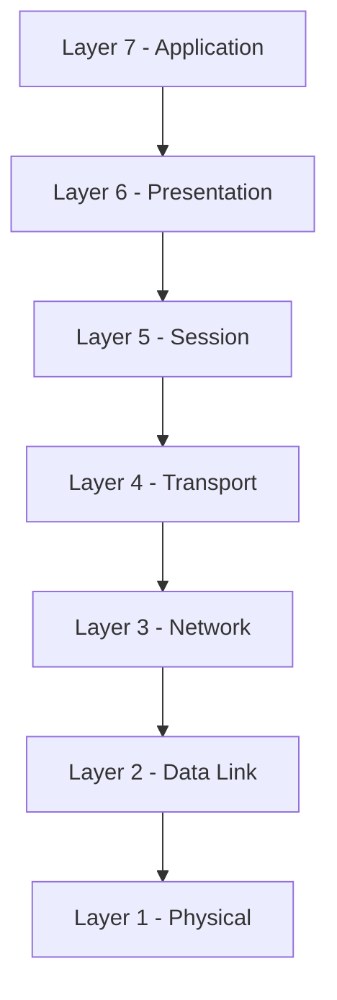
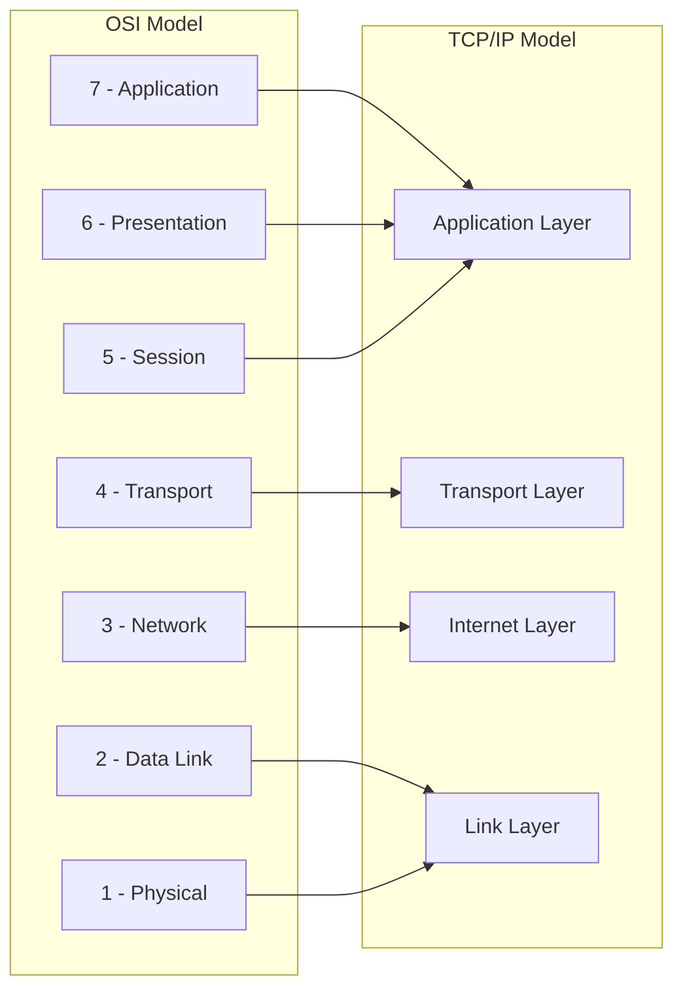

> **الهدف من الـ Section ده:**  
> فهم نماذج الشبكات (OSI وTCP/IP)، وإزاي كل Layer ليها دور في نقل الداتا، والفرق بين النموذج النظري والعملي في الشغل الحقيقي.

---

## Table of Contents

  - [OSI Model](#osi-model)
  - [TCP/IP Model](#tcpip-model)
  - [OSI vs TCP/IP Comparison](#osi-vs-tcpip-comparison)
  - [Summary](#summary)
---
## Network Models — OSI and TCP/IP

### OSI Model

الـ **OSI (Open Systems Interconnection) Model** هو نموذج نظري من 7 Layers بيوضّح إزاي الأجهزة بتتواصل مع بعض. كل Layer ليها وظيفة محددة.

> [!NOTE]
> تذكر القاعدة دي: اللايرز التحتانية أقرب للـ Wires، واللايرز الفوقانية أقرب للـ End User.

#### Layer 1 — Physical Layer

الـ Physical Layer هي أول Layer وبتتعامل مع **النقل الفعلي للبيانات** على الوسيط المادي.

- الـ Electrical Pulses على الأسلاك
- الـ Connection Specifications بين الهاردوير
- الـ Voltage والـ Current

#### Layer 2 — Data Link Layer

بتوصّل الجزء المادي من الشبكة (الأسلاك والإشارات) بالجزء المجرد (الـ Packets والـ Data Streams).

- **Physical Addressing** باستخدام **MAC Addresses**
- بتنشئ الـ Headers والـ Validation Information
- الـ **CRC** موجود هنا

#### Layer 3 — Network Layer

بتتعامل مع الـ **IP Addressing** والـ Connectivity عبر Segments متعددة من الشبكة.

- بتوضح إزاي الأنظمة على Segments مختلفة تلاقي بعض وتتواصل
- الـ **Routing** موجود هنا

#### Layer 4 — Transport Layer

بتتعامل مع بياناتك وبتجهزها للإرسال عبر الشبكة.

- بتضمن الـ **Reliable Connectivity** من طرف لطرف
- بتتحكم في **Sequencing** الـ Packets
- وظيفتها الأساسية هي **Segmentation** — تقسيم الداتا
- الـ **Ports** موجودة هنا
- **TCP** (أكتر موثوقية) أو **UDP** (أسرع)

#### Layer 5 — Session Layer

بتدير الـ **Sessions** بين الأجهزة.

- بتبدأ الـ Sessions وبتديرها وبتنهيها
- بتحدد إمتى الأجهزة تفضل متوصلة وإزاي بتعمل Synchronization للداتا

#### Layer 6 — Presentation Layer

مسؤولة عن **Data Formatting، Translation، Encryption، وCompression**.

- بتترجم الداتا بين الـ Application Format والـ Network Format
- بتشفر/بتفك تشفير الداتا للأمان
- بتضغط الداتا لتحسين الـ Transfer
- أمثلة: JPEG, PNG, MPEG, GIF

#### Layer 7 — Application Layer

هنا المستخدمين والتطبيقات بتتفاعل مع الشبكة.

- بتوفر Network Services للتطبيقات
- أمثلة على البروتوكولات:
  - HTTP / HTTPS — Web Browsing
  - SMTP / POP3 / IMAP — Email

| Layer | Name | Key Function | Key Protocol/Tech |
|---|---|---|---|
| 7 | Application | User Interface | HTTP, SMTP, FTP |
| 6 | Presentation | Data Format & Encryption | SSL/TLS, JPEG |
| 5 | Session | Session Management | NetBIOS |
| 4 | Transport | End-to-End Delivery | TCP, UDP |
| 3 | Network | IP Routing | IP, ICMP |
| 2 | Data Link | MAC Addressing | Ethernet, ARP |
| 1 | Physical | Bits on Wire | Cables, Wi-Fi |

---

### TCP/IP Model

الـ **TCP/IP Model** هو النموذج العملي اللي الإنترنت بيشتغل عليه فعلاً. عنده 4 Layers بدل 7.

#### Link Layer
بتحدد إزاي تتوصل بـ Network Topology معينة زي Ethernet.
- مقابلها في الـ OSI: Layers 1 و 2

#### Internet Layer
بتحدد إزاي الـ Datagrams بتتشكّل وبتتعامل مع الـ Routing.
- أمثلة: IPv4, IPv6, ICMP
- مقابلها في الـ OSI: Layer 3

#### Transport Layer
بتوفر خدمة إيصال الداتا من طرف لطرف.
- أمثلة: TCP, UDP
- مقابلها في الـ OSI: Layer 4

#### Application Layer
بتضم برامج التطبيقات وبتخدم كـ Network Interface للمستخدمين.
- أمثلة: Telnet, FTP, DNS
- مقابلها في الـ OSI: Layers 5, 6, 7

---

### OSI vs TCP/IP Comparison

| OSI Layer | TCP/IP Layer |
|---|---|
| Application (7) | Application |
| Presentation (6) | Application |
| Session (5) | Application |
| Transport (4) | Transport |
| Network (3) | Internet |
| Data Link (2) | Link |
| Physical (1) | Link |

> [!IMPORTANT]
> الـ OSI Model هو نموذج **نظري** للفهم والتعليم، أما الـ TCP/IP Model فهو النموذج **العملي** اللي الشبكات الحقيقية بتشتغل عليه. كـ Security Analyst، هتستخدم الاتنين في تحليلاتك.

---
## Summary

- الـ OSI = 7 Layers للفهم النظري
- الـ TCP/IP = 4 Layers للتطبيق الفعلي
- الاتنين مهمين في الـ Cybersecurity
