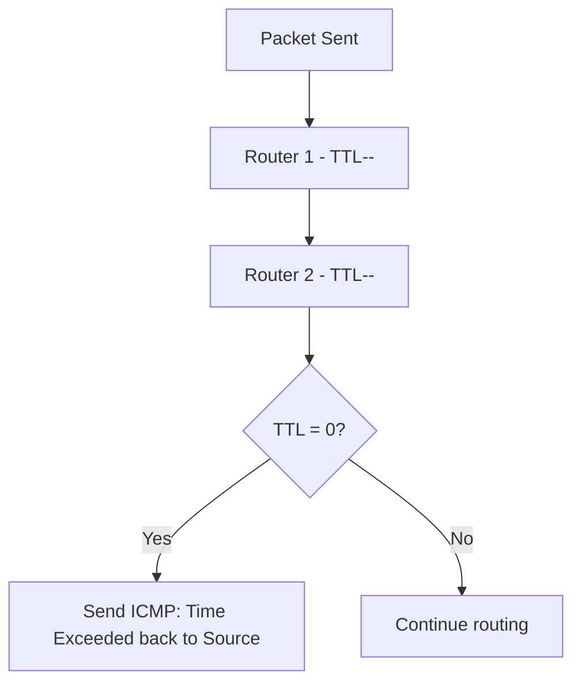
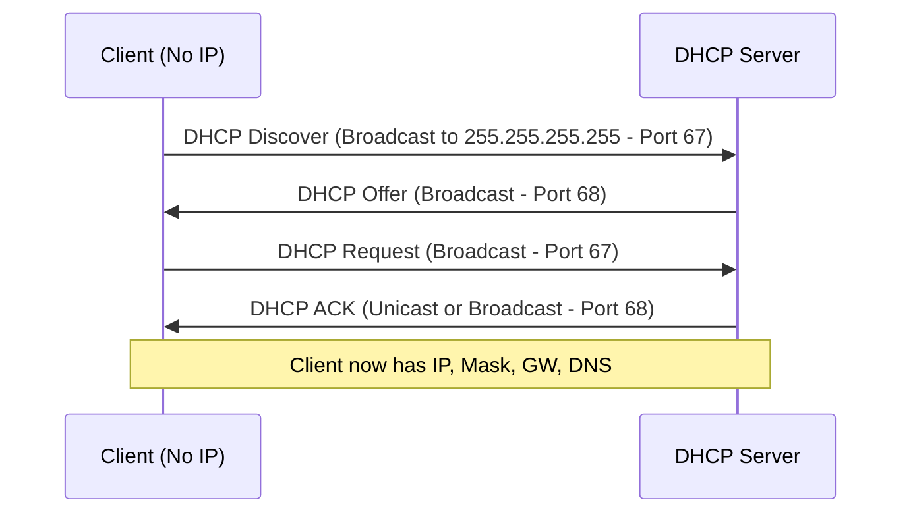
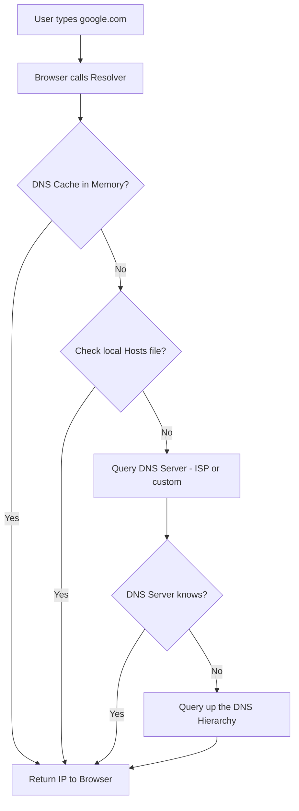

> **الهدف من الـ Section ده:**  
> بيشرح البروتوكولات المساعدة في الشبكة زي الـ ICMP والـ DHCP والـ DNS، ودور كل واحد في تشغيل الشبكة بكفاءة — من تشخيص الأخطاء، لتوزيع الـ IPs، لحد ترجمة أسماء المواقع لعناوين IP.

---

## Table of Contents
  - [ICMP Protocol](#icmp-protocol)
  - [DHCP Protocol](#dhcp-protocol)
  - [DNS Protocol](#dns-protocol)
  - [Summary](#summary)

---

## Supporting Network Protocols

### ICMP Protocol

#### ما هو ICMP؟

الـ **IP Protocol** هو **Best Effort Protocol** — بيبعت الـ Packet ويأمل يوصل، لكن من غير Connection ومن غير Acknowledgment. ده بيخليه **Unreliable**.

عشان كده في **ICMP (Internet Control Message Protocol)** — هو **آلية الـ Error Reporting** الخاصة بالـ IP Protocol.

#### أمثلة على ICMP Messages

| Scenario | ICMP Message |
|---|---|
| الـ TTL وصل لـ 0 عند Router | "Time to live exceeded in transit" |
| الـ Router مش عارف يبعت الـ Packet فين | "Destination unreachable, Network unreachable" |
| الشبكة وصلت لكن الجهاز مش بيرد | "Destination unreachable, Host unreachable" |

---

### DHCP Protocol

#### ما هو DHCP؟

الـ **DHCP (Dynamic Host Configuration Protocol)** هو آلية إعطاء كل جهاز على الشبكة **IP Address تلقائياً**.

بدونه، محتاج تحط IP يدوي على كل جهاز — ده ممكن مع 10 أجهزة، لكن مستحيل مع 100,000.

#### Static vs Dynamic IP

| Type | Who Sets It | Use Case |
|---|---|---|
| **Static** | المسؤول يحطها يدوي | Servers — محتاج IP ثابت دايماً |
| **Dynamic (DHCP)** | الـ DHCP Server تلقائياً | Clients — أجهزة المستخدمين |

#### ما اللي DHCP بيديه؟

- IP Address
- Subnet Mask
- Default Gateway
- DNS Server IP

#### DHCP DORA Process

| Step | Who | What |
|---|---|---|
| **Discover** | Client | "في DHCP Server هنا؟" |
| **Offer** | Server | "أيوه، وده الـ IP اللي هاديك إياه" |
| **Request** | Client | "عايز الـ Config ده" |
| **ACK** | Server | "تفضل، الـ Config جاهزة" |

> [!NOTE]
> الـ DHCP بيشتغل على **UDP**:
> - Client بيسمع على **Port 68**
> - Server بيسمع على **Port 67**
>
> الـ Client في البداية مالوش IP، فبيستخدم الـ Broadcast Address `255.255.255.255` كـ Source IP.

#### IP Lease

الـ IP المُعطى مش دايم — الجهاز بـ "يأجره" لفترة:
- في بيئة ثابتة (شركة): يوم أو أسبوع
- في بيئة متغيرة (كامبس جامعي): 60-90 دقيقة

---

### DNS Protocol

#### ما هو DNS؟

الـ **DNS (Domain Name System)** هو البروتوكول اللي بيترجم **Domain Names** (زي google.com) لـ **IP Addresses** حقيقية. لأن الكومبيوتر مش بيفهم `google.com` في الـ Packet Header — بيحتاج IP Address.

**TLD (Top Level Domain):** الجزء الأخير من الـ Domain زي `.com`، `.net`، `.edu`، `.org`

#### رحلة الـ DNS Resolution

#### DNS Resolution Steps

1. المستخدم بيكتب `google.com` في الـ Browser
2. الـ Browser بيستدعي الـ **Resolver**
3. الـ Resolver بيفحص الـ **DNS Cache** في الـ RAM أولاً
4. لو مش موجود، بيفحص الـ **Local Hosts File**
5. لو مش موجود، بيبعت Query لـ **DNS Server** (المُعطى من الـ ISP عبر DHCP)
6. لو الـ DNS Server مش عارف، بيسأل Server أعلى في الهيكل
7. في النهاية، الـ IP Address بيترجع للـ Browser

#### Public DNS Servers

| Provider | Primary | Secondary |
|---|---|---|
| **Cloudflare** | 1.1.1.1 | 1.0.0.1 |
| **Google DNS** | 8.8.8.8 | 8.8.4.4 |
| **OpenDNS** | 208.67.222.222 | 208.67.220.220 |

> [!TIP]
> مش لازم تستخدم الـ DNS Server بتاع الـ ISP. ممكن تغيّر لأي Server من الجدول ده. الـ Cloudflare (1.1.1.1) معروف بالسرعة والخصوصية.

---

## Summary

- الـ ICMP هو Error Reporting بتاع IP
- الـ DHCP بيدي الأجهزة IP تلقائياً (DORA Process)
- الـ DNS بيترجم Domain Names لـ IP Addresses
