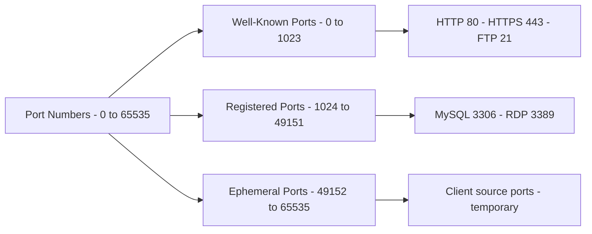
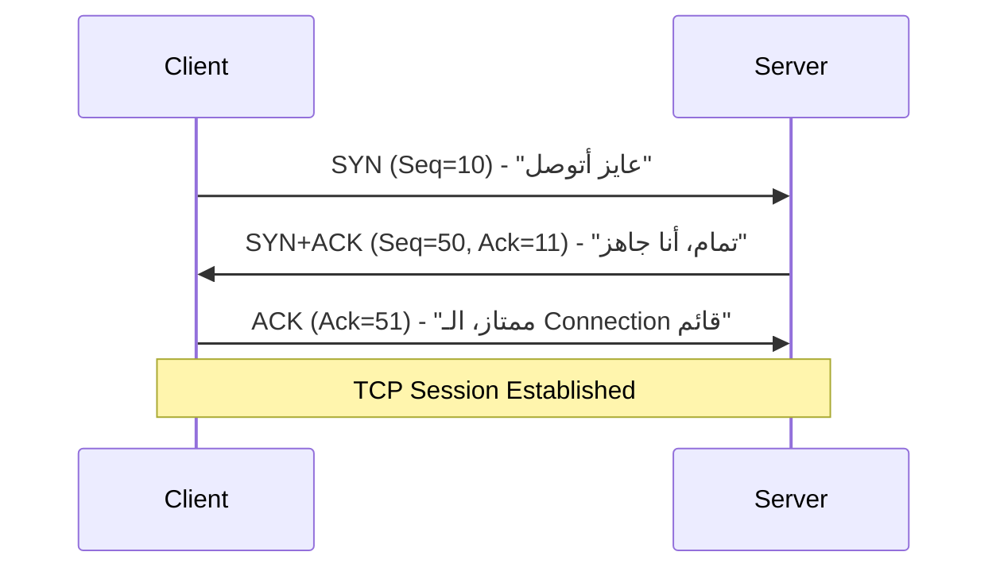
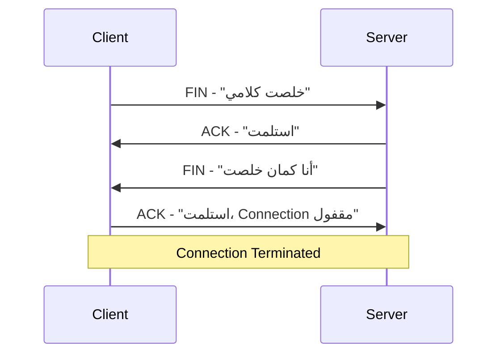

> **الهدف من الـ Section ده:**  
> بيشرح طبقة الـ Transport إزاي بتدير الاتصال بين الأجهزة باستخدام الـ TCP والـ UDP، ويفهمك دور الـ Ports، وإزاي الـ Sessions بتتفتح وتتقفل، والفرق بين السرعة والاعتمادية في نقل البيانات.

---

## Table of Contents
  - [Network Ports](#14-network-ports)
  - [TCP — Transmission Control Protocol](#15-tcp--transmission-control-protocol)
  - [TCP Header and Flags](#16-tcp-header-and-flags)
  - [TCP 3-Way Handshake](#17-tcp-3-way-handshake)
  - [TCP 4-Way Termination](#18-tcp-4-way-termination)
  - [UDP — User Datagram Protocol](#19-udp--user-datagram-protocol)
  - [Summary](#summary)

---

## Transport Layer — TCP and UDP

### 14. Network Ports

#### ما هي الـ Ports؟

الـ **Network Port** هو **Logical Address** بيميّز بين الـ Sessions أو الخدمات المختلفة على نفس الجهاز. تخيّل الـ IP Address كعنوان عمارة، والـ Port كرقم الشقة — الإتنين مع بعض بيحددوا مكان بالضبط.

كل Packet بيحتوي على **Destination Port Number** في الـ Layer 4 Header، وده بيقول للجهاز المستقبل أنهي تطبيق أو سيرفس الـ Packet ده مخصص ليه.

#### أنواع الـ Ports



| Port Range | Name | Description |
|---|---|---|
| 0 – 1023 | **Well-Known Ports** | محجوزة للخدمات الأساسية — ممنوع تستخدمها |
| 1024 – 49151 | **Registered Ports** | للتطبيقات التجارية — يُفضّل تتجنبها |
| 49152 – 65535 | **Ephemeral Ports** | الـ Client بيستخدمها كـ Source Port مؤقت |

#### أهم الـ Well-Known Ports

| Port | Protocol | Service |
|---|---|---|
| 21 | FTP | File Transfer |
| 22 | SSH | Secure Shell |
| 25 | SMTP | Email Sending |
| 53 | DNS | Domain Name Resolution |
| 80 | HTTP | Web (Unencrypted) |
| 443 | HTTPS | Web (Encrypted) |
| 3306 | MySQL | Database |
| 3389 | RDP | Remote Desktop |

#### مثال عملي

لما بتفتح Google:

```
Client (Your PC)          Server (Google)
Source Port: 49155   -->  Destination Port: 443
                    <--
Source Port: 443          Destination Port: 49155
```

---

### 15. TCP — Transmission Control Protocol

الـ **TCP** هو بروتوكول **Connection-Oriented** — بيبني Connection بين الطرفين وبيراقب حالة الـ Connection دي.

#### أهم خاصية في TCP: Error Control

الـ TCP مش بيضمن وصول كل **Packet** — لكنه بيضمن وصول كل **الداتا**.

**مثال:** لو بعتت 500 Byte من الداتا، والمستقبل استلم 400 بس — الـ TCP بيعرف ده ويعيد إرسال الـ 100 Byte الناقصة.

> [!IMPORTANT]
> الـ TCP بيشتغل فوق الـ IP — والـ IP هو Best Effort Protocol مش بيضمن الوصول. لذلك الـ TCP مش قادر يضمن وصول كل Packet، لكن عنده **Error Control Mechanism** يعيد إرسال الداتا اللي ضاعت.

---

### 16. TCP Header and Flags

#### هيكل الـ TCP Header

الحد الأدنى لحجم الـ TCP Header هو **20 Bytes**.

| Field | Size | Purpose |
|---|---|---|
| Source Port | 2 Bytes | الـ Port اللي الـ Connection جاي منه |
| Destination Port | 2 Bytes | الـ Port اللي الـ Connection رايحله |
| Sequence Number | 4 Bytes | ترقيم الـ Packets لإعادة ترتيبها |
| Acknowledgement | 4 Bytes | تأكيد استلام الـ Packets |
| Flags | Variable | التحكم في سلوك الـ Connection |

#### TCP Flags

الـ Flags هي Bits بتتحكم في سلوك الـ TCP Session:

| Flag | Name | Purpose |
|---|---|---|
| **SYN** | Synchronize | بيبدأ الـ 3-Way Handshake |
| **ACK** | Acknowledge | بيأكد استلام Packet سابق |
| **FIN** | Finish | بيطلب إنهاء الـ Connection |
| **RST** | Reset | إنهاء فوري للـ Session لما في مشكلة |
| **PSH** | Push | اعمل Deliver للداتا فوراً من غير ما تستنى |

#### PSH Flag — مثال عملي

لما بتكتب command في SSH زي `arp -a`:
- **بدون PSH:** المستقبل بيستنى يجمع كل الداتا الأول قبل ما يعمل Process
- **مع PSH:** كل حرف بيتبعت وبيتعالج فوراً (`a` → `r` → `p` ...)

الـ PSH مفيد في:
- Chat Applications
- Online Games القائمة على TCP

> [!TIP]
> لو في Packet Capture شفت الـ PSH + ACK Flags معاً — ده معناه إن الـ Packet ده **فيه داتا حقيقية** وبيأكد استلام Packet سابق في نفس الوقت.

---

### 17. TCP 3-Way Handshake

الـ **3-Way Handshake** هو الإجراء اللي TCP بيعمله عشان يبني Connection قبل ما يبعت أي داتا حقيقية. بيحصل كل ما في Session جديدة بين جهازين.

**الهدف:** كل طرف يعرف الـ **Initial Sequence Number** للطرف التاني.



| Packet | From | Flags | Content |
|---|---|---|---|
| 1st | Client → Server | SYN | Seq=10، "عايز أبدأ Session" |
| 2nd | Server → Client | SYN + ACK | Seq=50، Ack=11، "موافق" |
| 3rd | Client → Server | ACK | Ack=51، "الـ Connection اتبنى" |

> [!NOTE]
> الحد الأدنى من الـ Packets عشان تحصل TCP Communication كاملة هو **10 Packets**:
> - 3 للـ Handshake
> - 3 لتبادل الداتا الفعلية
> - 4 لإنهاء الـ Connection

---

### 18. TCP 4-Way Termination

لما الـ Communication خلصت، الـ Connection بيتقفل بشكل منظم في **4 خطوات**:



> [!TIP]
> الـ Server ممكن يجمع الـ FIN والـ ACK في Packet واحد (FIN + ACK)، فيبقى في الـ Packet Capture 3 Packets بدل 4 — وده طبيعي وصح.

> [!NOTE]
> لو في Packet Capture شفت الـ 4 Packets دول كاملين، ده معناه إن الـ Connection اتقفل بشكل سليم وما فيش مشاكل.

---

### 19. UDP — User Datagram Protocol

الـ **UDP** هو **Connectionless Protocol** — بيبعت الداتا من غير ما يبني Connection أو يستنى Confirmation.

#### UDP Header

الـ UDP Header أبسط بكتير من الـ TCP Header:

| Field | Size | Purpose |
|---|---|---|
| Source Port | 2 Bytes | الـ Port المرسِل |
| Destination Port | 2 Bytes | الـ Port المستقبِل |
| UDP Length | 2 Bytes | إجمالي حجم الـ UDP Packet |
| Checksum | 2 Bytes | فحص أساسي للـ Integrity |

#### TCP vs UDP Comparison

| Feature | TCP | UDP |
|---|---|---|
| Connection | Connection-Oriented | Connectionless |
| Reliability | بيضمن وصول الداتا | مفيش ضمان |
| Speed | أبطأ | أسرع |
| Overhead | أعلى | أقل |
| Min Packets to Transfer | 10 | 2 |
| Use Case | Web، Email، File Transfer | Streaming، Gaming، DNS |

#### إمتى نستخدم UDP؟

- **Limited Bandwidth:** لما الشبكة ضعيفة ومحتاج سرعة
- **Real-Time Communications:** Video Streaming، Voice Calls — الـ Delay أخطر من الـ Packet Loss
- **Repetitive Data:** زي NTP (Network Time Protocol) اللي بيتبعت كل دقيقة أو دقيقتين — لو Packet ضاع، هييجي تاني قريب

---

## Summary


- الـ Ports بتحدد أنهي Service الـ Packet رايحله
- الـ TCP Connection-Oriented وعنده Error Control
- الـ TCP 3-Way Handshake: SYN → SYN+ACK → ACK
- الـ UDP أسرع بدون ضمان وصول
