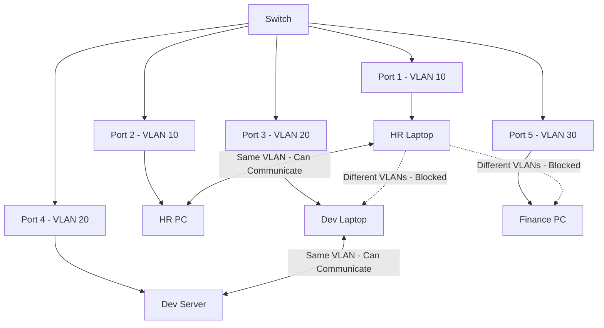
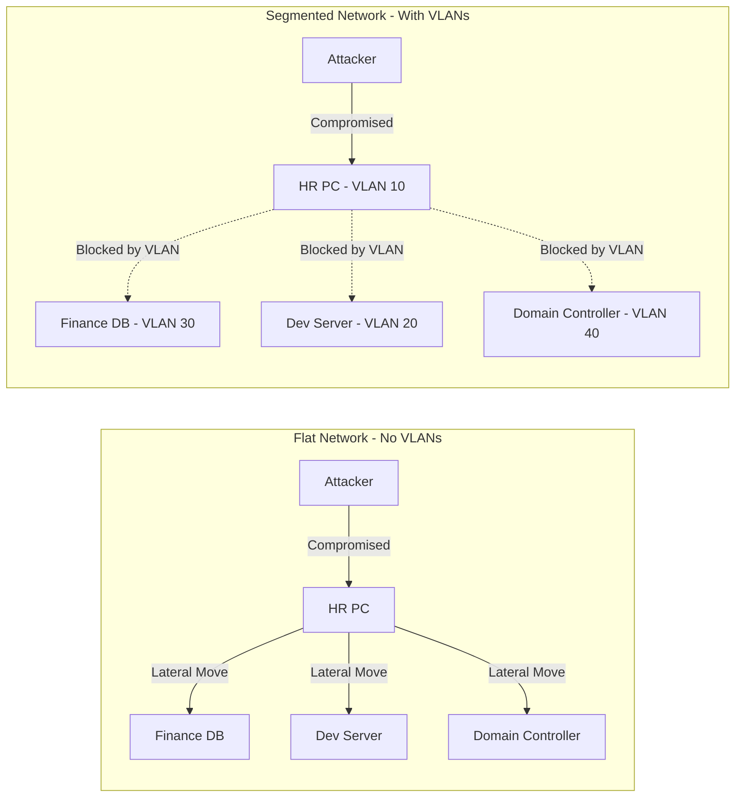
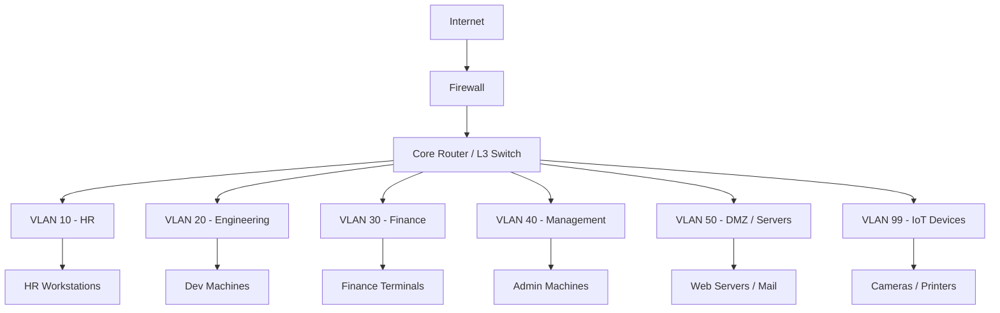
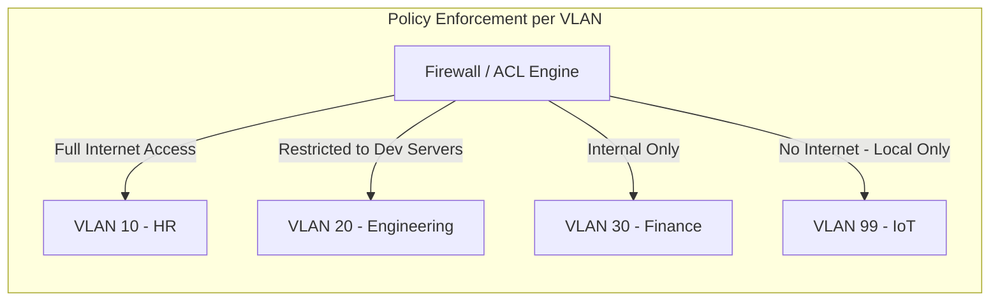
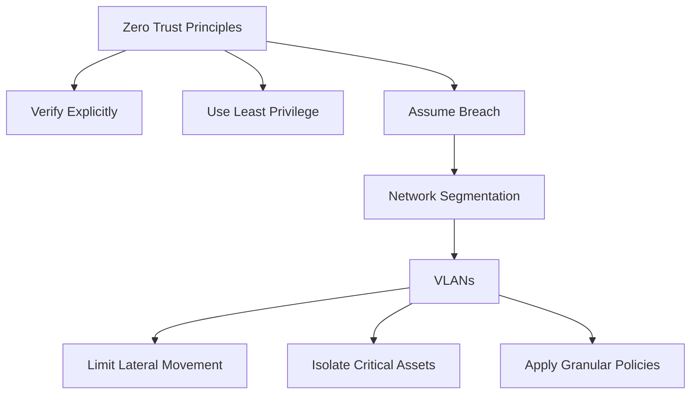
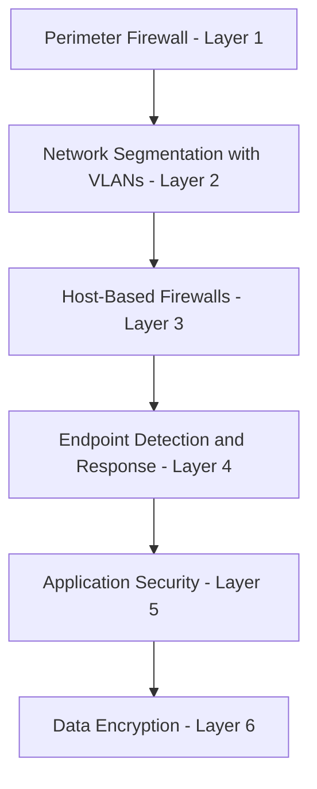
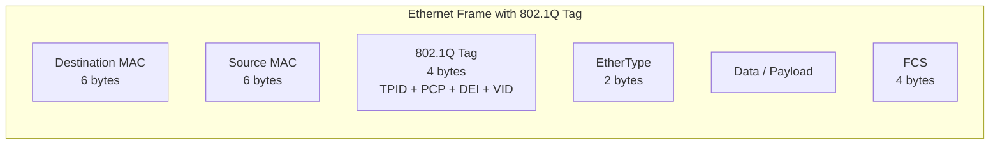
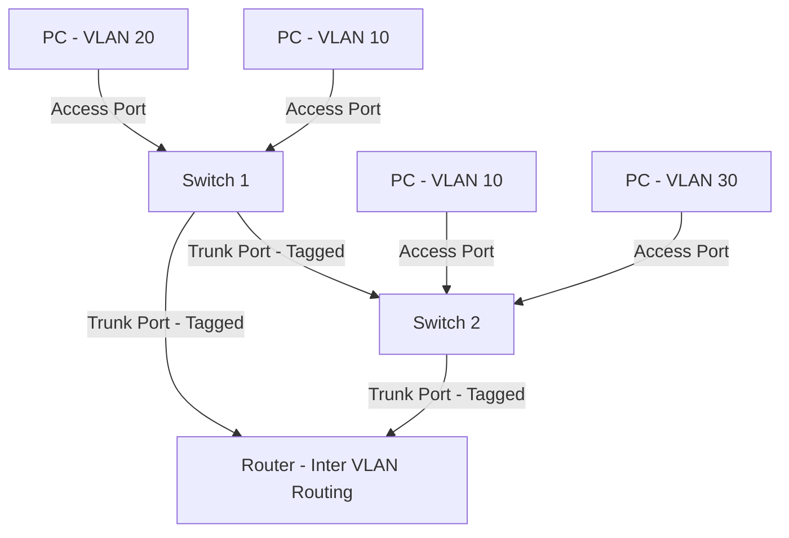
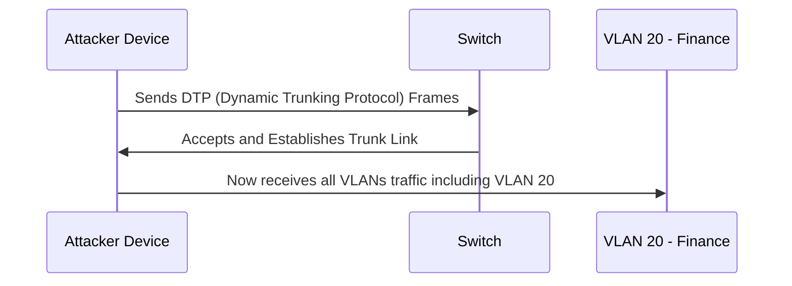
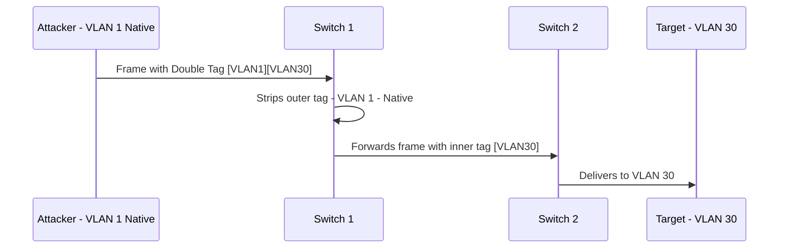

> **الهدف من الـ Section ده:**  
> هتفهم إيه هو الـ VLAN وليه بيتعمل، وإزاي بيساعد في تقسيم الشبكة عشان تمنع الـ Attackers من الـ Lateral Movement، وإزاي كـ Cybersecurity Professional تستفاد منه في تأمين الـ Network.

---

# VLANs (Virtual Local Area Networks)

## Table of Contents

- [What is a VLAN?](#what-is-a-vlan)
- [Why VLANs Exist — The Problem They Solve](#why-vlans-exist--the-problem-they-solve)
- [How VLANs Work](#how-vlans-work)
- [VLANs and Network Segmentation](#vlans-and-network-segmentation)
- [VLANs and Policy Enforcement](#vlans-and-policy-enforcement)
- [VLANs from a Security Perspective](#vlans-from-a-security-perspective)
- [VLAN Tagging — IEEE 802.1Q](#vlan-tagging--ieee-8021q)
- [Types of VLAN Ports](#types-of-vlan-ports)
- [Common VLAN Attacks](#common-vlan-attacks)
- [Summary](#summary)

---

## What is a VLAN?

الـ **VLAN** اختصار لـ **Virtual Local Area Network**، وهو طريقة بتخليك تقسّم شبكة فيزيائية واحدة (Physical Network) لعدة شبكات منطقية (Logical Networks) مستقلة عن بعض.

يعني تخيّل إن عندك **Switch** واحد فيه 24 بورت، وبدل ما كل الأجهزة المتوصلة بيه تكون في نفس الشبكة وتتكلم مع بعض بحرية — الـ VLAN بيخليك تقول:

- البورتات من 1 لـ 8 → VLAN 10 (مثلاً للـ HR)
- البورتات من 9 لـ 16 → VLAN 20 (للـ Engineering)
- البورتات من 17 لـ 24 → VLAN 30 (للـ Finance)

وكل VLAN بقى عبارة عن **Broadcast Domain** مستقل — يعني الأجهزة اللي في VLAN 10 مش بتشوف ولا بتتكلم مع الأجهزة اللي في VLAN 20 إلا لو في Router أو Layer 3 Switch بيسمح بيه صراحةً.

```
Physical Network (One Switch)
┌─────────────────────────────────────┐
│                                     │
│  [HR PC]   [HR PC]   [HR Printer]   │  ← VLAN 10
│                                     │
│  [Dev PC]  [Dev PC]  [Dev Server]   │  ← VLAN 20
│                                     │
│  [Fin PC]  [Fin PC]  [Fin DB]       │  ← VLAN 30
│                                     │
└─────────────────────────────────────┘
```

> [!IMPORTANT]
> الـ VLANs بتتعمل على مستوى الـ **Layer 2 (Data Link Layer)** في الـ OSI Model. الـ Switch هو اللي بيدير الـ VLAN، مش الـ Router. لو عايز الـ Communication تعدي بين VLANs لازم تعمل **Inter-VLAN Routing** باستخدام Router أو Layer 3 Switch.

---

## Why VLANs Exist — The Problem They Solve

### المشكلة بدون VLANs

تخيّل شركة كبيرة فيها 500 جهاز كلهم في نفس الشبكة (Flat Network). المشاكل اللي هتقابلها:

| المشكلة | التفاصيل |
|---|---|
| **Broadcast Storms** | كل جهاز بيبعت Broadcast بيوصل لـ 499 جهاز تاني — ده بيرهق الشبكة |
| **Security Risk** | لو Attacker دخل على جهاز واحد، يقدر يشوف كل الأجهزة التانية بسهولة |
| **No Policy Control** | صعب تطبّق Rules مختلفة على Departments مختلفة |
| **Scalability Issues** | كلما زادت الأجهزة، كلما زادت الـ Broadcasts وبطأت الشبكة |

### الحل مع VLANs

الـ VLAN بيحل كل المشاكل دي عن طريق:

- **تقليل الـ Broadcast Domain** — كل VLAN بيبقى عنده Broadcast Domain خاص بيه
- **عزل الـ Traffic** — الأجهزة في VLANs مختلفة مش بتشوف بعض automatically
- **تطبيق Policies** — تقدر تطبّق Firewall Rules أو QoS مختلفة على كل VLAN

> [!NOTE]
> الـ VLANs بيتعملوا من قِبَل **Network Administrators**، مش Cybersecurity Professionals — لكن الـ Security Team بتستفيد منهم جداً في تأمين الشبكة. يعني دور الـ Security هنا هو تصميم الـ Segmentation Strategy والـ Policies، ودور الـ Network Admin هو التنفيذ.

---

## How VLANs Work

الـ VLAN بيشتغل عن طريق إنك تحدد لكل **Port** على الـ Switch إنه ينتمي لأنهي VLAN. الـ Switch بعدين بيكون عارف إن أي Traffic جاي من البورت ده ينتمي لأنهي Broadcast Domain.



الـ Switch بيتعامل مع كل VLAN كأنه شبكة منفصلة تماماً على مستوى الـ Layer 2. Traffic من VLAN 10 مش بيعدي لـ VLAN 20 إلا لو في Router بيسمح بيه.

---

## VLANs and Network Segmentation

الـ **Network Segmentation** هو مفهوم تقسيم الشبكة لأجزاء أصغر عشان تحدّ من انتشار الأضرار لو حصل اختراق. والـ VLANs هم أشهر أداة بتتعمل بيها الـ Segmentation على مستوى الـ Layer 2.

### الـ Lateral Movement وإزاي الـ VLANs بتمنعه

الـ **Lateral Movement** هو لما الـ Attacker بيدخل على جهاز في شبكتك ويبدأ يتنقل منه لأجهزة تانية جوا نفس الشبكة عشان يوصع لحاجات أهم — زي Domain Controller أو Database Server.



> [!IMPORTANT]
> الـ VLANs بتقلل الـ **Attack Surface** بشكل كبير. لو الـ Attacker اخترق جهاز في VLAN 10، هو محاصر جوا الـ VLAN ده ومش قادر يوصل للـ VLANs التانية إلا لو في Misconfiguration أو بيستخدم Attack زي الـ VLAN Hopping.

### مثال عملي على الـ Segmentation

في بيئة Enterprise عادية، الـ Segmentation بتبقى على النحو ده:



> [!TIP]
> من الـ Best Practices إنك تحط الـ IoT Devices في VLAN منفصل — لأن معظمها بيكون فيه Vulnerabilities وما بيتحدثش بانتظام. لو اتاخترق Camera مثلاً، تبقى معزول عن باقي الشبكة.

---

## VLANs and Policy Enforcement

من أكبر مميزات الـ VLANs إنها بتخليك تطبق **Policies مختلفة** على Teams مختلفة بسهولة.

### إيه الـ Policies اللي ممكن تطبّقها على كل VLAN؟

| النوع | المثال |
|---|---|
| **Firewall Rules** | VLAN 10 (HR) يقدر يوصل للـ Internet، VLAN 30 (Finance) ممنوع يوصل إلا لـ IPs معينة |
| **QoS (Quality of Service)** | VLAN الخاص بالـ VoIP بياخد Priority أعلى في الـ Bandwidth |
| **Access Control Lists (ACLs)** | VLAN 20 (Engineering) يقدر يوصل لـ Dev Servers بس، مش لـ Finance DB |
| **DHCP Scope** | كل VLAN بياخد Range من الـ IPs مختلف |
| **Monitoring & Logging** | VLAN الخاص بالـ Servers بيتراقب بشكل أكثر من VLAN الموظفين العاديين |



> [!NOTE]
> الـ VLANs بتعمل الـ Segmentation، لكن الـ Policies نفسها بتتطبّق على الـ Router أو الـ Firewall اللي بيتحكم في الـ Inter-VLAN Traffic. يعني الـ VLAN بيحدد "مين مع مين"، والـ Firewall بيحدد "مين يقدر يتكلم مع مين ولو عدينا من VLAN لـ VLAN".

---

## VLANs from a Security Perspective

كـ Cybersecurity Professional، الـ VLANs هم أداة مهمة جداً في الـ Defense Strategy. دي أبرز النقاط اللي لازم تعرفها:

### الـ Principle of Least Privilege على مستوى الشبكة

الـ VLANs بتطبّق **Principle of Least Privilege** على مستوى الـ Network Segmentation — يعني كل جهاز يوصل بس للـ Resources اللي هو محتاجها، ومش أكتر من كده.

### Zero Trust وعلاقته بالـ VLANs

في معمارية الـ **Zero Trust**، المبدأ هو "لا تثق في أي حاجة بشكل تلقائي — حتى جوا الشبكة الداخلية". الـ VLANs بتساعد في تطبيق الجزء الخاص بالـ **Network Segmentation** في Zero Trust.



### الـ Defense in Depth والـ VLANs

الـ VLANs هم layer واحدة في مفهوم **Defense in Depth** — وهو المفهوم اللي بيقول إن الحماية لازم تبقى على طبقات متعددة:



> [!WARNING]
> الـ VLANs مش "Silver Bullet" — هم بيحموا من الـ Lateral Movement على مستوى الـ Layer 2، لكن لو الـ Router أو الـ Firewall اللي بيتحكم في الـ Inter-VLAN Traffic بيه Misconfiguration أو Vulnerability، الـ Attacker ممكن يعدّي بينهم. لازم دايماً يكون فيه Monitoring وـ Logging على الـ Inter-VLAN Traffic.

---

## VLAN Tagging — IEEE 802.1Q

عشان الـ VLANs تشتغل على الـ Trunk Links (الوصلات اللي بتشيل Traffic من أكتر من VLAN)، لازم يكون في طريقة لتمييز الـ Traffic — وده اللي بيعمله الـ **VLAN Tagging** بمعيار **IEEE 802.1Q**.

### إيه هو الـ VLAN Tag؟

لما Frame بتتحرك على **Trunk Link**، الـ Switch بيضيف **4 bytes** في الـ Ethernet Header بيسميه الـ 802.1Q Tag. الـ Tag ده بيحتوي على:

| الحقل | الحجم | الوصف |
|---|---|---|
| **TPID** (Tag Protocol Identifier) | 16 bits | قيمته ثابتة `0x8100` — بتقول للـ Switch إن الـ Frame ده متاغ |
| **PCP** (Priority Code Point) | 3 bits | بيحدد الـ Priority للـ QoS |
| **DEI** (Drop Eligible Indicator) | 1 bit | بيحدد لو الـ Frame ممكن يتحذف لو في Congestion |
| **VID** (VLAN Identifier) | 12 bits | رقم الـ VLAN من 1 لـ 4094 |



> [!NOTE]
> الـ **Native VLAN** هو الـ VLAN الوحيد اللي Traffic بتاعه بيتبعت على الـ Trunk Link **من غير** Tag. بـ Default على Cisco Switches، الـ Native VLAN رقمه 1. ده مهم من ناحية Security لأنه بيكون مصدر لـ Attack اسمه VLAN Hopping.

---

## Types of VLAN Ports

في نوعين أساسيين من الـ Ports على الـ Switch:

### Access Port

- بيتكلم مع جهاز نهائي زي PC أو Printer
- بينتمي لـ VLAN واحد بس
- الـ Traffic بيتبعت من غير Tag (الجهاز مش محتاج يعرف هو في أنهي VLAN)

```
[PC] ──── Access Port (VLAN 10) ──── [Switch]
```

### Trunk Port

- بيربط Switch بـ Switch أو Switch بـ Router
- بيشيل Traffic من أكتر من VLAN في نفس الوقت
- الـ Traffic بيتبعت مع الـ 802.1Q Tag عشان الجهاز التاني يعرف الـ Frame ده تابع لأنهي VLAN

```
[Switch A] ──── Trunk Port (All VLANs) ──── [Switch B]
```



---

## Common VLAN Attacks

كـ Security Professional، لازم تكون عارف الـ Attacks اللي ممكن تستهدف الـ VLANs:

### 1. VLAN Hopping

الـ **VLAN Hopping** هو هجوم بيخلي الـ Attacker يتحرك من VLAN لـ VLAN تاني من غير ما يعدي من Router أو Firewall.

فيه طريقتين:

#### Switch Spoofing

الـ Attacker بيخلي جهازه يتصرف كـ Switch ويفاوض على Trunk Link مع الـ Switch الحقيقي — فبيقدر يوصل للـ Traffic من كل الـ VLANs.



#### Double Tagging

الـ Attacker بيبعت Frame فيه **تاجين** — التاج الأول للـ Native VLAN، والتاج التاني للـ VLAN المستهدف. الـ Switch بيشيل التاج الأول (Native VLAN Tag) ويبعت الـ Frame للـ VLAN التاني.



> [!WARNING]
> الـ Double Tagging Attack **One-Way فقط** — الـ Attacker يقدر يبعت لـ VLAN التاني لكن مش هيقدر يستقبل الـ Response مباشرة. على الرغم من كده، لو استخدمه مع Attack تاني زي الـ DoS ممكن يبقى خطير.

### 2. الحماية من VLAN Attacks

| الإجراء | الهدف |
|---|---|
| **تعطيل DTP** على كل Access Ports | يمنع الـ Switch Spoofing |
| **تغيير الـ Native VLAN** لـ VLAN غير مستخدم (مثلاً VLAN 999) | يمنع الـ Double Tagging |
| **تفعيل Port Security** | يمنع أجهزة غير معروفة من الاتصال |
| **استخدام Private VLANs** | يعزل الأجهزة حتى جوا نفس الـ VLAN |
| **Monitoring الـ Trunk Ports** | للكشف عن أي Trunk Negotiation غير متوقع |

> [!TIP]
> دايماً غيّر الـ Native VLAN من الـ Default (VLAN 1) لـ VLAN مش بيستخدمه أي جهاز. وعطّل الـ DTP على كل البورتات اللي مش Trunk Ports فعلاً. الـ Best Practice هو تعمل كل Ports بـ Hardcoded Mode (إما Access وإما Trunk) بدل ما تسيبها في الـ Dynamic Mode.

---

## Summary

### ملخص الـ VLANs

- الـ **VLAN (Virtual LAN)** هو طريقة لتقسيم الشبكة الفيزيائية لشبكات منطقية منفصلة على مستوى الـ **Layer 2**.

- بيتم إنشاؤه من قِبَل **Network Administrators**، لكن الـ **Security Team** هو اللي بيستفيد منه في تأمين الشبكة وتطبيق الـ Policies.

- أهم فايدة من ناحية الـ Security هو منع الـ **Lateral Movement** — لو Attacker اخترق جهاز في VLAN، هو محاصر فيه ومش قادر ينتقل للـ VLANs التانية بسهولة.

- الـ VLANs بتسهّل تطبيق **Policies مختلفة** على Departments مختلفة — Firewall Rules، QoS، ACLs، DHCP Scopes.

- الـ **802.1Q Tagging** هو المعيار المستخدم لتمييز الـ VLAN Traffic على الـ Trunk Links.

- الـ Ports نوعين: **Access Ports** (لجهاز نهائي واحد VLAN) و**Trunk Ports** (للـ Switches والـ Routers وبتشيل كل الـ VLANs).

- أشهر Attack على الـ VLANs هو الـ **VLAN Hopping** وبيتم بطريقتين: **Switch Spoofing** و**Double Tagging** — والحل هو تعطيل الـ DTP وتغيير الـ Native VLAN.

- الـ VLANs هم جزء مهم من **Defense in Depth** و**Zero Trust Architecture**، لكنهم مش بديل كامل عن الـ Firewall والـ Monitoring.
