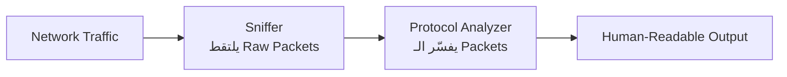
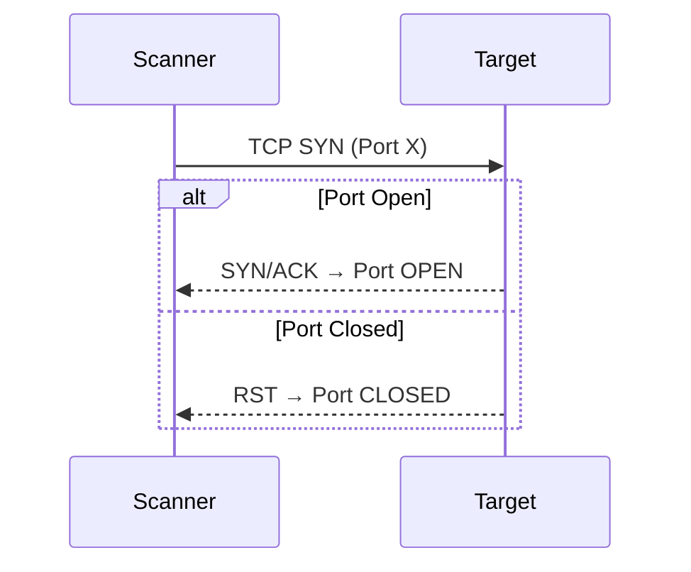
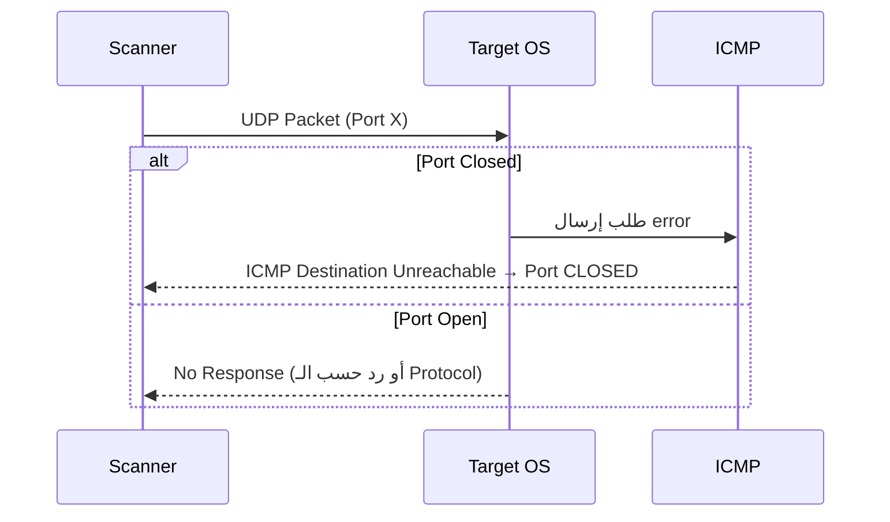
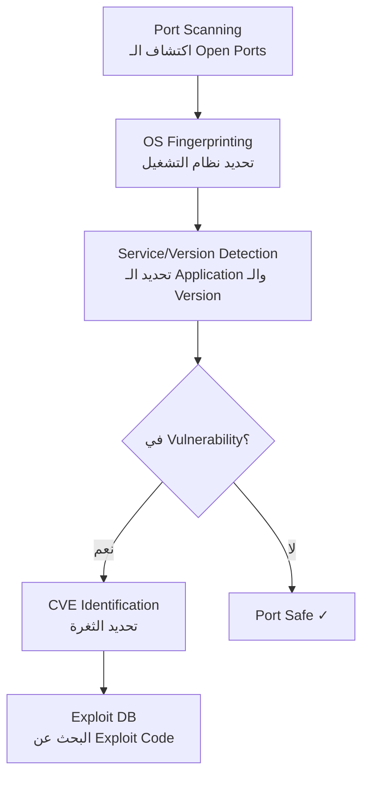
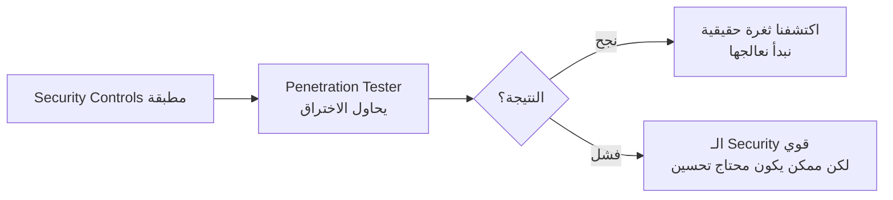
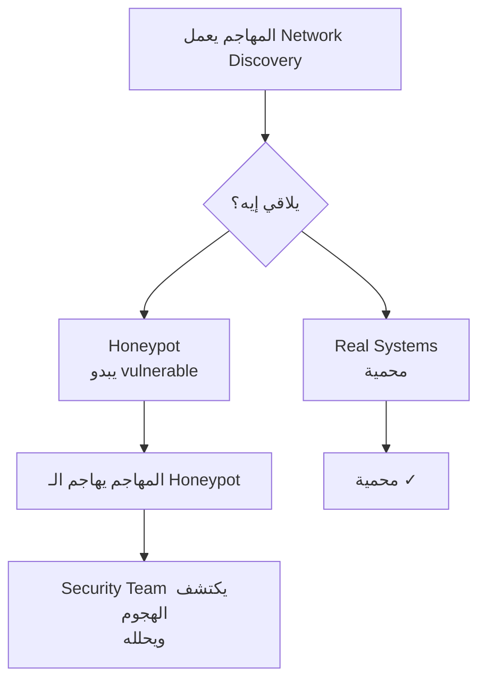

> **الهدف من الـ Section ده:**  
> هتفهم ببساطة الأدوات اللي بتستخدمها عشان تشوف الترافيك، تكتشف الـ ports المفتوحة، وتعرف فين الثغرات — وكمان إزاي نفس الأدوات دي بيستخدمها المهاجم والدفاع.

---

## Table of Contents

1. [Sniffers — أدوات التقاط الحزم](#sniffers)
2. [Port Scanners — أدوات فحص المنافذ](#port-scanners)
3. [Vulnerability Scanners — أدوات كشف الثغرات](#vulnerability-scanners)
4. [Penetration Testing — اختبار الاختراق](#penetration-testing)
5. [Honeypots — فخاخ المهاجمين](#honeypots)
6. [ملخص](#summary)

---

## Sniffers — أدوات التقاط الحزم {#sniffers}

### إيه هو الـ Sniffer؟

الـ **Sniffer** هو برنامج بيلتقط الـ **network packets** اللي بتعدي على الـ network interface بتاعته.

> [!IMPORTANT]
> لازم تعرف انت شايل الـ sniffer على أنهي interface — لأن ده هو اللي بيحدد إيه الـ packets اللي هتشوفها.

**مثال:** لو حطيت الـ sniffer على الـ **perimeter firewall**، هتلتقط كل الـ packets الجاية والرايحة من وإلى الـ Internet.

---

### Sniffer vs Protocol Analyzer

الـ sniffer بيالتقط الـ **raw packets** بس — يعني بيانات خام مش مفهومة.
عشان تفهم الـ packets دي، محتاج برنامج تاني اسمه **Protocol Analyzer** — وده بيحوّل البيانات الخام لـ **human-readable format**.

> [!NOTE]
> أدوات زي **Wireshark** بتجمع الاتنين مع بعض — sniffer + protocol analyzer في برنامج واحد.
> في المقابل، **TCPdump** هو CLI-based sniffer — أسرع لكن بيعرض بيانات أقل تفصيلاً.

| Tool | Type | Interface | Speed |
|------|------|-----------|-------|
| Wireshark | Sniffer + Analyzer | GUI | Moderate |
| TCPdump | Sniffer فقط | CLI | Fast |

---

## Port Scanners — أدوات فحص المنافذ {#port-scanners}

### ليه Port Scanning مهم؟

عشان المهاجم يهاجم نظام عن بُعد، محتاج يعرف:
1. الـ **IP address** بتاع الـ target
2. الـ **open ports** على الـ target — لأن كل port بيدله على service معين

**مثال:** لو لاقى Port 80 مفتوح → يعني في HTTP service شغال.

> [!WARNING]
> معرفة الـ port وحده مش كفاية — الأخطر هو معرفة **version** الـ application اللي شغّال على الـ port ده، لأن ده بيسمح للمهاجم يدور على **vulnerabilities** خاصة بالـ version ده.

---

### Nmap — الأداة الأشهر

الـ **Nmap** هي أشهر أداة Port Scanning، وبتقدر تكشف:
- الـ **open/closed ports**
- الـ **operating system** بتاع الـ target
- الـ **service** اللي شغال على كل port وكمان الـ **version** بتاعته

---

### إزاي الـ Port Scanner بيشتغل؟

#### TCP Ports

#### UDP Ports

الـ UDP مفيهوش SYN/RST — بيشتغل بطريقة مختلفة:

> [!NOTE]
> الـ **ICMP** هنا بيساعد الـ IP في الإبلاغ عن الأخطاء — وده أحد أهم أدواره الأصلية.

---

### Least Privilege في الـ Ports

> [!IMPORTANT]
> بسبب وجود الـ Port Scanners، قاعدة **Least Privilege** بتنطبق على الـ ports:
> **افتح بس الـ ports اللي محتاجها — وقفل كل حاجة تانية.**

---

## Vulnerability Scanners — أدوات كشف الثغرات {#vulnerability-scanners}

### المرحلة الجاية بعد الـ Port Scanning

بعد اكتشاف الـ open ports، الـ **Vulnerability Scanner** بيكمل الصورة:

### الـ CVE والـ Exploit DB

| المصطلح | المعنى |
|---------|--------|
| **CVE** | Common Vulnerabilities and Exposures — رقم معياري لكل ثغرة معروفة |
| **Exploit DB** | قاعدة بيانات فيها الـ exploit codes الجاهزة لكل CVE |

> [!WARNING]
> الـ Vulnerability Scanner مش بس أداة دفاعية — المهاجمين بيستخدموها بالظبط نفس الطريقة عشان يلاقوا نقط ضعف الـ systems.

---

## Penetration Testing — اختبار الاختراق {#penetration-testing}

### الفكرة الأساسية

بعد ما تبني الـ infrastructure وتطبق كل الـ security controls، السؤال بيبقى:
**هل الأمان ده كافي فعلاً؟**

الحل: تستأجر **متخصص** يحاول يخترق شبكتك بشكل قانوني ومتحكم فيه.

> [!TIP]
> لو الـ Pen Tester نجح في الاختراق — ده في الحقيقة نتيجة **إيجابية** ليك، لأنك اكتشفت الثغرة قبل ما يكتشفها مهاجم حقيقي.

---

## Honeypots — فخاخ المهاجمين {#honeypots}

### إيه هو الـ Honeypot؟

الـ **Honeypot** هو نظام **متعمد يبدو ضعيف وسهل الاختراق** — موجود على الشبكة عشان:
- يـ **جذب** المهاجمين
- يـ **كشف** محاولات الاختراق
- يـ **يبعدهم** عن الأصول الحقيقية

> [!IMPORTANT]
> **مفيش user عادي يحتاج يوصل للـ Honeypot** — لو حد وصله، ده معناه إنه بيعمل **network discovery** اللي هو في حد ذاته عمل **غير قانوني**.

> [!NOTE]
> الـ Honeypot بيعمل **imitation** لنظام حقيقي — لكنه **مش متصل بالبيانات الحقيقية**. هدفه الوحيد هو اصطياد المهاجم.

---

## ملخص {#summary}

| الأداة | الوظيفة | من بيستخدمها |
|--------|---------|-------------|
| **Sniffer** | التقاط الـ raw network packets | المهاجم والمدافع |
| **Protocol Analyzer** | تحليل وتفسير الـ packets | المهاجم والمدافع |
| **Port Scanner** | اكتشاف الـ open ports والـ services | المهاجم والمدافع |
| **Nmap** | Port scanning + OS/Version detection | المهاجم والمدافع |
| **Vulnerability Scanner** | كشف الـ CVEs والثغرات المعروفة | المهاجم والمدافع |
| **Penetration Testing** | اختبار الأمان بشكل قانوني ومتحكم | المدافع (يوظف متخصص) |
| **Honeypot** | اصطياد المهاجمين وتحليل الهجمات | المدافع فقط |

> [!NOTE]
> لاحظ إن أغلب الأدوات دي **بيستخدمها الاتنين** — المهاجم والمدافع. الفرق الوحيد هو **النية والإذن القانوني**.
