> **الهدف من الـ Section ده:** هتفهم إزاي الشبكات بتشتغل من الأساس — من إزاي الداتا بتتحرك، لحد إزاي الـ Protocols المختلفة بتتكلم مع بعض، وهتقدر تشوف وتفهم أي Traffic بيعدي على الشبكة زي محترف.

---

## Table of Contents

- [Category 1: Network Fundamentals](#category-1-network-fundamentals)
  - [LAN and WAN](#1-lan-and-wan)
  - [Network Devices — Switches vs Routers](#2-network-devices--switches-vs-routers)
  - [Protocols](#3-protocols)
- [Category 2: Data Transmission — Packets and Encapsulation](#category-2-data-transmission--packets-and-encapsulation)
  - [Packets and Packet Structure](#4-packets-and-packet-structure)
  - [Encapsulation and De-encapsulation](#5-encapsulation-and-de-encapsulation)
- [Category 3: Network Models — OSI and TCP/IP](#category-3-network-models--osi-and-tcpip)
  - [OSI Model](#6-osi-model)
  - [TCP/IP Model](#7-tcpip-model)
  - [OSI vs TCP/IP Comparison](#8-osi-vs-tcpip-comparison)
- [Category 4: IP Addressing and Routing](#category-4-ip-addressing-and-routing)
  - [IPv4 Header](#9-ipv4-header)
  - [IP Protocol Requirements](#10-ip-protocol-requirements)
  - [Routing and Routing Table](#11-routing-and-routing-table)
  - [ARP Protocol](#12-arp-protocol)
  - [Private and Public IPs — NAT](#13-private-and-public-ips--nat)
- [Category 5: Transport Layer — TCP and UDP](#category-5-transport-layer--tcp-and-udp)
  - [Network Ports](#14-network-ports)
  - [TCP — Transmission Control Protocol](#15-tcp--transmission-control-protocol)
  - [TCP Header and Flags](#16-tcp-header-and-flags)
  - [TCP 3-Way Handshake](#17-tcp-3-way-handshake)
  - [TCP 4-Way Termination](#18-tcp-4-way-termination)
  - [UDP — User Datagram Protocol](#19-udp--user-datagram-protocol)
- [Category 6: Supporting Network Protocols](#category-6-supporting-network-protocols)
  - [ICMP Protocol](#20-icmp-protocol)
  - [DHCP Protocol](#21-dhcp-protocol)
  - [DNS Protocol](#22-dns-protocol)
- [Category 7: Diagnostic Tools](#category-7-diagnostic-tools)
  - [Ping](#23-ping)
  - [Traceroute / Tracert](#24-traceroute--tracert)
  - [Loopback Address](#25-loopback-address)
- [Summary](#summary)

---

## Category 1: Network Fundamentals

### 1. LAN and WAN

الشبكات بتتقسم بشكل أساسي على حسب **الحجم الجغرافي** اللي بتغطيه.

#### LAN — Local Area Network

الـ **LAN** هي شبكة محلية موجودة في مكان واحد زي مبنى أو طابق أو شركة. الـ LAN ممكن تتكون من شبكة صغيرة واحدة أو عدة شبكات أصغر متوصلة ببعض — وفي الحالة دي الشبكات الأصغر بتتسمى **Subnets**.

```
[Subnet A] ──┐
              ├──► [LAN Core Switch] ──► LAN
[Subnet B] ──┘
```

- الـ Subnets بتتوصل مع بعض عشان تكوّن الـ LAN الأكبر
- معظم النقاش في الكورس ده هيبقى عن الـ LAN

#### WAN — Wide Area Network

الـ **WAN** بتغطي مسافة جغرافية أكبر بكتير — ممكن تكون دولة كاملة أو أكثر. الشركات بتستخدم الـ WAN عشان توصّل بين LANs موجودة في أماكن جغرافية مختلفة.

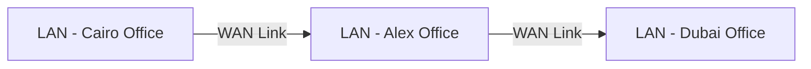

| Feature | LAN | WAN |
|---|---|---|
| Coverage Area | Building / Campus | Country / Global |
| Speed | High (1Gbps+) | Lower / Variable |
| Ownership | Private (Company) | Leased / ISP |
| Example | Office Network | The Internet |

---

### 2. Network Devices — Switches vs Routers

في أي شبكة، في جهازين أساسيين بيتحكموا في الـ Traffic:

#### Switch

الـ **Switch** جهاز بيشتغل على **Layer 2 (Data Link)** من الـ OSI Model. شغلته الأساسية إنه يوصّل الأجهزة ببعض داخل نفس الشبكة.

- بيفهم الـ **MAC Addresses** ويوجّه الـ Traffic بناءً عليها
- بيوصّل PCs، Servers، وكل الأجهزة ببعض داخل الـ LAN

#### Router

الـ **Router** جهاز بيشتغل على **Layer 3 (Network)** من الـ OSI Model. شغلته إنه يوصّل **شبكات مختلفة** ببعض.

- بيفهم الـ **IP Addresses** ويوجّه الـ Traffic بناءً عليها
- بيوصّل Switches ببعض — وبالتالي بيوصّل Networks ببعض

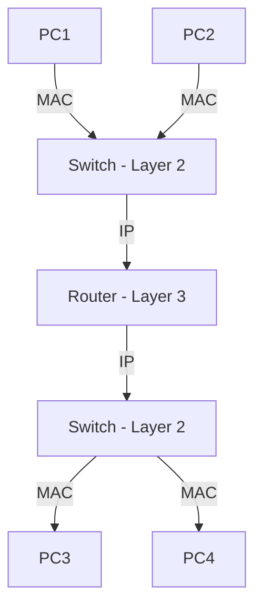

> [!IMPORTANT]
> الـ Switch بيفهم MAC وبيشتغل جوّا الشبكة الواحدة، والـ Router بيفهم IP وبيوصّل بين شبكات مختلفة. الفرق ده مهم جداً في الـ Cybersecurity لأنه بيحدد إزاي الـ Traffic بيتحرك.

| Feature | Switch | Router |
|---|---|---|
| OSI Layer | Layer 2 (Data Link) | Layer 3 (Network) |
| Understands | MAC Addresses | IP Addresses |
| Connects | Devices within LAN | Different Networks |

---

### 3. Protocols

الـ **Protocol** هو مجموعة من القواعد اللي بتحدد إزاي الأجهزة بتتكلم مع بعض. من غير Protocols، الأجهزة مش هتفهم بعض أبداً.

في 3 أنواع رئيسية من الـ Protocols:

#### Networking Protocols
دي البروتوكولات اللي بتتحكم في إزاي الداتا بتتنقل عبر الشبكة.
- **مثال:** IP Protocol

#### Application Protocols
دي البروتوكولات اللي بتتحكم في إزاي الداتا بتتنقل بين التطبيقات.
- **مثال:** FTP (File Transfer Protocol) — بيحدد إزاي الملفات بتتنقل بين الكومبيوترات

#### Security Protocols
دي البروتوكولات اللي بتضمن إن الداتا بتتنقل بشكل آمن ومشفر.
- **مثال:** HTTPS, SSH

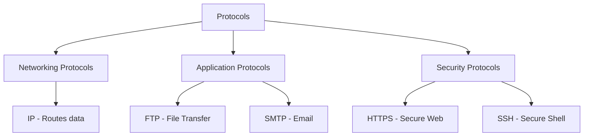

---

## Category 2: Data Transmission — Packets and Encapsulation

### 4. Packets and Packet Structure

#### ما هو الـ Packet؟

الداتا على الشبكة مش بتتبعت كـ Block واحد كبير — هي بتتقسم لـ **Packets** صغيرة. تخيّل إنك بتبعت رسالة طويلة بالبريد، بدل ما تبعتها في ظرف واحد كبير، بتقسّمها على أظرف أصغر وكل ظرف فيه جزء من الرسالة.

كل **Packet** عنده جزئين أساسيين:

| Part | Description |
|---|---|
| **Header** | معلومات عن الـ Packet: جاي منين، رايح فين، وإيه نوع الداتا فيه |
| **Payload (Data)** | الداتا الحقيقية اللي الـ Packet بيحملها |

> [!NOTE]
> في معظم الحالات، لما بتبعت إيميل أو ملف أو صفحة ويب، الداتا دي مش بتسافر في Packet واحد — ممكن تحتاج آلاف أو حتى ملايين الـ Packets.

#### Packet Structure على الـ Ethernet

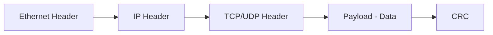

- **Ethernet Header:** أول حاجة في الـ Packet، بيحتوي على MAC Addresses
- **IP Header:** بيحتوي على IP Addresses والمعلومات الخاصة بالـ Routing
- **TCP/UDP Header:** بيحتوي على Port Numbers ومعلومات الـ Transport Layer
- **Payload:** الداتا الفعلية
- **CRC (Cyclical Redundancy Check):** رقم ناتج عن معادلة رياضية. المستقبل بيعمل نفس الحسبة — لو النتيجة اتطابقت، الـ Packet وصل سليم ومفيش حد عبث فيه

> [!TIP]
> الـ CRC هو أول مستوى من مستويات الـ Integrity Checking في الشبكة. كـ Security Analyst لازم تعرف الفرق بين الـ Packet اللي وصل سليم والـ Packet اللي اتعبث فيه.

---

### 5. Encapsulation and De-encapsulation

#### ما هو الـ Encapsulation؟

الـ **Encapsulation** هو عملية لف الداتا بالمعلومات البروتوكولية الضرورية قبل ما تتبعت على الشبكة. تخيّلها زي ما بتحط رسالة في ظرف، الظرف ده في ظرف تاني أكبر، والظرف التاني في كرتونة — كل غلاف بيضيف معلومات أكتر.

في نموذج الـ OSI، كل Layer بتضيف **Header** خاص بيها (وأحياناً **Trailer**) على الداتا الجاية من اللاير اللي فوقيها.

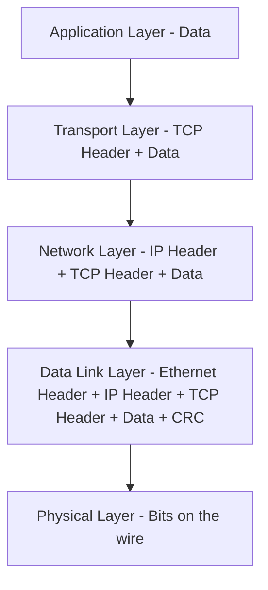

#### عملية الـ Encapsulation خطوة بخطوة:

1. الداتا بتبدأ عند الـ **Application Layer** (مثلاً إرسال إيميل)
2. بتنزل على الـ Stack، وكل Layer بتضيف Header خاص بيها
3. عند المستقبل، الداتا بتصعد على الـ Stack مرة تانية (**De-encapsulation**)
4. كل Layer بتشيل الـ Header الخاص بيها وتعالج المعلومات

> [!WARNING]
> **IP Spoofing:** لما الـ Computer بيتبعت Packet ورد عليه، بيستخدم الـ Source IP الموجودة في الـ Header. الـ Attacker ممكن يحط IP Address كداب كـ Source — وجهازك هيرد على الـ IP الكداب ده بدون ما يعرف إن المصدر الحقيقي كان تاني. ده اللي بيسمى **IP Spoofing**.

---

## Category 3: Network Models — OSI and TCP/IP

### 6. OSI Model

الـ **OSI (Open Systems Interconnection) Model** هو نموذج نظري من 7 Layers بيوضّح إزاي الأجهزة بتتواصل مع بعض. كل Layer ليها وظيفة محددة.

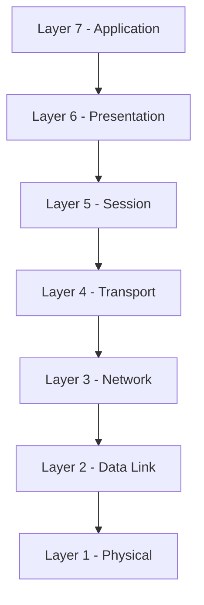

> [!NOTE]
> تذكر القاعدة دي: اللايرز التحتانية أقرب للـ Wires، واللايرز الفوقانية أقرب للـ End User.

#### Layer 1 — Physical Layer

الـ Physical Layer هي أول Layer وبتتعامل مع **النقل الفعلي للبيانات** على الوسيط المادي.

- الـ Electrical Pulses على الأسلاك
- الـ Connection Specifications بين الهاردوير
- الـ Voltage والـ Current

#### Layer 2 — Data Link Layer

بتوصّل الجزء المادي من الشبكة (الأسلاك والإشارات) بالجزء المجرد (الـ Packets والـ Data Streams).

- **Physical Addressing** باستخدام **MAC Addresses**
- بتنشئ الـ Headers والـ Validation Information
- الـ **CRC** موجود هنا

#### Layer 3 — Network Layer

بتتعامل مع الـ **IP Addressing** والـ Connectivity عبر Segments متعددة من الشبكة.

- بتوضح إزاي الأنظمة على Segments مختلفة تلاقي بعض وتتواصل
- الـ **Routing** موجود هنا

#### Layer 4 — Transport Layer

بتتعامل مع بياناتك وبتجهزها للإرسال عبر الشبكة.

- بتضمن الـ **Reliable Connectivity** من طرف لطرف
- بتتحكم في **Sequencing** الـ Packets
- وظيفتها الأساسية هي **Segmentation** — تقسيم الداتا
- الـ **Ports** موجودة هنا
- **TCP** (أكتر موثوقية) أو **UDP** (أسرع)

#### Layer 5 — Session Layer

بتدير الـ **Sessions** بين الأجهزة.

- بتبدأ الـ Sessions وبتديرها وبتنهيها
- بتحدد إمتى الأجهزة تفضل متوصلة وإزاي بتعمل Synchronization للداتا

#### Layer 6 — Presentation Layer

مسؤولة عن **Data Formatting، Translation، Encryption، وCompression**.

- بتترجم الداتا بين الـ Application Format والـ Network Format
- بتشفر/بتفك تشفير الداتا للأمان
- بتضغط الداتا لتحسين الـ Transfer
- أمثلة: JPEG, PNG, MPEG, GIF

#### Layer 7 — Application Layer

هنا المستخدمين والتطبيقات بتتفاعل مع الشبكة.

- بتوفر Network Services للتطبيقات
- أمثلة على البروتوكولات:
  - HTTP / HTTPS — Web Browsing
  - SMTP / POP3 / IMAP — Email

| Layer | Name | Key Function | Key Protocol/Tech |
|---|---|---|---|
| 7 | Application | User Interface | HTTP, SMTP, FTP |
| 6 | Presentation | Data Format & Encryption | SSL/TLS, JPEG |
| 5 | Session | Session Management | NetBIOS |
| 4 | Transport | End-to-End Delivery | TCP, UDP |
| 3 | Network | IP Routing | IP, ICMP |
| 2 | Data Link | MAC Addressing | Ethernet, ARP |
| 1 | Physical | Bits on Wire | Cables, Wi-Fi |

---

### 7. TCP/IP Model

الـ **TCP/IP Model** هو النموذج العملي اللي الإنترنت بيشتغل عليه فعلاً. عنده 4 Layers بدل 7.

#### Link Layer
بتحدد إزاي تتوصل بـ Network Topology معينة زي Ethernet.
- مقابلها في الـ OSI: Layers 1 و 2

#### Internet Layer
بتحدد إزاي الـ Datagrams بتتشكّل وبتتعامل مع الـ Routing.
- أمثلة: IPv4, IPv6, ICMP
- مقابلها في الـ OSI: Layer 3

#### Transport Layer
بتوفر خدمة إيصال الداتا من طرف لطرف.
- أمثلة: TCP, UDP
- مقابلها في الـ OSI: Layer 4

#### Application Layer
بتضم برامج التطبيقات وبتخدم كـ Network Interface للمستخدمين.
- أمثلة: Telnet, FTP, DNS
- مقابلها في الـ OSI: Layers 5, 6, 7

---

### 8. OSI vs TCP/IP Comparison

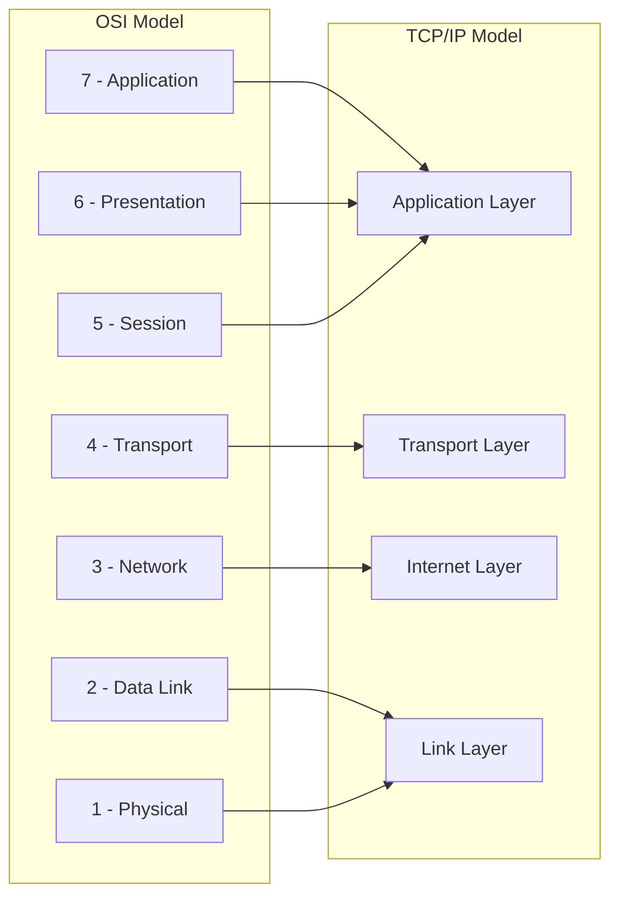

| OSI Layer | TCP/IP Layer |
|---|---|
| Application (7) | Application |
| Presentation (6) | Application |
| Session (5) | Application |
| Transport (4) | Transport |
| Network (3) | Internet |
| Data Link (2) | Link |
| Physical (1) | Link |

> [!IMPORTANT]
> الـ OSI Model هو نموذج **نظري** للفهم والتعليم، أما الـ TCP/IP Model فهو النموذج **العملي** اللي الشبكات الحقيقية بتشتغل عليه. كـ Security Analyst، هتستخدم الاتنين في تحليلاتك.

---

## Category 4: IP Addressing and Routing

### 9. IPv4 Header

الـ **IPv4 Header** هو الـ Header الموجود في الـ Network Layer (Layer 3). كل صف فيه بيمثل **32 Bit (4 Bytes)**، والحد الأدنى لحجم الـ Header هو **20 Bytes**.

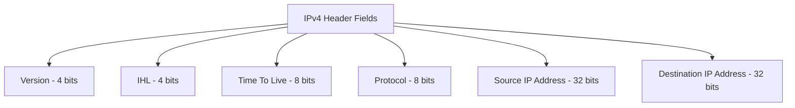

#### أهم Fields في الـ IPv4 Header:

**Version**
بيحدد إصدار الـ IP المستخدم.
- القيم المسموح بيها بس: `4` لـ IPv4 أو `6` لـ IPv6
- أي قيمة تانية = **Malformed Packet** ولازم يتشال بالـ Router

**Time-To-Live (TTL)**
الـ TTL بيحدد **الحد الأقصى من الـ Hops (Routers)** اللي الـ Packet ممكن يعدي عليها.

- كل ما الـ Packet يعدي على Router، الـ TTL بينزل بـ 1
- لو وصل لـ 0، الـ Packet بيتحذف
- الحد الأقصى للـ TTL هو **255**
- الهدف: منع الـ Packets من التهيّم على الشبكة للأبد

> [!TIP]
> الـ TTL مفيد جداً في الـ Network Forensics — ممكن تعرف من قيمة الـ TTL تقريباً جاي من نظام تشغيل إيه (Windows بيبدأ بـ 128، Linux بيبدأ بـ 64).

**Protocol**
بيحدد **البروتوكول اللي موجود في الـ Payload** وهيتبعتله في الـ Transport Layer.

| Protocol Number | Protocol |
|---|---|
| 6 | TCP |
| 17 | UDP |
| 1 | ICMP |

**Source & Destination IP Address**
- **Source Address:** عنوان الجهاز اللي بعت الـ Packet — بنقول "المفروض" لأن ممكن يتعمل **IP Spoofing**
- **Destination Address:** عنوان الجهاز اللي الـ Packet رايحله

> [!WARNING]
> لما بتشوف الـ Source IP في الـ Packet، متثقش فيه 100%. الـ Attacker ممكن يحط أي IP Address كـ Source. ده الأساس في هجمة الـ IP Spoofing.

---

### 10. IP Protocol Requirements

عشان الكومبيوتر يقدر يتواصل على الشبكة، لازم يكون عنده 3 حاجات أساسية:

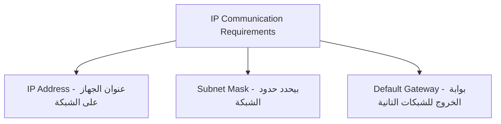

| Requirement | Purpose |
|---|---|
| **IP Address** | عنوان الجهاز على الشبكة |
| **Subnet Mask** | بيحدد إيه الجزء من الـ IP اللي بيمثل الشبكة وإيه اللي بيمثل الجهاز |
| **Default Gateway** | الـ Router اللي الجهاز بيبعت عليه كل الـ Traffic الخارج من الشبكة |

> [!IMPORTANT]
> الـ PC نفسه عنده **Routing Table** فيها على الأقل Entry واحدة وهي الـ **Default Gateway**. أي Packet رايح لشبكة تانية بيتبعت للـ Default Gateway الأول.

---

### 11. Routing and Routing Table

الـ **Routing Table** هي جدول موجود في كل Router (وحتى في الـ PC الخاص بك) بيوضح إزاي الـ Packets بتتوجه لوجهتها.

**إزاي الـ Routing بيشتغل:**
1. الـ Packet وصل للـ Router
2. الـ Router بيبص على الـ Destination IP
3. بيفتش في الـ Routing Table على أنسب طريق
4. بيبعت الـ Packet على الـ Interface المناسب

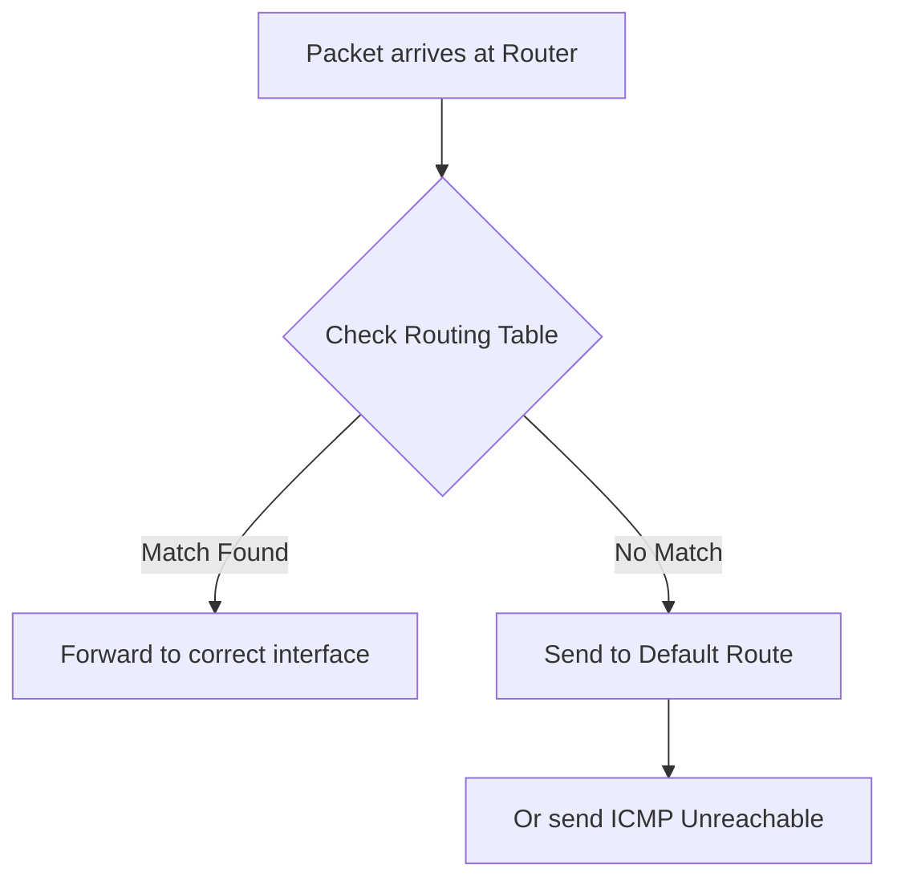

---

### 12. ARP Protocol

#### ما هو الـ ARP؟

الـ **ARP (Address Resolution Protocol)** هو البروتوكول اللي بيربط الـ **IP Address بالـ MAC Address** داخل الـ LAN. هو الحلقة الوصل بين الـ Layer 2 والـ Layer 3.

**ليه محتاجينه؟**
الداتا بتتوجه باستخدام الـ IP Address، لكن فعلياً على الشبكة المحلية بتتنقل باستخدام الـ **MAC Address**.

#### إزاي الـ ARP بيشتغل؟

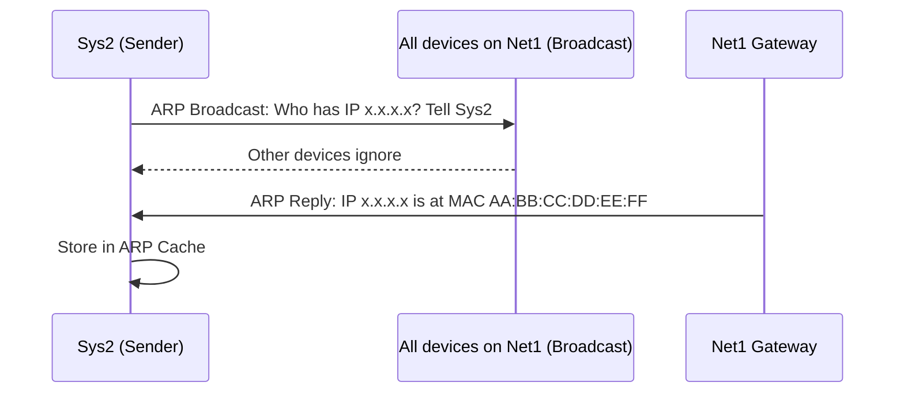

1. الجهاز بيبعت **ARP Broadcast** على الشبكة: "مين عنده الـ IP ده؟ قولي الـ MAC بتاعه"
2. كل الأجهزة بتشوف الـ Broadcast، بس اللي IP مختلف بيتجاهله
3. الجهاز اللي عنده الـ IP بيرد: "أنا! وده الـ MAC Address بتاعي"
4. الجهاز الأول بيحط المعلومات دي في الـ **ARP Cache** في الـ RAM

#### ARP Cache

الـ **ARP Cache** (أو ARP Table) هو جدول مؤقت بيتخزن في الـ RAM بيخلي الجهاز يتذكر الإجابات ومش يسأل كل شوية.

```bash
# عشان تشوف الـ ARP Cache على Windows:
arp -a
```

> [!TIP]
> الـ ARP Cache مفيد في الـ Incident Response — لو شفت MAC Address غريب معاه IP address مهم (زي الـ Gateway) ممكن يكون في هجوم ARP Spoofing/Poisoning.

---

### 13. Private and Public IPs — NAT

#### Private vs Public IP Addresses

| Type | Description | Example |
|---|---|---|
| **Public IP** | بتسافر على الإنترنت، فريدة عالمياً | 8.8.8.8 |
| **Private IP** | بتُستخدم داخل الشبكة المحلية فقط | 192.168.1.1 |

#### نطاقات الـ Private IP Addresses

| Class | Range | Number of Addresses |
|---|---|---|
| Class A | 10.0.0.0 – 10.255.255.255 | 16,777,216 |
| Class B | 172.16.0.0 – 172.31.255.255 | 1,048,576 |
| Class C | 192.168.0.0 – 192.168.255.255 | 65,536 |

> [!IMPORTANT]
> الـ Routers على الإنترنت **مش بتوجّه** الـ Packets اللي عنوانها Private IP. الـ Private IPs موجودة بس على الـ Internal Networks.

#### NAT — Network Address Translation

**ليه بنستخدم NAT؟**
الـ IPv4 عنده حوالي **3.4 مليار** عنوان IP، لكن في أكتر من 4 مليار مستخدم للإنترنت — يعني في مشكلة نقص في الـ IP Addresses. الحل هو الـ **NAT**.

**إزاي الـ NAT بيشتغل؟**

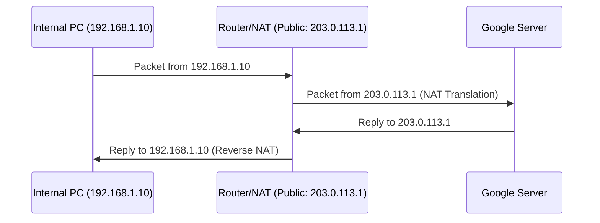

- الـ Traffic الخارج من الشبكة الداخلية، الـ Router بيغيّر الـ Source IP من Private لـ Public IP بتاعته
- الـ Replies الراجعة بترجع للـ Router، وهو بيعرف يرجّعها للجهاز الداخلي الصح

#### PAT — Port Address Translation

الـ **PAT** هو النوع الأكتر استخداماً من الـ NAT، وبيخلي أجهزة كتير داخل الشبكة تشارك نفس الـ Public IP باستخدام **Port Numbers** مختلفة.

> [!NOTE]
> الـ PAT بيشتغل بس للـ Traffic الخارج من الشبكة الداخلية للإنترنت — مش بيشتغل للـ Incoming Traffic من الإنترنت.

---

## Category 5: Transport Layer — TCP and UDP

### 14. Network Ports

#### ما هي الـ Ports؟

الـ **Network Port** هو **Logical Address** بيميّز بين الـ Sessions أو الخدمات المختلفة على نفس الجهاز. تخيّل الـ IP Address كعنوان عمارة، والـ Port كرقم الشقة — الإتنين مع بعض بيحددوا مكان بالضبط.

كل Packet بيحتوي على **Destination Port Number** في الـ Layer 4 Header، وده بيقول للجهاز المستقبل أنهي تطبيق أو سيرفس الـ Packet ده مخصص ليه.

#### أنواع الـ Ports

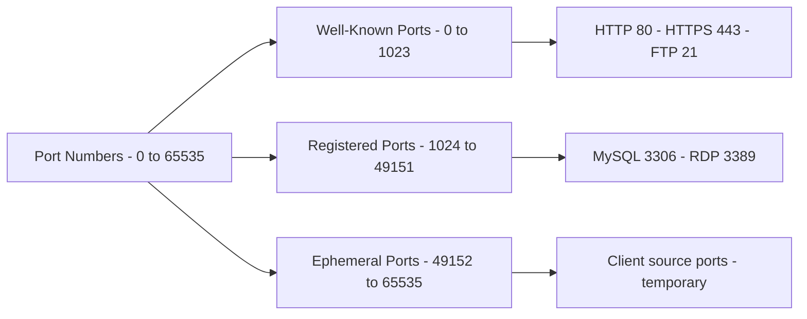

| Port Range | Name | Description |
|---|---|---|
| 0 – 1023 | **Well-Known Ports** | محجوزة للخدمات الأساسية — ممنوع تستخدمها |
| 1024 – 49151 | **Registered Ports** | للتطبيقات التجارية — يُفضّل تتجنبها |
| 49152 – 65535 | **Ephemeral Ports** | الـ Client بيستخدمها كـ Source Port مؤقت |

#### أهم الـ Well-Known Ports

| Port | Protocol | Service |
|---|---|---|
| 21 | FTP | File Transfer |
| 22 | SSH | Secure Shell |
| 25 | SMTP | Email Sending |
| 53 | DNS | Domain Name Resolution |
| 80 | HTTP | Web (Unencrypted) |
| 443 | HTTPS | Web (Encrypted) |
| 3306 | MySQL | Database |
| 3389 | RDP | Remote Desktop |

#### مثال عملي

لما بتفتح Google:

```
Client (Your PC)          Server (Google)
Source Port: 49155   -->  Destination Port: 443
                    <--
Source Port: 443          Destination Port: 49155
```

---

### 15. TCP — Transmission Control Protocol

الـ **TCP** هو بروتوكول **Connection-Oriented** — بيبني Connection بين الطرفين وبيراقب حالة الـ Connection دي.

#### أهم خاصية في TCP: Error Control

الـ TCP مش بيضمن وصول كل **Packet** — لكنه بيضمن وصول كل **الداتا**.

**مثال:** لو بعتت 500 Byte من الداتا، والمستقبل استلم 400 بس — الـ TCP بيعرف ده ويعيد إرسال الـ 100 Byte الناقصة.

> [!IMPORTANT]
> الـ TCP بيشتغل فوق الـ IP — والـ IP هو Best Effort Protocol مش بيضمن الوصول. لذلك الـ TCP مش قادر يضمن وصول كل Packet، لكن عنده **Error Control Mechanism** يعيد إرسال الداتا اللي ضاعت.

---

### 16. TCP Header and Flags

#### هيكل الـ TCP Header

الحد الأدنى لحجم الـ TCP Header هو **20 Bytes**.

| Field | Size | Purpose |
|---|---|---|
| Source Port | 2 Bytes | الـ Port اللي الـ Connection جاي منه |
| Destination Port | 2 Bytes | الـ Port اللي الـ Connection رايحله |
| Sequence Number | 4 Bytes | ترقيم الـ Packets لإعادة ترتيبها |
| Acknowledgement | 4 Bytes | تأكيد استلام الـ Packets |
| Flags | Variable | التحكم في سلوك الـ Connection |

#### TCP Flags

الـ Flags هي Bits بتتحكم في سلوك الـ TCP Session:

| Flag | Name | Purpose |
|---|---|---|
| **SYN** | Synchronize | بيبدأ الـ 3-Way Handshake |
| **ACK** | Acknowledge | بيأكد استلام Packet سابق |
| **FIN** | Finish | بيطلب إنهاء الـ Connection |
| **RST** | Reset | إنهاء فوري للـ Session لما في مشكلة |
| **PSH** | Push | اعمل Deliver للداتا فوراً من غير ما تستنى |

#### PSH Flag — مثال عملي

لما بتكتب command في SSH زي `arp -a`:
- **بدون PSH:** المستقبل بيستنى يجمع كل الداتا الأول قبل ما يعمل Process
- **مع PSH:** كل حرف بيتبعت وبيتعالج فوراً (`a` → `r` → `p` ...)

الـ PSH مفيد في:
- Chat Applications
- Online Games القائمة على TCP

> [!TIP]
> لو في Packet Capture شفت الـ PSH + ACK Flags معاً — ده معناه إن الـ Packet ده **فيه داتا حقيقية** وبيأكد استلام Packet سابق في نفس الوقت.

---

### 17. TCP 3-Way Handshake

الـ **3-Way Handshake** هو الإجراء اللي TCP بيعمله عشان يبني Connection قبل ما يبعت أي داتا حقيقية. بيحصل كل ما في Session جديدة بين جهازين.

**الهدف:** كل طرف يعرف الـ **Initial Sequence Number** للطرف التاني.

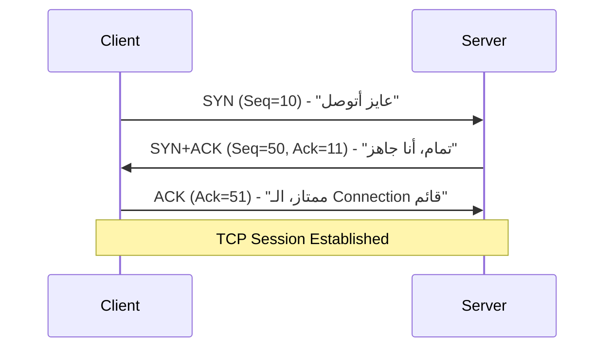

| Packet | From | Flags | Content |
|---|---|---|---|
| 1st | Client → Server | SYN | Seq=10، "عايز أبدأ Session" |
| 2nd | Server → Client | SYN + ACK | Seq=50، Ack=11، "موافق" |
| 3rd | Client → Server | ACK | Ack=51، "الـ Connection اتبنى" |

> [!NOTE]
> الحد الأدنى من الـ Packets عشان تحصل TCP Communication كاملة هو **10 Packets**:
> - 3 للـ Handshake
> - 3 لتبادل الداتا الفعلية
> - 4 لإنهاء الـ Connection

---

### 18. TCP 4-Way Termination

لما الـ Communication خلصت، الـ Connection بيتقفل بشكل منظم في **4 خطوات**:

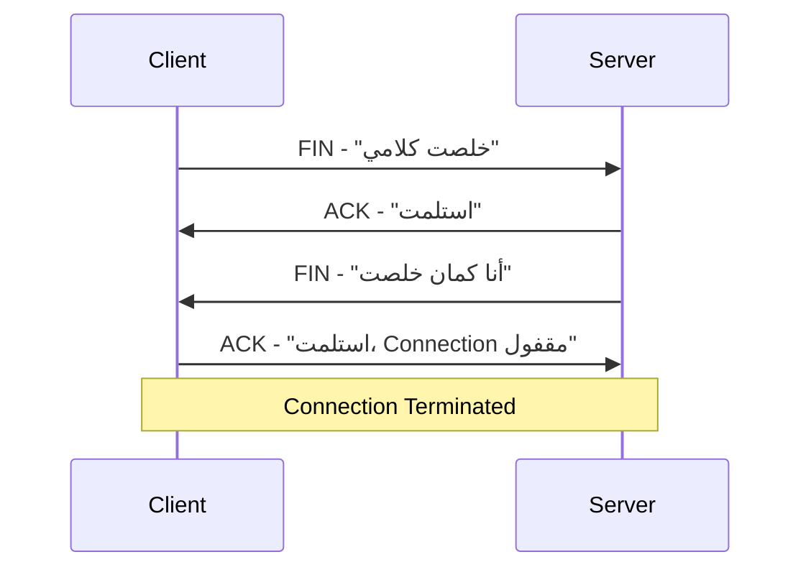

> [!TIP]
> الـ Server ممكن يجمع الـ FIN والـ ACK في Packet واحد (FIN + ACK)، فيبقى في الـ Packet Capture 3 Packets بدل 4 — وده طبيعي وصح.

> [!NOTE]
> لو في Packet Capture شفت الـ 4 Packets دول كاملين، ده معناه إن الـ Connection اتقفل بشكل سليم وما فيش مشاكل.

---

### 19. UDP — User Datagram Protocol

الـ **UDP** هو **Connectionless Protocol** — بيبعت الداتا من غير ما يبني Connection أو يستنى Confirmation.

#### UDP Header

الـ UDP Header أبسط بكتير من الـ TCP Header:

| Field | Size | Purpose |
|---|---|---|
| Source Port | 2 Bytes | الـ Port المرسِل |
| Destination Port | 2 Bytes | الـ Port المستقبِل |
| UDP Length | 2 Bytes | إجمالي حجم الـ UDP Packet |
| Checksum | 2 Bytes | فحص أساسي للـ Integrity |

#### TCP vs UDP Comparison

| Feature | TCP | UDP |
|---|---|---|
| Connection | Connection-Oriented | Connectionless |
| Reliability | بيضمن وصول الداتا | مفيش ضمان |
| Speed | أبطأ | أسرع |
| Overhead | أعلى | أقل |
| Min Packets to Transfer | 10 | 2 |
| Use Case | Web، Email، File Transfer | Streaming، Gaming، DNS |

#### إمتى نستخدم UDP؟

- **Limited Bandwidth:** لما الشبكة ضعيفة ومحتاج سرعة
- **Real-Time Communications:** Video Streaming، Voice Calls — الـ Delay أخطر من الـ Packet Loss
- **Repetitive Data:** زي NTP (Network Time Protocol) اللي بيتبعت كل دقيقة أو دقيقتين — لو Packet ضاع، هييجي تاني قريب

---

## Category 6: Supporting Network Protocols

### 20. ICMP Protocol

#### ما هو ICMP؟

الـ **IP Protocol** هو **Best Effort Protocol** — بيبعت الـ Packet ويأمل يوصل، لكن من غير Connection ومن غير Acknowledgment. ده بيخليه **Unreliable**.

عشان كده في **ICMP (Internet Control Message Protocol)** — هو **آلية الـ Error Reporting** الخاصة بالـ IP Protocol.

#### أمثلة على ICMP Messages

| Scenario | ICMP Message |
|---|---|
| الـ TTL وصل لـ 0 عند Router | "Time to live exceeded in transit" |
| الـ Router مش عارف يبعت الـ Packet فين | "Destination unreachable, Network unreachable" |
| الشبكة وصلت لكن الجهاز مش بيرد | "Destination unreachable, Host unreachable" |

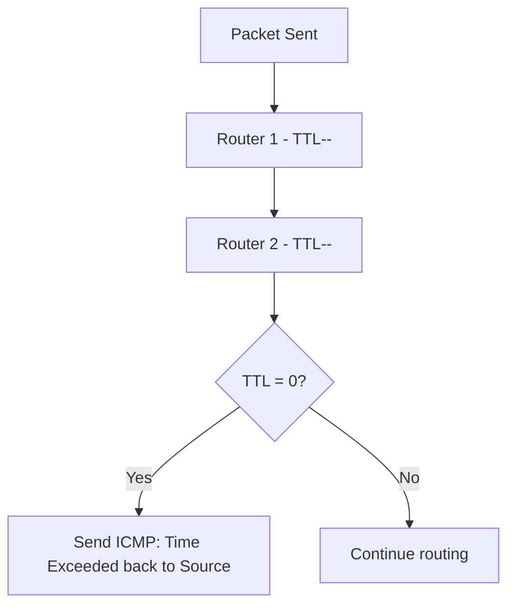

---

### 21. DHCP Protocol

#### ما هو DHCP؟

الـ **DHCP (Dynamic Host Configuration Protocol)** هو آلية إعطاء كل جهاز على الشبكة **IP Address تلقائياً**.

بدونه، محتاج تحط IP يدوي على كل جهاز — ده ممكن مع 10 أجهزة، لكن مستحيل مع 100,000.

#### Static vs Dynamic IP

| Type | Who Sets It | Use Case |
|---|---|---|
| **Static** | المسؤول يحطها يدوي | Servers — محتاج IP ثابت دايماً |
| **Dynamic (DHCP)** | الـ DHCP Server تلقائياً | Clients — أجهزة المستخدمين |

#### ما اللي DHCP بيديه؟

- IP Address
- Subnet Mask
- Default Gateway
- DNS Server IP

#### DHCP DORA Process

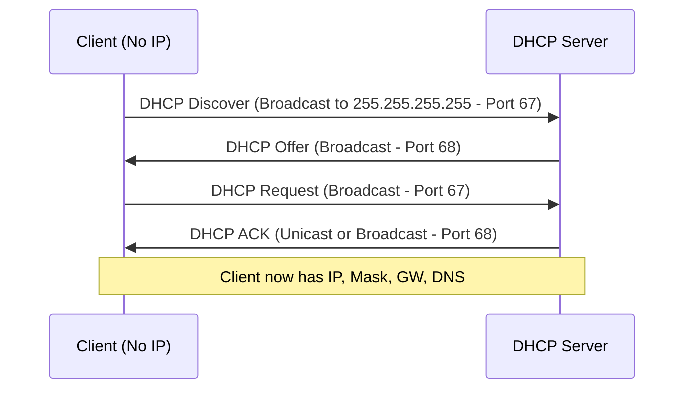

| Step | Who | What |
|---|---|---|
| **Discover** | Client | "في DHCP Server هنا؟" |
| **Offer** | Server | "أيوه، وده الـ IP اللي هاديك إياه" |
| **Request** | Client | "عايز الـ Config ده" |
| **ACK** | Server | "تفضل، الـ Config جاهزة" |

> [!NOTE]
> الـ DHCP بيشتغل على **UDP**:
> - Client بيسمع على **Port 68**
> - Server بيسمع على **Port 67**
>
> الـ Client في البداية مالوش IP، فبيستخدم الـ Broadcast Address `255.255.255.255` كـ Source IP.

#### IP Lease

الـ IP المُعطى مش دايم — الجهاز بـ "يأجره" لفترة:
- في بيئة ثابتة (شركة): يوم أو أسبوع
- في بيئة متغيرة (كامبس جامعي): 60-90 دقيقة

---

### 22. DNS Protocol

#### ما هو DNS؟

الـ **DNS (Domain Name System)** هو البروتوكول اللي بيترجم **Domain Names** (زي google.com) لـ **IP Addresses** حقيقية. لأن الكومبيوتر مش بيفهم `google.com` في الـ Packet Header — بيحتاج IP Address.

**TLD (Top Level Domain):** الجزء الأخير من الـ Domain زي `.com`، `.net`، `.edu`، `.org`

#### رحلة الـ DNS Resolution

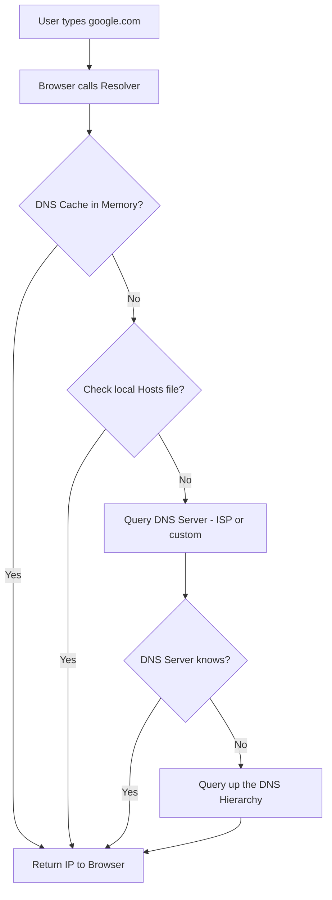

#### DNS Resolution Steps

1. المستخدم بيكتب `google.com` في الـ Browser
2. الـ Browser بيستدعي الـ **Resolver**
3. الـ Resolver بيفحص الـ **DNS Cache** في الـ RAM أولاً
4. لو مش موجود، بيفحص الـ **Local Hosts File**
5. لو مش موجود، بيبعت Query لـ **DNS Server** (المُعطى من الـ ISP عبر DHCP)
6. لو الـ DNS Server مش عارف، بيسأل Server أعلى في الهيكل
7. في النهاية، الـ IP Address بيترجع للـ Browser

#### Public DNS Servers

| Provider | Primary | Secondary |
|---|---|---|
| **Cloudflare** | 1.1.1.1 | 1.0.0.1 |
| **Google DNS** | 8.8.8.8 | 8.8.4.4 |
| **OpenDNS** | 208.67.222.222 | 208.67.220.220 |

> [!TIP]
> مش لازم تستخدم الـ DNS Server بتاع الـ ISP. ممكن تغيّر لأي Server من الجدول ده. الـ Cloudflare (1.1.1.1) معروف بالسرعة والخصوصية.

---

## Category 7: Diagnostic Tools

### 23. Ping

الـ **Ping** هو أبسط Tool لاختبار الاتصال بين جهازين أو للتأكد إن جهاز معين متاح.

**بيشتغل إزاي؟**
1. بيعمل **ICMP Echo Request** Packet ويبعته للـ Target
2. الـ Target بيرد بـ **ICMP Echo Reply**
3. الـ Tool بيحسب الـ Round-Trip Time (RTT)

```bash
# مثال
ping google.com
ping 8.8.8.8
```

**الاستخدامات:**
- اختبار إن الجهاز متاح
- قياس الـ Latency (التأخير)
- Troubleshooting مشاكل الشبكة

---

### 24. Traceroute / Tracert

الـ **Traceroute** (Linux/Mac) أو **Tracert** (Windows) بيساعدك تكتشف **المسار الفعلي** اللي الـ Packets بتأخده بين جهازين.

**إزاي بيشتغل؟**

بيعبث بالـ **TTL Field** في الـ IP Header:

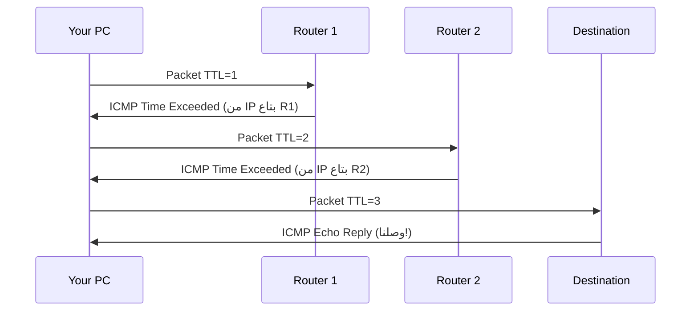

1. بيبعت Packet بـ TTL=1 → الأول Router يحذفه ويبعت ICMP Time Exceeded مع IP بتاعه
2. بيبعت Packet بـ TTL=2 → التاني Router يحذفه ويبعت ICMP Time Exceeded مع IP بتاعه
3. وهكذا لحد ما يوصل للـ Destination

```bash
# Windows
tracert google.com

# Linux / Mac
traceroute google.com
```

> [!TIP]
> الـ Traceroute مفيد جداً كـ Security Analyst عشان تشوف لو في Hop غريب في المسار أو لو الـ Traffic بيعدي على شبكة مش المفروض تعدي عليها.

---

### 25. Loopback Address

الـ **Loopback Address** هو `127.0.0.1` — أي Packet بتبعته لده بيتبعت لنفس جهازك.

**الاستخدامات:**
- الـ Services الداخلية في جهازك بتتكلم مع بعض باستخدامه
- Testing التطبيقات محلياً من غير ما تحتاج شبكة

```bash
ping 127.0.0.1
# لو رجعت رد = الـ Network Stack على جهازك شغّال صح
```

> [!NOTE]
> الـ Loopback Address هو **أكتر IP Address استخداماً في العالم** لأن أي كومبيوتر شغّال بيستخدمه داخلياً.

---

## Summary

### الـ Categories والـ Key Takeaways

**Category 1 — Network Fundamentals:**
- الـ LAN شبكة محلية، الـ WAN شبكة واسعة
- الـ Switch (Layer 2) بيفهم MAC، الـ Router (Layer 3) بيفهم IP
- الـ Protocols هي القواعد اللي الأجهزة بتتكلم بيها

**Category 2 — Data Transmission:**
- الداتا بتتنقل في Packets — كل Packet عنده Header وPayload
- الـ Encapsulation = كل Layer بتضيف Header وانت نازل الـ Stack
- الـ De-encapsulation = كل Layer بتشيل الـ Header وانت صاعد

**Category 3 — Network Models:**
- الـ OSI = 7 Layers للفهم النظري
- الـ TCP/IP = 4 Layers للتطبيق الفعلي
- الاتنين مهمين في الـ Cybersecurity

**Category 4 — IP Addressing:**
- الـ IPv4 Header بيحتوي على TTL، Protocol، Source/Destination IP
- كل جهاز محتاج IP + Subnet Mask + Gateway
- الـ ARP بيربط IP بـ MAC داخل الـ LAN
- الـ NAT بيحل مشكلة نقص الـ IP Addresses

**Category 5 — Transport Layer:**
- الـ Ports بتحدد أنهي Service الـ Packet رايحله
- الـ TCP Connection-Oriented وعنده Error Control
- الـ TCP 3-Way Handshake: SYN → SYN+ACK → ACK
- الـ UDP أسرع بدون ضمان وصول

**Category 6 — Supporting Protocols:**
- الـ ICMP هو Error Reporting بتاع IP
- الـ DHCP بيدي الأجهزة IP تلقائياً (DORA Process)
- الـ DNS بيترجم Domain Names لـ IP Addresses

**Category 7 — Diagnostic Tools:**
- `ping` لاختبار الاتصال
- `traceroute` / `tracert` لمعرفة مسار الـ Packets
- `127.0.0.1` هو الـ Loopback Address لجهازك

---
> **ملاحظة للمراجعة:** ركّز خصوصاً على الـ TCP 3-Way Handshake، الـ IPv4 Header fields، والـ DHCP DORA Process — دول من أكتر الحاجات اللي بتيجي في الـ SOC Analysis العملي.
