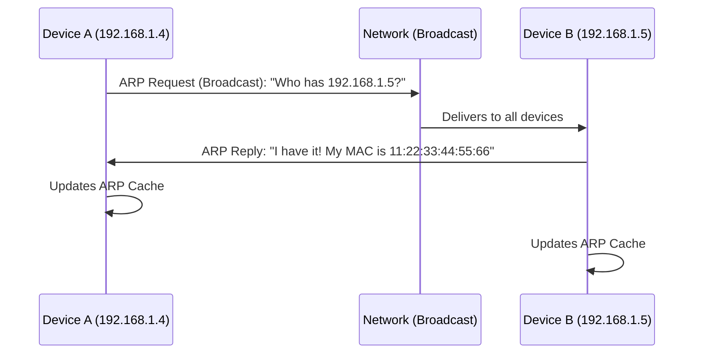
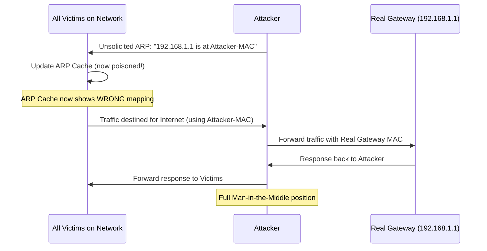
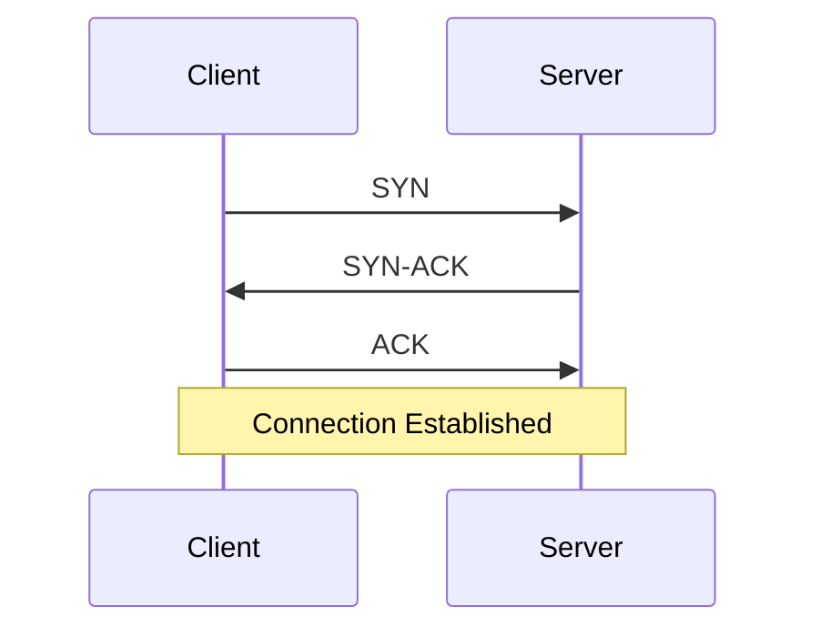
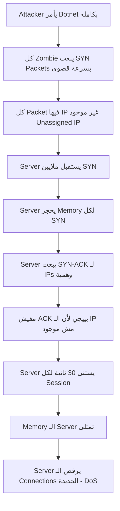

> **الهدف من الـ Section ده:**  
> هنتعرف على مجموعة من أخطر Network-Level Attacks اللي بتستهدف البنية الأساسية للشبكات والأنظمة.

---

## Table of Contents

- [Network-Level Attacks](#network-level-attacks)
  - [Spoofing](#spoofing)
  - [ARP Cache Poisoning](#arp-cache-poisoning)
  - [SYN Flood Attack](#syn-flood-attack)
  - [Buffer Overflow](#buffer-overflow)
- [Summary](#summary)

---

## Network-Level Attacks

### Spoofing

#### ما هو الـ Spoofing؟

الـ **Spoofing** هو استخدام معلومات مزيفة لأغراض ضارة. بالعربي: الـ Attacker بيتظاهر بإنه حد تاني.

| نوع الـ Spoofing | الوصف |
|---|---|
| **IP Spoofing** | وضع أي IP Address في الـ Packet بغض النظر عن المصدر الحقيقي |
| **MAC Spoofing** | تغيير الـ MAC Address لتجاوز الـ MAC Filtering |
| **Email Spoofing** | تغيير الـ Sender في الـ Email عشان يبان كأنه من حد تاني |

---

### ARP Cache Poisoning

#### فهم الـ ARP الطبيعي أولاً

الـ **ARP (Address Resolution Protocol)** هو البروتوكول المسؤول عن تحويل الـ **IP Address** لـ **MAC Address** على الـ Local Network.

كل Device عنده **ARP Cache** — جدول بيحفظ فيه الـ Mapping ده:

```
IP Address      MAC Address
192.168.1.1     AA:BB:CC:DD:EE:FF
192.168.1.5     11:22:33:44:55:66
```

```bash
# عشان تشوف الـ ARP Cache على جهازك
arp -a
```

#### إزاي بيشتغل الـ ARP الطبيعي؟



#### الـ Unsolicited ARP (Gratuitous ARP)

في نوع ARP اسمه **Unsolicited ARP** بيتبعت من غير ما حد يطلبه. استخداماته الشرعية:

- لما Router بيشتغل، بيعلن عن نفسه: "أنا هنا وعندي الـ IP ده"
- لما MAC Address بيتغير، بيعلن التحديث الجديد
- تحديث الـ ARP Tables في الشبكة

> [!IMPORTANT]
> الـ Feature دي مفيش فيها Authentication. أي Device يقدر يبعت Unsolicited ARP بأي معلومات حتى لو كاذبة — وكل الأجهزة في الشبكة هتصدق وتحدث الـ ARP Cache بتاعتها.

#### إزاي بيشتغل الـ ARP Cache Poisoning Attack؟



#### الـ Attack خطوة بخطوة

1. الـ Attacker يبعت **Unsolicited ARP** يقول "أنا الـ Gateway"
2. كل الأجهزة تصدق وتحدث الـ ARP Cache بتاعتها
3. كل الـ Traffic المتجه للإنترنت بييجي للـ Attacker
4. الـ Attacker يستخدم Tool زي **Ettercap** عشان:
   - يشوف كل الـ Traffic (Man-in-the-Middle)
   - يعدل في الـ MAC Addresses ويعمل Forward للـ Gateway الحقيقي
5. الـ Gateway يرد، والـ Attacker يعمل Forward للضحية

> [!TIP]
> عشان تكتشف الـ ARP Poisoning، ابحث عن **Duplicate IP Addresses** في الـ ARP Cache — لو IP واحد عنده MAC Addresses مختلفة، في حاجة غلط. أو استخدم Tools زي **XArp** للمراقبة.

---

### SYN Flood Attack

#### مراجعة سريعة: الـ TCP 3-Way Handshake



#### إزاي بيشتغل الـ SYN Flood؟

الـ Server لما بيستقبل SYN، بيعمل التالي:
- **يحجز Memory** للـ Session دي
- **يبعت SYN-ACK** للـ Client
- **يستنى الـ ACK** لمدة ~30 ثانية

الـ Attacker بيستغل ده:



> [!IMPORTANT]
> الـ Attacker مش محتاج مليون جهاز عشان يعمل مليون Session. كل جهاز من الـ Botnet بيبعت Packets بأسرع ما يقدر — كل Packet بـ IP وهمي مختلف.

#### الحلول

| الحل | الوصف | الفعالية |
|---|---|---|
| تقليل الـ SYN Timeout | تقليل وقت الانتظار من 30 ثانية | مفيد نسبياً، بس لو الـ Attack قوي مش كافي |
| SYN Cookies | تقنية بتتجنب حجز Memory قبل الـ ACK | أفضل |
| Firewall مع SYN Proxy | الـ Firewall بيكمل الـ Handshake عوضاً عن الـ Server | الأفضل، بس غالي |

---

### Buffer Overflow

#### ما هو الـ Buffer؟

الـ **Buffer** هو ببساطة قطعة من الـ Memory بيستخدمها البرنامج عشان يحفظ فيها Data مؤقتاً — زي Array أو String.

#### ما هو الـ Buffer Overflow؟

لما بتحاول تحط في الـ Buffer بيانات أكتر من اللي صُمم عشانها، البيانات الزيادة بتـ "Overflow" وتكتب فوق الـ Memory المجاورة. ده هو الـ **Buffer Overflow**.

> [!NOTE]
> الـ Buffer Overflow شائع جداً في لغتي **C** و **C++** لأنهم **مش بيعملوا Automatic Bounds Checking**. إنت كـ Developer مسؤول إنك تتأكد إن البيانات مش بتتعدى حجم الـ Buffer.
> 
> ```c
> char buffer[10];  // حجز 10 bytes بس
> // لو كتبت 50 byte هنا، C مش هتوقفك!
> ```

#### الـ Memory Layout وإزاي بيشتغل الـ Attack

```mermaid
flowchart TD
    subgraph Normal["Normal Execution"]
        N1[Instruction A] --> N2[Instruction B]
        N2 --> N3[Instruction C: Go to Buffer Q]
        N3 --> N4[Buffer Q: Process user input]
        N4 --> N5[Return Pointer: Go back to D]
        N5 --> N6[Instruction D: Continue]
    end

    subgraph Attack["Buffer Overflow Attack"]
        A1[Instruction A] --> A2[Instruction B]
        A2 --> A3[Instruction C: Go to Buffer Q]
        A3 --> A4[Buffer Q: Attacker fills with NOP sled]
        A4 --> A5[Overflow overwrites Return Pointer]
        A5 --> A6[New Return Pointer points to Malicious Code]
        A6 --> A7[Malicious Code Executes]
        A7 --> A8[Return to D to avoid suspicion]
    end
```



#### ليه الـ Attacker محتاج يكتب فوق الـ Return Address؟

> [!IMPORTANT]
> الـ Processor مش بيشغل Code تلقائياً لمجرد إنه موجود في الـ Memory. الـ Code بس بتتنفذ لما الـ CPU's Instruction Pointer (IP/EIP/RIP) بيقفز لعنوانها. يعني حتى لو الـ Attacker حط Shellcode في الـ Memory، هيفضل مجرد Bytes مش بتتنفذ — لازم يحول مسار الـ Execution Flow ليها.

#### الـ NOP Sled

الـ **NOP (No Operation)** هو Instruction شرعي بيقول للـ Processor "معملش حاجة، كمّل للـ Instruction الجاية". الـ Attacker بيملي الـ Buffer بـ NOPs عشان:

- يوسع مساحة الـ "Landing Zone" للـ Jump
- يضمن وصول الـ Execution للـ Malicious Code في النهاية

```
[NOP][NOP][NOP]...[NOP][NOP][Shellcode][Return to D]
       ← NOP Sled →
```

> [!TIP]
> الحماية من الـ Buffer Overflow بتتم بعدة طرق: **Input Validation** (التحقق من البيانات المدخلة)، **ASLR (Address Space Layout Randomization)** (تغيير عناوين الـ Memory عشوائياً)، و**Stack Canaries** (قيم خاصة قبل الـ Return Address بيتم التحقق منها).

## Summary
- **Spoofing:** تزوير الـ IP أو MAC أو Email
- **ARP Poisoning:** تزوير الـ ARP Cache عشان تبقى MITM
- **SYN Flood:** إغراق الـ Server بـ SYN Packets وهمية حتى ينهار
- **Buffer Overflow:** كتابة فوق الـ Memory عشان تحول الـ Execution لـ Malicious Code
