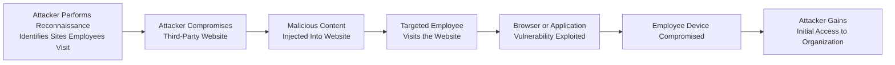

| Topic | Level | Reading Time | Prerequisites |
|---|---|---|---|
| Watering Hole Attack | Intermediate | ~12 min | Basic understanding of social engineering and reconnaissance concepts |

الهدف من الـ Section ده: هتفهم إيه هو الـ Watering Hole Attack، وإزاي المهاجم بيستهدف موقع تالت طرف بدل ما يهاجم المؤسسة مباشرة، وإزاي فريق الـ SOC يقدر يكتشف الهجوم ده.

## Learning Objectives

By the end of this section, you will be able to:

- Define a **Watering Hole Attack** and explain the analogy behind its name.
- Describe the role of **reconnaissance** in identifying the right compromise target.
- Explain why compromising a third-party website is attractive to attackers compared to attacking the organization directly.
- Trace the attack path from the compromised website to initial access into the organization's environment.
- Identify the indicators a **SOC** team monitors to detect this type of attack.

## Table of Contents

- [What Is a Watering Hole Attack](#what-is-a-watering-hole-attack)
- [Why the Name "Watering Hole"](#why-the-name-watering-hole)
- [Step One: Reconnaissance](#step-one-reconnaissance)
- [Why Attackers Target a Third-Party Website](#why-attackers-target-a-third-party-website)
- [Compromising the Website](#compromising-the-website)
- [From Visit to Initial Access](#from-visit-to-initial-access)
- [Attack Flow Diagram](#attack-flow-diagram)
- [Detection: The SOC Perspective](#detection-the-soc-perspective)
- [Career Connection](#career-connection)
- [Key Terms Glossary](#key-terms-glossary)
- [Summary](#summary)

## What Is a Watering Hole Attack

**Watering Hole Attack** هو هجوم مستهدف (**targeted attack**) بيقوم فيه المهاجم باختراق موقع إلكتروني بيزوره موظفين مؤسسة معينة بشكل متكرر، بدل ما يهاجم المؤسسة نفسها مباشرة.

الفكرة الأساسية هنا إن المهاجم مش بيحاول يخترق دفاعات المؤسسة القوية مباشرة، لكنه بيدور على نقطة أضعف: موقع خارجي بيثق فيه الموظفين ويزوروه بشكل طبيعي كجزء من روتين شغلهم أو اهتماماتهم.

> [!NOTE]
> الـ Watering Hole Attack بيُعتبر نوع من أنواع الهجمات غير المباشرة (**indirect attacks**)، لأن الهدف النهائي هو المؤسسة، لكن نقطة الاختراق الفعلية بتكون طرف تالت (third party) مش تابع للمؤسسة نفسها.

## Why the Name "Watering Hole"

اسم الهجوم ده جاي من تشبيه طبيعي: المهاجم بيخترق **مكان بيتجمع فيه الضحايا المستهدفين بشكل معروف**، بنفس الطريقة اللي بيها الحيوان المفترس (**predator**) بيستنى بجوار مصدر مياه (**watering hole**) عشان الفرائس (**prey**) بتيجي تشرب منه بشكل طبيعي ومتكرر.

المهاجم في الحالة دي مبيلحقش الضحية في كل مكان، لكنه بيستنى في مكان عارف إن الضحية هتيجي ليه بنفسها عاجلًا أو آجلًا.

## Step One: Reconnaissance

قبل ما يحدد الموقع المستهدف، المهاجم بيعمل **reconnaissance** (بحث واستطلاع) عشان يحدد المواقع، المنتديات، الخدمات، أو الموارد الإلكترونية اللي الموظفين المستهدفين بيستخدموها بشكل شائع.

البحث ده ممكن يشمل:

- المواقع الإخبارية أو التقنية المتخصصة اللي الموظفين بيتابعوها.
- المنتديات المهنية المرتبطة بمجال عمل المؤسسة.
- خدمات أو أدوات أونلاين بيستخدمها الموظفين بشكل متكرر في شغلهم.

> [!TIP]
> جودة مرحلة الـ reconnaissance بتحدد نجاح الهجوم كله؛ لو المهاجم اختار موقع مش فعليًا بيزوره الموظفين المستهدفين، الهجوم هيفشل من الأساس مهما كانت جودة الكود الضار المستخدم.

## Why Attackers Target a Third-Party Website

بما إن الموقع المستهدف بره السيطرة المباشرة للمؤسسة (**outside the organization's direct control**)، المؤسسة نفسها ممكن يكون عندها قدرة محدودة جدًا على تأمين أو مراقبة الموقع ده.

النقطة دي مهمة جدًا لفهم ليه الهجوم ده فعّال: المؤسسة ممكن تكون عندها دفاعات قوية جدًا على شبكتها الداخلية، لكنها مالهاش أي سيطرة على مستوى الأمان بتاع موقع خارجي تابع لجهة تانية تمامًا.

> [!IMPORTANT]
> الـ Watering Hole Attack بيستغل فجوة أساسية في نموذج الثقة: المؤسسات بتأمّن أنظمتها الداخلية، لكن الموظفين بيثقوا في مواقع خارجية مش بالضرورة نفس مستوى الحماية بتاعها.

## Compromising the Website

بعد ما المهاجم يحدد الموقع المناسب، هو بيحاول يخترقه ويحقن (**inject**) كود ضار أو محتوى ضار تاني جواه.

الكود ده بيتصمم عادةً بحيث يستهدف زوار الموقع بشكل عام، لكن المهاجم بيكون مهتم تحديدًا بالموظفين اللي بيمثلوا المؤسسة المستهدفة.

## From Visit to Initial Access

لما موظف مستهدف يزور الموقع المخترق، المحتوى الضار الموجود فيه ممكن يحاول يستغل ثغرة (**exploit a vulnerability**) في المتصفح أو في تطبيق تاني على جهاز الموظف، وبكده يخترق (**compromise**) الجهاز ده.

الجهاز اللي اتخترق ممكن يوفّر للمهاجم **وصول أولي (initial access)** لبيئة المؤسسة، وده بيعتمد على:

- نوع الهجوم المستخدم بالظبط.
- صلاحيات الجهاز نفسه داخل شبكة المؤسسة.

> [!WARNING]
> خطأ شائع إن الطلاب يفتكروا إن اختراق جهاز الموظف هو "نهاية" الهجوم. الحقيقة إنه غالبًا بس **البداية**؛ المهاجم بيستخدم الوصول الأولي ده كنقطة انطلاق للتحرك جوه شبكة المؤسسة وتحقيق أهداف أكبر.

## Attack Flow Diagram

المخطط التالي بيوضح مراحل الـ Watering Hole Attack بالكامل، من الاستطلاع وحتى الوصول الأولي لبيئة المؤسسة:

## Detection: The SOC Perspective

من منظور فريق الـ **SOC (Security Operations Center)**، فيه عدة مؤشرات بتساعد في اكتشاف هجوم من نوع Watering Hole، من أهمها:

| مؤشر المراقبة | الهدف من المراقبة |
|---|---|
| **Web Traffic Monitoring** | رصد الاتصالات الغير طبيعية بمواقع خارجية معينة |
| **Suspicious Domains** | اكتشاف اتصال بمواقع مشبوهة أو حديثة التسجيل |
| **Unusual Downloads** | ملاحظة تنزيلات غير متوقعة عقب زيارة موقع معين |
| **Endpoint Alerts** | تنبيهات من أدوات حماية النقاط الطرفية (EDR) عند محاولة استغلال ثغرة |
| **Known Malicious Infrastructure** | مطابقة الاتصالات مع قوائم بنية تحتية معروفة بارتباطها بمهاجمين |

> [!TIP]
> اكتشاف الـ Watering Hole Attack غالبًا بيعتمد على ربط أحداث متفرقة ببعض (**correlation**)، زي زيارة موقع معين تبعها تنبيه من الـ endpoint، أكتر من الاعتماد على مؤشر واحد بمفرده.

## Career Connection

فهم الـ Watering Hole Attack مهم في مسارات مهنية متعددة:

- في مجال **SOC**، تحليل حركة المرور الخاصة بالويب ومراقبة الـ endpoint alerts جزء أساسي من اكتشاف هذا النوع من الهجمات.
- في مجال **Threat Intelligence**، تتبع البنية التحتية المعروفة للمهاجمين (known malicious infrastructure) بيساعد في التنبؤ بمواقع محتملة للاستهداف.
- في مجال **GRC**، تقييم مخاطر اعتماد الموظفين على مواقع أو خدمات خارجية جزء من إدارة المخاطر المرتبطة بالأطراف الثالثة (third-party risk).

## Key Terms Glossary

| Term | Definition |
|---|---|
| **Watering Hole Attack** | هجوم مستهدف يقوم فيه المهاجم باختراق موقع يتردد عليه موظفو منظمة معينة. |
| **Reconnaissance** | مرحلة جمع المعلومات عن الهدف قبل تنفيذ الهجوم. |
| **Initial Access** | أول موطئ قدم يحصل عليه المهاجم داخل بيئة المؤسسة المستهدفة. |
| **Exploit** | استغلال ثغرة أمنية موجودة في برنامج أو نظام لتنفيذ فعل غير مصرح به. |
| **Endpoint** | أي جهاز طرفي (مثل حاسوب موظف) متصل بشبكة المؤسسة. |
| **Malicious Infrastructure** | مجموعة من الأنظمة أو المواقع المستخدمة من قبل المهاجمين لتنفيذ ودعم هجماتهم. |

## Summary

- **Watering Hole Attack** هجوم مستهدف بيخترق فيه المهاجم موقع بيزوره موظفو مؤسسة معينة بشكل متكرر، بدل مهاجمة المؤسسة مباشرة.
- اسم الهجوم جاي من تشبيه الحيوان المفترس اللي بيستنى بجوار مصدر مياه عشان فرائسه بتيجي ليه بنفسها.
- الهجوم بيبدأ بمرحلة **reconnaissance** لتحديد المواقع اللي الموظفين المستهدفين بيزوروها بشكل شائع.
- المهاجمين بيستهدفوا مواقع خارجة عن سيطرة المؤسسة المباشرة، لأن المؤسسة مالهاش قدرة كبيرة على تأمينها أو مراقبتها.
- لما الموظف يزور الموقع المخترق، محتوى ضار ممكن يستغل ثغرة في المتصفح أو تطبيق تاني ويخترق جهازه، وده ممكن يوفر للمهاجم **initial access** لبيئة المؤسسة.
- من منظور **SOC**، مراقبة حركة مرور الويب، النطاقات المشبوهة، التنزيلات غير الطبيعية، تنبيهات الـ endpoint، والاتصال ببنية تحتية معروفة كخبيثة، كلها مؤشرات أساسية لاكتشاف هذا النوع من الهجمات.

