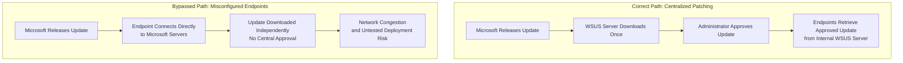

| Topic | Level | Reading Time | Prerequisites |
|---|---|---|---|
| OS Hardening and Patch Management | Intermediate | ~22 min | Basic understanding of operating systems and general security concepts |

> **الهدف من الـ Section ده:**  
> هتفهم إزاي تقلل سطح الهجوم (Attack Surface) بتاع أي نظام تشغيل عن طريق الـ Hardening، هتفهم أهمية التحديثات وخطر الـ Zero-Day، وهتشوف إزاي المؤسسات الكبيرة بتدير التحديثات بشكل مركزي عن طريق أداة زي WSUS، بالإضافة لسيناريو حقيقي من واقع العمل يوضح إيه اللي بيحصل لو الإدارة دي اتعطلت.

## Learning Objectives

By the end of this section, you will be able to:

- Define **OS Hardening** and explain the concept of an **Attack Surface**.
- List the key practices used to harden an operating system, from removing unwanted accounts to restricting access to critical assets.
- Explain why keeping systems updated matters, and define a **Zero-Day Vulnerability**.
- Explain why large organizations need **centralized patch management** instead of letting every device update independently.
- Describe how **WSUS** works and the security benefit of requiring administrator approval before deployment.
- Interpret a real-world scenario showing what happens when centralized patching is bypassed.

## Table of Contents

- [OS Hardening: Reducing the Attack Surface](#os-hardening-reducing-the-attack-surface)
- [What Is an Attack Surface](#what-is-an-attack-surface)
- [Key Hardening Practices](#key-hardening-practices)
- [Updates and Patches](#updates-and-patches)
- [Zero-Day Vulnerabilities](#zero-day-vulnerabilities)
- [Why Automatic Updates Aren't Always Enough](#why-automatic-updates-arent-always-enough)
- [Patch Management at Scale](#patch-management-at-scale)
  - [Network Congestion](#network-congestion)
  - [Stability Risks](#stability-risks)
- [WSUS: Centralized Update Management](#wsus-centralized-update-management)
- [Real Case Scenario: What Happens Without Centralized Patching](#real-case-scenario-what-happens-without-centralized-patching)
- [Hardening and Patching Flow Diagram](#hardening-and-patching-flow-diagram)
- [Career Connection](#career-connection)
- [Key Terms Glossary](#key-terms-glossary)
- [Summary](#summary)

## OS Hardening: Reducing the Attack Surface

**OS Hardening** هي عملية تقليل سطح الهجوم (**attack surface**) بتاع نظام كمبيوتر، وده بجعل الموضوع صعب قد الإمكان على المهاجم إنه يلاقي طريقة للدخول.

## What Is an Attack Surface

**Attack Surface** هو إجمالي عدد النقاط اللي المهاجم يقدر نظريًا يحاول من خلالها يدخل، يتفاعل، أو يستغل نظام معين.

ده بيشمل: البورتات المفتوحة على الشبكة، الخدمات الشغالة، حسابات المستخدمين، البرامج المثبتة، وأكتر من كده.

> [!IMPORTANT]
> كل ما سطح الهجوم كان أكبر، كل ما فرص المهاجم زادت. الفكرة الأساسية في الـ Hardening إنك تقلل النقاط دي لأقل حد ممكن، مش إنك تحاول تحمي كل نقطة على حدة.

## Key Hardening Practices

الجدول التالي بيلخّص أهم الممارسات لتقليل سطح الهجوم:

| الممارسة | الوصف |
|---|---|
| **إزالة الحسابات غير المرغوبة** | كل حساب إضافي هو نقطة دخول محتملة، خصوصًا الحسابات الافتراضية وحسابات الضيوف اللي نادرًا ما بتتراقب |
| **تطبيق سياسات كلمة مرور قوية** | عبر كل الحسابات على النظام |
| **قصر الوصول عن بعد على طرق مشفّرة** | مثلًا استخدام **SSH** بدل **Telnet**، لأن Telnet بينقل البيانات (بما فيها كلمات المرور) بنص عادي غير مشفر |
| **تقييد الوصول للأصول الحرجة** | بيتبع مبدأ **الصلاحية الأقل (least privilege)**، مثلًا ملف كلمات المرور لازم يكون قابل للقراءة بس من طرف الأدمن، مش كل مستخدم |
| **حذف البرامج والخدمات غير المرغوبة** | حتى لو شرعية، كل برنامج مثبت هو ثغرة محتملة. لو مش مستخدمها، هي مخاطرة غير ضرورية |

> [!TIP]
> ده نفس المنطق اللي شرحناه قبل كده في موضوع الـ Port Scanning: كل بورت مفتوح غير ضروري هو باب محتمل ممكن المهاجم يكتشفه ويستغله. مبدأ الـ Hardening هنا بيوسّع نفس الفكرة على مستوى النظام بالكامل.

## Updates and Patches

الحفاظ على تحديث نظام التشغيل وكل التطبيقات المثبتة هو واحدة من أبسط الممارسات لكن أكتر الممارسات الأمنية أهمية. للأجهزة الشخصية، الموصى بيه عمومًا إنك تفعّل التحديثات التلقائية، بحيث الـ patches بتتطبق من غير ما تحتاج تفتكر تعملها يدويًا.

> [!NOTE]
> مش كل تحديث بيكون عن ميزات جديدة أو إصلاح bugs بسيطة، بعض التحديثات بتصلّح تحديدًا ثغرات أمنية، ودي تستاهل اهتمام خاص من متخصصي الأمن.

على **Windows** تحديدًا، خيار التحديث التلقائي بيُعتبر عمومًا آمن للتفعيل، بما إنه بيثبّت بس التحديثات الأكتر أهمية تلقائيًا، بدل كل تحديث بسيط.

## Zero-Day Vulnerabilities

**Zero-Day** هي ثغرة بيتم اكتشافها وممكن يتم استغلالها من طرف مهاجمين **قبل** ما المزوّد يصدر إصلاح رسمي ليها. بمجرد ما المزوّد يبقى عارف بيها، هو عادةً بيسرع يصدر patch.

## Why Automatic Updates Aren't Always Enough

> [!WARNING]
> لو التحديثات التلقائية معطّلة على جهازك، إنت بتفضل عرضة (**vulnerable**) لاستغلال الـ zero-day ده لحد ما تثبّت الـ patch يدويًا، حتى لو الإصلاح أصلًا موجود.

## Patch Management at Scale

على الرغم إن التحديثات التلقائية عمومًا كويسة للأجهزة الفردية، تفعيل التحديث التلقائي في كل مكان ممكن يسبب نتائج سلبية غير مقصودة في مواقف معينة. في المؤسسات الكبيرة (تقريبًا 1000+ جهاز أو أكتر)، نظام إدارة تحديثات مركزي (**centralized patch management system**) بيبقى ضروري بدل ما كل جهاز يدير التحديثات بتاعته لوحده.

### Network Congestion

لو ألف جهاز حاولوا كلهم بشكل مستقل ينزّلوا نفس ملفات التحديث الكبيرة من الإنترنت في نفس الوقت، ده ممكن يغرق ويبطّئ عرض النطاق الترددي (**bandwidth**) بتاع الشبكة الخاصة بالمؤسسة.

### Stability Risks

أحيانًا patch معين، رغم إنه صادر من المزوّد نفسه، ممكن يسبب مشاكل غير متوقعة، تعارضات، أو انهيارات على أنظمة أو إعدادات معينة. اختبار التحديثات قبل النشر الواسع أمر أساسي، إنت مش عايز patch سيء يكسر مئات الأجهزة مرة واحدة.

> [!IMPORTANT]
> هنا بيدخل دور أدوات إدارة التحديثات المركزية، واحدة من أشهرها **Windows Server Update Service (WSUS)**.

## WSUS: Centralized Update Management

**WSUS** هو حل من Microsoft لإدارة التحديثات، بيسمح للمؤسسات إنها تدير، توافق، وتوزّع تحديثات Windows بشكل مركزي عبر كل الأنظمة في شبكتها.

المسار بيكون كالتالي: `Microsoft → WSUS Server → Endpoints (laptops, desktops, servers)`

الأجهزة الفردية **مش بتتصل مباشرة** بسيرفرات Microsoft عشان تنزّل التحديثات. بدل كده، كل الأجهزة بتجيب التحديثات المعتمدة من سيرفر WSUS الداخلي، اللي هو بنفسه بينزّل التحديثات من Microsoft مرة واحدة وبيوزّعها داخليًا.

> [!IMPORTANT]
> **ميزة أمنية حاسمة**: مفيش أي جهاز بيستقبل تحديث إلا لو تمت الموافقة عليه صراحةً من طرف أدمن.

فوائد WSUS الأساسية:

- **تقليل استخدام عرض نطاق الإنترنت**: التحديثات بتتنزّل مرة واحدة من طرف WSUS، مش من كل جهاز على حدة.
- **يدّي الأدمن تحكم دقيق**: في إيه بالظبط التحديثات اللي بتُنشر وإمتى.
- **يحسّن الرؤية (visibility)**: الأدمن يقدر يشوف أي الأجهزة استلمت أو ماستلمتش patch معين.

## Real Case Scenario: What Happens Without Centralized Patching

**الموقف المُلاحَظ (Situation Observed)**: اتلاحظ إن أجهزة داخل شبكة مؤسسة معينة كانت بتتصل مباشرة بسيرفرات تحديث Microsoft بدل ما تعدي على سيرفر WSUS الداخلي.

**النتيجة**: ده سبب حركة مرور ضخمة وغير متوقعة اتلاحظت على الشبكة، عدد كبير من الأجهزة الفردية كانت بتنزّل نفس ملفات التحديث بشكل مستقل عبر الإنترنت في نفس الوقت.

**ليه ده مشكلة**:

- بيهدم الهدف بالكامل من وجود نظام إدارة تحديثات مركزي زي WSUS.
- بيستهلك عرض نطاق إنترنت كبير بشكل غير ضروري، بما إن نفس بيانات التحديث بتتنزّل بشكل متكرر من أجهزة كتير بدل مرة واحدة من طرف سيرفر WSUS.
- كمان معناه إن التحديثات ماعادتش بتتم الموافقة عليها/اختبارها مركزيًا قبل النشر، وده بيرجّع مخاطر الاستقرار والتحكم اللي WSUS أصلًا اتصمم عشان يمنعها.

> [!IMPORTANT]
> **الدرس المستفاد**: ده مثال حقيقي من الواقع بيوضح ليه إعدادات إدارة التحديثات لازم تتراقب بشكل نشط. أجهزة متضبطة بشكل خطأ بتتخطى مسار التحديث المقصود ممكن تسبب مشاكل أداء شبكة بصمت وتقوّض الضوابط الأمنية من غير ما حد ينتبه.

## Hardening and Patching Flow Diagram

المخطط التالي بيوضح المسار الصحيح لإدارة التحديثات المركزية مقابل المسار الخاطئ اللي حصل في السيناريو الحقيقي:

## Career Connection

فهم OS Hardening وPatch Management له تطبيقات مباشرة في مسارات مهنية متعددة:

- في مجال **System Administration**، تطبيق ممارسات الـ hardening وإدارة WSUS جزء أساسي من الشغل اليومي لأي أدمن نظم.
- في مجال **SOC**، مراقبة حركة مرور الشبكة المرتبطة بالتحديثات بتساعد في اكتشاف أجهزة متخطية لمسار التحديث المقصود (زي السيناريو الحقيقي اللي شرحناه).
- في مجال **Vulnerability Management**، تحديد أولوية تطبيق الـ patches، خصوصًا الحرجة زي إصلاحات الـ zero-day، جزء أساسي من تقليل نافذة التعرض للمخاطر.
- في مجال **GRC**، وجود سياسة موثقة لإدارة التحديثات المركزية جزء من متطلبات الامتثال في معايير أمنية متعددة.

## Key Terms Glossary

| Term | Definition |
|---|---|
| **OS Hardening** | عملية تقليل سطح الهجوم لنظام تشغيل معين عن طريق إزالة المكونات غير الضرورية. |
| **Attack Surface** | إجمالي النقاط التي يمكن للمهاجم أن يحاول من خلالها الدخول أو استغلال نظام. |
| **Least Privilege** | مبدأ منح المستخدمين والأنظمة أقل صلاحية ضرورية فقط لأداء مهامهم. |
| **Zero-Day Vulnerability** | ثغرة يتم اكتشافها واستغلالها قبل صدور إصلاح رسمي من المزوّد. |
| **Patch Management** | العملية المنظمة لتوزيع واعتماد وتثبيت تحديثات الأمان عبر الأنظمة. |
| **WSUS (Windows Server Update Service)** | حل مركزي من Microsoft لإدارة والموافقة على وتوزيع تحديثات Windows. |
| **Network Congestion** | ازدحام حركة مرور الشبكة الناتج عن تحميل بيانات كبيرة من عدة مصادر في نفس الوقت. |

## Summary

- **OS Hardening** بيقلل سطح الهجوم بتاع النظام عن طريق تقليل النقاط اللي المهاجم ممكن يستغلها، زي البورتات المفتوحة، الحسابات، والبرامج المثبتة.
- الممارسات الأساسية بتشمل إزالة الحسابات غير المرغوبة، فرض كلمات مرور قوية، استخدام SSH بدل Telnet، تطبيق مبدأ الصلاحية الأقل، وحذف البرامج غير المستخدمة.
- التحديثات التلقائية مهمة جدًا، خصوصًا لأنها بتغلق نافذة التعرض لثغرات **Zero-Day**، لكن تعطيلها بيسيب الجهاز عرضة للاستغلال حتى لو الإصلاح موجود.
- في المؤسسات الكبيرة، إدارة التحديثات المركزية ضرورية عشان تتجنب **Network Congestion** و **Stability Risks** الناتجة عن السماح لكل جهاز يدير تحديثاته بمفرده.
- **WSUS** بيوفر حل مركزي بيضمن إن مفيش جهاز يستقبل تحديث من غير موافقة أدمن صريحة، وده بيقلل استهلاك النطاق الترددي ويحسّن الرؤية.
- سيناريو حقيقي من الواقع أظهر إزاي أجهزة متخطية لـ WSUS وبتتصل مباشرة بـ Microsoft سببت ازدحام شبكة وأعادت مخاطر الاستقرار اللي WSUS اتصمم عشان يمنعها.

