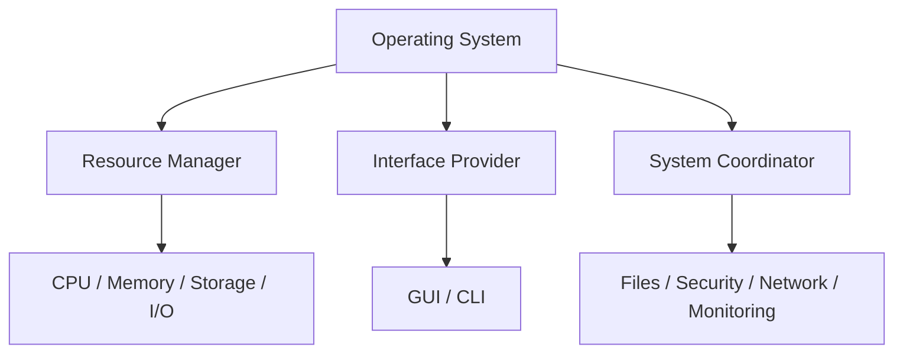
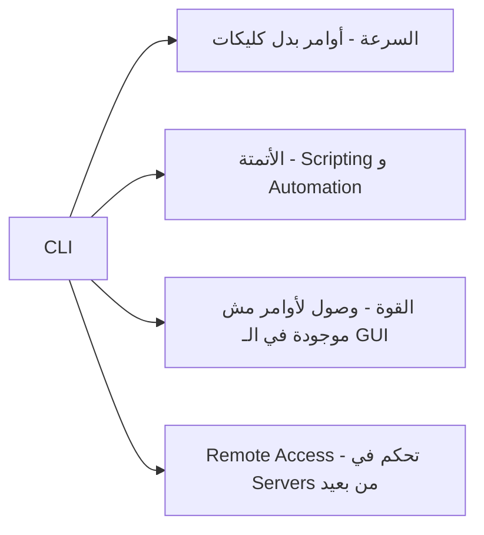
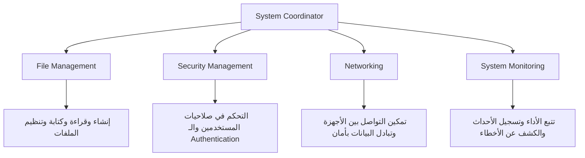
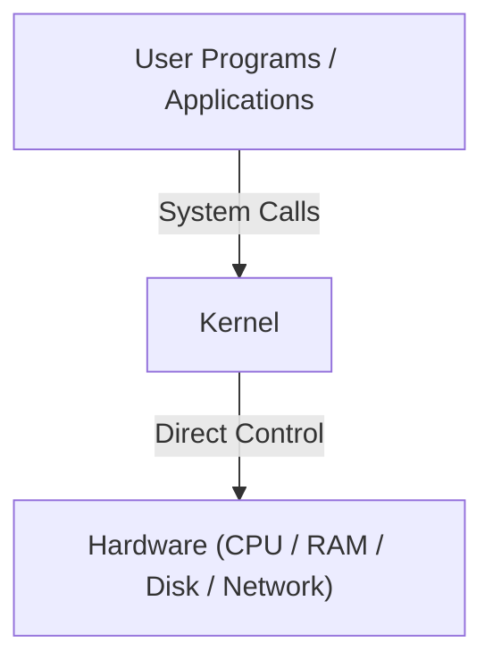
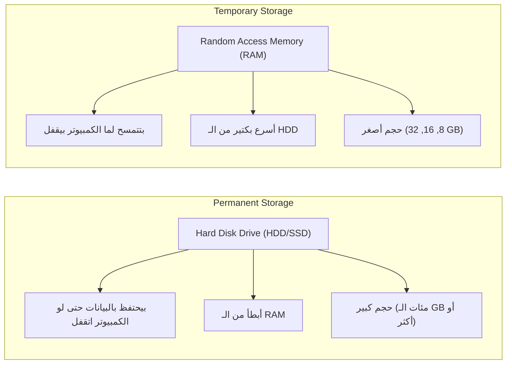
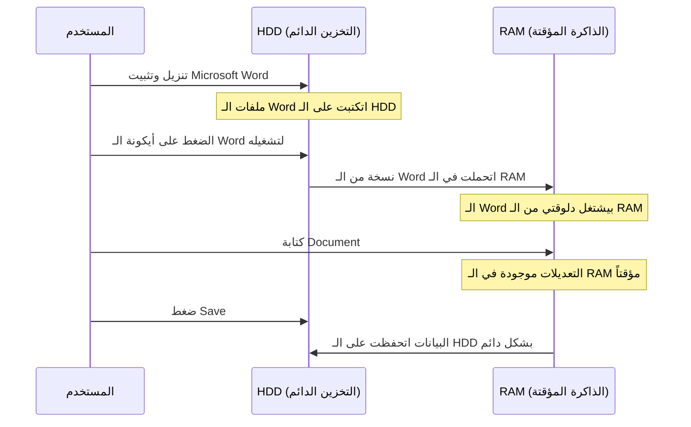
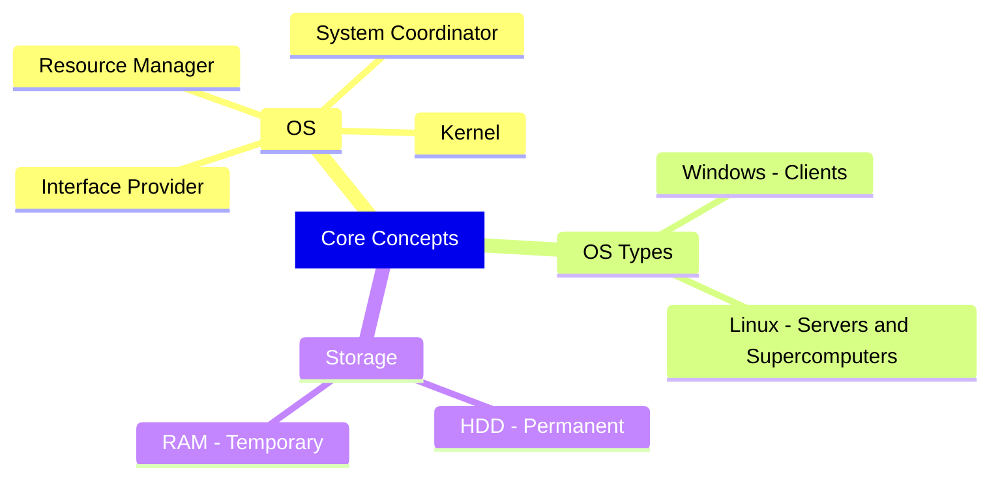

> **الهدف من الـ Section ده:**
> تفهم الـ Operating System وإدارة الـ resources، والفرق بين الـ HDD و RAM، مع basics في الـ Networking زي LAN/WAN، ودور الـ Router وSwitch وARP في نقل الـ packets.
---

## Table of Contents

- [What is an Operating System?](#what-is-an-operating-system)
- [OS As a Resource Manager](#os-as-a-resource-manager)
- [OS As an Interface Provider](#os-as-an-interface-provider)
- [OS As a System Coordinator](#os-as-a-system-coordinator)
- [The Kernel](#the-kernel)
- [Operating System Types](#operating-system-types)
- [HDD vs RAM](#hdd-vs-ram)

---

## What is an Operating System?

الـ **Operating System (OS)** هو الـ Software الأساسي اللي بيشغّل أي جهاز كمبيوتر. تخيّل إنك عندك Hardware — يعني دوائر كهربائية، معالجات، ذاكرة — من غير أي برنامج. الجهاز ده ما هوش غير قطع معدنية وسيليكون بدون أي حياة.

الـ OS هو اللي بيديه الحياة دي، بيحدد القواعد، وبيتحكم في كل حاجة.

```
بدون OS  →  الجهاز = قطعة حديد
مع OS    →  الجهاز = نظام متكامل قادر يشتغل
```

> [!IMPORTANT]
> كل Hardware عنده OS — مش بس اللابتوب والموبايل، لكن كمان الـ Routers والـ Printers والـ Smart TVs وحتى الـ ATM Machines.

الـ OS بيقوم بـ **3 أدوار أساسية** في نفس الوقت:



---

## OS As a Resource Manager

الـ OS بيدور في الأساس كـ **Resource Manager** — يعني بيتحكم في كل الموارد الموجودة في الجهاز، سواء كانت:

- **Physical Resources**: زي الـ RAM، الـ CPU، الـ Hard Drive، الـ Network Card.
- **Logical Resources**: زي الـ Logical Partitions على الـ Hard Drive.

### إزاي بيدير الموارد دي؟

| المورد | إزاي الـ OS بيديره |
|---|---|
| **CPU** | بيقرر أنهي Process بتشتغل، ولحد امتى، وبأي ترتيب (Scheduling) |
| **Memory (RAM)** | بيخصص مساحة لكل برنامج، بيعزلهم عن بعض، وبيعمل Swap لو المساحة وقفت |
| **Storage (HDD/SSD)** | بينظّم الملفات على الـ Drive، بيتتبع الأماكن الفاضية والمستخدمة |
| **I/O Devices** | بيتحكم في Printers, Keyboards, Network Cards عشان محدش يعمل Conflict |

> [!NOTE]
> لو الـ OS مش موجود ومش بيدير الموارد دي، كل البرامج هتتنافس على نفس الـ Resources وهيحصل Crash في ثواني.

### مثال واقعي:
لما بتفتح Chrome وWord وSpotify في نفس الوقت، الـ OS هو اللي بيوزع الـ CPU Time والـ RAM على كل برنامج منهم بحيث كلهم يشتغلوا مع بعض بشكل سلس.

---

## OS As an Interface Provider

الـ OS بيوفر طريقتين للتواصل مع الجهاز:

### 1. Graphical User Interface (GUI)
ده اللي إحنا شايفينه يومياً — النوافذ، الأيقونات، الأزرار. مصمم عشان المستخدم العادي يقدر يشتغل على الجهاز من غير ما يعرف أي حاجة تقنية.

### 2. Command-Line Interface (CLI)
ده هو الأداة الحقيقية في إيد الـ IT Professionals والـ Cybersecurity Experts.

**ليه حد يستخدم الـ CLI بدل الـ GUI؟**



> [!TIP]
> في الـ Cybersecurity، الـ CLI مش مجرد خيار — هو ضرورة. معظم الـ Security Tools وكمان أغلب الـ Servers بتشتغل بدون GUI خالص.

---

## OS As a System Coordinator

غير كونه Resource Manager وInterface Provider، الـ OS بيعمل أيضاً كـ **System Coordinator** — يعني بينسّق بين كل أجزاء النظام:



---

## The Kernel

الـ **Kernel** هو قلب الـ Operating System وأهم جزء فيه.

> [!IMPORTANT]
> الـ Kernel هو **أول حاجة بتتحمّل** لما الكمبيوتر بيبدأ، و**آخر حاجة بتقفل** لما بتطفيه.

تخيّل الـ OS كبناية كبيرة:
- الـ **Kernel** هو الأساس (Foundation) اللي كل حاجة تانية بتقوم عليه.
- الـ **User Programs** هم السكان اللي بيعيشوا فوق.
- الـ Kernel هو "البريدج" اللي بيوصّل البرامج دي بالـ Hardware بشكل آمن وفعّال.



لما بتفتح أي برنامج وبيطلب يكتب في ملف أو يقرأ من الـ Network، البرنامج ده ما بيوصلش الـ Hardware مباشرةً. بيبعت **System Call** للـ Kernel، والـ Kernel هو اللي بينفذ العملية الفعلية.

---

## Operating System Types

| الـ OS | بيُستخدم في إيه | ملاحظات مهمة |
|---|---|---|
| **Windows** | Client Machines (Desktops / Laptops) | الأكثر انتشاراً عند المستخدم العادي |
| **Linux** | Servers / Web Servers / Supercomputers | مفتوح المصدر، قوي جداً، مرن |
| **macOS** | Apple Devices | Unix-based، شائع في Design وDev |

### الـ Linux وأهميته في الـ Cybersecurity:

> [!WARNING]
> الـ Linux موجود على أقوى الكمبيوترات في العالم (Supercomputers) وعلى معظم الـ Servers على الإنترنت. ده معناه إن أي **Vulnerability** في الـ Linux ممكن تبقى **Catastrophic** وتأثر على ملايين الأنظمة في وقت واحد.

**ليه الـ Linux هو الأكثر استخداماً في الـ Servers؟**
- مجاني ومفتوح المصدر.
- مستقر جداً ونادراً بيحتاج Restart.
- بيشتغل من الـ CLI بدون GUI، فبياخد موارد أقل.
- المجتمع الكبير خلّى كل المشاكل الأمنية بتتحل بسرعة.

---

## HDD vs RAM

ده مفهوم أساسي جداً، خصوصاً لو بتشتغل في الـ **Digital Forensics** أو الـ **SOC (Security Operations Center)**.

> [!IMPORTANT]
> كـ SOC Analyst أو Digital Forensics Expert، لازم تعرف إمتى وفين المعلومة بتتخزن — عشان تقدر تلاقيها وقت التحقيق.

### الفرق بين الـ HDD والـ RAM:



| الخاصية | HDD / SSD | RAM |
|---|---|---|
| نوع التخزين | دائم (Permanent) | مؤقت (Temporary) |
| السرعة | أبطأ | أسرع بكتير |
| الحجم | كبير جداً | محدود |
| بعد إطفاء الجهاز | البيانات تفضل موجودة | البيانات بتتمسح |
| الغرض | تخزين الملفات والبرامج | تشغيل البرامج النشطة |

### إزاي بيشتغلوا مع بعض — مثال عملي:

تخيّل إنك عندك **Microsoft Word** على جهازك:



> [!NOTE]
> مش ممكن أي Software يشتغل من الـ HDD مباشرةً. لازم يتحمّل أولاً في الـ RAM — لأن الـ CPU سريع جداً وما ينفعش يستنى الـ HDD البطيء.

### أهمية المفهوم ده في الـ Forensics:
لو Malware اشتغل على جهاز ومحدش عمله Save، وبعدين الجهاز اتقفل، المعلومات دي **راحت للأبد** من الـ RAM. عشان كده في الـ Digital Forensics في تقنية اسمها **Live Forensics** بتسمح بتحليل الـ RAM قبل ما الجهاز يقفل.

---
## Summary


