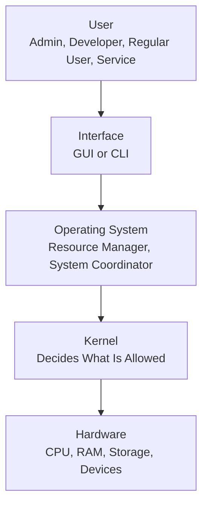
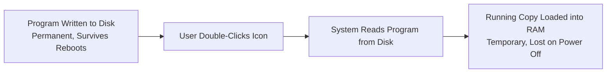

| Topic | Level | Reading Time | Prerequisites |
|---|---|---|---|
| Operating Systems | Beginner | ~24 min | None |

> **الهدف من الـ Section ده:**  
> هتفهم إيه هو نظام التشغيل فعليًا وأدواره التلاتة الأساسية، هتتعرف على الـ Kernel وليه هو أخطر جزء في أي نظام، هتاخد لمحة على أنواع أنظمة التشغيل، وهتفهم الفرق بين الـ HDD والـ RAM وليه الفرق ده أساسي جدًا لأي محلل جنائي رقمي (forensic analyst).

## Learning Objectives

By the end of this section, you will be able to:

- Define an **Operating System** and explain its three core roles: Resource Manager, Interface Provider, and System Coordinator.
- Explain why every resource allocation the OS makes is also a security boundary.
- Compare **GUI** and **CLI** as two ways of interacting with an OS.
- Define the **Kernel** and explain why a kernel vulnerability means total control of the system.
- Compare **Windows**, **Linux**, and **Mobile & Embedded** operating systems in terms of typical use and attack relevance.
- Distinguish between **HDD/SSD** (permanent storage) and **RAM** (temporary storage), and explain why this distinction matters for forensic analysis.

## Table of Contents

- [What Is an Operating System](#what-is-an-operating-system)
- [The OS as a Resource Manager](#the-os-as-a-resource-manager)
- [The OS as an Interface Provider](#the-os-as-an-interface-provider)
- [The OS as a System Coordinator](#the-os-as-a-system-coordinator)
- [The Kernel](#the-kernel)
- [Operating System Types](#operating-system-types)
- [Storage and Memory: Where Data Lives](#storage-and-memory-where-data-lives)
- [Hard Drive vs. RAM](#hard-drive-vs-ram)
- [Example: What Happens When You Open Word](#example-what-happens-when-you-open-word)
- [OS Architecture Diagram](#os-architecture-diagram)
- [Career Connection](#career-connection)
- [Key Terms Glossary](#key-terms-glossary)
- [Summary](#summary)

## What Is an Operating System

**Operating System (OS)** هو "الجسر بين الهاردوير وكل مين بيستخدمه."

هو اللي بيقرر إزاي البرامج بتشتغل، إزاي الذاكرة بتُستخدم، إزاي الأجهزة بتتواصل مع بعض، وإزاي البيانات بتتحرك عبر النظام. من غيره، الكمبيوتر مجرد دوائر وسليكون، الـ OS هو اللي بيدّي النظام ده ترتيب وقواعد.

تقريبًا كل جهاز بتلمسه بيشغّل نظام تشغيل: اللابتوبات، الموبايلات، الراوترات، الكاميرات، وحتى العربيات.

فيه ثلاث أدوار أساسية بيلعبها أي نظام تشغيل:

## The OS as a Resource Manager

الـ OS بيدير موارد فيزيائية (CPU، RAM، أقراص، أجهزة) وموارد منطقية (زي الأقسام والذاكرة الافتراضية).

| المورد | الدور | ملاحظة أمنية |
|---|---|---|
| **CPU** | بيقرر أي process يشتغل، لأد إيه، وبأي ترتيب (**scheduling**) | كل برنامج مقتنع إن المعالج ملكه لوحده، لكن مفيش برنامج فعليًا كده |
| **Memory** | بيخصص مساحة، بيحافظ على عزل الـ processes عن بعض، وبيبدلها دخول وخروج | العزل ده ضابط أمني (**security control**): برنامج انهار أو ضار مايوصلش لذاكرة برنامج تاني |
| **Storage** | بينظّم الملفات، بيتتبع المساحة الفاضية، وبيتحكم في مين يفتح إيه | هنا عايشة صلاحيات الملفات، وهنا بيبدأ الـ forensics بعد أي حادثة |
| **Devices** | بيدير الطابعات، الكيبوردات، كروت الشبكة من غير تعارض | الـ drivers بتشتغل بصلاحية عالية جدًا، وده بالظبط سبب إن الـ drivers الضعيفة أمنيًا مفضّلة عند المهاجمين |

> [!IMPORTANT]
> كل عملية تخصيص (**allocation**) هي كمان حد أمني (**security boundary**)، وحاجة المهاجم بيحاول يكسرها.

## The OS as an Interface Provider

فيه طريقتين أساسيتين للتفاعل مع نظام التشغيل:

**GUI — Graphical User Interface**

نوافذ، أيقونات، قوائم. سهل الاكتشاف ومتسامح، تقدر تلاقي إعداد معين من غير ما تعرف اسمه.

ممتاز للشغل اليومي، لكن بطيء وغير قابل للتكرار لو عايز تعمل نفس الحاجة على 400 جهاز.

**CLI — Command-Line Interface**

نص بيدخل، نص بيطلع. دقيق، قابل للسكربتة، ومتاح عبر اتصال عن بعد بأقل استهلاك ممكن لعرض النطاق الترددي.

بيئة العمل الأساسية لمتخصصي الـ IT والأمن، وكمان للمهاجمين، وده بالظبط السبب اللي بيخلي سطر الأوامر (**command lines**) بيتم تسجيله (**logged**) بشكل مكثف جدًا.

> [!TIP]
> **سؤال للنقاش**: ليه أي حد يختار سطر الأوامر بدل واجهة رسومية كويسة تمامًا؟ الإجابة غالبًا بترجع للحاجة إنك تكرر نفس العملية بدقة على عدد كبير من الأجهزة، أو تشتغل عن بعد بأقل استهلاك ممكن.

## The OS as a System Coordinator

| الوظيفة | الوصف | ملاحظة |
|---|---|---|
| **File Management** | بينشئ، يقرأ، يكتب، وينظّم الملفات، وبيتتبع مكان كل بلوك فعليًا على القرص | الملف المحذوف نادرًا ما بيكون اختفى فعليًا، والفجوة دي هي اللي الـ forensics بتعيش فيها |
| **Security Management** | بيتحكم في وصول المستخدمين، الصلاحيات، والمصادقة، أي إطار الـ AAA اللي درسناه قبل كده لكن مُطبَّق في كود | كل تسجيل دخول، كل فحص صلاحية، بيحصل هنا |
| **Networking** | بيخلي الجهاز يكلم أجهزة تانية، وبيقرر أي برامج تقدر تفتح أي اتصالات | الفايروول المحلي (**host firewall**) جزء من الوظيفة دي |
| **System Monitoring** | بيتتبع الأداء، يسجّل النشاط، يكتشف الأخطاء، وبيكتب السجل اللي هتحقق فيه لاحقًا | مفيش logs هنا معناها مفيش تحقيق ممكن هناك |

> [!IMPORTANT]
> ثلاثة من الأربع وظائف دي بتولّد التيليمتري (**telemetry**) اللي محلل الـ SOC بيعيش عليها في شغله اليومي.

## The Kernel

**الـ Kernel** هو "نواة نظام التشغيل، أول حاجة بتحمّل وآخر حاجة بتقفل."

**إيه هو**: المكوّن المركزي. كل حاجة تانية في الـ OS، سطح المكتب، الخدمات، برامجك، بتقعد فوقه وبتطلب منه حاجات.

**بيعمل إيه**: هو الجسر للهاردوير. بيربط برامج المستخدم بالهاردوير الفيزيائي بأمان: البرنامج بيطلب، الـ kernel بيقرر هل ده مسموح ولا لأ، وبينفذ العملية.

**ليه الأمان بيهتم**: كود بيشتغل جوه الـ kernel يقدر يعمل أي حاجة على الجهاز ده. ثغرة في الـ kernel مش مجرد "يوم سيء"، هي **سيطرة كاملة على النظام**.

> [!WARNING]
> **User space** بيطلب، **Kernel space** بيقرر، والـ **rootkits** موجودة أصلًا عشان تعدي الخط ده.

## Operating System Types

| النوع | الاستخدام الغالب | أمثلة |
|---|---|---|
| **Windows** | غالبًا أجهزة العملاء (**clients**)، سطح المكتب المهيمن في بيئات الشركات، وبالتالي أشهر نقطة بداية لأي هجوم لأن ده مكان المستخدمين | Active Directory، سطح مكتب الشركة، معظم صفحات الهبوط لهجمات التصيد (**phishing**) |
| **Linux** | غالبًا سيرفرات، سيرفرات ويب، بنية تحتية، containers، وكل الطبقة العليا من الحوسبة الفائقة | سيرفرات ويب، أحمال عمل الكلاود، أدوات الأمان، معامل Splunk |
| **Mobile & Embedded** | في كل مكان تاني، Android وiOS في الموبايلات؛ أنظمة مبسّطة جوه الراوترات، الكاميرات، وأجهزة التحكم الصناعية | أجهزة IoT اللي محدش بيحدّثها، والأجهزة اللي بتبني الـ botnets |

> [!IMPORTANT]
> ثغرة في Linux ممكن تكون كارثية، لأنه بيشغّل السيرفرات، الكلاود، والبنية التحتية، ثغرة واحدة بتوصل لعدد ضخم من الأنظمة في نفس الوقت.

## Storage and Memory: Where Data Lives

بعد ما فهمنا إن الـ OS بيدير الذاكرة كمورد أساسي، بننتقل بالتفصيل لفهم إزاي البيانات فعليًا بتتخزن وبتعيش وقت التشغيل، ولإيه محلل الجنائي الرقمي (**forensic analyst**) بيهتم جدًا بالفرق ده.

## Hard Drive vs. RAM

| | **Hard Disk Drive (HDD / SSD)** | **Random Access Memory (RAM)** |
|---|---|---|
| **النوع** | تخزين دائم (**permanent storage**) | تخزين مؤقت (**temporary storage**) |
| **الوصف** | بيحافظ على محتوياته لما الطاقة تنقطع. كبير، بطيء نسبيًا، وهنا كل حاجة بتتثبت وتتحفظ | بيفضى في اللحظة اللي الطاقة بتنقطع فيها. صغير، سريع جدًا، والمكان الوحيد اللي الكود فعليًا يقدر يتنفذ فيه |
| **من منظور الـ Forensics** | بينجو من إعادة التشغيل. بيديك البرامج المثبتة، الملفات المحفوظة، وآثار الملفات المحذوفة | فيه الـ processes الشغالة، الاتصالات المفتوحة، بيانات وكلمات مرور مفكوكة التشفير، وكل ده بيروح لو الجهاز اتقفل |

> [!IMPORTANT]
> مفيش حاجة بتشتغل من على القرص مباشرة. لازم تتحمّل في الـ RAM الأول.
>
> وده بالظبط السبب اللي **الـ Fileless Malware** موجود عشانه: كود بيعيش بس في الذاكرة بيسيب أثر أقل بكتير على القرص. (فتكر شرحنا التفصيلي لموضوع الـ Fileless Malware قبل كده؟ دي بالظبط النقطة التقنية اللي بتخليه فعّال جدًا).

## Example: What Happens When You Open Word

1. **Install**: البرنامج بيتكتب على القرص الصلب. دلوقتي موجود بشكل دائم، وهيفضل موجود بعد عشر مرات إعادة تشغيل.
2. **Execute**: إنت بتدوس على الأيقونة مرتين. النظام بيقرأ البرنامج من القرص وبيبدأ يبني نسخة شغّالة (**running copy**) منه.
3. **Run**: نسخة بتتحمّل في الـ RAM. النسخة اللي إنت فعليًا بتكتب فيها عايشة في الذاكرة. نسخة القرص بس قاعدة موجودة.

> [!TIP]
> **سؤال**: فين تدوّر على برنامج شغّال دلوقتي؟ **الإجابة**: في الذاكرة. القرص بيقولك إيه اللي اتثبت، الـ RAM بتقولك إيه اللي بيحصل فعليًا دلوقتي.

## OS Architecture Diagram

المخطط التالي بيوضح ترتيب الطبقات من المستخدم لحد الهاردوير، وموقع الـ Kernel كنقطة حاسمة بينهم:

والمخطط التالي بيوضح رحلة برنامج من التثبيت لحد التشغيل الفعلي:

## Career Connection

فهم أساسيات نظام التشغيل والذاكرة له تطبيقات مباشرة في مسارات مهنية متعددة:

- في مجال **Digital Forensics**، الفرق بين HDD وRAM أساسي جدًا، تحليل الذاكرة الحية (**memory forensics**) بيكشف عمليات وأنشطة مش موجودة على القرص خالص.
- في مجال **SOC**، فهم إن سطر الأوامر بيتم تسجيله بكثافة بيساعد في التحقيق في أنشطة مشبوهة عبر الـ CLI.
- في مجال **Malware Analysis**، فهم ليه الـ Fileless Malware فعّال جدًا (لأن مفيش ملف يتفحص على القرص) أساسي لتحليل التهديدات الحديثة.
- في مجال **Vulnerability Management**، معرفة إن أي ثغرة Linux ممكن تأثر على عدد ضخم من السيرفرات بيوجّه أولويات الـ patching.

## Key Terms Glossary

| Term | Definition |
|---|---|
| **Operating System (OS)** | البرنامج الأساسي الذي يجعل الهاردوير قابلاً للاستخدام، ويدير الموارد والواجهات. |
| **Kernel** | النواة المركزية لنظام التشغيل، المسؤولة عن اتخاذ كل القرارات المتعلقة بالوصول للهاردوير. |
| **GUI** | واجهة مستخدم رسومية تعتمد على النوافذ والأيقونات. |
| **CLI** | واجهة سطر أوامر تعتمد على إدخال وإخراج نصي. |
| **HDD/SSD** | وسيط تخزين دائم يحتفظ بالبيانات حتى بعد انقطاع الطاقة. |
| **RAM** | ذاكرة مؤقتة تُفرّغ فور انقطاع الطاقة، وهي المكان الوحيد الذي ينفذ فيه الكود فعليًا. |
| **Fileless Malware** | برمجية خبيثة تعمل بالكامل في الذاكرة دون كتابة ملفات على القرص. |
| **Telemetry** | البيانات والسجلات التي يولّدها النظام وتُستخدم في المراقبة الأمنية. |

## Summary

- **Operating System** هو الجسر بين الهاردوير ومستخدميه، وله ثلاثة أدوار أساسية: **Resource Manager**، **Interface Provider**، و **System Coordinator**.
- كل عملية تخصيص موارد من طرف الـ OS هي كمان حد أمني يحاول المهاجم كسره.
- **الـ Kernel** هو المكوّن الأخطر في النظام، لأن أي كود بيشتغل جواه يقدر يتحكم في الجهاز بالكامل.
- **Windows** غالبًا للعملاء (وأشهر نقطة بداية للهجمات)، **Linux** غالبًا للسيرفرات والبنية التحتية، و **Mobile & Embedded** في كل مكان تاني.
- **HDD/SSD** تخزين دائم يعكس ما تم تثبيته، بينما **RAM** تخزين مؤقت يعكس ما يحدث فعليًا الآن، وهذا الفرق أساسي في التحقيقات الجنائية الرقمية.
- الـ **Fileless Malware** بيستغل حقيقة إن الكود لازم يتحمّل في الذاكرة، وبيعيش هناك بس عشان يسيب أثر أقل على القرص.

