> **الهدف من الـ Section ده:**
> هتفهم إيه هو الـ Operating System وإزاي بيدير الـ Resources، وهتعرف الفرق بين الـ HDD والـ RAM وليه ده مهم جداً في الـ Digital Forensics. كمان هتاخد overview عن الـ Networking الأساسية — إيه الفرق بين الـ LAN والـ WAN، إزاي الـ Router والـ Switch بيشتغلوا، وإيه هو الـ ARP Protocol وإزاي الـ Packets بتتنقل على الشبكة.

---

## Table of Contents

- [What is an Operating System?](#what-is-an-operating-system)
- [OS As a Resource Manager](#os-as-a-resource-manager)
- [OS As an Interface Provider](#os-as-an-interface-provider)
- [OS As a System Coordinator](#os-as-a-system-coordinator)
- [The Kernel](#the-kernel)
- [Operating System Types](#operating-system-types)
- [HDD vs RAM](#hdd-vs-ram)
- [Networking Overview](#networking-overview)
- [LAN and WAN](#lan-and-wan)
- [Router vs Switch](#router-vs-switch)
- [ARP Protocol](#arp-protocol)
- [Packets](#packets)

---

## What is an Operating System?

الـ **Operating System (OS)** هو الـ Software الأساسي اللي بيربط الـ Hardware بالـ User والـ Applications. من غيره، الكمبيوتر مجرد قطع إلكترونية من غير روح.

```
بدون OS:  [ Hardware ] ← لا يوجد تواصل → [ User ]
مع OS:    [ Hardware ] ←→ [ OS ] ←→ [ User & Applications ]
```

الـ OS بيلعب 3 أدوار أساسية:

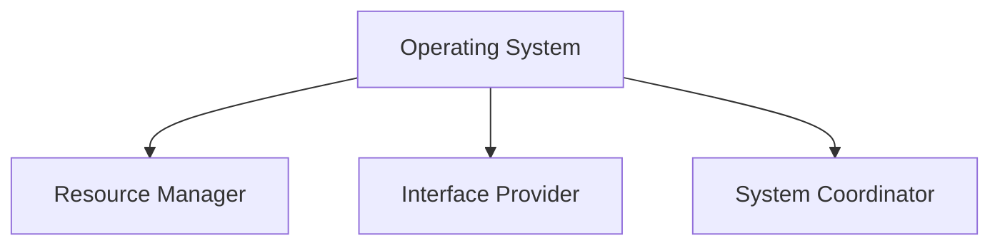

> **ملاحظة مهمة:** كل جهاز Hardware — سواء كمبيوتر، سيرفر، موبايل، أو راوتر — بيشتغل بـ Operating System. حتى أجهزة الـ IoT عندها نوع من الـ OS.

---

## OS As a Resource Manager

الـ OS بيتحكم في كل الـ Resources الموجودة على الجهاز — سواء **Physical** زي الـ RAM والـ CPU، أو **Logical** زي التقسيمات (Partitions).

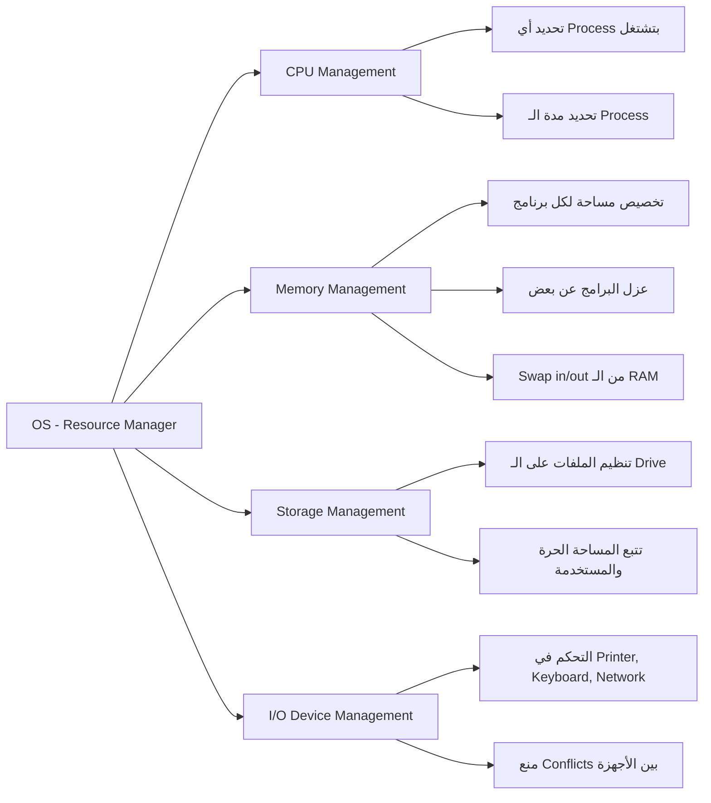

### تفاصيل كل Resource:

| Resource | دور الـ OS |
|----------|------------|
| **CPU** | يحدد أي Process تشتغل، ولأد إيه، وبأي ترتيب — ده اللي بيتسمى Scheduling |
| **Memory (RAM)** | يخصص مساحة لكل برنامج، يعزلهم عن بعض، ويعمل Swap لو المساحة اتملت |
| **Storage (HDD/SSD)** | ينظم الملفات، يتتبع المساحة الفاضية، ويتحكم في الـ File Access |
| **I/O Devices** | يدير التواصل مع الـ Keyboard, Mouse, Printer, Network Card ويمنع التعارض |

> **مثال عملي:** لما بتفتح Chrome و Word في نفس الوقت، الـ OS هو اللي بيوزع الـ CPU والـ RAM عليهم عشان محدش يأكل على التاني.

---

## OS As an Interface Provider

الـ OS بيوفر طريقتين للتعامل مع الجهاز:

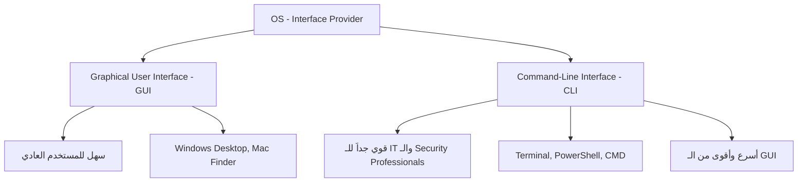

### GUI vs CLI

| الخاصية | GUI | CLI |
|---------|-----|-----|
| **الاستخدام** | مستخدمين عاديين | IT & Cybersecurity Professionals |
| **السهولة** | سهل جداً | يحتاج تعلم |
| **القوة** | محدود | قوي جداً وغير محدود |
| **السرعة** | أبطأ | أسرع بكتير |
| **الـ Automation** | صعب | سهل جداً (Scripts) |

> **ليه الـ Cybersecurity Professional بيستخدم الـ CLI؟**
> لأن الـ CLI بيديه تحكم كامل في الجهاز، بيقدر يكتب Scripts تشتغل أوتوماتيك، وبيقدر يوصل لأي جزء في الـ System مش متاح من الـ GUI. في الـ Incident Response مثلاً، كل ثانية بتفرق — والـ CLI أسرع وأدق.

---

## OS As a System Coordinator

الـ OS مش بس بيدير الـ Resources، هو كمان بيلعب دور الـ Coordinator بين كل أجزاء الـ System:

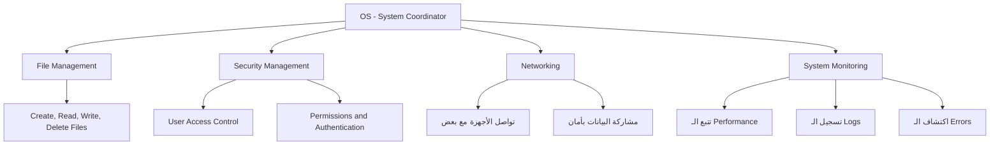

| الوظيفة | الوصف |
|---------|-------|
| **File Management** | إنشاء وقراءة وكتابة وتنظيم الملفات |
| **Security Management** | التحكم في مين يدخل إيه — Permissions و Authentication |
| **Networking** | تمكين الأجهزة من التواصل ومشاركة البيانات بأمان |
| **System Monitoring** | مراقبة الأداء، تسجيل الـ Logs، واكتشاف المشاكل |

---

## The Kernel

الـ **Kernel** هو قلب الـ Operating System. هو أول حاجة بتتحمل لما الجهاز بيشتغل، وآخر حاجة بتتقفل لما بيتقفل.

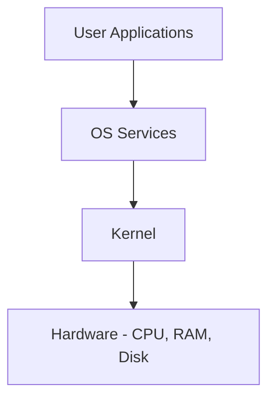

### دور الـ Kernel:

- **الـ Bridge الآمن:** بيوصل برامج الـ User بالـ Hardware من غير ما يديهم وصول مباشر (عشان الأمان)
- **أول ما يشتغل:** يتحمل مع بداية الـ Boot
- **آخر ما يتقفل:** بيفضل شغال لحد ما الجهاز يتقفل خالص
- **بيتحكم في كل حاجة:** كل عملية على الجهاز بتعدي من الـ Kernel

> **تشبيه:** الـ Kernel زي مدير المبنى — أي حد عايز يدخل غرفة (Hardware)، لازم يعدي عليه الأول ويأخد إذن. من غيره، الكل هيدخل على بعض ويحصل فوضى.

---

## Operating System Types

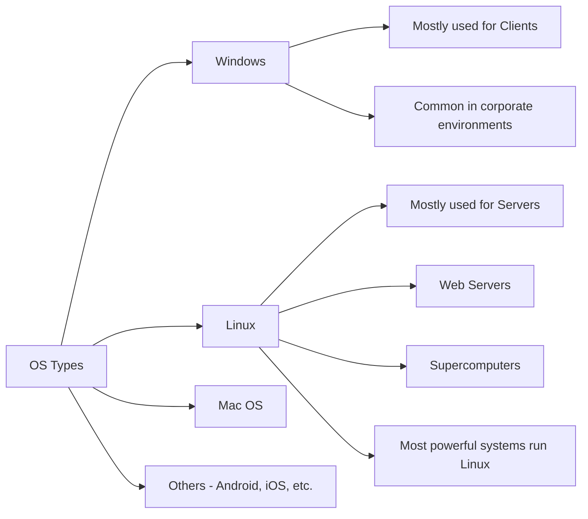

### مقارنة بين الـ Windows والـ Linux

| الخاصية | Windows | Linux |
|---------|---------|-------|
| **الاستخدام الأساسي** | Clients & Desktops | Servers & Supercomputers |
| **الـ Market Share (Servers)** | أقل | الأكثر انتشاراً |
| **الـ Security** | أكثر استهدافاً | أكثر أماناً بطبيعته |
| **الـ Cost** | مدفوع | مجاني (في معظمه) |
| **الـ CLI** | PowerShell / CMD | Bash (أقوى بكتير) |
| **التخصيص** | محدود | لا نهائي |

> **سؤال مهم:** إيه الـ OS الأكثر استخداماً في العالم ولماذا؟
>
> **الجواب:** على مستوى الـ Servers والـ Supercomputers — **Linux** هو الملك. أقوى 500 كمبيوتر في العالم بيشتغلوا على Linux. أما على مستوى الـ Desktop للمستخدم العادي، فـ Windows هو الأكثر انتشاراً.

> **تحذير أمني مهم:** الـ Linux Vulnerabilities ممكن تكون **كارثية جداً**، لأن معظم السيرفرات والبنية التحتية الحساسة (Banking، Government، Cloud) بتشتغل على Linux. ثغرة واحدة فيه ممكن تأثر على ملايين الأجهزة في وقت واحد.

---

## HDD vs RAM

ده موضوع مهم جداً للـ **SOC Analyst** وخصوصاً في الـ **Digital Forensics** — لأنك لازم تعرف **فين** و**إزاي** البيانات بتتخزن عشان تعرف تلاقيها وقت التحقيق.

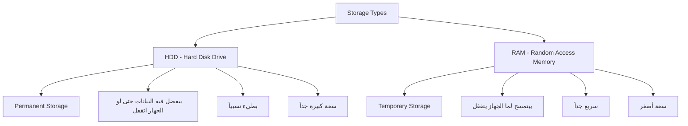

### الفرق الجوهري:

| الخاصية | HDD | RAM |
|---------|-----|-----|
| **نوع التخزين** | Permanent (دائم) | Temporary (مؤقت) |
| **البيانات بعد الإغلاق** | بتفضل موجودة | بتتمسح خالص |
| **السرعة** | أبطأ | أسرع بكتير |
| **الحجم النموذجي** | 500GB - 10TB | 4GB - 64GB |
| **الاستخدام** | تخزين الملفات والـ Software | تشغيل البرامج حالياً |

### مثال عملي: Microsoft Word

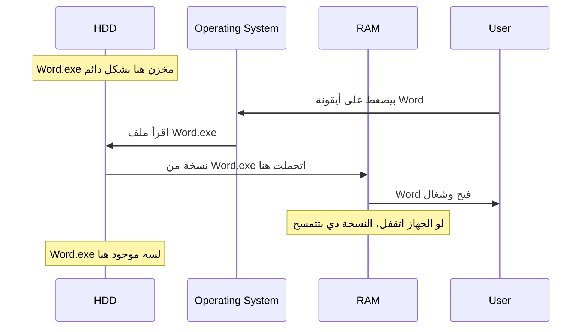

> **ليه ده مهم في الـ Digital Forensics؟**
>
> لما تعمل تحقيق على جهاز، البيانات الموجودة في الـ RAM (زي الـ Passwords المفتوحة، الـ Encryption Keys، الـ Active Connections) **هتتمسح لما الجهاز يتقفل**. عشان كده، الـ Forensic Analyst لازم يعمل **RAM Dump** قبل أي حاجة تانية — عشان ميضيعش الأدلة اللي في الـ RAM.

---

## Networking Overview

الـ Networking هو الأساس اللي الـ Cybersecurity بيتبنى عليه. مش ممكن تحمي حاجة مش فاهمها.

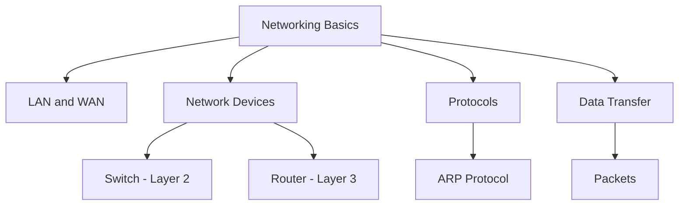

---

## LAN and WAN

### LAN - Local Area Network

الـ **LAN** هي شبكة محلية بتغطي منطقة صغيرة — زي مكتب، مدرسة، أو طابق في مبنى.

- ممكن تكون من جهاز واحد أو أكتر
- لما بتقسم الـ LAN لشبكات أصغر، كل جزء بيتسمى **Subnet**
- الـ Subnets بتتوصل ببعض عشان تكوّن الـ LAN الأكبر
- معظم كلامنا في الـ Course ده هيكون عن الـ LAN

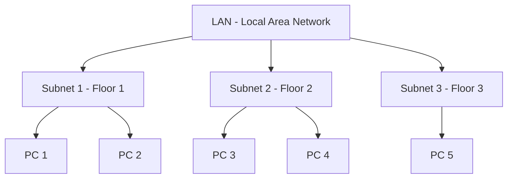

### WAN - Wide Area Network

الـ **WAN** بتغطي منطقة جغرافية كبيرة — زي دولة أو قارة.

- الشركات الكبيرة بتستخدمها عشان توصل LANs في أماكن مختلفة ببعض
- الـ Internet هو أكبر مثال على الـ WAN

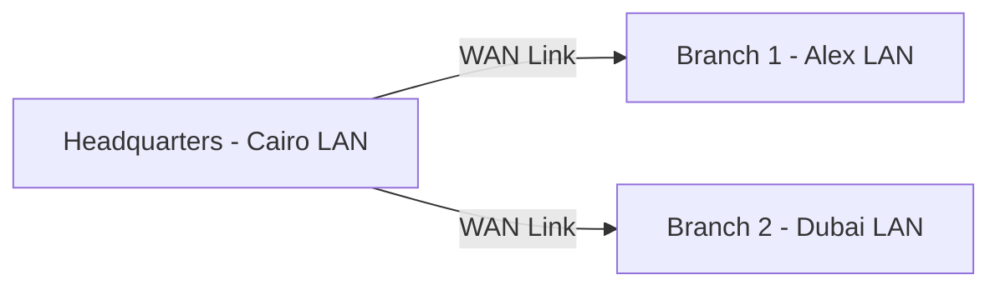

### LAN vs WAN

| الخاصية | LAN | WAN |
|---------|-----|-----|
| **المساحة الجغرافية** | صغيرة (مبنى، حرم جامعي) | كبيرة (دول، قارات) |
| **السرعة** | عالية جداً | أبطأ نسبياً |
| **التكلفة** | رخيصة | غالية |
| **الأمان** | أسهل في التحكم | أصعب وأعقد |
| **مثال** | شبكة المكتب | الـ Internet |

---

## Router vs Switch

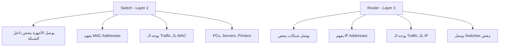

### الفرق الجوهري:

| الخاصية | Switch | Router |
|---------|--------|--------|
| **الـ OSI Layer** | Layer 2 (Data Link) | Layer 3 (Network) |
| **بيفهم إيه** | MAC Addresses | IP Addresses |
| **بيوصل إيه** | أجهزة داخل نفس الشبكة | شبكات مختلفة ببعض |
| **الـ Traffic** | داخل الـ LAN | بين الـ LANs أو للـ Internet |
| **مثال** | سويتش في مكتب | الراوتر في البيت |

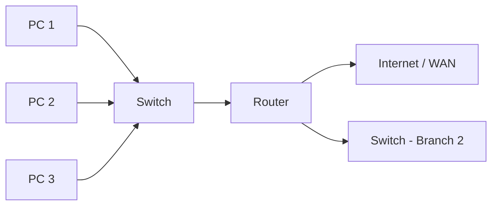

> **تشبيه:** الـ Switch زي الـ Receptionist داخل الشركة — بيعرف كل موظف (MAC Address) وبيوصل الرسائل بينهم. أما الـ Router فزي البريد (Post Office) — بيعرف العناوين (IP Addresses) وبيوصل الرسائل لشبكات تانية خارج الشركة.

---

## ARP Protocol

### إيه هو الـ ARP؟

الـ **ARP (Address Resolution Protocol)** هو البروتوكول المسؤول عن ترجمة الـ **IP Address** لـ **MAC Address** داخل الـ LAN.

**ليه ده ضروري؟**

- الـ Data بتتوجه على أساس الـ IP Address
- لكن التوصيل الفعلي على الشبكة بيتم على أساس الـ MAC Address
- إذن لازم نعرف الـ MAC بتاع الجهاز اللي عنده الـ IP ده

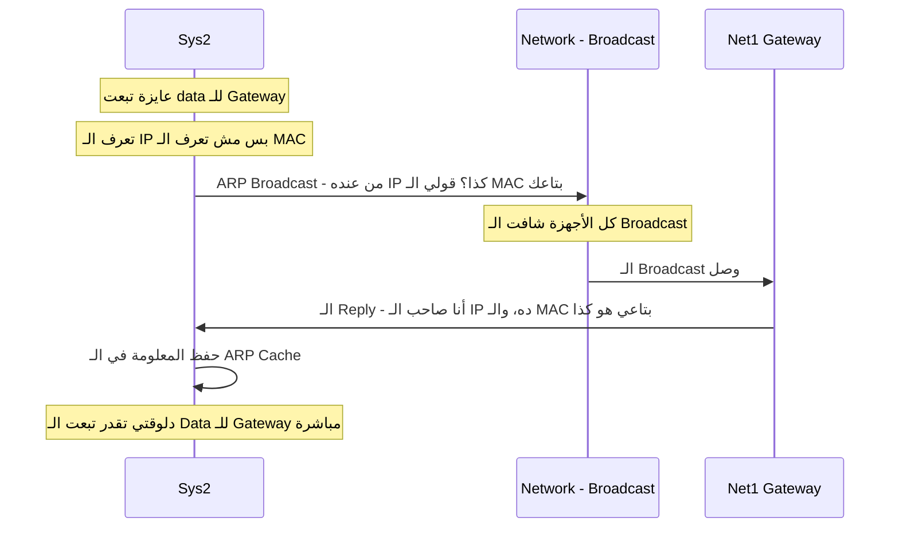

### الـ ARP Cache

بعد ما الـ Sys2 تاخد الرد، بتحطه في حاجة اسمها **ARP Cache** أو **ARP Table** — وهي موجودة في الـ **RAM**.

- الـ ARP Cache بيخزن الـ IP-to-MAC mapping مؤقتاً
- الجهاز بيرجع ليها قبل ما يبعت ARP Request تانية
- مدة الحفظ بتختلف من OS لـ OS

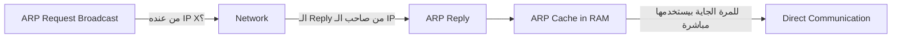

### تمرين عملي

**اعرض الـ ARP Cache على جهازك:**

```bash
# على Windows:
arp -a

# على Linux/Mac:
arp -a
# أو
ip neigh show
```

**مثال على الـ Output:**

```
Interface: 192.168.1.5
  Internet Address      Physical Address      Type
  192.168.1.1           00-1a-2b-3c-4d-5e     dynamic
  192.168.1.10          00-aa-bb-cc-dd-ee     dynamic
```

> **أهمية الـ ARP في الـ Cybersecurity:**
>
> الـ ARP Protocol فيه ثغرة معروفة اسمها **ARP Spoofing** أو **ARP Poisoning** — فيها الـ Attacker بيبعت ARP Replies مزيفة عشان يربط الـ IP بتاعه بـ MAC Address تاني، فيخلي كل الـ Traffic يعدي عليه (Man-in-the-Middle Attack). ده بيخليه أحد أخطر الهجمات داخل الـ LAN.

---

## Packets

### إيه هو الـ Packet؟

الـ **Packet** هو الوحدة الأساسية اللي البيانات بتتحرك فيها على الشبكة.

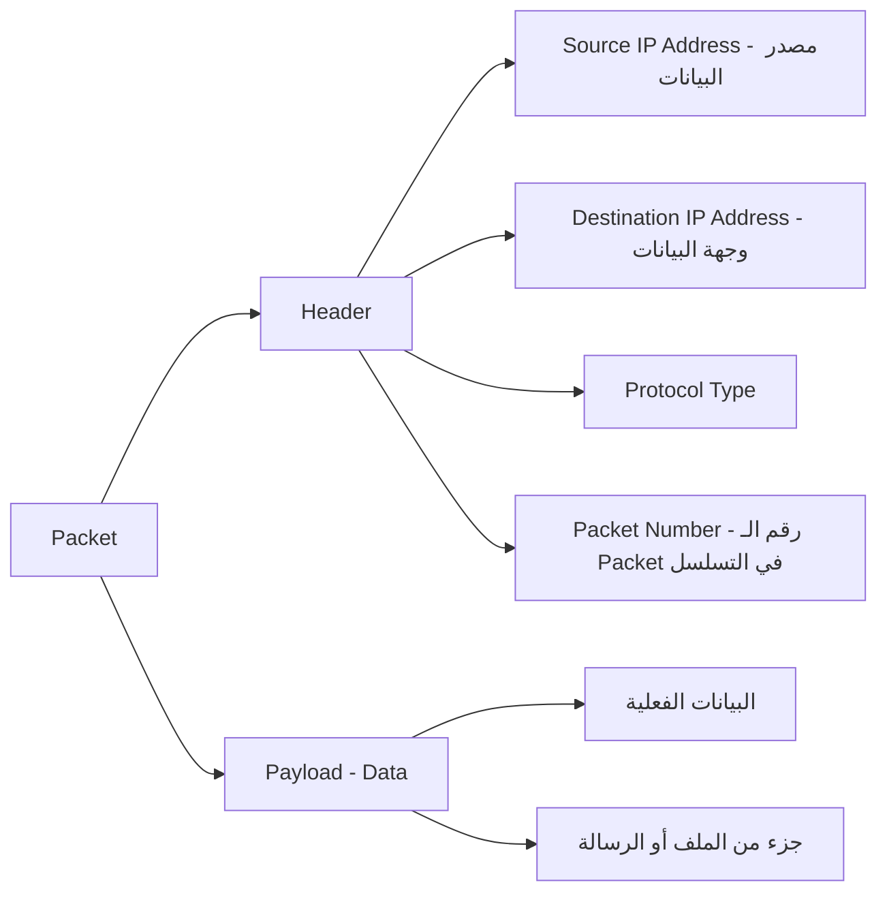

### مكونات الـ Packet:

| الجزء | الاسم | الوصف |
|-------|-------|-------|
| الجزء الأول | **Header** | معلومات عن الـ Packet — من فين، رايح فين، ونوعه |
| الجزء التاني | **Payload** | البيانات الفعلية اللي الـ Packet بيحملها |

### إزاي البيانات بتتبعت؟

لما بتبعت Email أو ملف أو صفحة ويب، البيانات مش بتتبعت في Packet واحد — بتتقسم لآلاف أو ملايين الـ Packets.

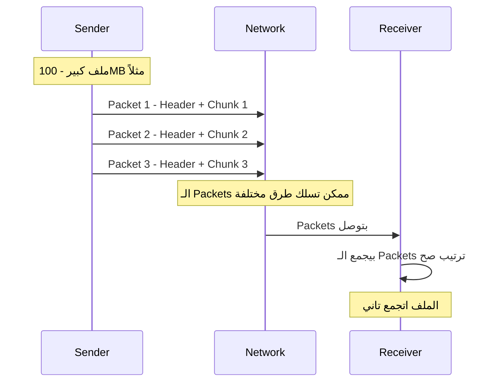

> **ملاحظة مهمة:** الـ Packets مش لازم توصل بنفس الترتيب اللي اتبعتت بيه. الـ Receiver هو اللي بيرتبها صح في الآخر باستخدام الـ Packet Numbers الموجودة في الـ Header.

### ليه الـ Packets مهمة في الـ Cybersecurity؟

الـ **Packet Analysis** أو **Packet Sniffing** هو أحد أهم مهارات الـ SOC Analyst. بنستخدم Tools زي **Wireshark** عشان:

- نشوف إيه اللي بيتبعت على الشبكة
- نكتشف الـ Suspicious Traffic
- نحلل الهجمات بعد ما تحصل (Post-Incident Analysis)
- نفهم سلوك الـ Malware على الشبكة

---

## ملخص عام للـ Lecture

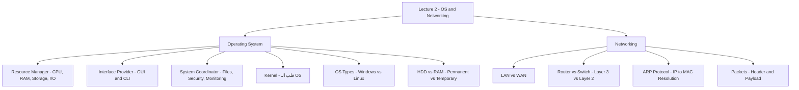


---

*Lecture 2 — Introduction to Cyber Security Course*
