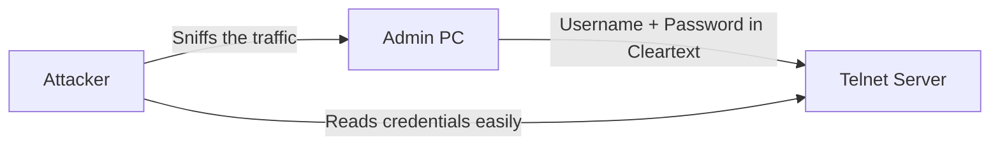
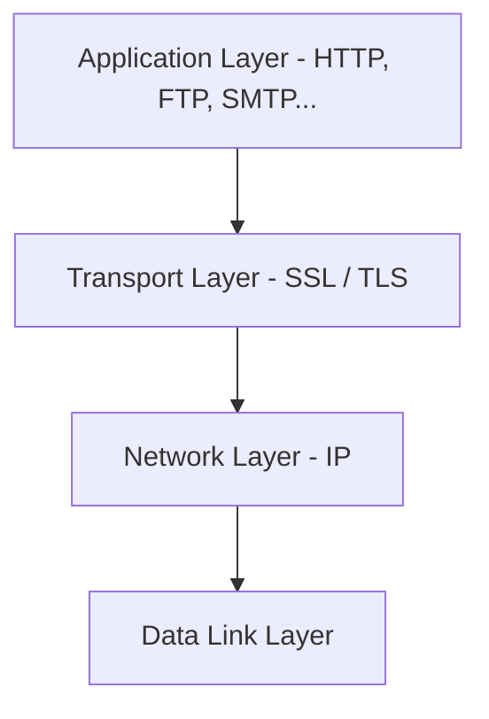
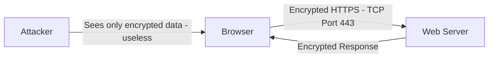

> **الهدف من الـ Section ده:**
> هتفهم ليه الـ Telnet خطر وإزاي الـ SSH بيحل المشكلة دي. وفي الآخر هتفهم الفرق بين SSL وTLS وإزاي الـ HTTPS بيحمي بياناتك على الإنترنت.
---

## Table of Contents
- [SSH — Secure Shell](#ssh--secure-shell)
- [SSL & TLS](#ssl--tls)
- [HTTPS](#https)
- [Summary](#summary)

---

## SSH — Secure Shell

### المشكلة: Telnet

**Telnet** كان بروتوكول قديم بيُستخدم للـ Remote Connection — يعني تتحكم في جهاز تاني من بُعد عبر الـ CLI.

المشكلة الكبيرة إن Telnet بيبعت **كل حاجة بـ Cleartext**:
- الـ Username
- الـ Password
- كل الأوامر اللي بتكتبها
- كل الـ Output اللي بترجع

يعني لو في Attacker عمل **Packet Sniffing** على الشبكة، هيشوف كل حاجة بالحرف الواحد!

---

### الحل: SSH (Secure Shell)

**SSH** هو النسخة المُشفَّرة من Telnet — بيعمل نفس الوظيفة (Remote CLI Access) لكن بيشفّر كل حاجة.

| الخاصية | Telnet | SSH |
|---------|--------|-----|
| **التشفير** | لا — Cleartext | نعم — Encrypted بالكامل |
| **Port** | TCP 23 | TCP 22 |
| **الأمان** | غير آمن | آمن |
| **الاستخدام** | متروك (Legacy) | الـ Standard الحالي |
| **حماية الـ Password** | مكشوف | مُشفَّر |

> [!IMPORTANT]
> SSH بيشفّر **كل حاجة**: الـ Username، الـ Password، الأوامر، والـ Output. حتى لو Attacker عمل Packet Capture، هيلاقي Gibberish — مش هيعرف يقرأ حاجة.

> [!TIP]
> في الـ Real World، SSH مش بس بيُستخدم لـ Remote Login — ممكن كمان تعمل بيه **Secure File Transfer (SFTP/SCP)** و**Port Forwarding** و**Tunneling**.

---

## SSL & TLS

### العلاقة بينهم

- **SSL (Secure Sockets Layer)** — الإصدار القديم، اتطوّر على مدار سنين
- **TLS (Transport Layer Security)** — الإصدار الأحدث والأكثر أماناً، هو في الأساس SSL بنسخة أحسن
- الاتنين بيعملوا نفس الوظيفة: **تشفير الاتصالات على مستوى الـ Transport Layer**

> [!NOTE]
> في الواقع العملي لما الناس بتقول "SSL"، هم في الغالب بيتكلموا عن "TLS" — لأن SSL الآن اعتُبر Deprecated وغير آمن، وTLS هو اللي بيُستخدم فعلياً.

---

### يشتغلوا فين؟

SSL/TLS بيشتغلوا على **OSI Layer 4 (Transport Layer)**.

ده معناه إنهم ممكن يشفّروا **أي بروتوكول بيشتغل فوق TCP**:

| البروتوكول | النسخة المُشفَّرة | Port |
|-----------|-----------------|------|
| HTTP | **HTTPS** | 443 |
| FTP | **FTPS** | 990 |
| SMTP | **SMTPS** | 465 |
| IMAP | **IMAPS** | 993 |
| POP3 | **POP3S** | 995 |

---

### الغلطة الشائعة جداً!

> [!WARNING]
> **الغلطة الشائعة:** كتير من الناس بيقولوا إن SSL/TLS بيشتغلوا على **TCP Port 443** — ده غلط!
>
> **الصح:** الـ **Port 443** هو Port بتاع **HTTPS** (يعني HTTP + TLS) — مش بتاع TLS نفسه.
>
> الـ SSL/TLS هم **Transport Layer Protocols**، وبروتوكولات الـ Transport Layer مش بيتعيّنلها Port Numbers. الـ Port Numbers دي بتتعيّن فقط لـ **Application Layer Protocols**.

---

## HTTPS

### ما هو HTTPS؟

**HTTPS = HTTP + SSL/TLS**

يعني هو بروتوكول الـ HTTP العادي بتاع الويب، لكن مُشفَّر باستخدام SSL أو TLS.

### خصائص HTTPS

- **Port:** TCP 443
- **التشفير:** بيشفّر **كل حاجة** بين الـ Browser والـ Web Server في الاتجاهين
- **الـ Certificate:** الـ Web Server لازم يكون عنده **SSL/TLS Certificate** صادر من **CA (Certificate Authority)** موثوقة
- **المؤشر:** في المتصفح بيظهر **القفل (🔒)** في الـ Address Bar

> [!IMPORTANT]
> لما بتشوف `https://` وقفل في المتصفح، ده معناه إن:
> 1. الاتصال مُشفَّر — محدش يقدر يقرأه
> 2. الـ Server عنده Certificate موثوق — أنت فعلاً بتكلم الموقع الصح مش Fake

> [!WARNING]
> وجود الـ HTTPS مش معناه إن الموقع **آمن أو موثوق** — معناه بس إن الاتصال **مُشفَّر**. مواقع الـ Phishing كمان بتستخدم HTTPS!

---
## Summary
#### SSH
- **Telnet** = Remote CLI بدون تشفير — كل حاجة Cleartext على TCP 23
- **SSH** = نفس الوظيفة لكن مُشفَّر بالكامل على TCP 22
- SSH هو الـ Standard الحالي وTelnet متروك تماماً

#### SSL & TLS
- **SSL** قديم، **TLS** هو النسخة الأحدث والأكثر أماناً
- بيشتغلوا على **OSI Layer 4** ويقدروا يشفّروا أي TCP Protocol
- Port 443 مش بتاع TLS — هو بتاع HTTPS تحديداً

#### HTTPS
- **HTTP + TLS** = **HTTPS على TCP Port 443**
- بيشفّر كل الـ Traffic في الاتجاهين
- القفل في المتصفح يعني التشفير موجود — مش بالضرورة إن الموقع آمن أو موثوق
