| Topic | Level | Reading Time | Prerequisites |
|---|---|---|---|
| Secure Software Design and Fuzzing | Intermediate | ~18 min | Basic understanding of software development concepts and general security terminology |
> **الهدف من الـ Section ده:**  
> هتفهم ليه الأمان لازم يكون جزء أساسي من تصميم البرنامج من أول يوم مش حاجة بتتضاف في الآخر، وهتتعرف على تقنية اسمها Fuzzing بتساعد المطورين يكتشفوا الثغرات قبل ما البرنامج يوصل للمستخدمين.

# Secure Software Design & Fuzzing

## Learning Objectives

By the end of this section, you will be able to:

- Explain why treating security as an **afterthought** is a common and costly mistake in the software industry.
- Describe the **mindset shift** from a reactive to a proactive approach to security.
- Explain why fixing a security flaw during the design phase is dramatically cheaper than fixing it after release.
- List the key practices developers must consider from the very beginning: **Input Validation**, **Authentication**, and **Logging and Monitoring**.
- Define **Fuzzing** and explain what kinds of problems it is designed to trigger.

## Table of Contents

- [Why Secure Software Design Matters](#why-secure-software-design-matters)
- [The Mindset Shift](#the-mindset-shift)
- [Why Security Must Start at the Design Phase](#why-security-must-start-at-the-design-phase)
- [The Cost Difference: Design Phase vs. Production](#the-cost-difference-design-phase-vs-production)
- [Key Things Developers Must Consider From the Beginning](#key-things-developers-must-consider-from-the-beginning)
  - [Input Validation](#input-validation)
  - [Authentication](#authentication)
  - [Logging and Monitoring](#logging-and-monitoring)
- [Other Secure Design Practices](#other-secure-design-practices)
- [Fuzzing: Automated Testing Through Chaos](#fuzzing-automated-testing-through-chaos)
- [What Fuzzing Is Looking to Trigger](#what-fuzzing-is-looking-to-trigger)
- [Secure Design vs. Reactive Patching Diagram](#secure-design-vs-reactive-patching-diagram)
- [Career Connection](#career-connection)
- [Key Terms Glossary](#key-terms-glossary)
- [Summary](#summary)

## Why Secure Software Design Matters

فيه مشكلة شائعة جدًا في صناعة البرمجيات: الأمان بيتم التعامل معاه كـ **أفكار لاحقة (afterthought)** بدل ما يكون جزء أساسي من عملية التطوير.

المطورين غالبًا بيركّزوا الأول على إن البرنامج **يشتغل**، وبيفكروا في الأمان بس لما حاجة تتكسر أو تتستغل.

> [!NOTE]
> في المثالية، كل مطور ومهندس برمجيات المفروض يدرس تصميم البرمجيات الآمن كجزء من تدريبه الأساسي، لكن في الواقع، كتير من المطورين بياخدوا تعليم أمني رسمي قليل جدًا أو معدوم خالص.

## The Mindset Shift

**تصميم البرمجيات الآمن** معناه تحديد ومعالجة المخاطر الأمنية أثناء **مرحلة التصميم**، قبل ما حتى يتكتب سطر كود واحد، مش مجرد مسح الكود النهائي بحثًا عن bugs بعد ما يخلص.

> [!IMPORTANT]
> بدل ما تبني منتج الأول وترقّع الثغرات بعد كده (نهج تفاعلي/**reactive**)، الأمان بيتبني جوه الـ architecture، تدفق البيانات (**data flow**)، ومنطق التطبيق من أول يوم (نهج استباقي/**proactive**).

## Why Security Must Start at the Design Phase

## The Cost Difference: Design Phase vs. Production

إصلاح عيب أمني وقت مرحلة التصميم ممكن يكلّف تقريبًا مفيش حاجة، مجرد تغيير في التصميم على الورق.

إصلاح نفس العيب ده بعد ما البرنامج يبقى فعليًا في الإنتاج (**production**) ممكن يكلّف **100 ضعف أكتر**، لأنه ممكن يتطلب إعادة كتابة مكونات أساسية، إعادة نشر أنظمة كاملة (**redeploying systems**)، إخطار المستخدمين المتأثرين، والتعامل مع اختراقات محتملة.

> [!WARNING]
> الفرق بين "تعديل على الورق" و"إعادة كتابة النظام كامل" مش مجرد فرق تكلفة بسيط، هو فرق جوهري في المخاطر وسمعة الشركة ونتايج فعلية على المستخدمين الحقيقيين.

## Key Things Developers Must Consider From the Beginning

### Input Validation

التأكد إن أي بيانات يدخلها المستخدم (في فورم، URL، رفع ملف، إلخ) بتتفحص وتُنظّف (**sanitized**) قبل ما تتعالج. ده بيمنع هجمات زي **buffer overflows** (اللي درسناها بالتفصيل في موضوع منفصل).

### Authentication

التحقق الصحيح من إن المستخدمين هما فعلًا اللي بيدّعوا إنهم هما، باستخدام آليات قوية (مش مجرد كلمات مرور بسيطة).

### Logging and Monitoring

بناء القدرة على تتبع إيه اللي بيحصل جوه التطبيق، بحيث النشاط الغير طبيعي أو الضار يقدر يتكتشف ويتحقق فيه لاحقًا.

## Other Secure Design Practices

ممارسات إضافية مهمة للتصميم الآمن:

- **فرض سياسات كلمة مرور قوية** (حد أدنى للطول، متطلبات تعقيد، عدم إعادة استخدام كلمات مرور قديمة).
- **استخدام اتصال مشفر زي HTTPS** بدل HTTP العادي، بحيث البيانات المنتقلة بين الـ client والـ server ما يسهلش اعتراضها وقراءتها.

## Fuzzing: Automated Testing Through Chaos

**Fuzzing** هي تقنية اختبار برمجيات آلية (**automated software testing technique**)، بيتم فيها قصف البرنامج بمدخلات (**inputs**) غير متوقعة، مشوّهة، أو عشوائية تمامًا، عشان نشوف هو هيتصرف إزاي.

الهدف هو المحاولة عن قصد إن البرنامج "ينكسر" عن طريق إيجاد مدخلات المطورين أبدًا معطّطوش ليها.

> [!TIP]
> فكّر في أداة الـ fuzzing زي أداة **brute-force**، لكن بدل ما تجرّب كلمات مرور، هي بتفضل تغذّي البرنامج ببيانات عشوائية أو مشوّهة عبر حقول الإدخال بتاعته، محاولة تلاقي حالة تخلي التعامل مع الإدخال ينهار.

الـ Fuzzing بيساعد المطورين يكتشفوا الثغرات **قبل** ما البرنامج يتصدر، بدل ما المهاجمين يكتشفوها **بعد** ما البرنامج يوصل للمستخدمين.

## What Fuzzing Is Looking to Trigger

الجدول التالي بيلخّص أنواع المشاكل اللي الـ fuzzing بيحاول يستفزها:

| النوع | الوصف |
|---|---|
| **Crashes** | البرنامج بيتوقف عن العمل بشكل غير متوقع |
| **Memory Corruption** | بيانات بتتكتب فوق في الذاكرة بطريقة مش المفروض تحصل، وده ممكن المهاجمين يستغلوه أحيانًا عشان ينفذوا كود خاص بيهم |
| **Unhandled Exceptions** | أخطاء البرنامج مش عارف يتعامل معاها، وده ممكن يكشف معلومات داخلية حساسة أو يسبب عدم استقرار |
| **Security Vulnerabilities** | أي حاجة من اللي فوق دي ممكن يستغلها مهاجم لو اتسابت من غير إصلاح |

## Secure Design vs. Reactive Patching Diagram

المخطط التالي بيقارن بين النهج الاستباقي (تصميم آمن من البداية) والنهج التفاعلي (ترقيع بعد الاكتشاف):

```mermaid
flowchart TB
    subgraph Proactive["Proactive Approach: Secure by Design"]
        direction LR
        P1["Design Phase<br/>Identify Security Risks"] --> P2["Build Input Validation,<br/>Authentication, Logging"] --> P3["Write Code"] --> P4["Test with Fuzzing"] --> P5["Release Secure Product"]
    end
    subgraph Reactive["Reactive Approach: Patch Later"]
        direction LR
        R1["Write Code<br/>No Security Consideration"] --> R2["Release Product"] --> R3["Vulnerability Discovered<br/>By Attacker or Incident"] --> R4["Emergency Rewrite<br/>and Redeployment"] --> R5["Notify Affected Users"]
    end
```

## Career Connection

فهم تصميم البرمجيات الآمن والـ Fuzzing له تطبيقات مباشرة في مسارات مهنية متعددة:

- في مجال **Application Security**، دمج ممارسات التصميم الآمن من مرحلة التخطيط جزء أساسي من تقليل الثغرات قبل حتى ما تتكتب.
- في مجال **Malware Analysis والـ Exploit Development**، أدوات الـ fuzzing بتُستخدم بشكل أساسي لاكتشاف ثغرات جديدة (زي buffer overflows) في برامج حقيقية.
- في مجال **DevSecOps**، دمج الـ fuzzing كجزء من خطوط الـ CI/CD (**continuous integration/deployment**) بيسمح باكتشاف الثغرات آليًا مع كل تحديث للكود.

## Key Terms Glossary

| Term | Definition |
|---|---|
| **Secure Software Design** | تحديد ومعالجة المخاطر الأمنية في مرحلة التصميم، قبل كتابة الكود. |
| **Proactive Approach** | بناء الأمان في بنية التطبيق ومنطقه من البداية. |
| **Reactive Approach** | معالجة المشاكل الأمنية بعد اكتشافها أو استغلالها، بعد إصدار المنتج. |
| **Input Validation** | التحقق من صحة وتنظيف أي بيانات يدخلها المستخدم قبل معالجتها. |
| **Authentication** | التحقق من هوية المستخدم باستخدام آليات موثوقة. |
| **Logging and Monitoring** | تتبع الأحداث داخل التطبيق لاكتشاف النشاط المشبوه لاحقًا. |
| **Fuzzing (Fuzz Testing)** | تقنية اختبار آلية تغذي البرنامج بمدخلات عشوائية أو مشوهة لاكتشاف الثغرات. |
| **Memory Corruption** | كتابة بيانات في مناطق ذاكرة بطريقة غير مقصودة، قد تُستغل من المهاجمين. |

## Summary

- الأمان غالبًا بيتعامل معاه كـ **أفكار لاحقة** في صناعة البرمجيات، لكن المفروض يكون جزء أساسي من التصميم من أول يوم.
- **التصميم الآمن الاستباقي (proactive)** معناه تحديد ومعالجة المخاطر أثناء مرحلة التصميم، مش الاعتماد على النهج التفاعلي (**reactive**) بعد الإصدار.
- إصلاح ثغرة أمنية في مرحلة التصميم يكلّف تقريبًا لا شيء، بينما إصلاحها بعد الإنتاج ممكن يكلّف **100 ضعف** أكتر.
- ثلاث عناصر أساسية لازم تُبنى من البداية: **Input Validation**، **Authentication**، و **Logging and Monitoring**.
- ممارسات إضافية مهمة: فرض سياسات كلمة مرور قوية، واستخدام HTTPS بدل HTTP.
- **Fuzzing** هي تقنية اختبار آلية بتقصف البرنامج بمدخلات عشوائية أو مشوّهة، بهدف اكتشاف الثغرات قبل ما المهاجمين يكتشفوها.
- الـ Fuzzing بتحاول تستفز أربع أنواع من المشاكل: **Crashes**، **Memory Corruption**، **Unhandled Exceptions**، و **Security Vulnerabilities**.

