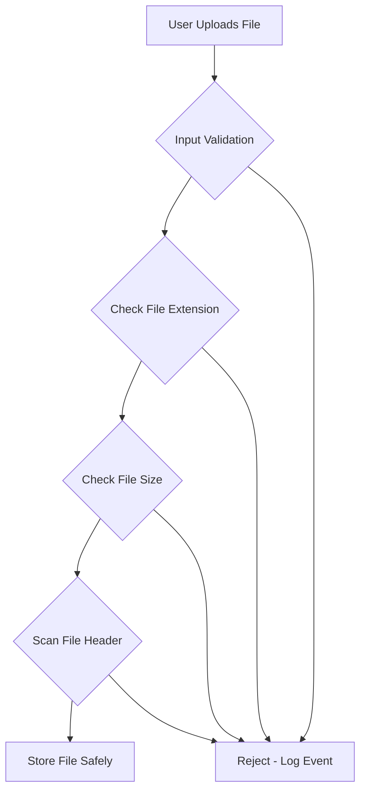
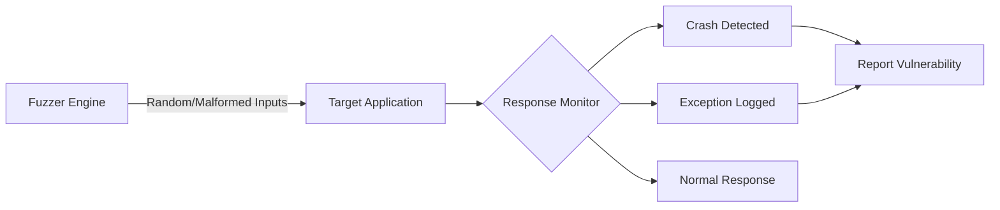
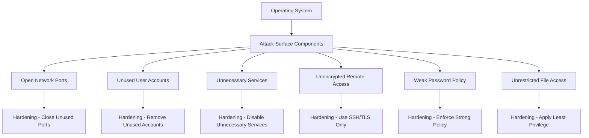
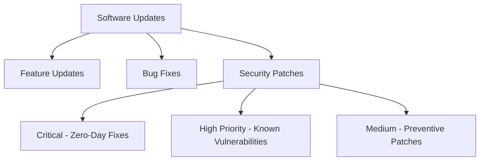
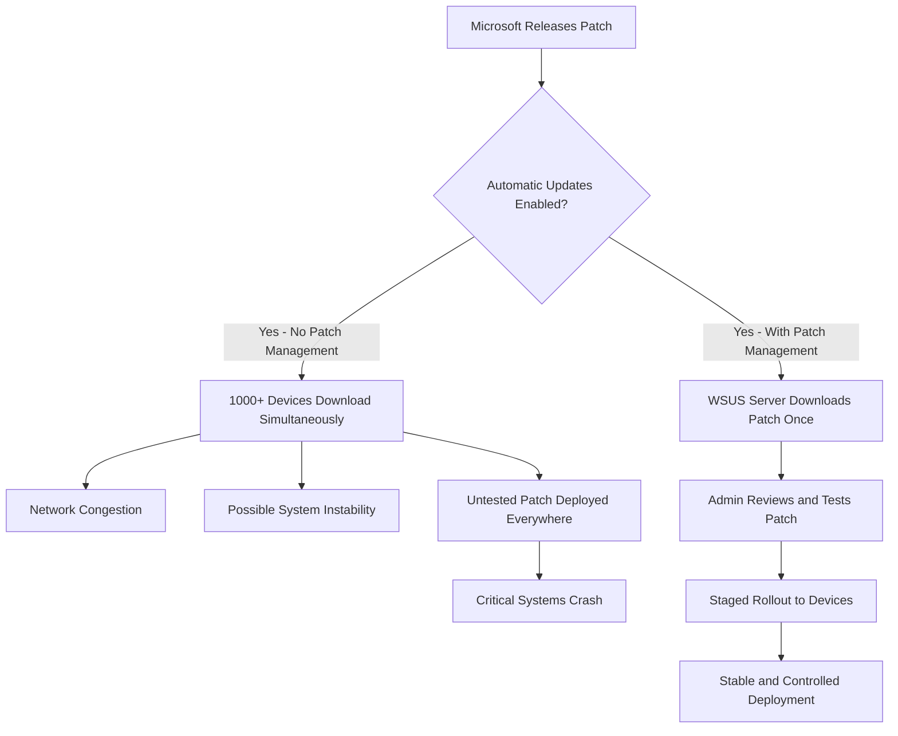
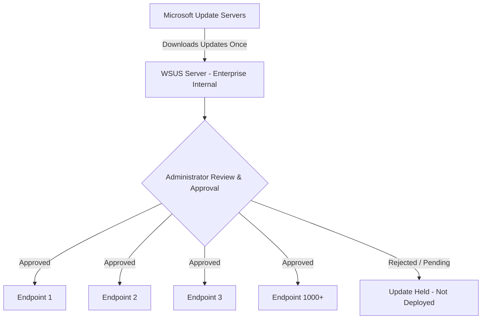
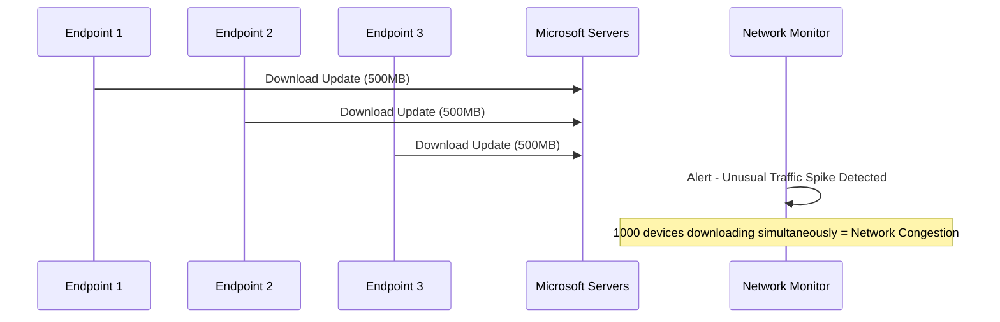

> **الهدف من الـ Section ده:**  
> هتفهم ببساطة إزاي تبني Software آمن من البداية، وتختبره ضد الأخطاء، وتقفل أي نقاط ضعف في الـ System — وكمان ليه التحديثات مهمة وإزاي الشركات الكبيرة بتديرها بشكل منظم عشان تتجنب المشاكل والهجمات. 


---


## Table of Contents

- [Secure Software Design](#secure-software-design)
- [Fuzzing](#fuzzing)
- [OS Hardening](#os-hardening)
- [Updates and Patches](#updates-and-patches)
- [Patch Management](#patch-management)
- [Windows Server Update Service (WSUS)](#windows-server-update-service-wsus)
- [Real Case Scenario](#real-case-scenario)
- [Summary](#summary)

---

## Secure Software Design

### إيه هو الـ Secure Software Design؟

المشكلة الشائعة جداً في عالم تطوير البرمجيات إن الـ Developers بيبنوا الـ Software وبعدين يفكروا في الأمان — زي ما تبني بيت وبعدين تحاول تحط أبواب وشبابيك! ده بالظبط المشكلة.

**Secure Software Design** هو الممارسة اللي بتخلي الـ Developer يفكر في الـ Security من أول لحظة في مرحلة التصميم، مش بعد ما يخلص الكود ويحاول يرقع الثغرات.

> [!IMPORTANT]
> الفرق بين الـ Secure Software Design وأي approach تاني هو إننا بنحط الـ Security في الـ Architecture والـ Logic من البداية، مش بنضيفها كـ afterthought.

### ليه لازم يبدأ الأمان من مرحلة التصميم؟

في الـ Software Development Life Cycle (SDLC)، كلما اكتشفت المشكلة بدري، كلما التكلفة أقل:

```
مرحلة التصميم   → تكلفة إصلاح الثغرة = 1x
مرحلة التطوير  → تكلفة إصلاح الثغرة = 10x
مرحلة الـ Testing → تكلفة إصلاح الثغرة = 50x
مرحلة الـ Production → تكلفة إصلاح الثغرة = 100x
```

> [!WARNING]
> لو وصلت ثغرة للـ Production وفي ناس بتستخدم الـ Software، مش بس هتكلفك أكتر تصلحها — ممكن تسبب خسارة مالية، سمعة، أو legal liability للشركة.

### أمثلة على ممارسات الـ Secure Software Design

| الممارسة | الوصف |
|---|---|
| **Input Validation** | التحقق من كل input قبل معالجته — منع الـ SQL Injection والـ XSS |
| **Authentication** | التأكد من هوية المستخدم بشكل صحيح — استخدام MFA |
| **Logging & Monitoring** | تسجيل كل العمليات المهمة لتمكين الـ Incident Response |
| **Encrypted Communication** | استخدام HTTPS بدل HTTP لتشفير البيانات أثناء النقل |
| **Strong Password Policies** | إجبار المستخدمين على كلمات مرور قوية من الأول |
| **Least Privilege** | منح كل user/process أقل صلاحيات ممكنة تخليه يشتغل |

### مثال عملي

تخيل بتبني App بيسمح للـ Users يرفعوا صور:

- **❌ الطريقة الغلط:** تقبل أي file بدون فلترة → ممكن حد يرفع malware أو script خطير
- **✅ الطريقة الصح (Secure Design):** من أول لحظة في التصميم تحدد: هنقبل بس .jpg و .png، هنعمل size limit، هنفحص الـ file header مش بس الـ extension



---

## Fuzzing

### إيه هو الـ Fuzzing؟

**Fuzzing** (أو **Fuzz Testing**) هو تقنية اختبار برمجي بتقوم فيها بإرسال **inputs عشوائية أو مشوهة أو غير متوقعة** لبرنامج بشكل أوتوماتيكي، عشان تشوف هيتعطل ولا لأ.

تخيله زي **Brute Force Tool** بس مش للـ Passwords — ده بيحاول يكسر الطريقة اللي البرنامج بيتعامل بيها مع الـ Input.

### إيه اللي الـ Fuzzing بيحاول يكتشفه؟

- **Crashes:** البرنامج بيوقع كليًا
- **Memory Corruption:** بيعبى ذاكرة أكتر منه محتاج (Buffer Overflow)
- **Unhandled Exceptions:** حالات ما كانش المبرمج حسبها
- **Security Vulnerabilities:** ثغرات ممكن Attacker يستغلها



> [!TIP]
> الـ Fuzzing مش بس للـ Security — الـ Developers بيستخدموه عشان يتأكدوا إن الـ Input Handling قوي وبيتعامل مع أي حاجة غريبة المستخدمين يدخلوها.

### أمثلة على Fuzzing Inputs

```
Normal Input:  username = "ahmed"
Fuzzed Input:  username = "ahmed'; DROP TABLE users;--"
Fuzzed Input:  username = "AAAAAAAAAAAAAAAAAAAAAAAAAAAAAAAAAAAAAAAA" (1000 chars)
Fuzzed Input:  username = null
Fuzzed Input:  username = <script>alert(1)</script>
Fuzzed Input:  username = ../../../../etc/passwd
```

---

## OS Hardening

### إيه هو الـ OS Hardening؟

**OS Hardening** هو عملية **تقليص الـ Attack Surface** بتاع الـ System.

### إيه هو الـ Attack Surface؟

الـ **Attack Surface** هو **مجموع كل النقاط** اللي ممكن Attacker يحاول يدخل أو يتفاعل مع الـ System من خلالها.

تخيل بيتك — كل شباك وباب وفتحة تهوية هي جزء من الـ Attack Surface بتاعه. الـ OS Hardening معناه إنك تقفل كل الشبابيك والأبواب اللي مش محتاجها.



### خطوات الـ OS Hardening

| الخطوة | التفاصيل |
|---|---|
| **Remove Unused Accounts** | حذف أي User Account مش محتاجة — حتى لو legitimate |
| **Strong Password Policy** | إجبار الكل على Complexity Requirements وExpiry |
| **Limit Remote Access** | السماح فقط بـ Encrypted Methods (SSH, RDP over VPN) |
| **Least Privilege** | كل User يوصل بس للـ Files والـ Services اللي محتاجها |
| **Remove Unused Software** | حذف أي Software مش بيتستخدم — حتى لو مفيش خطر واضح منه |
| **Disable Unnecessary Services** | إيقاف كل Service مش ضرورية (FTP, Telnet, etc.) |
| **Restrict Critical Files** | مثلاً ملف الـ Passwords يوصله Admin فقط |

> [!NOTE]
> الـ OS Hardening مش عملية بتعملها مرة واحدة — لازم تراجعها بانتظام مع كل تغيير في الـ System أو عند إضافة Software جديد.

> [!WARNING]
> حتى لو الـ Software أو الـ Service اللي بتشيلها legitimate ومفيش منها خطر واضح حالياً، لو مش بتستخدمها، اشيلها. ثغرة فيها ممكن تكون Entry Point للـ Attacker.

---

## Updates and Patches

### ليه الـ Updates مهمة؟

مش كل Update عن Features جديدة أو Bug Fixes عادية — في Updates تانية أكتر أهمية بكتير.

### أنواع الـ Updates



### الـ Zero-Day Vulnerability وعلاقتها بالـ Patching

**Zero-Day Vulnerability** هي ثغرة اتكشفت وأُعلن عنها، لكن لسه مفيش Patch ليها — أو في Patch بس Automatic Updates مش شغال.

**السيناريو المخيف:**

```
1. Attacker يكتشف Zero-Day في Windows
2. يبدأ يستغلها على نطاق واسع
3. Microsoft تطلق Patch عاجل
4. جهازك بدون Automatic Updates = لسه Vulnerable
5. بقيت Target سهل حتى بعد ما الـ Fix اتنشر
```

> [!IMPORTANT]
> الـ Automatic Update في Windows بيثبت **"Very Important Updates"** أوتوماتيكياً — وده بيشمل الـ Security Patches الحرجة. تفعيله آمن ومنصوح بيه للأجهزة الشخصية.

### توصيات الـ Updates

- **الأجهزة الشخصية:** فعّل الـ Automatic Updates دايماً
- **الخوادم والمؤسسات:** استخدم Patch Management System (زي WSUS)

---

## Patch Management

### إيه هي المشكلة مع الـ Automatic Updates في الشركات الكبيرة؟

في بيئة الـ Enterprise، الـ Automatic Updates ممكن تسبب مشاكل كبيرة:



### سيناريوهات تثبيت Patch من غير Management

| المشكلة | التوضيح |
|---|---|
| **Network Congestion** | 1000 جهاز كل واحد بيحمّل نفس الـ Update = ضغط هائل على الشبكة |
| **System Instability** | بعض الـ Patches بتسبب Crashes أو Conflicts مع Software موجود |
| **No Testing** | الـ Patch اتطبق على Production مباشرة من غير اختبار |
| **No Control** | ما تقدرش تتحكم في التوقيت أو ترجع للإصدار القديم لو في مشكلة |

> [!IMPORTANT]
> في الشركات الكبيرة (1000+ جهاز أو أكتر)، لازم يكون في **Patch Management System** — مش اختياري، ده ضروري.

---

## Windows Server Update Service (WSUS)

### إيه هو الـ WSUS؟

**WSUS (Windows Server Update Service)** هو حل Microsoft لإدارة الـ Patches مركزياً في الـ Enterprise Networks.

بدل ما كل جهاز يروح يحمّل الـ Updates من Microsoft مباشرة، الـ WSUS بيكون وسيط مركزي:



### كيف يشتغل الـ WSUS؟

1. الـ WSUS Server بيحمّل الـ Updates من Microsoft **مرة واحدة بس**
2. الـ Admin بيراجع الـ Updates ويختبرها
3. الـ Admin بيعمل **Approve** للـ Updates اللي آمنة
4. الـ Endpoints بتاخد الـ Updates من الـ WSUS Server الداخلي مش من Microsoft
5. **لا جهاز هياخد Update لحد ما الـ Admin يوافق عليها**

### مزايا الـ WSUS

| الميزة | التوضيح |
|---|---|
| **Centralized Control** | إدارة كل الـ Updates من مكان واحد |
| **Bandwidth Saving** | الـ Update بتتحمل مرة واحدة بس على الشبكة |
| **Testing Before Deployment** | الـ Admin يقدر يختبر الـ Update قبل نشرها |
| **Staged Rollout** | ينشر الـ Update على مجموعة صغيرة الأول، يتأكد إنها شغالة، وبعدين يكمل |
| **Rollback Capability** | يقدر يرجع لإصدار قديم لو الـ Patch سببت مشاكل |

> [!TIP]
> الـ WSUS بيوفر على المؤسسة Bandwidth كبيرة ووقت كتير — خيّل 1000 جهاز كل واحد بيحمّل 500MB Update = 500GB Traffic! مع WSUS ده بيبقى 500MB بس.

---

## Real Case Scenario

### قصة حقيقية من بيئة العمل

في سيناريو حقيقي حصل، الـ Endpoints كانت متصلة بـ Microsoft مباشرة عشان تحمّل الـ Updates من غير WSUS.

النتيجة؟ تم رصد **Traffic ضخم جداً وغير طبيعي** على الشبكة.



> [!NOTE]
> ده بالظبط السبب اللي خلى الـ WSUS يتعمل — مؤسسة كبيرة من غير Patch Management = فوضى في الشبكة وخطر حقيقي على الـ Stability.

---
## Summary


### ملخص المحاضرة

**Secure Software Design:**
- الـ Security لازم تبدأ من مرحلة الـ Design مش بعد الـ Production
- تصحيح ثغرة في الـ Design يكلف 1x — في الـ Production يكلف 100x
- من أهم الممارسات: Input Validation, Strong Authentication, Encrypted Communication, Least Privilege

**Fuzzing:**
- تقنية اختبار بترسل Inputs عشوائية ومشوهة لاكتشاف الـ Crashes والثغرات الأمنية
- أداة قوية للـ Developers لاختبار الـ Input Handling قبل الـ Production

**OS Hardening:**
- هدفه تقليل الـ Attack Surface قدر الإمكان
- إزالة الـ Accounts والـ Software والـ Services الغير ضرورية
- تطبيق Least Privilege ومنع الـ Remote Access غير المشفر

**Updates & Patches:**
- الـ Security Patches حرجة — خاصة لـ Zero-Day Vulnerabilities
- الـ Automatic Updates منصوح بيها للأجهزة الشخصية
- الشركات الكبيرة محتاجة Patch Management System

**WSUS:**
- حل Microsoft لإدارة الـ Updates مركزياً في الـ Enterprise
- بيوفر الـ Bandwidth ويمنع الـ Instability بإتاحة الاختبار قبل الـ Deployment
- لا Update تنزل على أي Endpoint من غير موافقة الـ Admin

