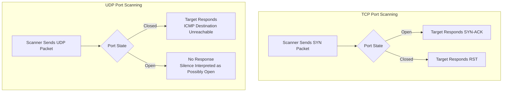

| Topic | Level | Reading Time | Prerequisites |
|---|---|---|---|
| Sniffers and Port Scanning | Intermediate | ~26 min | Basic understanding of TCP/IP, the 3-Way Handshake, and common port numbers |

> **الهدف من الـ Section ده:**  
> الهدف من الـ Section ده: هتفهم إزاي أدوات الـ Sniffing بتلتقط حركة المرور الخام على الشبكة، وإزاي أدوات الـ Port Scanning بتكتشف الأبواب المفتوحة على نظام معين، سواء عن طريق TCP أو UDP، وهتشوف ليه أداة زي **Nmap** أهم بكتير من مجرد اكتشاف بورت مفتوح.


## Learning Objectives

By the end of this section, you will be able to:

- Explain what a **Sniffer** does and why the placement of the network interface determines what traffic it can capture.
- Distinguish between a sniffer and a **protocol analyzer**, and explain why Wireshark is both.
- Compare **Wireshark** and **TCPdump** in terms of interface and typical use cases.
- Explain what a **Port Scanner** does and why it is one of the first steps in reconnaissance.
- Explain how TCP port scanning uses the 3-Way Handshake to determine if a port is open or closed.
- Explain how UDP port scanning works around the lack of a handshake using **ICMP**.
- Explain why identifying the exact service version (not just the port) is critical for an attacker, using a real CVE example.

## Table of Contents

- [Sniffers: Listening to Network Traffic](#sniffers-listening-to-network-traffic)
- [Why Placement Matters](#why-placement-matters)
- [Sniffer vs. Protocol Analyzer](#sniffer-vs-protocol-analyzer)
- [Popular Sniffing Tools](#popular-sniffing-tools)
  - [Wireshark](#wireshark)
  - [TCPdump](#tcpdump)
- [Port Scanners: Finding Open Doors](#port-scanners-finding-open-doors)
- [The Attack Process, Step by Step](#the-attack-process-step-by-step)
- [TCP Port Scanning: The 3-Way Handshake Trick](#tcp-port-scanning-the-3-way-handshake-trick)
- [UDP Port Scanning: Using ICMP as a Workaround](#udp-port-scanning-using-icmp-as-a-workaround)
  - [Special Case: DNS](#special-case-dns)
- [Nmap: Beyond Just Finding Open Ports](#nmap-beyond-just-finding-open-ports)
- [Why the Version Matters So Much](#why-the-version-matters-so-much)
- [Real-World Example: Apache Path Traversal](#real-world-example-apache-path-traversal)
- [Port Scanning Flow Diagram](#port-scanning-flow-diagram)
- [Career Connection](#career-connection)
- [Key Terms Glossary](#key-terms-glossary)
- [Summary](#summary)

## Sniffers: Listening to Network Traffic

**Sniffer** هو أداة سوفتوير بتلتقط (**captures**) حزم الشبكة (**packets**) اللي بتعدي من خلال واجهة الشبكة (**network interface**) اللي هو متصل بيها.

## Why Placement Matters

مهم جدًا نفهم **فين بالظبط (أي interface)** إنت بتحط الـ sniffer، لأن ده اللي بيحدد بالظبط إيه حركة المرور اللي إنت فعليًا تقدر تشوفها.

إنت تقدر تلتقط بس اللي بيعدي من خلال النقطة دي.

**مثال**: لو حطيت sniffer على واجهة (**interface**) فايروول الحدود (**perimeter firewall**، اللي مواجه للإنترنت)، هو هيلتقط بس حركة المرور الرايحة والجاية من وللإنترنت، هو مش هيشوف حركة المرور الداخلية بين جهازين على شبكتك المحلية، لأن حركة المرور دي أبدًا معتلمسش واجهة الفايروول أصلًا.

> [!TIP]
> فكّر في الـ sniffer زي كاميرا مراقبة موجهة على ممر واحد محدد، هي بس بتسجّل اللي بيعدي في الممر ده، مش اللي بيحصل في غرف تانية في المبنى.

## Sniffer vs. Protocol Analyzer

فيه فرق مهم لازم نميّزه: الـ Sniffer بس بيلتقط الـ **raw packets**، أساسًا أصفار وواحدات في صيغة تقنية.

عشان تفهم فعليًا إيه اللي جوه الـ packets دي (أي موقع اتزار، أي بيانات اتبعتت)، إنت محتاج **protocol analyzer** عشان يترجم البيانات الخام دي لصيغة مفهومة للبشر (**human-readable format**).

## Popular Sniffing Tools

### Wireshark

**Wireshark** هي أشهر أداة في المجال ده، وهي فعليًا sniffer و protocol analyzer في نفس الوقت مدمجين في تطبيق واحد.

هي بتلتقط الحزم الخام (وظيفة الـ sniffer) **و** بتترجمها لتفاصيل منظمة ومقروءة، بتوريك عناوين الـ IP المصدر والوجهة، البروتوكولات، الـ headers، وحتى البيانات الفعلية جوه الحزمة، كل ده في واجهة بصرية جميلة (وظيفة الـ protocol analyzer).

### TCPdump

**TCPdump** أداة تانية شائعة، لكنها **CLI-based** (سطر أوامر، من غير واجهة رسومية).

بما إنها معندهاش واجهة رسومية لازم ترندرها، هي أخف وأسرع، بتُستخدم عادةً على السيرفرات أو في المواقف اللي محتاجة التقاط سريع وخفيف (**low-overhead**) من غير بيئة desktop كاملة.

مثال أمر:

```bash
tcpdump -n tcp
```

الأمر ده بيقول لنظامك: "التقط واعرض packets الشبكة، وفلتر بالتحديد حركة مرور TCP، مع تعطيل ترجمة الأسماء (**name resolutions**) عشان تسرّع المخرجات."

## Port Scanners: Finding Open Doors

**Port Scanner** هي أداة بتُستخدم لاكتشاف أي بورتات مفتوحة على نظام مستهدف، بمعنى تاني، أي خدمات شغالة وقابلة إنها تستقبل اتصالات.

دي واحدة من أول خطوات المهاجم بيعملها وهو بيخطط لهجوم عن بعد، إنت متقدرش تهاجم باب إنت مش عارف أصلًا إنه موجود.

## The Attack Process, Step by Step

1. المهاجم الأول محتاج عنوان الـ IP بتاع الهدف (بيتلاقى من خلال تقنيات استطلاع مختلفة).
2. بمجرد ما عنده الـ IP، هو بيمسحه عشان يلاقي أي بورتات مفتوحة.
3. كل بورت مفتوح بيلمّح لنوع الخدمة الشغالة عليه، مثلًا، بورت 80 عادةً معناه سيرفر ويب HTTP شغال، بورت 22 معناه SSH، بورت 3389 معناه Remote Desktop.

> [!TIP]
> تخيل لص ماشي حوالين بيت بيتحقق من كل باب وشباك عشان يشوف أنهي واحد مفتوح، الـ port scanner بيعمل النسخة الرقمية من كده، بيتحقق من كل باب (بورت) على نظام معين عشان يشوف أنهي واحد هيرد.

## TCP Port Scanning: The 3-Way Handshake Trick

الـ port scanners بتعتمد على إزاي الـ TCP طبيعيًا بيتصرف وهو بيحاول يأسس اتصال (نفس عملية الـ handshake اللي أي اتصال عادي بيعديها).

العملية:

1. الـ scanner بيبعت **TCP SYN packet** للبورت المستهدف.
2. لو البورت **مفتوح**، النظام بيرد بـ **SYN-ACK packet**.
3. لو البورت **مقفول**، النظام بيرد بـ **RST packet** (reset)، معناه "مفيش خدمة سامعة هنا، الاتصال مرفوض."

> [!TIP]
> ده زي دق باب، لو حد فتحه وقال "أهلًا" (SYN-ACK)، الباب ده مفتوح (مستخدم). لو صوت صاح "محدش عايش هنا، امشي" (RST)، الباب ده مقفول.

الطريقة دي شغالة كويس جدًا مع الـ TCP لأنه عنده عملية handshake رسمية مبنية فيه. لكن ده بيثير سؤال: إيه بخصوص الـ **UDP**؟ الـ UDP معندوش handshake، مفيش SYN، مفيش RST، فإزاي الـ scanner يعرف هل بورت UDP مفتوح؟

## UDP Port Scanning: Using ICMP as a Workaround

بما إن الـ UDP معندوش عملية handshake، الـ scanners لازم يستخدموا حل بديل ذكي (**clever workaround**) بيتضمن الـ **ICMP** (البروتوكول المستخدم عادةً للتشخيصات ورسائل الأخطاء في الشبكة، زي الـ ping).

العملية:

1. الـ scanner بيبعت **UDP packet** مباشرة للـ IP والبورت المستهدف.
2. نظام تشغيل الهدف بيتحقق: "فيه حاجة سامعة على البورت ده؟"
3. لو البورت **مقفول**: نظام التشغيل بيرد برسالة **ICMP Destination Unreachable**، بتقول تحديدًا للـ scanner: "الـ packet بتاعك وصل، لكن مفيش حاجة سامعة على البورت ده."
4. لو البورت **مفتوح**: في معظم الحالات، إنت هتاخد **مفيش رد خالص**، صمت.

الـ scanner لازم يفسّر عدم وجود رد كعلامة محتملة على إن البورت مفتوح (رغم إن ده مش مؤكد 100%، بما إن الـ packets ممكن كمان تتفقد أو تتفلتر ببساطة).

> [!NOTE]
> الـ **ICMP** اتصمم خصيصًا من طرف مجموعة بروتوكولات الإنترنت (**Internet Protocol suite**) عشان يبلّغ عن أخطاء ومشاكل توصيل لبروتوكولات تانية زي UDP وTCP، بما إن الـ UDP نفسه معندوش طريقة مدمجة يقول بيها "البورت مقفول"، هو بيستعير الـ ICMP عشان يوصّل الرسالة دي بدل كده.

### Special Case: DNS

بعض الخدمات المبنية على UDP، زي **DNS** (بورت 53)، فعليًا بترد حتى وهي بتتفحص، لأن خدمة الـ DNS نفسها بتبعت رد كجزء من التشغيل العادي بتاعها.

فالـ scanners أحيانًا بتاخد إجابة أوضح وخاصة بالبروتوكول لبعض خدمات UDP المعروفة.

## Nmap: Beyond Just Finding Open Ports

**Nmap** هي أكتر أداة استخدامًا لعمل port scanning، بيستخدمها المهاجمين ومتخصصي الأمن على حد سواء (هي أداة شرعية وأساسية للمدافعين كمان، مش بس أداة اختراق).

الـ Nmap كمان يقدر يكتشف:

- نظام التشغيل بتاع الهدف.
- الخدمة بالتحديد الشغالة على بورت معين.
- نسخة الخدمة دي (مثلًا، مش بس "سيرفر ويب"، لكن تحديدًا "Apache 2.4.49").

## Why the Version Matters So Much

بمجرد ما المهاجم يعرف السوفتوير والنسخة بالتحديد، هو يقدر يدوّر في قواعد بيانات الثغرات العامة (**public vulnerability databases**) على نقاط ضعف معروفة وموثقة في النسخة دي بالتحديد، وبعدين يستخدم exploit موجود بالفعل ضدها.

> [!IMPORTANT]
> معرفة إنه "سيرفر ويب" مش مفيدة قوي، لكن معرفة إنه تحديدًا "Apache 2.4.49" ممكن توصّل مباشرة لهجوم فعلي شغال.

ده بالظبط السبب اللي بيخلي مفهوم **الصلاحية الأقل (least privilege)** مهم بالنسبة للبورتات كمان: افتح بس البورتات اللي نظامك فعليًا محتاجها، ومفيش غيرها.

> [!WARNING]
> كل بورت مفتوح غير ضروري هو باب محتمل ممكن المهاجم يكتشفه ويستغله، كل ما البواب المفتوحة تقل، كل ما سطح الهجوم (**attack surface**) بيصغر.

## Real-World Example: Apache Path Traversal

مثال واقعي: **Apache Path Traversal (CVE-2021-41773)** هي ثغرة شهيرة من سنة 2021 أثّرت بالتحديد على نسخة Apache 2.4.49 بس.

المهاجم اللي بيشغّل Nmap كان يقدر يعرف فورًا لو الهدف عرضة للاستغلال بمجرد ما يشوف رقم النسخة ده بالتحديد في نتائج المسح.

## Port Scanning Flow Diagram

المخطط التالي بيوضح الفرق بين مسار فحص TCP باستخدام الـ handshake ومسار فحص UDP باستخدام ICMP كحل بديل:



## Career Connection

فهم أدوات الـ Sniffing والـ Port Scanning له تطبيقات مباشرة في مسارات مهنية متعددة:

- في مجال **Pentesting**، استخدام Nmap وWireshark جزء أساسي جدًا من مرحلة الاستطلاع (**reconnaissance**) في أي اختبار اختراق.
- في مجال **SOC**، تحليل حركة مرور ملتقطة بأدوات زي Wireshark بيساعد في التحقيق في حوادث أمنية وفهم طبيعة الهجوم.
- في مجال **Vulnerability Management**، فهم إزاي المهاجمين بيستخدموا معلومات النسخة (زي Apache 2.4.49) بيساعد في تحديد أولوية إصلاح الثغرات المرتبطة بخدمات محددة.
- في مجال **Network Security Engineering**، تطبيق مبدأ الصلاحية الأقل على البورتات المفتوحة جزء أساسي من تقليل سطح الهجوم.

## Key Terms Glossary

| Term | Definition |
|---|---|
| **Sniffer** | أداة تلتقط حزم الشبكة الخام المارة عبر واجهة شبكة معينة. |
| **Protocol Analyzer** | أداة تترجم البيانات الخام الملتقطة إلى صيغة مفهومة للبشر. |
| **Wireshark** | أداة تجمع بين وظيفتي الـ sniffer والـ protocol analyzer في واجهة رسومية واحدة. |
| **TCPdump** | أداة التقاط حزم خفيفة تعمل عبر سطر الأوامر (CLI). |
| **Port Scanner** | أداة تكتشف البورتات المفتوحة والخدمات الشغالة على نظام مستهدف. |
| **ICMP** | بروتوكول يُستخدم للإبلاغ عن الأخطاء وتشخيص الشبكة، يُستعار لأغراض فحص بورتات UDP. |
| **Nmap** | أداة مسح شبكات شائعة الاستخدام تكشف البورتات المفتوحة، نظام التشغيل، والخدمات ونسخها. |
| **Least Privilege (for Ports)** | مبدأ فتح البورتات الضرورية فقط لتقليل سطح الهجوم. |
| **Attack Surface** | مجموع النقاط المحتملة التي يمكن للمهاجم استغلالها للوصول إلى نظام أو شبكة. |

## Summary

- **Sniffer** بيلتقط حركة مرور الشبكة الخام، لكنه بيشوف بس اللي بيعدي من خلال الـ interface اللي هو متصل بيها بالتحديد، فمكان وضعه بيحدد بالظبط إيه اللي هيقدر يشوفه.
- **Wireshark** هي sniffer وprotocol analyzer في نفس الوقت (واجهة رسومية)، بينما **TCPdump** أداة أخف وأسرع تعمل عبر سطر الأوامر.
- **Port Scanner** بيكتشف أي بورتات مفتوحة على هدف معين، وده من أول خطوات المهاجم في أي هجوم عن بعد.
- فحص بورتات **TCP** بيعتمد على الـ 3-Way Handshake: SYN-ACK معناه البورت مفتوح، RST معناه البورت مقفول.
- فحص بورتات **UDP** أصعب لأنه معندوش handshake، فبيعتمد على **ICMP**: رسالة "Destination Unreachable" معناها البورت مقفول، بينما الصمت ممكن يعني إن البورت مفتوح (مش مؤكد 100%).
- **Nmap** أداة قوية جدًا بتقدر تكتشف مش بس البورتات المفتوحة، لكن كمان نظام التشغيل، الخدمة، ونسختها بالتحديد.
- معرفة النسخة بالتحديد (زي Apache 2.4.49) بتوصّل المهاجم مباشرة لثغرات موثقة معروفة، زي ثغرة **Apache Path Traversal (CVE-2021-41773)** الحقيقية من 2021.
- مبدأ **least privilege** على البورتات، افتح بس اللي محتاجه فعليًا، جزء أساسي من تقليل سطح الهجوم.

