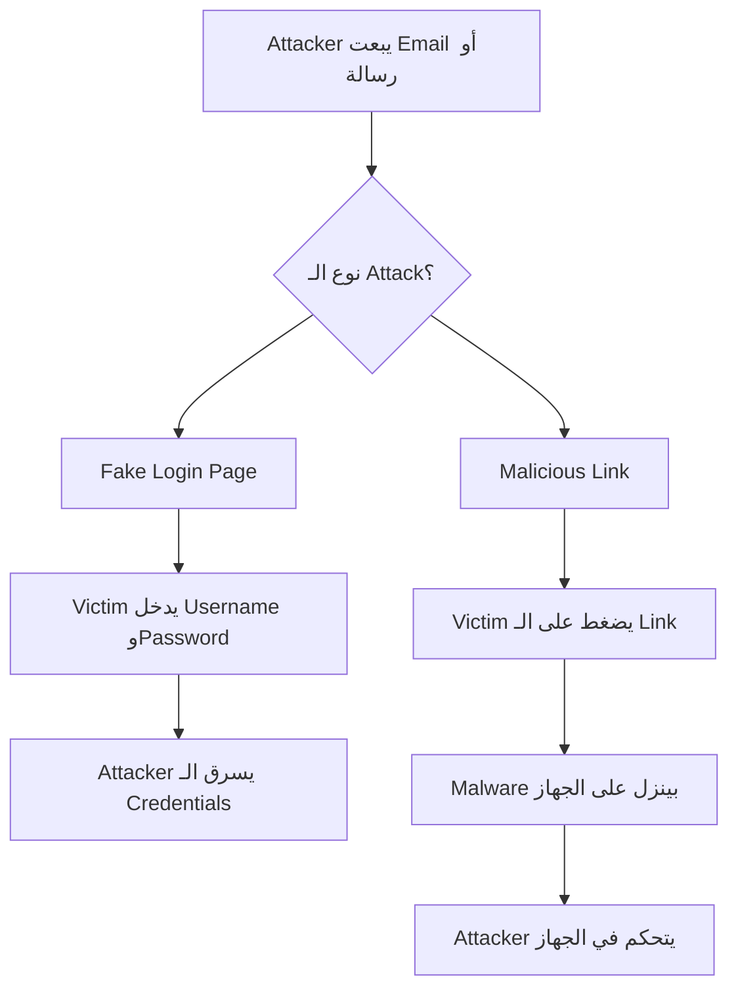
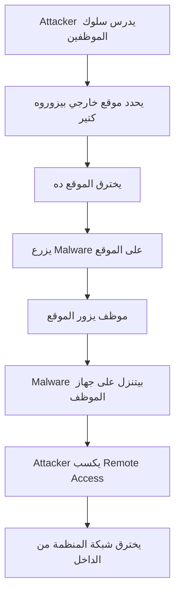

> **الهدف من الـ Section ده:**  
> هنتعرف على أخطر نوع من الهجمات السيبرانية واللي بيستهدف الإنسان نفسه بدل الأنظمة — وهي Social Engineering & Deception Attacks.

---

## Table of Contents

- [Social Engineering \& Deception Attacks](#social-engineering--deception-attacks)
  - [Social Engineering](#social-engineering)
  - [Phishing \& Spear Phishing](#phishing--spear-phishing)
  - [Watering Hole Attack](#watering-hole-attack)
- [Summary](#summary)

---

## Social Engineering & Deception Attacks

### Social Engineering

#### ما هو الـ Social Engineering؟

الـ **Social Engineering** هو استغلال الطبيعة البشرية بدل الثغرات التقنية. الـ Attacker بيقنع الضحية إنها هي نفسها تسلمه المعلومات أو الوصول.

> [!IMPORTANT]
> ده أخطر نوع من الـ Attacks. لأن لو نجح، كل الـ Security Devices اللي اتصرف فيها ملايين هتبقى بلا فايدة — الضحية بنفسها سلمت الـ Attacker كل معلومة عشان يدخل النظام بصورة شرعية.

#### ليه بنقع فيه؟

الـ Attackers بيستغلوا الطبيعة البشرية:
- الثقة والمساعدة
- الخوف والضغط
- الفضول
- الطمع

#### إزاي تتحمى؟

مفيش Technology تحميك من الـ Social Engineering. الحل الوحيد هو:

> [!TIP]
> **Training + Awareness**. لازم تدرب موظفيك بشكل مستمر وترفع الـ Security Awareness. Simulation Phishing Attacks بتساعد جداً عشان الناس تاخد بالها من الـ Tricks دي.

---

### Phishing & Spear Phishing

#### الفرق بين Phishing و Spear Phishing

| المعيار | Phishing | Spear Phishing |
|---|---|---|
| الهدف | الجميع (Broadcast) | شخص محدد أو مؤسسة |
| مستوى التخصيص | منخفض | عالي جداً |
| مستوى البحث | لا يوجد | بحث مكثف عن الهدف |
| معدل النجاح | أقل | أعلى بكتير |
| الخطورة | متوسطة | عالية جداً |

#### طرق الـ Phishing Attack

**1. Fake Login Page**
صفحة بتتظاهر إنها موقع حقيقي (بنك، Gmail، Facebook) عشان تسرق الـ Username والـ Password.

**2. Malicious Link**
لينك لما تضغط عليه بينزل Malware على جهازك.

> [!WARNING]
> في Tools مجانية على الإنترنت بتعمل Phishing Pages جاهزة في دقائق. الـ Attacker مش محتاج خبرة كبيرة عشان ينفذ الـ Attack.

---

### Watering Hole Attack

#### ما هي الـ Watering Hole Attack؟

اسمها مأخوذ من طريقة الصيد في الطبيعة — الأسد مش بيجري ورا الفريسة، هو بيستنى عند حفرة الماء اللي الفريسة هتيجي ليها حتماً.

> [!NOTE]
> الـ Attack دي صعبة الاكتشاف لأن الموظف بيزور موقع شرعي معروف وموثوق — الموقع نفسه اتاخد. كـ SOC Analyst، لازم تراقب الـ Web Requests وتاخد بالك من أي Malicious Downloads حتى من مواقع موثوقة.

## Summary
- أخطر نوع هجوم — بيتجاوز كل التقنية
- Phishing للكل، Spear Phishing لهدف محدد
- Watering Hole: اخترق موقع بيزوره الموظفين وانتظرهم
- الحل الوحيد: Training وAwareness

