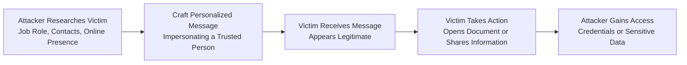

| Topic | Level | Reading Time | Prerequisites |
|---|---|---|---|
| Social Engineering and Phishing | Beginner | ~16 min | None |

الهدف من الـ Section ده: هتفهم إزاي المهاجمين بيستغلوا سلوك البشر النفسي عشان يوصلوا لمعلومات أو صلاحيات حساسة، وهتعرف الفرق بين الـ Phishing العادي والـ Spear Phishing المستهدف.

## Learning Objectives

By the end of this section, you will be able to:

- Define **Social Engineering** and explain why humans can be the weakest link in a security system.
- Identify common social engineering techniques such as **phishing**, **spear phishing**, **pretexting**, **baiting**, and **impersonation**.
- Explain how attackers use **reconnaissance** (research) to make an attack more convincing.
- Distinguish between **Phishing** and **Spear Phishing** in terms of scope and targeting.
- Recommend practical mitigations that organizations can use to reduce the risk of social engineering attacks.

## Table of Contents

- [What Is Social Engineering](#what-is-social-engineering)
- [Why Humans Are the Weakest Link](#why-humans-are-the-weakest-link)
- [Reconnaissance: How Attackers Research Their Targets](#reconnaissance-how-attackers-research-their-targets)
- [High-Value Targets: Privileged Employees](#high-value-targets-privileged-employees)
- [Common Social Engineering Techniques](#common-social-engineering-techniques)
- [Phishing in Depth](#phishing-in-depth)
  - [How a Phishing Attack Works](#how-a-phishing-attack-works)
  - [Malicious Links and Attachments](#malicious-links-and-attachments)
- [Spear Phishing: Targeted and Personalized Attacks](#spear-phishing-targeted-and-personalized-attacks)
- [Phishing vs. Spear Phishing](#phishing-vs-spear-phishing)
- [Attack Flow Diagram](#attack-flow-diagram)
- [Mitigations and Best Practices](#mitigations-and-best-practices)
- [Career Connection](#career-connection)
- [Key Terms Glossary](#key-terms-glossary)
- [Summary](#13-summary)

## What Is Social Engineering

**Social Engineering** هو استخدام التلاعب النفسي (**psychological manipulation**) عشان تقنع شخص إنه ينفذ فعل معين أو يكشف معلومات كان المفروض تفضل محمية.

بدل ما المهاجم يحاول يخترق نظام تقني معقد، هو بيستهدف العنصر البشري مباشرة، ويحاول يستغل طبيعة السلوك البشري نفسه عشان يوصل لهدفه.

> [!NOTE]
> الفرق الجوهري بين الهجوم التقني والـ Social Engineering إن الأول بيستهدف ثغرة في نظام أو كود، أما التاني بيستهدف ثغرة في تفكير أو سلوك إنسان.

## Why Humans Are the Weakest Link

في كتير من الأحيان، **البشر بيبقوا أضعف نقطة في نظام الأمان (weakest point in a security system)**، لأن المهاجمين بيقدروا يستغلوا مشاعر وسلوكيات إنسانية طبيعية زي:

- الثقة (**trust**).
- الفضول (**curiosity**).
- الخوف (**fear**).
- الإحساس بالإلحاح أو العجلة (**urgency**).

> [!IMPORTANT]
> مهما كانت الأنظمة التقنية للحماية قوية ومكلفة، الـ Social Engineering بيقدر يتجاوزها بالكامل، لأن المهاجم مش بيحاول يكسر النظام، هو بيحاول يقنع إنسان إنه يفتحله الباب بنفسه.

## Reconnaissance: How Attackers Research Their Targets

قبل ما ينفذوا الهجوم، المهاجمين غالبًا بيعملوا بحث (**research**) عن أهدافهم من خلال وسائل التواصل الاجتماعي (**social media**) والمعلومات المتاحة للعامة (**publicly available information**).

الهدف من البحث ده إنهم يفهموا:

- اهتمامات الضحية (**interests**).
- عاداتهم اليومية (**habits**).
- علاقاتهم الشخصية والمهنية (**relationships**).
- مسؤولياتهم الوظيفية (**responsibilities**).

المعلومات دي بتساعد المهاجم يبني سيناريو هجوم مقنع أكتر، لأنه بيقدر يستخدم تفاصيل حقيقية تخلي الرسالة أو الطلب يبدو منطقي وشرعي.

## High-Value Targets: Privileged Employees

الموظف اللي عنده صلاحيات عالية (**highly privileged employee**) ممكن يكون هدف قيّم جدًا للمهاجم، لأن اختراق حسابه ممكن يوفر وصول (**access**) لأنظمة ومعلومات حساسة جدًا داخل المؤسسة.

> [!WARNING]
> المهاجمين مش بيستهدفوا بس الموظفين التقنيين أو أصحاب المناصب العليا؛ أي شخص عنده صلاحيات وصول مهمة (زي موظف في قسم الحسابات أو الموارد البشرية) ممكن يكون هدف جذاب لو حسابه يقدر يفتح باب لنظام حساس.

## Common Social Engineering Techniques

الجدول التالي بيوضح أشهر أساليب الـ Social Engineering:

| التقنية | الوصف |
|---|---|
| **Phishing** | إرسال رسائل احتيالية لعدد كبير من الضحايا المحتملين، انتحالًا لجهة موثوقة |
| **Spear Phishing** | نسخة مستهدفة وشخصية من الـ phishing، موجّهة لشخص أو منظمة معينة |
| **Pretexting** | اختلاق سيناريو أو قصة مزيفة لإقناع الضحية بمشاركة معلومات أو تنفيذ إجراء |
| **Baiting** | إغراء الضحية بشيء جذاب (زي جهاز USB أو عرض مجاني) لدفعه لتنفيذ فعل ضار |
| **Impersonation** | انتحال شخصية موثوقة (زي موظف دعم فني أو مدير) لكسب ثقة الضحية |

بما إن الـ Social Engineering بيعتمد على العنصر البشري، الأنظمة التقنية للحماية وحدها **مش كافية للحماية الكاملة (technical security controls alone cannot completely prevent social engineering)**. لازم تتجمع مع:

- التدريب على الوعي الأمني (**security awareness training**).
- المصادقة القوية (**strong authentication**).
- إجراءات التحقق (**verification procedures**).
- المصادقة متعددة العوامل المقاومة للتصيد (**phishing-resistant MFA**).

## Phishing in Depth

### How a Phishing Attack Works

**Phishing** هو نوع من هجمات الـ Social Engineering بيقوم فيه المهاجم بإرسال رسائل احتيالية (**fraudulent messages**) لعدد كبير من الضحايا المحتملين، وعادةً بيتظاهر إنه منظمة أو خدمة موثوقة.

من أشهر أساليب الـ phishing إن المهاجم بينشئ **صفحة تسجيل دخول مزيفة (fake login page)** بتشبه شكل موقع بنكي، بريد إلكتروني، أو موقع شركة مألوف، وبيحاول يقنع الضحية إنه يدخّل اسم المستخدم وكلمة المرور بتاعته فيها.

### Malicious Links and Attachments

رسائل الـ phishing كمان ممكن تحتوي على روابط أو مرفقات ضارة (**malicious links or attachments**)، مصممة عشان:

- توصّل برمجيات خبيثة (**malware**) لجهاز الضحية.
- تعيد توجيه الضحية (**redirect**) لموقع إلكتروني ضار.

> [!WARNING]
> صفحة تسجيل الدخول المزيفة ممكن تكون مطابقة تمامًا للموقع الأصلي من الناحية الشكلية، والفرق الوحيد غالبًا بيكون في تفاصيل دقيقة زي عنوان الـ URL، فده بيخلي التحقق من الرابط قبل إدخال أي بيانات خطوة أساسية.

## Spear Phishing: Targeted and Personalized Attacks

**Spear Phishing** هو شكل أكتر استهدافًا (**targeted**) من الـ phishing، وبيركّز على شخص معين أو منظمة معينة بدل إرسال رسالة عشوائية لعدد كبير من الناس.

قبل ما يبدأ هجوم الـ spear phishing، المهاجم غالبًا بيعمل بحث عن الضحية يشمل:

- الدور الوظيفي (**job role**).
- الشركة اللي بيشتغل بيها.
- جهات الاتصال (**contacts**) الخاصة بيه.
- اهتماماته وحضوره الإلكتروني (**online presence**).

البحث ده بيساعد المهاجم إنه يخلي الرسالة تبدو شرعية ومقنعة قدر الإمكان.

مثال على كده: المهاجم ممكن ينتحل شخصية مدير (**impersonate a manager**) ويبعت لموظف طلب مقنع يطلب منه يفتح مستند معين أو يوفّر معلومات حساسة.

## Phishing vs. Spear Phishing

الفرق الأساسي بين النوعين إن الـ **Phishing** عمومًا بيكون واسع وعشوائي (**broad and opportunistic**)، بينما الـ **Spear Phishing** بيكون مستهدف ومخصص (**targeted and personalized**).

| المعيار | Phishing | Spear Phishing |
|---|---|---|
| نطاق الاستهداف | واسع، لعدد كبير من الضحايا | محدد، شخص أو منظمة معينة |
| مستوى التخصيص | منخفض، رسالة عامة | مرتفع، مبني على بحث دقيق عن الضحية |
| مستوى الإقناع | متوسط | مرتفع جدًا بسبب التخصيص |
| مجهود التحضير المطلوب من المهاجم | قليل نسبيًا | كبير، يشمل reconnaissance مفصّل |

## Attack Flow Diagram

المخطط التالي بيوضح مراحل هجوم الـ Spear Phishing من البحث وحتى تحقيق الهدف:

## Mitigations and Best Practices

المؤسسات تقدر تقلل من مخاطر الـ phishing والـ social engineering بشكل عام من خلال:

- **Security Awareness Training**: تدريب الموظفين على التعرف على محاولات التصيد والتلاعب.
- **Email Filtering**: أدوات فلترة البريد الإلكتروني لاكتشاف الرسائل المشبوهة.
- **MFA (Multi-Factor Authentication)**: طبقة حماية إضافية حتى لو تم اختراق كلمة المرور.
- **URL Protection**: أدوات تفحص الروابط قبل ما المستخدم يدخل عليها.
- **التحقق من الطلبات غير المعتادة عبر قناة اتصال منفصلة**: زي الاتصال المباشر بالشخص المفترض إنه بعت الطلب، بدل الرد على نفس الرسالة المشبوهة.

> [!TIP]
> لو استلمت طلب غير متوقع من "مديرك" أو زميل بيطلب فيه معلومات حساسة أو تحويل أموال، أفضل إجراء إنك تتأكد منه عن طريق قناة اتصال مختلفة تمامًا (زي مكالمة هاتفية مباشرة) بدل الرد على نفس الرسالة.

## Career Connection

فهم الـ Social Engineering والـ Phishing مهم جدًا في مسارات مهنية متعددة:

- في مجال **SOC**، تحليل رسائل التصيد المبلّغ عنها من الموظفين جزء أساسي من العمل اليومي.
- في مجال **Pentesting**، اختبارات التصيد الأخلاقي (**phishing simulations**) بتُستخدم لقياس مدى وعي الموظفين وتحسين التدريب.
- في مجال **GRC**، وضع سياسات وإجراءات التحقق من الطلبات الحساسة جزء أساسي من إدارة المخاطر المؤسسية.

## Key Terms Glossary

| Term | Definition |
|---|---|
| **Social Engineering** | استخدام التلاعب النفسي لإقناع شخص بتنفيذ فعل أو كشف معلومات محمية. |
| **Phishing** | هجوم يقوم فيه المهاجم بإرسال رسائل احتيالية لعدد كبير من الضحايا، منتحلًا جهة موثوقة. |
| **Spear Phishing** | نسخة مستهدفة وشخصية من الـ phishing، موجّهة لفرد أو منظمة محددة. |
| **Pretexting** | اختلاق سيناريو مزيف لإقناع الضحية بمشاركة معلومات أو تنفيذ إجراء. |
| **Baiting** | إغراء الضحية بشيء جذاب لدفعها لتنفيذ فعل ضار. |
| **Impersonation** | انتحال شخصية موثوقة لكسب ثقة الضحية. |
| **Reconnaissance** | مرحلة جمع المعلومات عن الهدف قبل تنفيذ الهجوم. |
| **Phishing-Resistant MFA** | نوع من المصادقة متعددة العوامل مصمم خصيصًا ليقاوم محاولات التصيد. |

## Summary

- **Social Engineering** بيعتمد على التلاعب النفسي بدل استغلال ثغرات تقنية، والبشر غالبًا بيكونوا أضعف نقطة في نظام الأمان بسبب الثقة، الفضول، الخوف، والإحساس بالإلحاح.
- المهاجمين بيعملوا **reconnaissance** عن ضحاياهم من خلال وسائل التواصل الاجتماعي والمعلومات المتاحة للعامة عشان يزودوا فرص نجاح الهجوم.
- الموظفين أصحاب الصلاحيات العالية (**privileged employees**) بيكونوا أهداف قيّمة بشكل خاص للمهاجمين.
- من أشهر أساليب الـ Social Engineering: **phishing**، **spear phishing**، **pretexting**، **baiting**، و **impersonation**.
- **Phishing** بيكون واسع وعشوائي وبيستهدف عدد كبير من الناس، غالبًا عن طريق صفحات تسجيل دخول مزيفة أو روابط/مرفقات ضارة.
- **Spear Phishing** أكتر استهدافًا وتخصيصًا، وبيعتمد على بحث دقيق عن الضحية قبل تنفيذ الهجوم.
- الحماية الفعالة بتحتاج مزيج من **security awareness training**، **MFA**، **email filtering**، **URL protection**، والتحقق من الطلبات غير المعتادة عبر قناة اتصال منفصلة.
