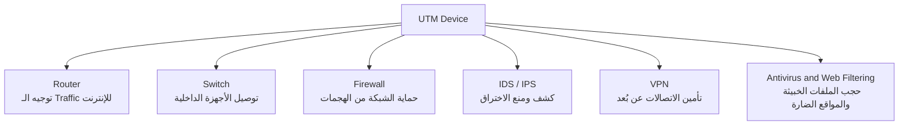
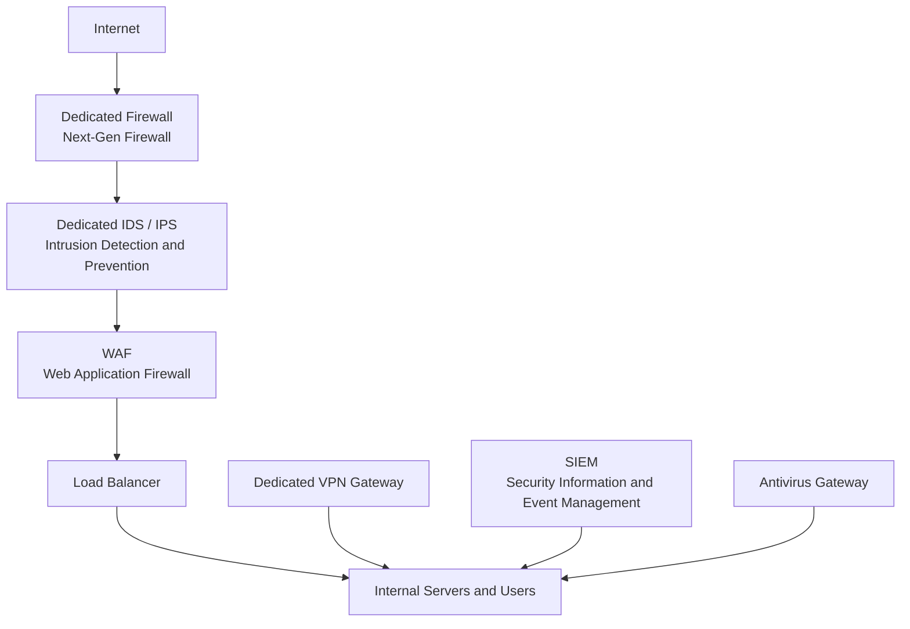
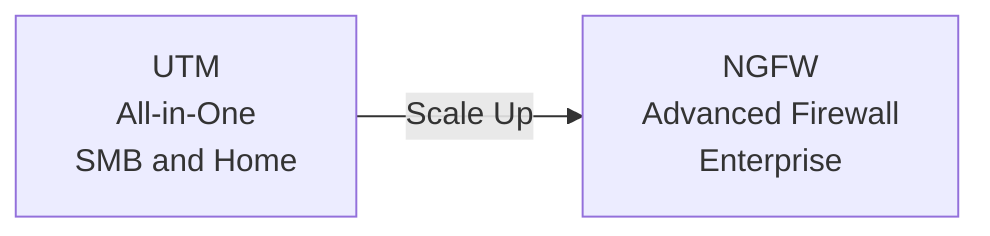

> **الهدف من الـ Section ده:**
> هتفهم إيه هو الـ UTM، وإزاي بيجمع كل أدوات الحماية في جهاز واحد، وامتى تستخدمه وامتى تتجنبه — وهتقدر تفرق بين الـ UTM والـ Enterprise Security Setup بكل ثقة.

---

# UTM (Unified Threat Management)

## Table of Contents

- [ما هو الـ UTM؟](#ما-هو-الـ-utm)
- [مكونات الـ UTM](#مكونات-الـ-utm)
- [مزايا الـ UTM](#مزايا-الـ-utm)
- [عيوب الـ UTM في البيئات الكبيرة](#عيوب-الـ-utm-في-البيئات-الكبيرة)
- [البديل للـ Enterprise: Best-of-Breed](#البديل-للـ-enterprise-best-of-breed)
- [UTM vs Enterprise Setup — مقارنة شاملة](#utm-vs-enterprise-setup--مقارنة-شاملة)
- [UTM vs NGFW](#utm-vs-ngfw)
- [Summary](#summary)

---

## ما هو الـ UTM؟

الـ **UTM (Unified Threat Management)** هو جهاز أمني واحد بيجمع جوّاه **أكثر من وظيفة أمنية** في نفس الوقت.

الفكرة الأساسية: بدل ما تشتري 5 أو 6 أجهزة أمنية منفصلة، الـ UTM بيدّيك كل ده في **جهاز واحد** بواجهة إدارة واحدة.

> [!NOTE]
> تخيل الـ UTM زي الـ **Swiss Army Knife** — سكينة واحدة فيها مقص وبرغي وشوكة وكل حاجة. مش الأفضل في كل وظيفة، لكنها كافية وعملية جداً لمعظم المواقف.

**مثال من الواقع:** الـ Home Router بتاعك في البيت هو أبسط شكل من أشكال الـ UTM — فيه:
- **Routing** → بيوجّه الـ Traffic للإنترنت
- **Switching** → بيوصّل الأجهزة ببعض
- **Basic Firewall** → بيحمي الشبكة من الهجمات الخارجية

```
[ Internet ]
     |
[ UTM Device ]  ←── Router + Switch + Firewall + IDS/IPS + VPN + Antivirus
     |
[ Internal Network ]
```

---

## مكونات الـ UTM

جهاز الـ UTM الكامل بيتضمن عادةً المكونات دي كلها مدمجة مع بعض:



| المكوّن | الوظيفة |
|---|---|
| **Router** | توجيه الـ Traffic بين الشبكة الداخلية والإنترنت |
| **Switch** | توصيل الأجهزة داخل الشبكة المحلية |
| **Firewall** | فلترة الـ Packets وحماية الشبكة من الهجمات |
| **IDS / IPS** | كشف ومنع محاولات الاختراق |
| **VPN** | تشفير الاتصالات للموظفين البعيدين (Remote Workers) |
| **Antivirus** | فحص الملفات والـ Traffic وحجب البرمجيات الخبيثة |
| **Web Filtering** | حجب المواقع الضارة أو غير المناسبة |

> [!IMPORTANT]
> مش شرط كل UTM يحتوي على كل المكونات دي — بعض الأجهزة بتركّز على بعض الوظائف أكتر من غيرها حسب الشركة المصنّعة والـ Model.

---

## مزايا الـ UTM

### 1. Cost-Effective (اقتصادي)
بدل ما تشتري Firewall منفصل + IDS منفصل + VPN Gateway منفصل + Antivirus Gateway منفصل، الـ UTM بيدّيك كل ده في **جهاز واحد بسعر أرخص بكتير**.

### 2. Easy Management (سهولة الإدارة)
كل الوظائف الأمنية بتتدار من **Dashboard واحد**. مش محتاج خبرة عالية أو فريق متخصص لكل جهاز على حدة.

> [!TIP]
> الـ UTM مثالي جداً للـ **Small Business** أو الـ **Startup** اللي معندهاش فريق IT كبير — شخص واحد يقدر يدير كل حاجة.

### 3. Centralized Visibility (رؤية مركزية)
بتشوف كل اللي بيحصل على الشبكة من مكان واحد — الـ Logs، الـ Alerts، والـ Reports كلها في نفس الواجهة.

**الاستخدامات المثالية للـ UTM:**
- **Home Networks** → الراوتر البيتي
- **Small to Medium Businesses (SMB)** → شركات من 10 لـ 200 موظف
- **Startups** → بيئات محتاجة حماية سريعة وبدون تعقيد

---

## عيوب الـ UTM في البيئات الكبيرة


لما الـ Traffic الكبير كله بيعدّي من جهاز واحد، بتظهر مشاكل:

### 1. Performance Constraints (قيود الأداء)
كل الـ Traffic بيعدّي من جهاز واحد → ده ممكن يسبب **Bottleneck** (اختناق في الشبكة) لما الأعداد تكبر.

### 2. Limited Flexibility (مرونة محدودة)
الـ Enterprise الكبيرة محتاجة **تخصيص عالي** في كل وظيفة أمنية — الـ UTM بيدي حلول Generic مش متخصصة.

### 3. Single Point of Failure (نقطة فشل واحدة)
لو الجهاز وقع أو اتهاجم → **الشبكة كلها والحماية كلها بتوقف** في نفس الوقت. ده خطر كبير جداً في البيئات الحساسة.

> [!WARNING]
> الـ **Single Point of Failure** هو أخطر عيوب الـ UTM في البيئات الكبيرة. لو الجهاز الواحد اتعطل، مفيش Firewall، مفيش IDS، مفيش VPN — كل حاجة بتوقف مع بعض.

### 4. Limited Scalability (محدودية التوسع)
الـ UTM مش مصمم يتحمل آلاف المستخدمين أو الـ Traffic العالي اللي بتشوفه في الـ Enterprise أو الـ Data Centers.

---

## البديل للـ Enterprise: Best-of-Breed

الـ **Enterprise الكبيرة** بتستخدم نهج مختلف تماماً — بدل جهاز واحد، بتحط **جهاز متخصص لكل وظيفة**:



كل جهاز في الـ Setup ده:
- **متخصص 100%** في وظيفته
- **عالي الأداء** ومصمم للـ Load الكبير
- **مستقل** — لو جهاز وقع، الباقي بيفضل شغال
- **قابل للتوسع** منفرداً بدون ما تأثر على الأجهزة التانية

---

## UTM vs Enterprise Setup — مقارنة شاملة

| المعيار | UTM | Enterprise Setup |
|---|---|---|
| **التكلفة** | منخفضة | عالية جداً |
| **الإدارة** | بسيطة (واجهة واحدة) | معقدة (أجهزة منفصلة) |
| **الأداء** | مناسب للشبكات الصغيرة | أفضل بكثير للشبكات الكبيرة |
| **التخصص** | محدود | كل جهاز متخصص 100% |
| **Single Point of Failure** | نعم — خطر كبير | لا — كل جهاز مستقل |
| **Scalability** | محدودة | عالية جداً |
| **الاستخدام المثالي** | Home Network / SMB | Enterprise / Data Centers |
| **فريق الإدارة** | شخص واحد كافي | فريق IT متخصص |

> [!NOTE]
> الـ UTM مناسب جداً للـ Home Networks والشركات الصغيرة — لكن الـ Enterprise الكبيرة محتاجة أجهزة منفصلة ومتخصصة عشان تتحمل الـ Load وتدي أداء أحسن، وعشان تتجنب الـ Single Point of Failure.

---

## UTM vs NGFW

الـ **NGFW (Next-Generation Firewall)** بيتسوّق أحياناً بطريقة شبيهة بالـ UTM، لكن في فروق جوهرية:

| الخاصية | UTM | NGFW |
|---|---|---|
| **الهدف الأساسي** | حل شامل all-in-one | Firewall متقدم مع إمكانيات إضافية |
| **Application Awareness** | محدودة | عالية جداً — بيفهم الـ Apps مش بس الـ Ports |
| **Deep Packet Inspection** | أساسية | متقدمة جداً |
| **الأداء** | أقل في الشبكات الكبيرة | أعلى، مصمم للـ Enterprise |
| **التكامل مع SIEM** | محدود | أقوى بكثير |
| **الاستخدام الأمثل** | SMB و Home | Enterprise و Data Centers |



> [!TIP]
> لو بتشتغل في بيئة صغيرة ومحتاج حماية سريعة وبسيطة → **UTM**. لو بتشتغل في Enterprise وعندك ميزانية وفريق → **NGFW مع Best-of-Breed Setup**.

---

## Summary

### النقاط الأساسية اللي لازم تتذكرها:

- **الـ UTM** هو جهاز واحد بيجمع Router + Switch + Firewall + IDS/IPS + VPN + Antivirus في نفس المكان — زي الـ Swiss Army Knife بالظبط.

- **مزاياه الكبيرة:** اقتصادي، سهل الإدارة، ومناسب جداً للـ Home Networks والـ SMB.

- **عيبه الأكبر:** الـ **Single Point of Failure** — لو الجهاز وقع، كل حاجة بتوقف. وكمان أداؤه مش كافي للشبكات الكبيرة.

- **الـ Enterprise** بتفضّل الـ **Best-of-Breed** — أجهزة منفصلة ومتخصصة لكل وظيفة، أداء أعلى، ومفيش Single Point of Failure.

- **الـ NGFW** أقوى من الـ UTM في الـ Application Awareness والـ Deep Packet Inspection، وهو الخيار الأمثل للبيئات الكبيرة.

- **القاعدة العامة:**
  - UTM → **Home Network / Small Business**
  - NGFW / Enterprise Security → **Large Networks / Data Centers**
