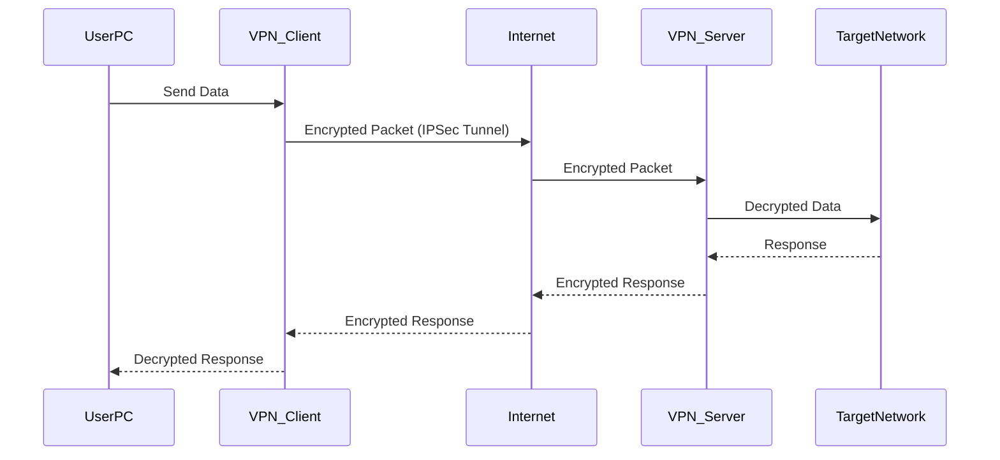

> **الهدف من الـ Section ده:**  
>هنتعرف على مفهوم VPN & Secure Tunneling كواحد من أهم تقنيات تأمين الاتصال عبر الإنترنت.

---

## VPN & Secure Tunneling
### VPN — Virtual Private Network

الـ VPN هو من أهم الـ Tools اللي بتُستخدم في الـ Cybersecurity عشان تأمن الاتصال بين شبكتين عبر الـ Internet.

#### ما هو الـ VPN؟

الـ **VPN (Virtual Private Network)** هو تقنية بتخلي جهازين أو شبكتين منفصلتين يتواصلوا مع بعض كأنهم على نفس الـ Private Network — حتى لو الاتصال بينهم بيعدي على الـ Internet العام.

```
[Office A] ──── Encrypted Tunnel (IPSec) ──── [Office B]
               over Public Internet
```

#### ليه الـ VPN مهم؟

قبل الـ VPN، الشركات كانت بتستخدم **Leased Lines** — يعني خطوط مخصصة بتربط الفروع ببعض مباشرةً. المشكلة إن:

- الـ Leased Lines كانت **بتاخد شهور عشان تتركب**
- وكانت **تكلف آلاف الدولارات شهرياً**

الـ VPN حل المشكلة دي بتكلفة أقل بكتير باستخدام الـ Internet الموجود أصلاً.

> [!IMPORTANT]
> الـ VPN مش بس للاتصال بشبكة خارجية. كتير من المنظمات بتستخدمه **داخل شبكتها الداخلية نفسها** عشان تضمن الـ Confidentiality والـ Integrity للمعلومات الحساسة جداً بين أجزاء الشبكة المختلفة.

#### إزاي بيشتغل الـ VPN؟

الـ VPN بيستخدم بروتوكول **IPSec** عشان يعمل تشفير للـ Traffic. الـ IPSec بيشتغل على الـ **Layer 3 (Network Layer)**، يعني كل الـ Traffic اللي بيعدي من خلاله بيتشفر بالكامل.



#### الـ VPN Tunnel

بعد ما الـ VPN Connection بتتأسس، **أي Application** زي الـ Email أو الـ Web Browser أو الـ FTP ممكن يستخدم الـ Tunnel دا كأن الكمبيوتر متوصل مباشرةً بالـ Local Network.

> [!TIP]
> لما تيجي تاخد الـ Sniffing على الـ Network وحد مستخدم VPN، مش هتقدر تشوف أي Data حقيقية — كل اللي هتشوفه Encrypted Traffic مش مفيد.

#### الـ VPN في الـ Wireless Networks

> [!NOTE]
> لما البيانات توصل للـ Access Point، بتتفك تشفيرها وبتتبعت على الـ Wire بـ **Plaintext**. عشان كده، الحل الأمثل هو استخدام VPN Tunnel بين الـ Access Point والشبكة المقصودة عشان يضمن **End-to-End Encryption**.

#### مقارنة: Leased Line vs VPN

| المعيار | Leased Line | VPN |
|---|---|---|
| التكلفة | آلاف الدولارات شهرياً | أقل بكتير |
| وقت الإعداد | شهور | دقائق |
| الأمان | عالي (مخصص) | عالي (مشفر) |
| المرونة | محدودة | مرنة جداً |
| الاعتماد على الإنترنت | لا | نعم |

---

## Summary

- الـ VPN بيوفر Encrypted Tunnel فوق الـ Public Internet باستخدام IPSec على الـ Layer 3
- بيحل مشكلة الـ Leased Lines الغالية والبطيئة
- حتى على الـ Wireless، الـ Data بتتفك تشفيرها عند الـ Access Point — الحل هو VPN End-to-End

