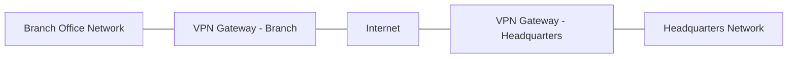
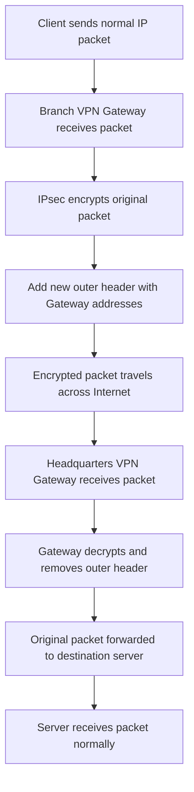

| Topic | Level | Reading Time | Prerequisites |
|---|---|---|---|
| Virtual Private Networks (VPN) | Beginner | ~15 min | Basic understanding of IP networking and the OSI/TCP-IP model |

> **الهدف من الـ Section ده:**  
> هتفهم إيه هي الـ **VPN**، إزاي بتشتغل تقنياً باستخدام **IPsec**، وليه الشركات بتعتمد عليها بدل الـ Leased Lines الغالية، وكمان هتفهم رحلة الـ Packet خطوة بخطوة من مكتب فرعي لحد الـ Headquarters.


## Learning Objectives

By the end of this section, you will be able to:

- Define what a **VPN** is and explain the business problem it solves compared to traditional leased lines.
- Identify the three core security properties a VPN provides: confidentiality, integrity, and (as we will see) authentication.
- Describe how **IPsec** operates at Layer 3 to protect IP traffic regardless of the application generating it.
- Trace the full lifecycle of a packet traveling through an IPsec VPN tunnel, from the Branch Office to the Headquarters.
- Explain typical real-world VPN use cases, including remote access, site-to-site connectivity, and internal network segmentation.

## Table of Contents

- [Learning Objectives](#learning-objectives)
- [Table of Contents](#table-of-contents)
- [What Is a VPN](#what-is-a-vpn)
- [Why Organizations Use VPNs Instead of Leased Lines](#why-organizations-use-vpns-instead-of-leased-lines)
- [The Role of IPsec in VPNs](#the-role-of-ipsec-in-vpns)
- [Security Properties Provided by a VPN](#security-properties-provided-by-a-vpn)
- [VPN Deployment Scenarios](#vpn-deployment-scenarios)
- [How a VPN Tunnel Works: Step-by-Step Packet Flow](#how-a-vpn-tunnel-works-step-by-step-packet-flow)
- [Encapsulation Explained Visually](#encapsulation-explained-visually)
- [VPN and Cybersecurity Career Paths](#vpn-and-cybersecurity-career-paths)
- [Key Terms Glossary](#key-terms-glossary)
- [Summary](#summary)

## What Is a VPN

**VPN** (Virtual Private Network) هي تقنية بتعمل اتصال آمن (secure connection) بين شبكتين خاصتين (private networks) عن طريق شبكة عامة زي الإنترنت. بدل ما الشركة تمد كابل فيزيقي مخصص بين مكتبين، الـ VPN بيعمل *virtual tunnel* بين الطرفين، وكأنهم متوصلين ببعض بخط خاص مباشر (direct private link)، مع إن البيانات فعلياً بتعدي على شبكة عامة غير موثوقة.

الفكرة الأساسية إن الـ VPN مش بيغير الشبكة الفيزيقية، هو بيعمل طبقة منطقية (logical layer) فوق البنية التحتية الموجودة، وده اللي بيخلي الحل ده مرن واقتصادي جداً مقارنة بالحلول التقليدية.

> [!NOTE]
> كلمة "Virtual" هنا معناها إن الاتصال مش موجود فيزيقياً كخط مخصص، لكنه بيتصرف منطقياً وكأنه خط خاص، بينما "Private" معناها إن البيانات محمية ومش متاحة لأي حد تاني بيستخدم نفس الشبكة العامة.

## Why Organizations Use VPNs Instead of Leased Lines

قبل ظهور الـ VPNs، لو شركة عايزة تربط فرعين ببعض بشكل آمن، كانت بتلجأ لـ **Leased Line**: خط اتصال مخصص (dedicated circuit) بتأجره من مزود خدمة. الحل ده كان بيواجه مشكلتين رئيسيتين:

- **الوقت**: تركيب Leased Line ممكن ياخد شهور لحد ما يتفعل بالكامل.
- **التكلفة**: بيكلف آلاف الدولارات شهرياً، وده عبء مالي كبير خصوصاً لو الشركة عايزة تربط أكتر من فرع.

الـ VPN حل المشكلتين دول لأنه بيستخدم اتصال الإنترنت الموجود بالفعل (existing Internet connection) بدل ما تدفع في بنية تحتية مخصصة جديدة. النتيجة إن الشركات قدرت تربط الفروع، الـ Business Partners، والمستخدمين البعيدين (remote users) بسرعة وبتكلفة أقل بكتير، مع الحفاظ على نفس مستوى الأمان تقريباً.

| Criterion | Leased Line | VPN |
|---|---|---|
| Deployment Time | Weeks to months | Minutes to hours |
| Cost | Thousands of dollars per month | Uses existing Internet connection |
| Infrastructure | Dedicated physical circuit | Logical tunnel over public network |
| Scalability | Limited, requires new circuits | Easily scalable across sites |
| Security Model | Physical isolation | Cryptographic protection (encryption/integrity) |

> [!IMPORTANT]
> الـ VPN مش بيلغي الحاجة للأمان، هو بينقل مسؤولية الحماية من العزل الفيزيقي (physical isolation) للتشفير (encryption). يعني الأمان بقى معتمد على قوة الخوارزميات المستخدمة وصحة الإعدادات، مش على إن الخط مخصص فيزيقياً.

## The Role of IPsec in VPNs

الأغلبية العظمى من الـ VPNs بتعتمد على بروتوكول اسمه **IPsec** (Internet Protocol Security). الـ IPsec بيشتغل على **Layer 3** من نموذج الـ OSI، يعني بيحمي الـ IP traffic نفسه بغض النظر عن نوع التطبيق اللي منتج البيانات دي.

ده بيدينا ميزة مهمة جداً: أي بروتوكول أو تطبيق شغال فوق IP — زي **email**, **web browsing (HTTP/HTTPS)**, **FTP**, أو **instant messaging** — ممكن يستخدم نفس الـ VPN tunnel من غير أي تعديل على التطبيق نفسه. التشفير والحماية بيحصلوا على مستوى الـ Network Layer، مش على مستوى كل تطبيق لوحده.

```bash
# Example: checking active IPsec Security Associations on a Linux gateway
ipsec status
```

```bash
# Example: viewing configured IPsec tunnels (strongSwan)
sudo ipsec statusall
```

> [!TIP]
> لو انت شغال في مجال الـ Networking أو الـ Security، هتلاقي إن فهم الـ IPsec أساسي جداً، لأنه مش بس بيتستخدم في الـ VPNs التقليدية، لكن كمان في حماية الاتصالات الداخلية الحساسة جوه الشركة نفسها.

## Security Properties Provided by a VPN

الـ VPN مش بس بيوصل شبكتين ببعض، هو بيوفر مجموعة خصائص أمنية أساسية:

- **Confidentiality (السرية)**: البيانات بتتشفر قبل ما تعدي على الشبكة العامة، وده بيمنع أي حد بيراقب حركة الشبكة (sniffing/eavesdropping) من فهم محتوى البيانات الحقيقي.
- **Integrity (التكامل)**: الـ VPN بيضمن إن البيانات ما اتغيرتش أثناء انتقالها عبر الشبكة، فلو حد حاول يعدل في الـ packet وهو ماشي، الطرف التاني هيقدر يكتشف كده.
- **Authentication (التوثيق)**: الأطراف المشاركة في الـ VPN بتتأكد من هوية بعضها قبل ما التبادل الفعلي للبيانات يبدأ.

> [!WARNING]
> خطأ شائع إن الناس بتفتكر VPN = Anonymity الكاملة. في الحقيقة، الـ VPN بيحمي البيانات *أثناء انتقالها* بين الطرفين، لكنه مش بالضرورة بيخفي هويتك بشكل كامل، خصوصاً لو الـ VPN provider نفسه بيحتفظ بسجلات (logs).

## VPN Deployment Scenarios

مش كل استخدامات الـ VPN واحدة. أشهر السيناريوهات هي:

- **Site-to-Site VPN**: بيربط شبكتين خاصتين ببعض، زي الاتصال بين مكتب فرعي (Branch Office) ومقر الشركة الرئيسي (Headquarters).
- **Remote Access VPN**: بيسمح لمستخدم بعيد (remote user) إنه يتصل بشبكة الشركة الداخلية بأمان من أي مكان.
- **Internal / Intra-organization VPN**: بيتستخدم جوه الشركة نفسها لحماية الاتصالات شديدة الحساسية بين أقسام مختلفة من الشبكة الداخلية، حتى لو الشبكة دي مش متصلة بالإنترنت العام مباشرة.

> [!NOTE]
> استخدام الـ VPN جوه الشبكة الداخلية نفسها (وليس بس عبر الإنترنت) بيوضح إن الهدف مش بس "عبور الإنترنت بأمان"، لكن أيضاً تطبيق مبدأ **Defense in Depth** بحماية الاتصالات الحساسة حتى داخل الشبكة الموثوقة نسبياً.

## How a VPN Tunnel Works: Step-by-Step Packet Flow

عشان نفهم الـ VPN بعمق، لازم نتتبع رحلة الـ packet خطوة بخطوة، من لحظة ما بيتبعت من جهاز في الـ Branch Office، لحد ما بيوصل السيرفر في الـ Headquarters:

1. جهاز في الـ **Branch Office** بيبعت **normal IP packet** لسيرفر موجود في شبكة الـ **Headquarters**.
2. الـ Packet بيوصل الأول لـ **VPN Gateway** الخاص بالـ Branch Office.
3. الـ VPN Gateway بياخد الـ Original IP Packet بالكامل ويعمله **encapsulation** جوه IP Packet تاني.
4. بروتوكول **IPsec** بيشفر الـ Packet الأصلي، فأي حد بيراقب حركة الإنترنت مش هيقدر يشوف محتوى البيانات أو تفاصيل الاتصال الداخلي.
5. بيتضاف **Outer Header** جديد فيه عناوين الـ VPN Gateways بتوع الطرفين، عشان الـ Packet المشفر يقدر يتنقل عبر الإنترنت.
6. الـ Packet بيسافر عبر الإنترنت كـ **encrypted IPsec packet**، والـ Routers العادية بس بتعمل forward ليه من غير ما تفهم محتواه.
7. لما الـ Packet يوصل لـ **Headquarters VPN Gateway**، الـ Gateway بيفك التشفير (decrypt) ويشيل الـ Outer Encapsulation.
8. الـ **Original IP Packet** بيترجع لشكله الطبيعي وبيتبعت (forward) للسيرفر المستهدف جوه شبكة الـ Headquarters.
9. السيرفر بيستقبل الـ Packet بشكل طبيعي تماماً، من غير ما يحتاج يعرف إن الاتصال أصلاً عدى عبر VPN Tunnel.

> [!IMPORTANT]
> النقطة الأهم هنا إن كل الـ Encapsulation والتشفير بيحصل على مستوى الـ Gateways بس. الأجهزة الطرفية (Branch computer والـ Server) مش بتحتاج أي إعداد إضافي، وده اللي بيخلي الحل شفاف (transparent) بالنسبة للتطبيقات.

## Encapsulation Explained Visually

الدايجرام الأول بيوضح البنية العامة للاتصال بين الـ Branch Office والـ Headquarters عبر الإنترنت:


```mermaid
graph LR
    A[Branch Office Network] --- B[VPN Gateway - Branch]
    B --- C[Internet]
    C --- D[VPN Gateway - Headquarters]
    D --- E[Headquarters Network]
```

الدايجرام الثاني بيوضح خطوات معالجة الـ Packet نفسه، من لحظة إرساله لحد وصوله للسيرفر النهائي:


```mermaid
flowchart TD
    Start[Client sends normal IP packet] --> G1[Branch VPN Gateway receives packet]
    G1 --> Enc[IPsec encrypts original packet]
    Enc --> Wrap[Add new outer header with Gateway addresses]
    Wrap --> Travel[Encrypted packet travels across Internet]
    Travel --> G2[Headquarters VPN Gateway receives packet]
    G2 --> Dec[Gateway decrypts and removes outer header]
    Dec --> Deliver[Original packet forwarded to destination server]
    Deliver --> ServerReceive[Server receives packet normally]
```

> [!TIP]
> لما تشرح الـ Encapsulation لأي حد جديد في المجال، استخدم تشبيه الظرف جوه ظرف: الـ Original Packet هو "الخطاب"، وIPsec بيحطه جوه "ظرف مقفول ومشفر"، وبعدين بيتحط جوه "ظرف تاني" مكتوب عليه بس عنوان الـ Gateways عشان البريد (الإنترنت) يعرف يوصله، من غير ما يعرف محتوى الخطاب الأصلي.

## VPN and Cybersecurity Career Paths

فهم الـ VPN مش بس مهم كمفهوم نظري، ده أساس في أكتر من مسار مهني في الأمن السيبراني:

- **SOC (Security Operations Center)**: محلل الـ SOC ممكن يحتاج يراقب VPN logs عشان يكتشف محاولات دخول غير مصرح بيها أو Sessions غير طبيعية.
- **Penetration Testing**: الـ Pentester ممكن يفحص إعدادات الـ VPN Gateway نفسها بحثاً عن ثغرات في التشفير أو الإعدادات الضعيفة.
- **Cloud Security**: معظم الـ Cloud Providers بيقدموا خدمات زي **Site-to-Site VPN** للربط بين الـ On-premises Infrastructure والـ Cloud Environment بأمان.
- **GRC (Governance, Risk, and Compliance)**: التأكد من إن سياسات استخدام الـ VPN متوافقة مع معايير الأمان والامتثال التنظيمي (compliance standards) زي ISO 27001.

## Key Terms Glossary

| Term | Definition |
|---|---|
| VPN (Virtual Private Network) | تقنية بتعمل اتصال منطقي آمن بين شبكتين خاصتين عبر شبكة عامة زي الإنترنت. |
| IPsec | مجموعة بروتوكولات بتعمل على Layer 3 لتشفير وحماية حركة الـ IP Traffic. |
| Leased Line | خط اتصال فيزيقي مخصص بيتأجر من مزود خدمة، بديل تقليدي وأغلى للـ VPN. |
| Encapsulation | عملية وضع الـ Packet الأصلي جوه Packet تاني له Header خارجي مختلف. |
| VPN Gateway | الجهاز أو الخدمة المسؤولة عن إنشاء وإدارة الـ VPN Tunnel من طرفي الاتصال. |
| Confidentiality | خاصية أمنية بتضمن إن البيانات متشفرة ومش مقروءة لأي طرف غير مصرح له. |
| Integrity | خاصية أمنية بتضمن إن البيانات ما اتغيرتش أثناء انتقالها عبر الشبكة. |
| Site-to-Site VPN | نوع من الـ VPN بيربط شبكتين خاصتين ببعض، زي فرع ومقر رئيسي. |
| Remote Access VPN | نوع من الـ VPN بيسمح لمستخدم فردي بالاتصال الآمن بشبكة الشركة عن بعد. |

## Summary

- الـ **VPN** بيوفر اتصال آمن ومنطقي بين شبكتين خاصتين عبر شبكة عامة، بدون الحاجة لـ Leased Line مكلفة وبطيئة في التركيب.
- الـ VPNs غالباً بتعتمد على **IPsec**، اللي بيشتغل على Layer 3 وبيحمي أي نوع Traffic فوق IP، سواء email أو web أو FTP، من غير ما يحتاج تعديل في التطبيقات نفسها.
- الخصائص الأمنية الأساسية اللي الـ VPN بيوفرها هي **Confidentiality**، **Integrity**، وكمان **Authentication** بين الأطراف.
- الـ VPN مش بس حل لعبور الإنترنت بأمان، لكن كمان بيتستخدم داخلياً لحماية الاتصالات الحساسة جوه الشركة نفسها.
- رحلة الـ Packet في الـ VPN Tunnel بتمر بمراحل واضحة: استقبال، تشفير، Encapsulation، عبور الإنترنت، فك تشفير، ثم تسليم للـ Server النهائي بشكل طبيعي.
- فهم الـ VPN أساسي لمسارات مهنية متعددة زي **SOC**، **Penetration Testing**، **Cloud Security**، و**GRC**.

