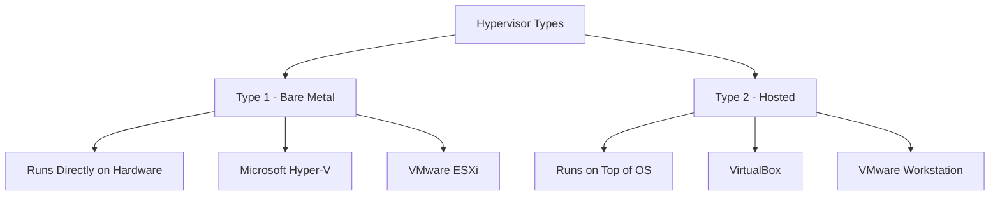
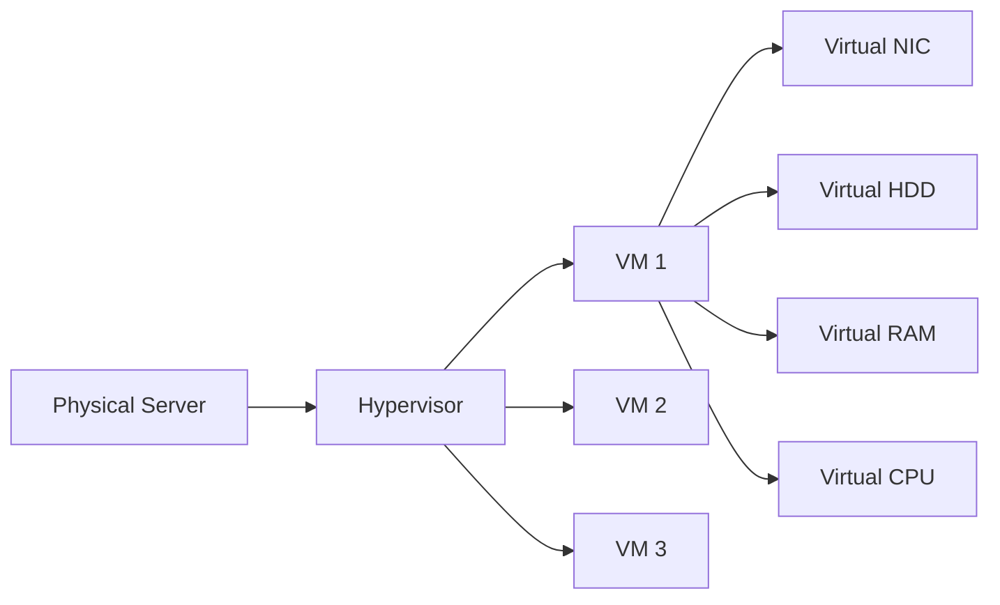
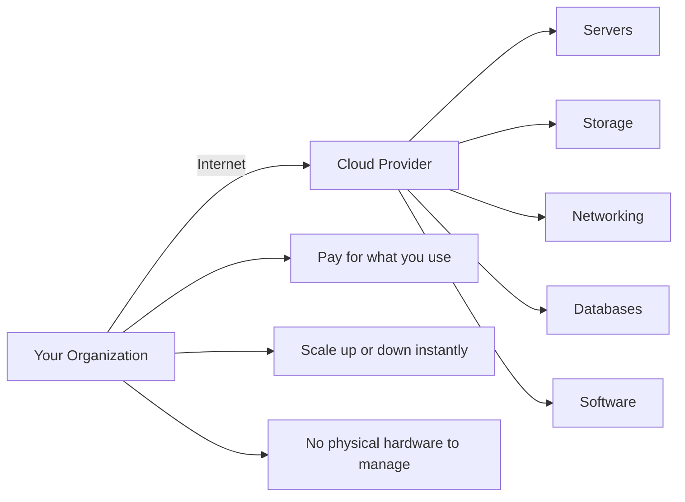
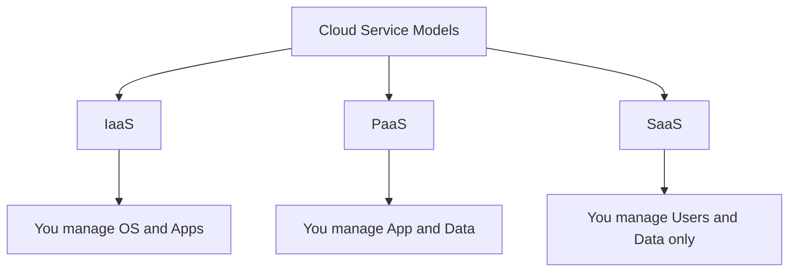
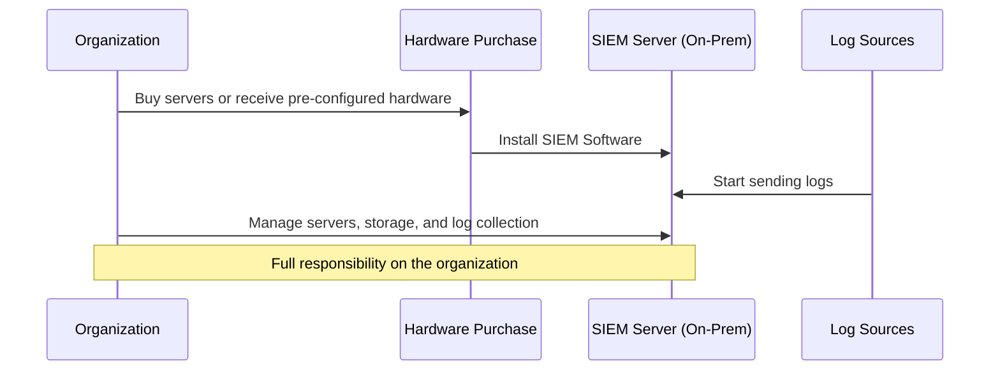
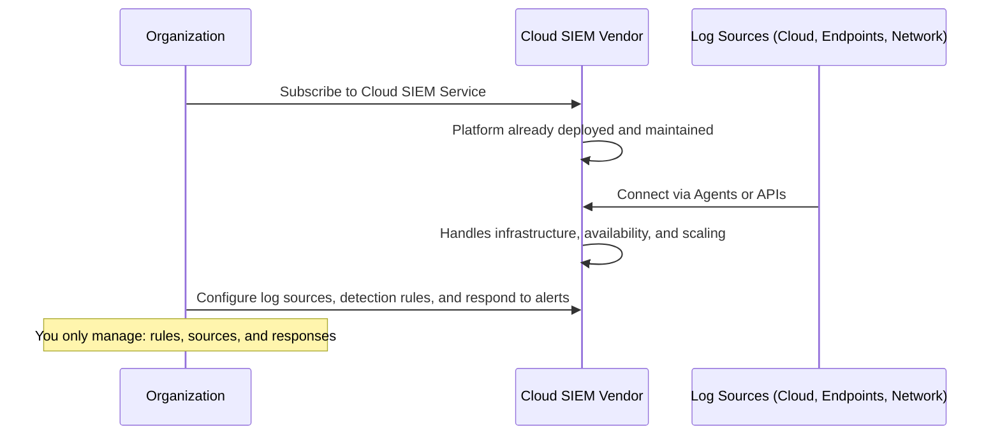

> **الهدف من الـ Section ده:**  
> هتفهم ببساطة يعني إيه Virtualization وCloud، وإزاي تشغّل أكتر من سيستم على جهاز واحد، وإيه الفرق بين IaaS وPaaS وSaaS — وكمان إزاي الشركات بتستخدم الـ Cloud في الأمن السيبراني بدل ما تدير كل حاجة بنفسها.

---
## Table of Contents

- [Virtualization](#virtualization)
- [Cloud Computing](#cloud-computing)
- [Cloud Service Models: IaaS, PaaS, SaaS](#cloud-service-models-iaas-paas-saas)
- [Cloud-based Cybersecurity Solutions](#cloud-based-cybersecurity-solutions)
- [Summary](#summary)

---

## Virtualization

### إيه هي الـ Virtualization؟

**Virtualization** هي التكنولوجيا اللي بتخليك تشغّل **أكتر من Virtual Machine (VM) على جهاز فيزيائي واحد** — وكل VM بتتصرف كأنها Computer مستقل تماماً بكل حاجة.

تخيل عندك جهاز واحد قوي — بدل ما تحط عليه System واحد، بتعمل 5 أجهزة افتراضية، كل واحدة بـ OS خاص بها وذاكرة خاصة وـ Network Card خاصة.

### الـ Hypervisor — العقل المدبر

الـ **Hypervisor** هو البرنامج أو الـ Layer اللي بيدير الـ Virtual Machines ويخلي الـ Virtualization ممكنة.

في نوعين من الـ Hypervisors:

### الفرق بين الـ Type 1 والـ Type 2

| | **Type 1 (Bare Metal)** | **Type 2 (Hosted)** |
|---|---|---|
| **يشتغل على** | Hardware مباشرة | فوق Operating System |
| **الأداء** | أعلى وأسرع | أبطأ نسبياً |
| **الاستخدام** | Data Centers, Enterprise | Development, Testing, Personal |
| **أمثلة** | Hyper-V, VMware ESXi | VirtualBox, VMware Workstation |

### الـ Hardware الـ Virtualized

كل VM بتشوف بـ Hardware افتراضي خاص بيها:

> [!NOTE]
> كل الـ Hardware ده **وهمي (Virtualized)** — مفيش NIC حقيقي أو HDD حقيقي للـ VM. الـ Hypervisor بيعمل Simulation كاملة للـ Hardware الفيزيائي ويقسمه على الـ VMs.

> [!TIP]
> الـ Virtualization بتوفر على المؤسسات فلوس كتير — بدل ما تشتري 10 Servers، تشتري Server واحد قوي وتشغّل 10 VMs عليه.

---

## Cloud Computing

### إيه هو الـ Cloud Computing؟

**Cloud Computing** هو توصيل موارد الحوسبة عبر الإنترنت — Servers، Storage، Networking، Databases، وSoftware — **On Demand وAt Scale** من غير ما تمتلك الـ Infrastructure الفيزيائية.

ببساطة: بدل ما تشتري وتدير Servers بنفسك، بتأجر ما تحتاجه من Cloud Provider زي AWS أو Azure أو Google Cloud.

### ليه الـ Cloud؟

| **On-Premises (Traditional)** | **Cloud** |
|---|---|
| تشتري الـ Hardware بنفسك | تأجر ما تحتاجه |
| تدير كل حاجة بنفسك | الـ Provider بيدير الـ Infrastructure |
| الـ Capacity ثابتة | Scale فوري حسب الحاجة |
| تكلفة رأسمالية كبيرة (CapEx) | تكلفة تشغيلية (OpEx) |
| وقت طويل للـ Setup | Ready في دقائق |

---

## Cloud Service Models: IaaS, PaaS, SaaS

الـ Cloud جه بثلاث Models مختلفة — كل Model بيحدد **إيه اللي بتديره أنت وإيه اللي بيديره الـ Provider**.

IaaS — Infrastructure as a Service

الـ Provider بيديلك الـ Infrastructure الأساسية، وأنت بتدير كل حاجة فوقيها.

**أنت بتدير:**
- Operating System
- Patching
- Applications
- Security Configurations

**الـ Provider بيدير:**
- Hardware
- Hypervisor
- Physical Data Center

> مثال: AWS EC2 — بتاخد Virtual Machine وبتدير عليها الـ OS والـ Applications بنفسك.

### PaaS — Platform as a Service

الـ Provider بيديلك Platform جاهزة للـ Development، وأنت بس تركز على الـ Code والـ Data.

**أنت بتدير:**
- Application Code
- Data

**الـ Provider بيدير:**
- OS
- Runtime Environment
- Middleware
- Patching

> مثال: Heroku, Google App Engine — بتـ Deploy الـ App بتاعتك من غير ما تهتم بالـ Server.

### SaaS — Software as a Service

أنت بس بتستخدم الـ Software — الـ Provider بيدير كل حاجة.

**أنت بتدير:**
- Users
- Data Usage

**الـ Provider بيدير:**
- Everything else

> مثال: Microsoft 365, Gmail, Salesforce — بتفتحه من المتصفح وبس.

### مقارنة شاملة

| | **IaaS** | **PaaS** | **SaaS** |
|---|---|---|---|
| **Control** | أعلى | متوسط | أقل |
| **Flexibility** | أعلى | متوسط | أقل |
| **Management Overhead** | أكبر | متوسط | أصغر |
| **Best For** | DevOps, Sysadmins | Developers | End Users |
| **Examples** | AWS EC2, Azure VM | Heroku, App Engine | Microsoft 365, Gmail |

> [!IMPORTANT]
> الـ SaaS هو الأغلى من ناحية الـ Subscription لكن الأسهل في الإدارة — لأن الـ Provider بيتحمل كل مسؤولية الـ Infrastructure والـ Security والـ Updates.

---

## Cloud-based Cybersecurity Solutions

### مثال: الـ SIEM On-Premises vs Cloud

سنستخدم الـ **SIEM (Security Information and Event Management)** كمثال لتوضيح الفرق بين الـ Deployment Models.

### الـ SIEM On-Premises (التقليدي)

**خطوات الـ On-Premises SIEM:**
1. شراء الـ Hardware اللازم أو استلام Servers مثبت عليها الـ Software من الـ Vendor
2. بعد إعداد الـ Servers، تبدأ في تجميع الـ Logs من مختلف الـ Sources
3. أنت مسؤول عن إدارة الـ Servers وتجميع الـ Logs وتخزينها

### الـ Cloud-based SIEM

**خطوات الـ Cloud SIEM:**
1. الاشتراك في خدمة SIEM من الـ Vendor من غير شراء أي Hardware
2. الـ Platform موجودة ومتصانة بالفعل من الـ Provider
3. ربط الـ Log Sources (Cloud Services, Endpoints, Network Devices) عبر Agents أو APIs
4. الـ Cloud Provider مسؤول عن الـ Infrastructure والـ Availability والـ Scaling
5. أنت مسؤول بس عن إعداد الـ Log Sources وقواعد الـ Detection والـ Response

### مقارنة: On-Premises SIEM vs Cloud SIEM

| | **On-Premises SIEM** | **Cloud-based SIEM** |
|---|---|---|
| **Hardware** | تشتريه أنت | الـ Provider بيديره |
| **Setup Time** | أسابيع أو أشهر | ساعات أو أيام |
| **Maintenance** | مسؤوليتك | مسؤولية الـ Provider |
| **Scaling** | بيحتاج شراء Hardware جديد | فوري وأوتوماتيكي |
| **Cost Model** | CapEx (تكلفة رأسمالية) | OpEx (اشتراك شهري/سنوي) |
| **Control** | أعلى | أقل (تعتمد على الـ Provider) |
| **Your Responsibility** | كل حاجة | Rules, Sources, Response |

> [!NOTE]
> الـ Cloud-based SIEM مش معناه إنك مش مسؤول عن الـ Security — أنت لسه مسؤول عن إعداد قواعد الـ Detection وربط الـ Log Sources والـ Response على الـ Incidents.

> [!TIP]
> للشركات الصغيرة والمتوسطة، الـ Cloud SIEM أوفر وأسرع في الـ Deployment. للشركات الكبيرة اللي عندها Data Sensitivity عالية أو Compliance Requirements خاصة، ممكن الـ On-Premises يكون أنسب.

---

## Summary

**Virtualization:**
- تشغيل أكتر من VM على Hardware واحد باستخدام Hypervisor
- Type 1 (Bare Metal): للـ Enterprise والـ Data Centers
- Type 2 (Hosted): للـ Development والاستخدام الشخصي

**Cloud Computing:**
- توصيل موارد IT عبر الإنترنت On Demand بدون ملكية Hardware
- 3 Models: IaaS (أعلى Control) → PaaS (للـ Developers) → SaaS (أسهل استخدام)

**Cloud-based Cybersecurity:**
- الـ Cloud SIEM أسرع في الـ Deployment وأقل في الـ Maintenance
- الـ Provider مسؤول عن الـ Infrastructure — أنت مسؤول عن الـ Rules والـ Response
- الاختيار بين On-Premises وCloud بيعتمد على حجم الشركة والـ Compliance Requirements
