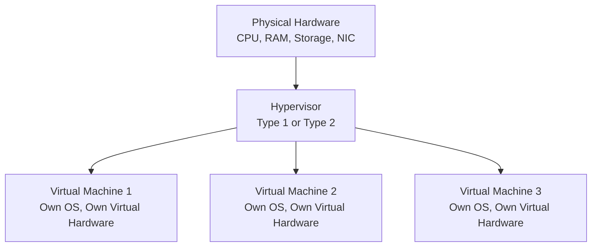
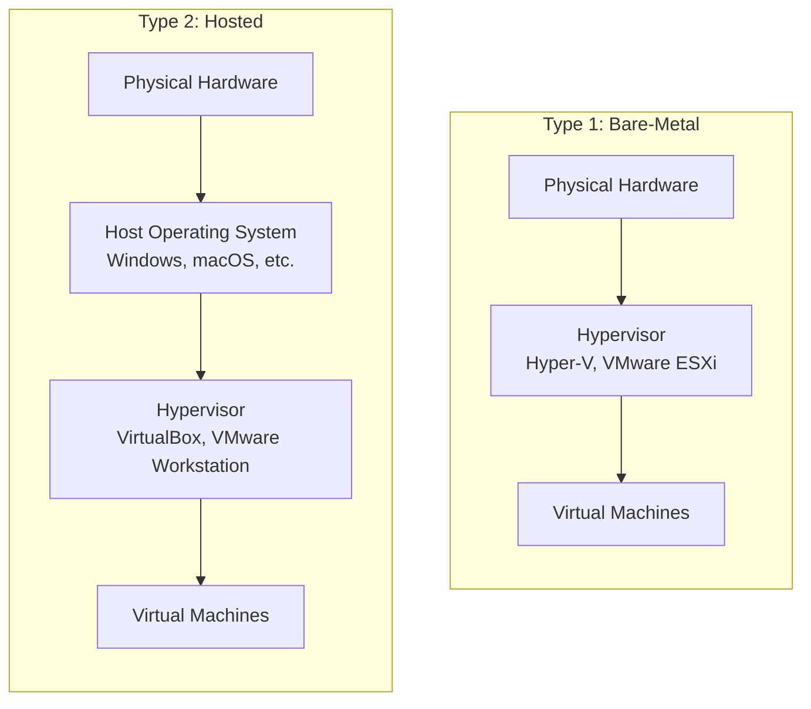

| Topic | Level | Reading Time | Prerequisites |
|---|---|---|---|
| Virtualization | Beginner | ~14 min | Basic understanding of computer hardware components (CPU, RAM, storage, network) |

> **الهدف من الـ Section ده:**  
>  هتفهم إزاي جهاز فيزيائي واحد يقدر "يتقسّم" لعدة أجهزة مستقلة تمامًا عن بعض، وهتتعرف على مفهوم الـ Hypervisor ونوعيه، وهتشوف ليه المفهوم ده هو الأساس اللي بُني عليه الـ Cloud Computing بالكامل.

## Learning Objectives

By the end of this section, you will be able to:

- Define **Virtualization** and explain what a **Virtual Machine (VM)** is.
- Explain the role of the **Hypervisor** in making virtualization possible.
- Distinguish between **Type 1 (Bare-Metal)** and **Type 2 (Hosted)** hypervisors, with real examples of each.
- Explain why the hardware seen by a VM is not physically real, and how the hypervisor manages actual physical resources behind the scenes.
- Explain why virtualization is considered foundational to modern IT infrastructure and cloud computing.

## Table of Contents

- [Virtualization: Running Multiple Computers on One Machine](#virtualization-running-multiple-computers-on-one-machine)
- [The Hypervisor](#the-hypervisor)
- [Type 1 vs. Type 2 Hypervisors](#type-1-vs-type-2-hypervisors)
- [Virtual Hardware: It's All Fake, But It Works](#virtual-hardware-its-all-fake-but-it-works)
- [Foundational to Modern IT](#foundational-to-modern-it)
- [Virtualization Architecture Diagram](#virtualization-architecture-diagram)
- [Career Connection](#career-connection)
- [Key Terms Glossary](#key-terms-glossary)
- [Summary](#summary)

## Virtualization: Running Multiple Computers on One Machine

**Virtualization** هي تقنية بتسمحلك تشغّل عدة **أجهزة افتراضية (Virtual Machines - VMs)** على كمبيوتر فيزيائي واحد بس، بحيث كل VM بيتصرف كأنه جهاز مستقل تمامًا بذاته، بنظام تشغيل، تخزين، وهاردوير خاص بيه (افتراضيًا).

## The Hypervisor

ده بيتحقق عن طريق قطعة سوفتوير اسمها **Hypervisor**.

من أشهر أمثلة الـ Hypervisors: **VMware** و **VirtualBox**.

## Type 1 vs. Type 2 Hypervisors

فيه نوعين أساسيين من الـ Hypervisors:

| النوع | الوصف | أمثلة | الاستخدام الشائع |
|---|---|---|---|
| **Bare-Metal Hypervisors (Type 1)** | بيتثبت مباشرة على الهاردوير الفيزيائي، من غير الحاجة لنظام تشغيل مضيف (**host OS**) تحته | Microsoft Hyper-V، VMware ESXi | بيئات المؤسسات ومراكز البيانات (**data centers**)، لأنها أكفأ وعبء تشغيلي (**overhead**) أقل |
| **Hosted Hypervisors (Type 2)** | بيتثبت فوق نظام تشغيل موجود بالفعل، زي أي تطبيق عادي | VirtualBox، VMware Workstation | شائعة على أجهزة الكمبيوتر الشخصية للاختبار أو تشغيل نظام تشغيل تاني جنب نظامك الأساسي |

> [!TIP]
> فكّر في الفرق كده: الـ **Type 1** هو نظام تشغيل مستقل بذاته مخصص فقط لإدارة الأجهزة الافتراضية (زي إنه هو نفسه "نظام التشغيل" بتاع السيرفر)، بينما الـ **Type 2** هو مجرد برنامج بتشغّله جوه نظام تشغيل عادي إنت أصلًا مستخدمه (زي Windows أو macOS).

## Virtual Hardware: It's All Fake, But It Works

كل جهاز افتراضي، لما تبص على إعداداته، بيبان وكأن عنده هاردوير مخصص بتاعه، كارت شبكة (**NIC**)، كارت شاشة، قرص صلب، ذاكرة، وهكذا.

في الواقع، **مفيش أي حاجة من الهاردوير ده موجودة فعليًا فيزيائيًا** لنفس الـ VM ده بالتحديد، هو بالكامل مُحاكى (**virtualized/emulated**) من طرف سوفتوير الـ Hypervisor، اللي بيقسّم ويوزّع أجزاء من موارد الهاردوير الفيزيائي الحقيقي بين كل الـ VMs الشغالة على نفس الجهاز المضيف (**host**).

> [!IMPORTANT]
> ده بالظبط اللي بيسمح لعدة VMs إنهم يشتغلوا بشكل مستقل على نفس الجهاز الفيزيائي، كل واحد فيهم مقتنع إن عنده مجموعة كاملة من الهاردوير الخاص بيه، بينما الـ Hypervisor بيدير الموارد الفيزيائية الحقيقية اللي تحته وراء الكواليس.

## Foundational to Modern IT

المفهوم ده أساسي جدًا لبنية الـ IT الحديثة، لأنه بيمكّن حاجات زي:

- **Server Consolidation**: تشغيل عدد كبير من السيرفرات الافتراضية على عدد أقل من الأجهزة الفيزيائية.
- **بيئات اختبار معزولة (Isolated Testing Environments)**.
- وزي ما هنشوف بعد كده، **الـ Cloud Computing نفسه**.

## Virtualization Architecture Diagram

المخطط التالي بيوضح إزاي عدة VMs بتشتغل على نفس الجهاز الفيزيائي عن طريق الـ Hypervisor:

والمخطط التالي بيوضح الفرق بين موقع الـ Hypervisor في النوعين:

## Career Connection

فهم الـ Virtualization له تطبيقات مباشرة في مسارات مهنية متعددة:

- في مجال **Cloud Security**، فهم الـ Hypervisor أساسي لأنه الطبقة اللي بُني عليها الـ Cloud Computing بالكامل.
- في مجال **Pentesting**، توزيعات زي Kali Linux غالبًا بتُشغّل جوه VM عن طريق Type 2 hypervisor عشان بيئة اختبار معزولة وآمنة.
- في مجال **Malware Analysis**، الـ VMs بتُستخدم كبيئات معزولة (شبيهة بمفهوم الـ Sandbox اللي درسناه قبل كده) لتحليل ملفات مشبوهة من غير خطر على النظام الحقيقي.
- في مجال **System Administration**، إدارة الـ Server Consolidation عن طريق Type 1 hypervisors جزء أساسي من تصميم بنية تحتية فعالة من ناحية التكلفة.

## Key Terms Glossary

| Term | Definition |
|---|---|
| **Virtualization** | تقنية تسمح بتشغيل عدة أجهزة افتراضية مستقلة على جهاز فيزيائي واحد. |
| **Virtual Machine (VM)** | جهاز افتراضي يتصرف كجهاز مستقل بذاته، بنظام تشغيل وموارد خاصة به. |
| **Hypervisor** | سوفتوير مسؤول عن إنشاء وإدارة الأجهزة الافتراضية وتوزيع موارد الهاردوير الفيزيائي عليها. |
| **Type 1 Hypervisor (Bare-Metal)** | يُثبت مباشرة على الهاردوير الفيزيائي دون الحاجة لنظام تشغيل مضيف. |
| **Type 2 Hypervisor (Hosted)** | يُثبت فوق نظام تشغيل موجود بالفعل، كأي تطبيق عادي. |
| **Host** | الجهاز الفيزيائي الذي يشغّل الـ Hypervisor والأجهزة الافتراضية. |
| **Server Consolidation** | تشغيل عدد كبير من السيرفرات الافتراضية على عدد أقل من الأجهزة الفيزيائية. |

## Summary

- **Virtualization** بتسمح بتشغيل عدة **Virtual Machines** على جهاز فيزيائي واحد، وكل VM بيتصرف كجهاز مستقل تمامًا.
- ده بيتحقق عن طريق سوفتوير اسمه **Hypervisor**، من أشهر أمثلته VMware وVirtualBox.
- فيه نوعين: **Type 1 (Bare-Metal)** بيتثبت مباشرة على الهاردوير ومستخدم في بيئات المؤسسات (زي Hyper-V وESXi)، و **Type 2 (Hosted)** بيتثبت فوق نظام تشغيل موجود ومستخدم على الأجهزة الشخصية (زي VirtualBox).
- الهاردوير اللي كل VM بيشوفه (كارت شبكة، كارت شاشة، إلخ) **مش موجود فعليًا**، هو محاكى بالكامل من طرف الـ Hypervisor اللي بيوزّع الموارد الفيزيائية الحقيقية بين كل الـ VMs.
- المفهوم ده أساسي للـ IT الحديثة، وبيمكّن Server Consolidation، بيئات اختبار معزولة، وهو الأساس اللي بُني عليه الـ Cloud Computing.

