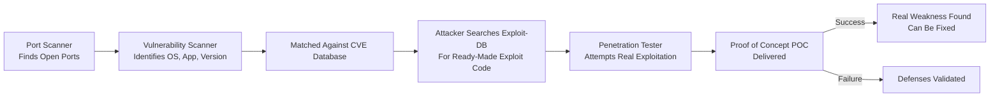

| Topic | Level | Reading Time | Prerequisites |
|---|---|---|---|
| Vulnerability Scanning, Penetration Testing, Honeypots, and Sandboxes | Intermediate | ~24 min | Basic understanding of port scanning, CVEs, firewalls, IDS/IPS, and the DMZ |

> **الهدف من الـ Section ده:**  
> هتفهم إزاي الرحلة بتكمل من مجرد اكتشاف بورت مفتوح لحد إثبات إن الثغرة دي فعليًا قابلة للاستغلال، وهتشوف الفرق بين الفحص الآلي (Vulnerability Scanning) والاختبار البشري الفعلي (Penetration Testing)، وأخيرًا هتتعرف على فخين ذكيين: الـ Honeypot والـ Sandbox.

## Learning Objectives

By the end of this section, you will be able to:

- Explain how a **Vulnerability Scanner** goes a step beyond a port scanner to identify exploitable weaknesses.
- Define **CVE** and explain how it relates to public exploit databases like Exploit-DB.
- List popular vulnerability scanning tools used by both attackers and defenders.
- Explain what **Penetration Testing** is and how it differs from an automated vulnerability scan.
- Interpret both possible outcomes of a pentest engagement, and distinguish **Red Team** from **Blue Team**.
- Define a **Honeypot** and explain why any connection to it is inherently suspicious.
- Define a **Sandbox** and explain how it safely analyzes suspicious files and malware.

## Table of Contents

- [Vulnerability Scanners: From Open Port to Exploitable Weakness](#vulnerability-scanners-from-open-port-to-exploitable-weakness)
- [The Process, Step by Step](#the-process-step-by-step)
- [Understanding CVE](#understanding-cve)
- [From CVE to Exploit-DB](#from-cve-to-exploit-db)
- [Popular Vulnerability Scanning Tools](#popular-vulnerability-scanning-tools)
- [Penetration Testing: Hiring Someone to Try to Break In](#penetration-testing-hiring-someone-to-try-to-break-in)
- [How Pentesting Differs From a Vulnerability Scan](#how-pentesting-differs-from-a-vulnerability-scan)
- [The Proof of Concept (POC)](#the-proof-of-concept-poc)
- [Two Possible Outcomes](#two-possible-outcomes)
- [Red Team vs. Blue Team](#red-team-vs-blue-team)
- [Honeypots: The Decoy That Catches Attackers](#honeypots-the-decoy-that-catches-attackers)
- [Why the Honeypot Is Made to Look Vulnerable](#why-the-honeypot-is-made-to-look-vulnerable)
- [The Critical Rule: No Legitimate Reason to Connect](#the-critical-rule-no-legitimate-reason-to-connect)
- [Real-World Value of Honeypots](#real-world-value-of-honeypots)
- [Sandbox: A Safe Room for Suspicious Files](#sandbox-a-safe-room-for-suspicious-files)
- [Assessment Pipeline Diagram](#assessment-pipeline-diagram)
- [Career Connection](#career-connection)
- [Key Terms Glossary](#key-terms-glossary)
- [Summary](#summary)

## Vulnerability Scanners: From Open Port to Exploitable Weakness

**Vulnerability Scanner** بيكمل من حيث ما وقف الـ **port scanner**.

هو مش بس بيلاقي بورتات مفتوحة، هو بيروح خطوة أبعد عشان يحدد بالظبط إيه الشغال، وهل ده فعليًا قابل للاستغلال (**exploitable**) ولا لأ.

## The Process, Step by Step

1. بيحدد البورتات المفتوحة (شبيه بالـ port scanner).
2. بيحاول يحدد نظام التشغيل، والتطبيق بالتحديد ونسخته المستمعة على كل بورت.
3. بعد كده بيقارن نظام التشغيل، التطبيق، والنسخة دي مقابل قاعدة بيانات من الـ patches الناقصة والثغرات الموثقة المعروفة.

باختصار: الـ vulnerability scanner بيقولك "النظام ده شغال Windows Server 2019، البورت ده شغال Apache 2.4.49، والأهم من كده، النسخة دي بالتحديد عندها ثغرة معروفة، محددة بـ **CVE-2021-41773**."

## Understanding CVE

**CVE** اختصار لـ **Common Vulnerabilities and Exposures**، هو رقم تعريف عام موحّد (**standardized public ID**) بيُعطى لكل ثغرة معروفة وموثقة، عشان متخصصي الأمن حوالين العالم يقدروا يشيروا لنفس المشكلة بالتحديد من غير أي لبس.

## From CVE to Exploit-DB

اللي بيحصل بعد ما تُكتشف الـ CVE: المهاجم ماوقفش عند كده، هو بياخد رقم الـ CVE ده وبيدوّر في **Exploit-DB** (قاعدة بيانات عامة لكود الاستغلال) عشان يلاقي كود جاهز فعليًا بيستغل الثغرة دي بالتحديد.

> [!IMPORTANT]
> الرحلة الكاملة هي: اكتشاف نسخة معينة → معرفة رقم CVE بتاعها → البحث عن كود استغلال جاهز في Exploit-DB. كل خطوة بتقرّب المهاجم أكتر من هجوم فعلي شغال.

## Popular Vulnerability Scanning Tools

أدوات شائعة زي **Nessus**، **OpenVAS**، و **Qualys** هي vulnerability scanners مستخدمة من المهاجمين والمدافعين على حد سواء.

> [!TIP]
> فرق الأمان بتستخدم نفس الأدوات دي بالظبط عشان تلاقي وتصلح نقاط الضعف بتاعتها **قبل** ما المهاجمين يوصلولها.

## Penetration Testing: Hiring Someone to Try to Break In

بمجرد ما تكون بنيت الـ data center بتاعك وطبّقت الأساسيات، فايروولات، DMZ، IDS، IPS، الـ patching، مبدأ الصلاحية الأقل، إلخ، السؤال الطبيعي التالي هو: **هل كل ده فعليًا شغال في الواقع؟**

الإجابة هي إنك توظف **penetration tester** (غالبًا بيتسمى **Ethical Hacker**)، متخصص شغله كله إنه يحاول بشكل قانوني وآمن يخترق شبكتك، بالظبط زي ما مهاجم حقيقي هيعمل.

## How Pentesting Differs From a Vulnerability Scan

ده مختلف عن فحص الثغرات: الـ scanner بس بيسرد نقاط ضعف محتملة تلقائيًا.

**البنتيستر فعليًا بيحاول يستغلها**، يربطها مع بعض (**chain them together**)، ويثبت تأثير حقيقي وعملي، مش بس "الباب ده ممكن يكون مقفول"، لكن "أنا فعليًا دخلت من خلاله، لغرفة معيشتك، وده صورة تثبت كده."

## The Proof of Concept (POC)

البنتيستر بيقدّم **POC (Proof of Concept)**، دليل عملي فعلي بيثبت إن الاستغلال ده حقيقي ومش مجرد افتراض نظري.

## Two Possible Outcomes

فيه نتيجتين محتملتين لأي اختبار اختراق:

**نجحوا في الاختراق**

دي فعليًا نتيجة **إيجابية** لوضعك الأمني. معناها إنك حدّدت نقطة ضعف حقيقية وقابلة للاستغلال قبل ما مهاجم حقيقي يوصلها، وتقدر تصلحها. دي معلومة قيّمة، مش فشل.

**فشلوا في الاختراق**

لو هما ماهرين وبرضه معقدروش يدخلوا، ده مؤشر قوي إن دفاعاتك متينة، وده بيبرر الفلوس والمجهود المصروف على برنامج الأمان بتاعك قدام الإدارة.

> [!NOTE]
> لو الـ tester باستمرار بيفشل يلاقي أي حاجة مهمة، الإدارة ممكن تبدأ تتساءل هل الفلوس المصروفة على المشاركة دي (أو الـ tester ده) كانت تستاهل أصلًا.

## Red Team vs. Blue Team

مصطلح شائع في الواقع: ده غالبًا بيتسمى **Red Team engagement** لما يكون محاكاة هجوم كاملة وواقعية، مقابل **Blue Team**، وهو فريق المدافعين اللي بيحاول يكتشف ويوقف الهجوم ده.

## Honeypots: The Decoy That Catches Attackers

**Honeypot** هو نظام مزيف (**fake system**) بيتصمم عن قصد إنه يبان زي هدف حقيقي وقيّم، لكنه فعليًا **مش جزء من بنيتك التحتية الحقيقية**، ومالوش أي بيانات حقيقية.

الغرض منه: هو موجود بغرض واحد، إنه يكون **طُعم (bait)**، عشان يجذب المهاجمين، يخليك تكتشف وتدرس سلوكهم، ويسحب انتباههم بعيدًا عن أنظمتك الحقيقية والقيّمة.

## Why the Honeypot Is Made to Look Vulnerable

قرار تصميم أساسي: الـ Honeypot بيتصمم عن قصد إنه يبان **ضعيف**، سوفتوير قديم، إعدادات ضعيفة، خدمات مفتوحة تبان مغرية.

> [!TIP]
> ده بالظبط اللي بيخليه جذاب لمهاجم بيمسح شبكتك بادوّر على هدف سهل.

## The Critical Rule: No Legitimate Reason to Connect

القاعدة الحاسمة: **مفيش موظف شرعي عنده أي سبب إنه يوصل للنظام ده أبدًا**. هو مش مذكور في أي مكان، مش مرتبط بأي عملية بيزنس حقيقية، ومحدش قال لحد يستخدمه.

> [!IMPORTANT]
> ده بالظبط اللي بيخليه أداة اكتشاف قوية جدًا: بما إن مفيش سبب شرعي لأي حد إنه يتصل بيه، أي محاولة اتصال بالـ honeypot بتبقى مشبوهة تلقائيًا. في الواقع، الطريقة الوحيدة إن حد يلاقيه أصلًا هي إنه يمسح الشبكة بشكل نشط بادوّر على أهداف، وده نشاط غير قانوني وغير مصرّح بيه في حد ذاته. بمعنى تاني، مجرد لمس الـ honeypot عمليًا دليل على نية ضارة.

## Real-World Value of Honeypots

القيمة الحقيقية للـ Honeypots:

- بتخلي فرق الأمان تدرس تقنيات وأدوات المهاجمين في بيئة آمنة ومعزولة.
- بتولّد تنبيهات عالية الثقة (**high-confidence alerts**، false positives قليلة جدًا، بما إنه مفيش سبب شرعي إنه يتفعّل).
- بتشتري وقت (**buy time**) عن طريق تشتيت انتباه المهاجمين بعيدًا عن الأنظمة الحرجة الحقيقية.

## Sandbox: A Safe Room for Suspicious Files

**Sandbox** هي بيئة معزولة (**isolated environment**) ممكن فيها الملفات المشبوهة، البرامج، أو الـ malware تتنفذ وتتحلل بأمان، من غير ما تأثر على النظام الحقيقي.

هي بتراقب سلوكهم، زي العمليات (**processes**) اللي بتتنشأ، الملفات اللي بتتعدل، الاتصالات بالشبكة، وتغييرات النظام، عشان تحدد هل هما ضارين ولا لأ.

> [!TIP]
> فكّر في الـ Sandbox زي غرفة اختبار محكمة الإغلاق: تقدر تفتح فيها أي "علبة مشبوهة" وتشوف بالظبط إيه اللي هتعمله، من غير أي خطر إنها تأثر على أي حاجة برة الغرفة دي.

## Assessment Pipeline Diagram

المخطط التالي بيوضح الرحلة الكاملة من مجرد بورت مفتوح لحد إثبات الاستغلال الفعلي، بالإضافة لأدوات الاكتشاف والتحليل المساعدة:

## Career Connection

فهم فحص الثغرات، اختبار الاختراق، والـ Honeypots/Sandboxes مهم جدًا في مسارات مهنية متعددة:

- في مجال **Pentesting**، الرحلة الكاملة من الاستطلاع للـ vulnerability scanning لحد الاستغلال الفعلي هي جوهر الشغل اليومي.
- في مجال **SOC**، مراقبة تنبيهات الـ honeypots بتوفر إشارات عالية الثقة عن نشاط مشبوه فعلي.
- في مجال **Malware Analysis**، استخدام الـ Sandboxes جزء أساسي من تحليل عينات ملفات مشبوهة بأمان.
- في مجال **GRC**، تنظيم عمليات الـ Red Team/Blue Team engagements جزء من إثبات فعالية برنامج الأمان قدام الإدارة والمدققين.

## Key Terms Glossary

| Term | Definition |
|---|---|
| **Vulnerability Scanner** | أداة تحدد الأنظمة والخدمات والنسخ الشغالة، وتقارنها مع قاعدة بيانات ثغرات معروفة. |
| **CVE (Common Vulnerabilities and Exposures)** | رقم تعريف عام موحّد يُعطى لكل ثغرة معروفة وموثقة. |
| **Exploit-DB** | قاعدة بيانات عامة تحتوي على كود استغلال جاهز لثغرات معروفة. |
| **Penetration Testing** | محاولة قانونية ومصرح بها لاختراق نظام أو شبكة لإثبات مدى قابليتها للاستغلال فعليًا. |
| **Proof of Concept (POC)** | دليل عملي يثبت أن ثغرة معينة قابلة للاستغلال فعليًا. |
| **Red Team** | فريق يحاكي هجومًا واقعيًا كاملًا لاختبار دفاعات المؤسسة. |
| **Blue Team** | فريق المدافعين الذي يحاول اكتشاف ووقف هجوم الفريق الأحمر. |
| **Honeypot** | نظام مزيف مصمم لجذب المهاجمين ودراسة سلوكهم دون أي بيانات أو قيمة حقيقية. |
| **Sandbox** | بيئة معزولة لتنفيذ وتحليل الملفات المشبوهة بأمان دون التأثير على النظام الحقيقي. |

## Summary

- **Vulnerability Scanner** بيكمل من حيث وقف الـ port scanner، بيحدد نظام التشغيل، التطبيق، ونسخته، وبيقارنها مع قاعدة بيانات ثغرات معروفة (**CVE**).
- المهاجم بياخد رقم الـ CVE ويدوّر في **Exploit-DB** عن كود استغلال جاهز فعليًا.
- أدوات زي **Nessus**، **OpenVAS**، و **Qualys** بتُستخدم من المهاجمين والمدافعين على حد سواء.
- **Penetration Testing** مختلف عن فحص الثغرات الآلي، لأن البنتيستر فعليًا بيستغل الثغرات ويثبت تأثير حقيقي عن طريق **POC**.
- سواء نجح البنتيستر أو فشل، كلاهما نتيجة قيّمة: النجاح بيكشف ثغرة حقيقية قابلة للإصلاح، والفشل بيثبت متانة الدفاعات.
- **Red Team** بيحاكي هجوم واقعي كامل، بينما **Blue Team** هو فريق المدافعين اللي بيحاول يكتشفه ويوقفه.
- **Honeypot** هو نظام مزيف بيتصمم عن قصد إنه يبان ضعيف وجذاب، ومفيش سبب شرعي أبدًا لأي حد إنه يتصل بيه، فأي اتصال بيه مشبوه تلقائيًا.
- **Sandbox** هي بيئة معزولة بتسمح بتنفيذ وتحليل الملفات المشبوهة والـ malware بأمان، من خلال مراقبة سلوكها الفعلي.

