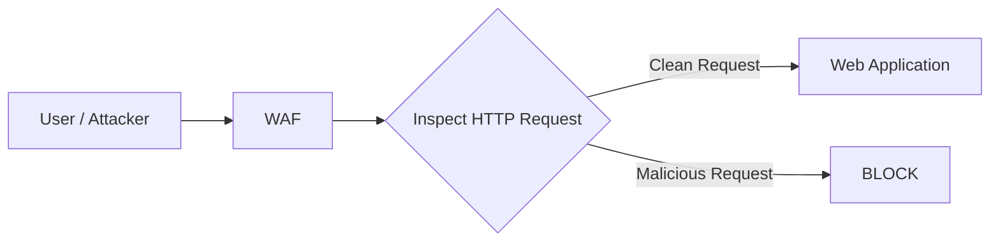
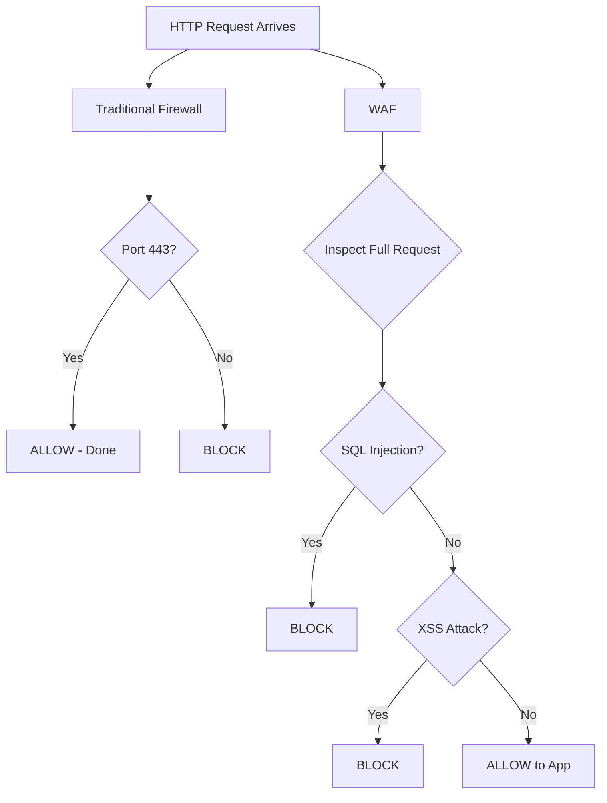
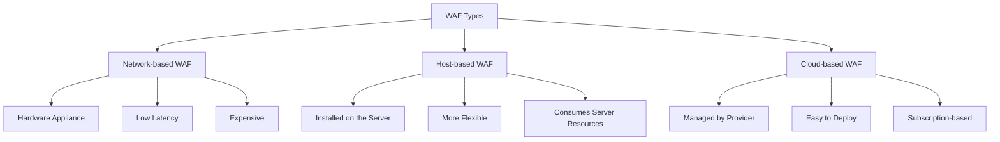
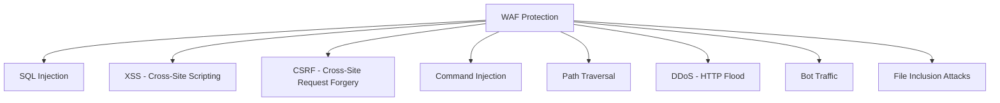
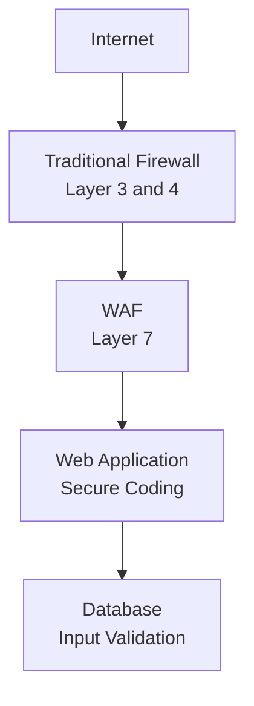

> **الهدف من الـ Section ده:**  
> هتفهم إيه الـ WAF وليه الـ Traditional Firewall مش كافي لحماية الـ Web Applications، وإزاي الـ WAF بيشوف الـ HTTP Traffic ويقدر يكتشف الـ Attacks اللي بتعدي من فوق الـ Traditional Firewall عادي.
---


## Table of Contents

- [ ليه الـ Traditional Firewall مش كافي؟](#ليه-الـ-traditional-firewall-مش-كافي)
- [ إيه هو الـ WAF؟](#إيه-هو-الـ-waf)
- [ الفرق بين الـ Firewall والـ WAF](#الفرق-بين-الـ-firewall-والـ-waf)
- [ إزاي الـ WAF بيشتغل؟](#إزاي-الـ-waf-بيشتغل)
- [ أنواع الـ WAF](#أنواع-الـ-waf)
- [ الـ WAF بيحمي من إيه؟](#الـ-waf-بيحمي-من-إيه)
- [ حدود الـ WAF](#حدود-الـ-waf)
- [Summary](#summary)

---

## ليه الـ Traditional Firewall مش كافي؟

عشان نفهم الـ WAF، لازم الأول نفهم ليه الـ Traditional Firewall بيفشل في بعض الحالات.

الـ **Traditional Firewall** بيشتغل على الـ **Layer 3 (Network Layer)** و**Layer 4 (Transport Layer)** من الـ OSI Model. يعني هو بيشوف:

- **IP Addresses** — مين بيتكلم مع مين؟
- **Port Numbers** — على أنهي Port؟
- **Protocols** — TCP ولا UDP؟

```
Traditional Firewall Decision:
Source IP: 192.168.1.5  →  Destination: 10.0.0.1:443  →  Protocol: TCP  →  ALLOW
```

الـ Firewall في المثال ده بيقول **"TCP على Port 443 = HTTPS = مسموح"** — وخلاص. هو مش عارف إيه اللي جوه الـ Request دي.

> [!WARNING]
> الـ Traditional Firewall أعمى تماماً للـ Application Layer. هو بيشوف الغلاف بس، مش المحتوى اللي جوه. يعني لو جه Attacker وبعت Request طبيعي على Port 443، الـ Firewall هيعدّيه من غير ما يعرف إن فيه Attack جواه.

---

### مثال واقعي يوضح المشكلة

تخيل إن عندك بنك فيه حارس أمن على الباب. الحارس بيشوف:
- هل الشخص لابس بدلة؟ ✔
- هل عنده بطاقة دخول؟ ✔
- هل جاي من ناحية صح؟ ✔

الحارس بيقول **"اتفضل"** — لكنه مش عارف إن الشخص ده جاي يعمل تزوير في الأوراق داخل البنك!

ده بالظبط اللي بيحصل مع الـ Traditional Firewall مع الـ HTTP Requests الخبيثة.

---

## إيه هو الـ WAF؟

الـ **WAF (Web Application Firewall)** هو **Security Control** بيتحط قُدّام الـ Web Applications عشان يفحص كل الـ **HTTP/HTTPS Traffic** اللي بيجيلها.

الـ WAF بيشتغل على الـ **Layer 7 (Application Layer)** — وده بيخليه يقدر يقرأ ويفهم الـ HTTP Requests الكاملة، مش بس الـ Headers بتاعت الـ Network.



> [!IMPORTANT]
> الـ WAF مش بديل للـ Firewall — هو **طبقة إضافية** فوقيه. الاتنين بيشتغلوا مع بعض. الـ Firewall بيحمي على مستوى الـ Network، والـ WAF بيحمي على مستوى الـ Application.

---

## الفرق بين الـ Firewall والـ WAF

| Feature | Traditional Firewall | WAF |
|---|---|---|
| **OSI Layer** | Layer 3 & 4 | Layer 7 |
| **بيشوف إيه؟** | IP, Port, Protocol | HTTP Headers, Body, Parameters |
| **بيحمي من إيه؟** | Network-level Attacks | Application-level Attacks |
| **مثال على قراره** | `TCP 443 → ALLOW` | `GET /login?user=admin' OR '1'='1 → BLOCK` |
| **يقدر يكتشف SQL Injection؟** | لا | آه |
| **يقدر يكتشف XSS؟** | لا | آه |

---

### مقارنة من ناحية الـ Decision



---

## إزاي الـ WAF بيشتغل؟

الـ WAF بيفحص كل جزء في الـ HTTP Request قبل ما توصل للـ Web Application.

### الـ HTTP Request بتتكون من إيه؟

```
GET /login.php?user=admin&pass=1234 HTTP/1.1
Host: www.example.com
User-Agent: Mozilla/5.0
Cookie: session=abc123
Content-Type: application/x-www-form-urlencoded

username=admin&password=secret
```

الـ WAF بيفحص **كل حاجة** هنا:

- **URL والـ Query Parameters** — `?user=admin&pass=1234`
- **HTTP Headers** — `User-Agent`, `Cookie`, إلخ
- **Request Body** — الداتا اللي بتتبعت في الـ POST Requests
- **HTTP Method** — GET, POST, PUT, DELETE

---

### الـ WAF بيستخدم Rulesets

الـ WAF بيتشغّل بناءً على مجموعة من الـ **Rules** — وكل Rule بتقول:

> "لو الـ Request فيها كذا، عمل كذا."

```
Rule 1: لو في الـ URL حاجة زي  ' OR '1'='1  → BLOCK (SQL Injection)
Rule 2: لو في الـ Body حاجة زي  <script>alert()</script>  → BLOCK (XSS)
Rule 3: لو الـ Request Size أكبر من X MB  → BLOCK (Buffer Overflow Attempt)
```

> [!NOTE]
> فيه Rulesets جاهزة ومعروفة زي **OWASP ModSecurity Core Rule Set (CRS)** — وهي بتغطي أشهر الـ Web Attacks الموثقة في الـ OWASP Top 10. الـ WAF Solutions المختلفة بتيجي بـ Rulesets افتراضية وبتديك option إنك تضيف Rules خاصة بيك.

---

### مثال عملي: SQL Injection Request

```http
GET /login.php?user=admin' OR '1'='1 HTTP/1.1
Host: www.target.com
```

الـ Traditional Firewall بيشوف:
```
TCP Port 80 → ALLOW
```

الـ WAF بيشوف:
```
URL Parameter contains: admin' OR '1'='1
Pattern matches: SQL Injection Rule
Action: BLOCK → Return 403 Forbidden
```

---

## أنواع الـ WAF

فيه تلات أنواع رئيسية للـ WAF بناءً على طريقة الـ Deployment:



| النوع | الوصف | مثال |
|---|---|---|
| **Network-based WAF** | Hardware Appliance بيتحط قُدّام الـ Network | F5 BIG-IP ASM |
| **Host-based WAF** | Software بيتنصب على الـ Web Server نفسه | ModSecurity على Apache/Nginx |
| **Cloud-based WAF** | خدمة SaaS بيديرها الـ Provider | Cloudflare WAF, AWS WAF |

> [!TIP]
> الـ **Cloud-based WAF** هو الأسهل والأسرع في الـ Deployment خصوصاً للـ Startups والشركات الصغيرة، لأنك مش محتاج Hardware ولا تحديثات يدوية — الـ Provider هو اللي بيتكفل بكل ده.

---

## الـ WAF بيحمي من إيه؟

الـ WAF بيحمي من الـ **OWASP Top 10** وغيرها من الـ Application-level Attacks:



### شرح سريع لكل Attack

| الـ Attack | إيه اللي بيعمله؟ | مثال |
|---|---|---|
| **SQL Injection** | حقن SQL Code في الـ Database Query | `' OR '1'='1` |
| **XSS** | حقن JavaScript Code في الصفحة | `<script>steal_cookie()</script>` |
| **CSRF** | تنفيذ Actions من غير علم المستخدم | نموذج مزيف بيعمل Transfer |
| **Command Injection** | تنفيذ OS Commands على السيرفر | `; rm -rf /` |
| **Path Traversal** | الوصول لملفات خارج الـ Web Directory | `../../etc/passwd` |
| **HTTP Flood** | إرسال طلبات كتير عشان يعطّل السيرفر | آلاف الـ Requests في الثانية |

> [!NOTE]
> الـ SQL Injection والـ XSS وغيرها من الـ Attacks دي هيتم شرحها بالتفصيل في المراحل الجاية من الكورس. المهم دلوقتي تعرف إن الـ WAF هو الخط الدفاعي اللي بيوقفهم على مستوى الـ HTTP Traffic.

---

## حدود الـ WAF

الـ WAF مش حل سحري وعنده حدوده:

> [!WARNING]
> **الـ WAF مش بديل لكتابة كود آمن (Secure Coding).** لو الـ Application نفسه فيه Vulnerabilities في الـ Code، الـ WAF ممكن يتجاوز بأساليب متطورة. الـ WAF هو طبقة دفاعية إضافية، مش حل نهائي.

| القيد | الشرح |
|---|---|
| **False Positives** | ممكن يحجب Requests شرعية بالغلط |
| **False Negatives** | ممكن يعدّي Attacks متطورة مش في الـ Rules |
| **Encrypted Traffic** | الـ HTTPS لازم يتفك تشفيره عشان يفحصه |
| **Zero-Day Attacks** | الـ Rules مش فيها الـ Attacks الجديدة لحد ما تتضاف |
| **Business Logic Attacks** | الـ WAF مش فاهم الـ Business Logic |

---

### الـ Defense in Depth — الحماية بالطبقات

الفكرة الصح مش تعتمد على حاجة واحدة، لكن تبني طبقات من الحماية:



> [!IMPORTANT]
> الـ **Defense in Depth** هو المبدأ الأساسي في الـ Cybersecurity. كل طبقة بتحمي من نوع مختلف من الـ Attacks، وبالتالي حتى لو طبقة اتخطت، الطبقة الجاية بتوقف الـ Attacker.

---

## Summary

- الـ **Traditional Firewall** بيشتغل على الـ **Layer 3 و 4** ويشوف بس الـ IP والـ Port والـ Protocol — وبالتالي هو أعمى تجاه الـ Application-level Attacks.

- الـ **WAF (Web Application Firewall)** بيشتغل على الـ **Layer 7** ويفحص الـ HTTP/HTTPS Traffic بالكامل، بما في ذلك الـ URL والـ Headers والـ Body.

- الـ WAF بيتخذ قراراته بناءً على **Rulesets** — لو الـ Request match Rule معينة (زي SQL Injection Pattern)، بيبلوكها.

- فيه تلات أنواع من الـ WAF: **Network-based** (Hardware)، **Host-based** (Software على السيرفر)، و**Cloud-based** (SaaS).

- الـ WAF بيحمي من الـ **OWASP Top 10** والـ Application Attacks الشائعة زي الـ SQL Injection والـ XSS والـ Command Injection وغيرها.

- الـ WAF **مش حل كامل** — عنده حدود زي الـ False Positives والـ Zero-Day Attacks، ولازم يكون جزء من استراتيجية **Defense in Depth** مع الـ Firewall والـ Secure Coding.

- الفرق الأساسي في الجملة الواحدة:
  - **Firewall:** `TCP 443 → ALLOW`
  - **WAF:** `GET /login.php?user=admin' OR '1'='1 → BLOCK`
