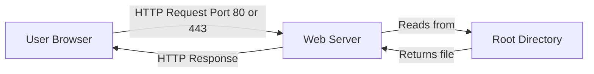
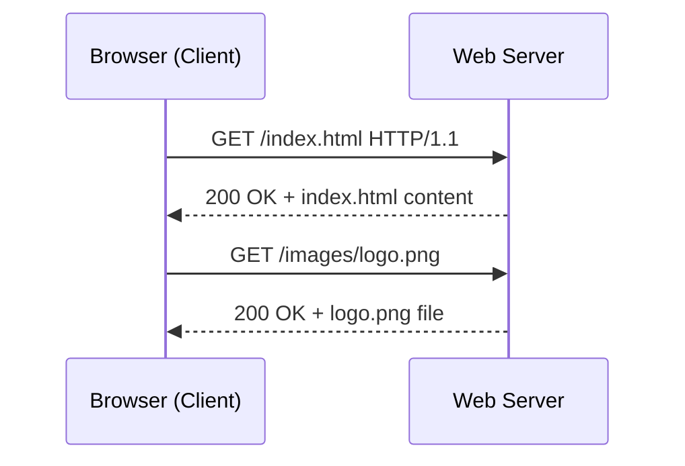
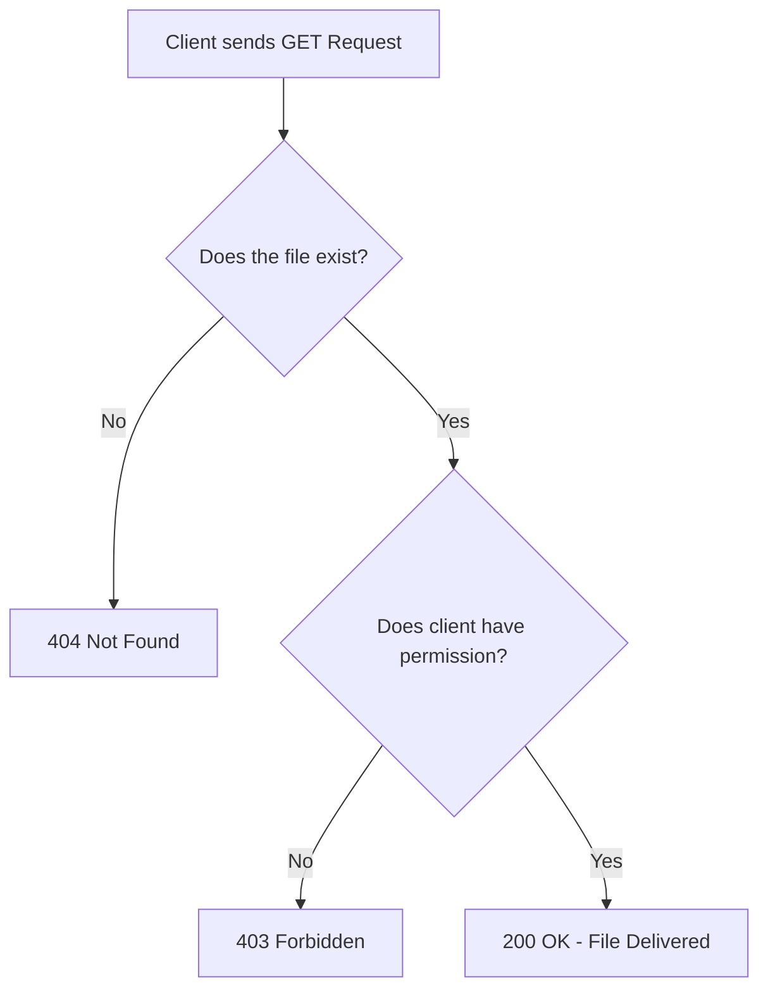
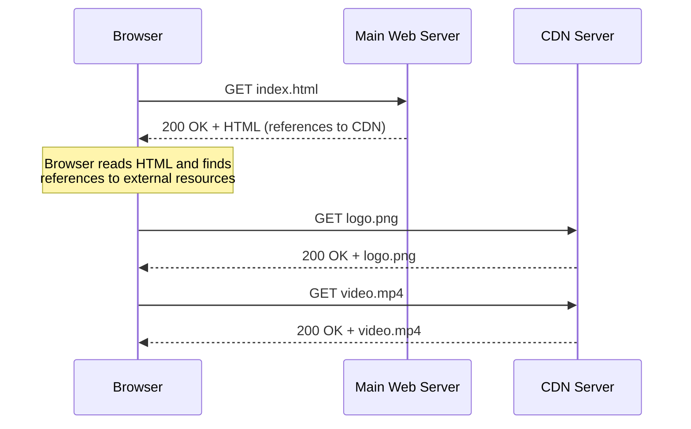
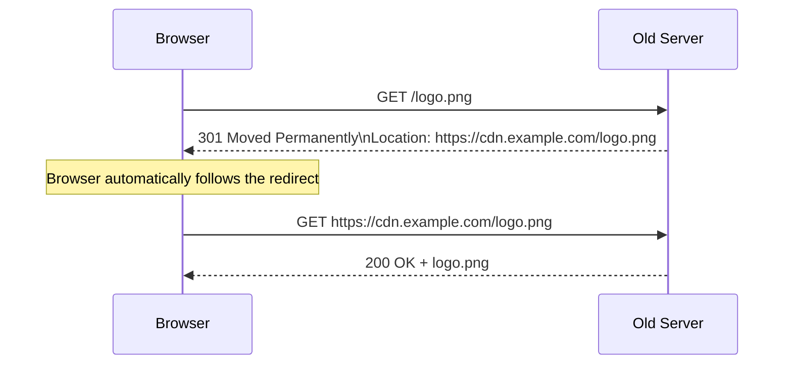
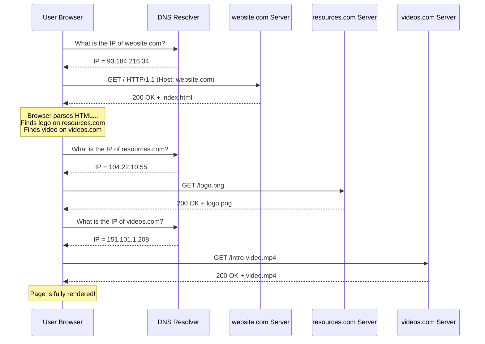
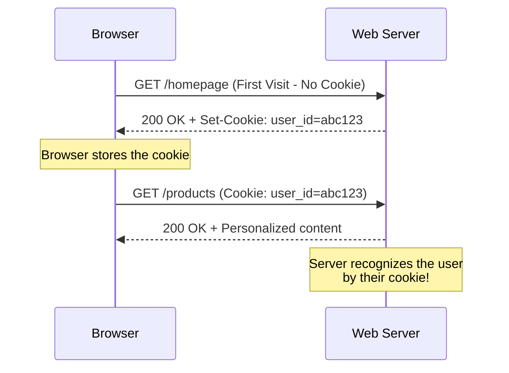
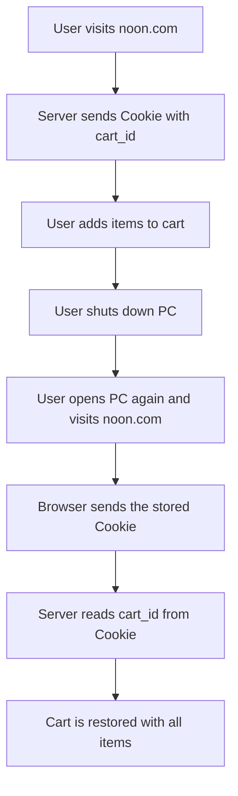

> **الهدف من الـ Section ده:**  
> هتفهم إزاي الـ Web بيشتغل من تحت — إزاي الـ Browser بيطلب الـ Pages، إيه معنى الـ HTTP Status Codes، وإيه دور الـ Cookies في إنها تفرق بينك وبين أي حد تاني بيزور نفس الموقع — حتى من غير ما تعمل Login.

---

## Table of Contents

1. [How a Website Works](#1-how-a-website-works)
2. [Web Servers & Ports](#2-web-servers--ports)
3. [HTTP & the Request-Response Model](#3-http--the-request-response-model)
4. [HTTP Status Codes](#4-http-status-codes)
5. [Content Delivery Networks (CDN)](#5-content-delivery-networks-cdn)
6. [HTTP Redirects (301 & 302)](#6-http-redirects-301--302)
7. [Web Exercise — Full Page Load Walkthrough](#7-web-exercise--full-page-load-walkthrough)
8. [Cookies](#8-cookies)
9. [Summary](#9-summary)

---

## 1. How a Website Works

### الفكرة الأساسية

لما بتفكر تعمل موقع، في جزأين أساسيين لازم تكتبهم:

| الجزء | الوصف | أمثلة |
|-------|--------|--------|
| **Back-End** | الكود اللي بيشتغل على الـ Server في الخفاء | Python, PHP, Node.js |
| **Front-End** | الكود اللي المستخدم بيشوفه ويتفاعل معاه | HTML, CSS, JavaScript |

الكود ده كله محفوظ في **Files** على الـ Hard Drive بتاعتك — سواء كان كود، صور، فيديوهات، أو أي Resources تانية.

### الـ Web Root Directory

عشان الموقع يشتغل، محتاج تحدد **Root Directory** — ده هو المجلد الأساسي اللي الـ Web Server بيبدأ يدور فيه على الملفات لما حد يطلبها.

```
/var/www/html/          ← Root Directory (Apache example)
├── index.html          ← الـ Homepage
├── about.html
├── images/
│   └── logo.png
└── scripts/
    └── app.js
```

### الـ Domain Name

عشان الناس توصلك من الإنترنت، محتاج **Domain Name** — ده العنوان اللي الناس بتكتبه في الـ Browser زي `website.com`.

> [!NOTE]
> تقدر تستخدم جهازك الشخصي كـ Web Server عن طريق تثبيت Software زي **Nginx** أو **Apache**، وتعمل تعديلات على الـ DNS والـ Firewall عشان يبقى متاح من الإنترنت.

---

## 2. Web Servers & Ports

### إيه اللي بيعمله الـ Web Server Software؟

لما تثبّت Web Server Software زي Nginx أو Apache، هو بيعمل حاجتين أساسيتين:

1. **يفتح Ports** — بيستنى الـ Requests على:
   - **Port 80** → للـ HTTP (غير مشفّر)
   - **Port 443** → للـ HTTPS (مشفّر بـ TLS/SSL)

2. **يعالج الـ Requests** — لما حد يطلب صفحة، هو بيدور عليها في الـ Root Directory ويبعتهالوه.



---

## 3. HTTP & the Request-Response Model

### HTTP — Hyper Text Transfer Protocol

الـ HTTP هو البروتوكول اللي الـ Browser والـ Server بيتكلموا بيه مع بعض.

### قاعدة مهمة جداً

> [!IMPORTANT]
> في الـ HTTP، **الـ Client بس هو اللي بيبعت Requests**، والـ **Server بس هو اللي بيبعت Responses**. العكس مش ممكن — الـ Server مش ممكن يبدأ يبعت حاجة من غير ما الـ Client يطلب الأول.

### إيه اللي بيحصل خطوة بخطوة؟



### الـ HTTP Methods الأساسية

| Method | الغرض |
|--------|--------|
| **GET** | طلب بيانات أو صفحة من الـ Server |
| **POST** | إرسال بيانات للـ Server (زي نموذج Login) |
| **PUT** | تحديث بيانات موجودة |
| **DELETE** | حذف بيانات |

> [!NOTE]
> في سياق الـ Web Basics ده، بنركز على الـ **GET** لأنه الأكثر شيوعاً في تصفح المواقع.

---

## 4. HTTP Status Codes

الـ Status Codes دي أرقام بيبعتهم الـ Server في كل Response عشان يقولك إيه اللي حصل.

### جدول الـ Status Codes

| النطاق | المعنى العام | أمثلة مهمة |
|--------|-------------|-------------|
| **2xx** | النجاح — الطلب اتنفذ | `200 OK` |
| **3xx** | إعادة التوجيه — الملف اتنقل | `301 Moved Permanently`, `302 Found` |
| **4xx** | خطأ من ناحية الـ Client | `403 Forbidden`, `404 Not Found` |
| **5xx** | خطأ من ناحية الـ Server | `500 Internal Server Error` |

### شرح كل Code مهم

#### ✅ 200 OK
الطلب نجح والـ Server بعت الملف المطلوب بنجاح.

#### 🔄 301 Moved Permanently
الملف أو الصفحة اتنقلت لعنوان جديد بشكل دائم. الـ Browser بيتحول تلقائياً للعنوان الجديد.

#### 🔄 302 Found (Temporary Redirect)
نفس فكرة 301 بس مؤقتة — الملف موجود في مكان تاني دلوقتي بس ممكن يرجع.

#### 🚫 403 Forbidden

> [!WARNING]
> الـ **403** هو من أخطر الـ Status Codes من ناحية الـ Security. معناه إن الملف أو المجلد **موجود فعلاً** لكن المستخدم **ملوش صلاحية** يوصله.
>
> لو شفت **أكتر من 403 من نفس الـ IP** في الـ Logs، ده ممكن يكون علامة إن حد بيحاول يوصل لأجزاء من الموقع مش المفروض يوصلها — ده **مؤشر على نشاط مشبوه**.

#### 🔍 404 Not Found
الـ Client طلب ملف **مش موجود** أصلاً على الـ Server. ده مختلف عن 403 — هنا الملف مش موجود خالص.



#### ❌ 500 Internal Server Error
في مشكلة حصلت على الـ Server نفسه أثناء تنفيذ الطلب — مش من ناحية الـ Client.

> [!TIP]
> كـ Security Analyst، الـ Status Codes هي أول حاجة بتبص عليها في الـ Access Logs. تجميعات كتيرة من 403 أو 404 من نفس الـ IP ممكن تكشفلك محاولات **Directory Enumeration** أو **Unauthorized Access**.

---

## 5. Content Delivery Networks (CDN)

### الفكرة

مش كل حاجة في الموقع لازم تكون على نفس الـ Server. الصور، الفيديوهات، والـ Scripts ممكن تكون على **Servers تانية** — وده بيتعمل عن طريق الـ **CDN**.

### إيه هو الـ CDN؟

الـ **Content Delivery Network** عبارة عن شبكة من الـ Servers المنتشرة في أماكن مختلفة حول العالم، وظيفتها إنها تخدم الـ Static Content (صور، فيديوهات، CSS, JS) بسرعة لأي حد في أي مكان.



### ليه بنستخدم CDN؟

| السبب | الشرح |
|-------|--------|
| **السرعة** | الـ User بياخد الـ Content من أقرب Server ليه جغرافياً |
| **تخفيف الحمل** | الـ Main Server مش بيشيل كل الـ Requests |
| **الـ Availability** | لو Server واحد وقع، في Servers تانية تكمل |

> [!NOTE]
> لما الـ Browser بيشيل الـ HTML Page، بيقرا الكود بتاعها ويلاقي Tags زي `` — فبيبعت Request تاني تلقائياً للـ CDN عشان ياخد الصورة.

---

## 6. HTTP Redirects (301 & 302)

### السيناريو

تخيل إن صورة كانت على `website.com/logo.png` وبعدين انتقلت لـ CDN على `cdn.example.com/logo.png`. الـ Browser ما يعرفش إن الصورة اتنقلت.

### إيه اللي بيحصل؟



### الفرق بين 301 و 302

| الكود | الاسم | المعنى | تأثيره على الـ SEO |
|-------|--------|--------|-------------------|
| **301** | Moved Permanently | الملف انتقل للأبد | الـ Search Engines بتحدث الـ Index |
| **302** | Found (Temporary) | انتقال مؤقت | الـ Search Engines بتفضل تتذكر العنوان القديم |

---

## 7. Web Exercise — Full Page Load Walkthrough

### السيناريو

> مستخدم عايز يفتح `website.com` في الـ Browser.
> - الـ HTML Page بتاعة `website.com` بتحتوي على **Logo** متستضاف على `resources.com`
> - وبتحتوي على **Video** متستضاف على `videos.com`

### الخطوات الكاملة



### شرح الخطوات بالتفصيل

**الخطوة 1 — DNS Query لـ website.com:**
الـ Browser محتاج يعرف الـ IP Address بتاع `website.com` عشان يعرف يوصله. بيبعت سؤال للـ DNS Resolver اللي بيرد عليه بالـ IP.

**الخطوة 2 — طلب الـ Homepage:**
الـ Browser بيبعت `GET /` للـ IP بتاع `website.com`. الـ Server بيرد بـ `200 OK` ويبعتله الـ `index.html`.

**الخطوة 3 — الـ Browser يقرأ الـ HTML:**
الـ Browser بيشوف في الكود إن في صورة على `resources.com` وفيديو على `videos.com`.

**الخطوة 4 — DNS Queries جديدة:**
الـ Browser بيسأل الـ DNS عن الـ IP بتاع `resources.com` وبعدين `videos.com`.

**الخطوة 5 — طلب الـ Logo والـ Video:**
بيبعت `GET /logo.png` لـ `resources.com` وبعدين `GET /intro-video.mp4` لـ `videos.com`.

**الخطوة 6 — الصفحة اتحمّلت بالكامل:**
كل الـ Resources اترجعت بـ `200 OK` والـ Browser عرض الصفحة كاملة.

> [!TIP]
> الـ Browser بيعمل الـ DNS Queries والـ HTTP Requests دي بشكل **Parallel** (في نفس الوقت) قدر الإمكان عشان يسرّع تحميل الصفحة. الـ Developer Tools في أي Browser بتعرضلك ده في تبويبة الـ Network.

---

## 8. Cookies

### إيه هو الـ Cookie؟

الـ **Cookie** هو قطعة صغيرة من البيانات بيبعتها الـ Web Server للـ Browser، والـ Browser بيحفظها على جهاز المستخدم.

### خصائص الـ Cookies

| الخاصية | التفاصيل |
|---------|---------|
| **الحجم** | صغير جداً — بيانات نصية فقط |
| **المحتوى** | نصوص وأرقام فقط — **مش ممكن** تحتوي على كود قابل للتنفيذ أو صور |
| **الغرض الأساسي** | تعريف الجهاز (Identifier) حتى من غير Login |
| **أنواعها** | Session Cookies (في الـ RAM) وPersistent Cookies (على الـ Hard Drive) |



### ليه الـ Cookies مهمة؟

#### مشكلة الـ HTTP Stateless

> [!IMPORTANT]
> الـ HTTP هو **Stateless Protocol** — يعني بطبيعته **الـ Server مش بيفتكر** إنك زرته قبل كده. كل Request بينظر إليها كأنها جديدة تماماً.
>
> الـ Cookies هي الحل لمشكلة الـ Statelessness دي.

#### أنواع الـ Cookies

**1. Session Cookies (مؤقتة):**
- بتتخزن في الـ **RAM**
- بتتمسح لما تقفل الـ Browser
- مثال: إنك تكون Login في موقع

**2. Persistent Cookies (دائمة):**
- بتتخزن على الـ **Hard Drive**
- بتفضل حتى بعد ما تقفل الجهاز وتشغله تاني
- مثال: تذكر الـ Shopping Cart حتى بعد إغلاق الجهاز

### مثال عملي — الـ Shopping Cart



> [!NOTE]
> موقع زي Noon بيقدر يحفظ الـ Shopping Cart حتى من غير ما تكون عامل Login — ده بسبب الـ **Persistent Cookies** اللي بتتخزن على جهازك وبتتبعت للـ Server مع كل Request.

### الـ Cookies في الـ Security

> [!WARNING]
> الـ Cookies ممكن تكون هدف للـ Attackers:
>
> - **Session Hijacking:** لو حد سرق الـ Session Cookie بتاعك، يقدر يتنكر فيك على الموقع من غير ما يعرف الـ Password.
> - **Cookie Theft via XSS:** الـ Cross-Site Scripting ممكن يستخدم لسرقة الـ Cookies.
> - **Tracking:** الـ Third-Party Cookies بتُستخدم لتتبع نشاطك عبر مواقع مختلفة.

---

## 9. Summary

### ملخص الـ Section ده

- **الموقع** عبارة عن ملفات (HTML, CSS, JS, صور) موجودة في **Root Directory** على الـ Server، والـ Web Server Software (زي Nginx أو Apache) بيبعتها لأي حد يطلبها على **Port 80 أو 443**.

- **الـ HTTP** شغال على مبدأ **Request-Response** — الـ Client (Browser) بيطلب، والـ Server بيرد. مفيش Server يبدأ يبعت حاجة من تلقاء نفسه.

- **الـ HTTP Status Codes** هي الطريقة اللي الـ Server بيعرفنا بيها بنتيجة الطلب:
  - **2xx** = نجاح
  - **3xx** = إعادة توجيه
  - **4xx** = خطأ من ناحية الـ Client (الـ **403** مهم جداً في الـ Security)
  - **5xx** = خطأ من ناحية الـ Server

- **الـ CDN** بيسمح بإنك توزع الـ Static Content على Servers مختلفة حول العالم لتسريع التحميل وتخفيف الحمل عن الـ Main Server.

- **الـ 301 و 302** هما كودا الإعادة التوجيه — الأول دائم والتاني مؤقت.

- **الـ Cookies** هي الحل لمشكلة إن الـ HTTP **Stateless** — بتسمح للـ Server إنه "يفتكر" الـ Client حتى من غير Login، وبتنقسم لـ **Session Cookies** (مؤقتة في الـ RAM) و**Persistent Cookies** (دائمة على الـ Hard Drive).

- من ناحية الـ **Security**، مراقبة الـ Status Codes (خصوصاً تجميعات الـ 403) والاهتمام بحماية الـ Cookies من السرقة هما من أهم الممارسات.
