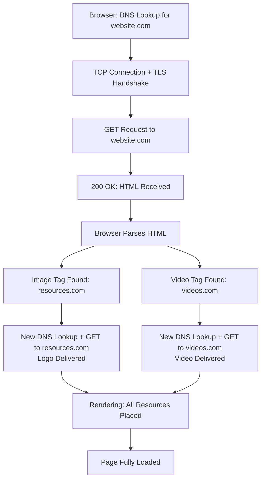

| Topic | Level | Reading Time | Prerequisites |
|---|---|---|---|
| CDNs, Multi-Server Pages, and the Full Page Load | Intermediate | ~20 min | Basic understanding of how websites are built and hosted, HTTP, DNS, and firewall rules |

> **الهدف من الـ Section ده:**  
> هتفهم إن الصفحة الواحدة اللي بتشوفها في متصفحك فعليًا نتيجة تعاون عدة سيرفرات مختلفة، هتتعرف على مفهوم الـ CDN وإزاي بيسرّع تحميل المواقع، وهتشوف ليه فايروول مضبوط يسمح بدومين واحد بس ممكن يكسر موقع كامل.


## Learning Objectives

By the end of this section, you will be able to:

- Define a **CDN (Content Delivery Network)** and explain the role of **edge servers**.
- Trace how a browser actually reaches an edge server, from DNS lookup to cache hit or miss.
- Explain why loading a single webpage often means talking to several different servers.
- Explain why allowing only one domain on a firewall is not enough to load a modern website correctly.
- Walk through the complete step-by-step process of loading a real page, from DNS lookup to full rendering.

## Table of Contents

- [What Is a CDN](#what-is-a-cdn)
- [How You Actually Reach an Edge Server](#how-you-actually-reach-an-edge-server)
- [Same CDN Domain, Different Answer](#same-cdn-domain-different-answer)
- [One Page, Many Servers](#one-page-many-servers)
- [Resources Hosted on a Different Domain](#resources-hosted-on-a-different-domain)
- [Why Allowing One Domain Isn't Enough](#why-allowing-one-domain-isnt-enough)
- [Exercise: Trace a Full Page Load](#exercise-trace-a-full-page-load)
- [Step-by-Step Walkthrough](#step-by-step-walkthrough)
- [Multi-Server Page Load Diagram](#multi-server-page-load-diagram)
- [Career Connection](#career-connection)
- [Key Terms Glossary](#key-terms-glossary)
- [Summary](#summary)

## What Is a CDN

**CDN (Content Delivery Network)** هي مجموعة من السيرفرات، بتتسمى **edge servers**، منتشرة في أماكن كتير حوالين العالم.

بدل ما كل مستخدم يجيب الصور، الفيديو، CSS، أو JS من سيرفر أصلي واحد بعيد (**origin server**)، هو بياخد نسخة مخزّنة مؤقتًا (**cached copy**) من edge server قريب منه.

**النتيجة**: تحميل أسرع، ضغط أقل على السيرفر الأصلي، وموثوقية أفضل.

## How You Actually Reach an Edge Server

العملية بتحصل بالخطوات التالية:

1. الـ HTML بتاع الصفحة بيشاور على مورد موجود على دومين الـ CDN، مش الموقع الرئيسي (مثلًا `cdn-provider.com/logo.png`).
2. المتصفح بيدوّر على دومين الـ CDN ده في DNS.
3. الـ DNS بتاع الـ CDN "واعي بالموقع" (**location-aware**)، هو مبيرجعش عنوان ثابت واحد. هو بيرجّع أي edge server هو الأقرب أو الأقل ازدحامًا للمتصفح ده دلوقتي.
4. المتصفح بيتصل مباشرة بالـ edge server ده.
5. **Cache Hit**: الـ edge server عنده الملف بالفعل وبيبعته فورًا. **Cache Miss**: هو بيجيب الملف من الأصل مرة واحدة، بيخزّن نسخة، وبعدين بيبعته.

## Same CDN Domain, Different Answer

> [!IMPORTANT]
> مستخدمين اتنين في أماكن مختلفة (أو في أوقات مختلفة) ممكن يتوجّهوا لـ edge servers مختلفة تمامًا لنفس الطلب بالظبط.

## One Page, Many Servers

تحميل صفحة ويب واحدة نادرًا ما بيعني إنك بتكلم سيرفر واحد بس.

الـ HTML الرئيسي غالبًا جاي من سيرفر الموقع نفسه، مثلًا `website.com`. لكن الصور، الفيديو، والسكربتات المشار ليها جوه الـ HTML ده غالبًا عايشة على دومين مختلف تمامًا، وأشهر حاجة إنه يكون CDN.

## Resources Hosted on a Different Domain

أحيانًا اللوجو أو الفيديو المشار ليه في الـ HTML مش مستضاف على نفس سيرفر الموقع نفسه.

```html

```

عنصر الصورة (**image tag**) دي بيحتوي على URL كامل بيشاور لدومين مختلف تمامًا. لما المتصفح يقرا العنصر ده، هو بيبعت طلب HTTP منفصل مباشرة لدومين الـ CDN، مش لسيرفر الموقع الرئيسي.

> [!TIP]
> ده معناه إن تحميل صفحة واحدة ممكن يتضمن الكلام مع عدة سيرفرات مختلفة، كل واحد مسؤول عن جزء مختلف من المحتوى.

## Why Allowing One Domain Isn't Enough

**السيناريو**: فايروول متضبط إنه يسمح بس بـ `facebook.com`. هل الموقع هيتحمّل بالكامل؟

**اللي فعليًا بيحصل**:

- الـ HTML الرئيسي من `facebook.com` بيتحمّل تمام، الطلب ده بيطابق الـ rule.
- لكن الصور، السكربتات، الفيديو، واستدعاءات الـ API غالبًا بتتقدّم من دومينات CDN أو دومينات شريكة منفصلة الـ rule أبدًا معدتاش عنها.
- الطلبات دي بتتحظر، فالصفحة بتتحمّل جزئيًا أو بتتكسر.

**ليه ده بيحصل**:

- المواقع الحديثة بتعتمد على أكتر بكتير من دومين واحد: CDNs، APIs، خدمات مصادقة، وأدوات طرف ثالث.
- الدومينات المدعومة بـ CDN ممكن تحل (**resolve**) لعناوين IP مختلفة حسب موقع المستخدم أو حمل السيرفر، فحتى قائمة السماح المبنية على IP مش موثوقة.
- ده السبب اللي بيخلي الفايروولات الحقيقية بتعتمد على فلترة قائمة على الـ URL (**URL/domain-aware filtering**، زي FQDN objects وفئات الدومينات) بدل rule واحدة ثابتة (**hardcoded**).

> [!IMPORTANT]
> **الدرس الأساسي**: السماح بدومين واحد مش معناه السماح بالتطبيق بالكامل اللي بيعتمد عليه.

> [!NOTE]
> ده بالظبط نفس منطق **Default Deny** اللي درسناه قبل كده في مواضيع أمان الشبكات: قاعدة "سمح بس بدومين واحد" بتبان آمنة على الورق، لكنها فعليًا بتكسر التطبيق لأنها متجاهلة كل التبعيات (**dependencies**) الخفية بتاعته.

## Exercise: Trace a Full Page Load

**السيناريو**: مستخدم بيكتب `website.com` في متصفحه.

- **website.com**: بيستضيف صفحة الـ HTML الرئيسية.
- **resources.com**: بيستضيف اللوجو المشار ليه في الـ HTML.
- **videos.com**: بيستضيف الفيديو المشار ليه كمان في الـ HTML.

**المهمة**: نشرح خطوة بخطوة إزاي الصفحة بتتحمّل، من الـ DNS لحد الـ rendering الكامل.

## Step-by-Step Walkthrough

**الخطوة 1: DNS Lookup**

المتصفح مش عارف عنوان IP بتاع `website.com`، هو عارف بس اسمه. هو بيبعت استعلام DNS، سائل: "إيه عنوان الـ IP بتاع `website.com`؟" نظام الـ DNS بيرد بعنوان الـ IP الصحيح.

**الخطوة 2: TCP Connection**

باستخدام عنوان الـ IP ده، المتصفح بيفتح اتصال بسيرفر الويب (عادةً على بورت 443). لو HTTPS مستخدمة، **TLS handshake** كمان بتحصل هنا عشان تشفّر الاتصال.

**الخطوة 3: HTTP GET Request**

المتصفح بيبعت `GET / HTTP/1.1` لسيرفر `website.com`، طالب الـ homepage.

**الخطوة 4: Server Response**

السيرفر بيرد بـ **200 OK** وبيبعت ملف الـ HTML (زي `index.html`).

**الخطوة 5: HTML Parsing Begins**

المتصفح بيبدأ يقرا الـ HTML من فوق لتحت، وبيبني بنية الصفحة.

**الخطوة 6: Logo Request**

المتصفح بيلاقي عنصر `` بيشاور على لوجو مستضاف على `resources.com`. ده محتاج DNS lookup جديد لـ `resources.com`، اتصال TCP جديد، وطلب GET جديد عشان يجيب `logo.png`. `resources.com` بيرد بـ **200 OK** وبيانات الصورة.

**الخطوة 7: Video Request**

بنفس الطريقة، المتصفح بيلاقي عنصر فيديو بيشاور على `videos.com`. DNS lookup تاني، اتصال TCP، وطلب GET بيحصلوا، المرة دي بيجيبوا ملف الفيديو من `videos.com`.

**الخطوة 8: Parallel Loading**

المتصفحات الحديثة عادةً بتبعت الطلبات المختلفة دي (اللوجو، الفيديو، CSS، السكربتات) في نفس الوقت (**in parallel**) بدل واحد ورا التاني، عشان تحمّل الصفحة أسرع.

**الخطوة 9: Rendering**

كل ما مورد يوصل، المتصفح بيحطه جوه الصفحة، بيعرض النص، بيحدد موقع صورة اللوجو، وبيجهّز مشغّل الفيديو.

**الخطوة 10: Page Fully Loaded**

بمجرد ما كل الموارد المشار ليها تتجاب وتتحط بنجاح، الصفحة بتُعتبر مُرندَرة (**rendered**) بالكامل وجاهزة للمستخدم يتفاعل معاها.

> [!IMPORTANT]
> **الخلاصة الأساسية**: صفحة ويب واحدة مرئية ممكن تتضمن عدة DNS lookups، عدة سيرفرات، وعشرات الطلبات الفردية من نوع HTTP بتحصل وراء الكواليس.

## Multi-Server Page Load Diagram

المخطط التالي بيوضح الرحلة الكاملة من كتابة الدومين لحد الـ rendering الكامل للصفحة، عبر السيرفرات المتعددة:



## Career Connection

فهم الـ CDNs، الصفحات متعددة السيرفرات، والرحلة الكاملة لتحميل الصفحة له تطبيقات مباشرة في مسارات مهنية متعددة:

- في مجال **Network Security Engineering**، تصميم قواعد فايروول واعية بالدومين (**domain-aware**) بدل قواعد ثابتة على IP جزء أساسي من تشغيل تطبيقات ويب حديثة بأمان.
- في مجال **SOC**، فهم إن الصفحة الواحدة بتشمل طلبات لعدة دومينات بيساعد في التمييز بين حركة مرور طبيعية ومشبوهة.
- في مجال **Web Application Security**، معرفة التبعيات الخفية للمواقع (CDNs، APIs) جزء أساسي من تقييم سطح الهجوم الكامل لأي تطبيق.

## Key Terms Glossary

| Term | Definition |
|---|---|
| **CDN (Content Delivery Network)** | مجموعة سيرفرات منتشرة جغرافيًا لتسريع تسليم المحتوى للمستخدمين. |
| **Edge Server** | سيرفر تابع لشبكة الـ CDN، أقرب جغرافيًا للمستخدم النهائي. |
| **Origin Server** | السيرفر الأصلي الذي يحتفظ بالنسخة الأساسية من الملفات قبل تخزينها مؤقتًا على الـ CDN. |
| **Cache Hit / Cache Miss** | حالة توفر الملف المطلوب مسبقًا على الـ edge server (hit) أو عدم توفره فيتطلب جلبه من الأصل (miss). |
| **FQDN (Fully Qualified Domain Name)** | الاسم الكامل والمحدد لدومين معين، يُستخدم في قواعد الفايروول الواعية بالدومين. |
| **URL/Domain-Aware Filtering** | فلترة فايروول تعتمد على اسم الدومين بدلاً من عنوان IP ثابت. |
| **Rendering** | عملية بناء وعرض الصفحة بصريًا بعد استلام كل مواردها. |

## Summary

- **CDN** هي مجموعة **edge servers** منتشرة عالميًا، بتوفر نسخة مخزّنة مؤقتًا من المحتوى قريبة من كل مستخدم، وبتحسّن سرعة التحميل والموثوقية.
- الـ DNS الخاص بالـ CDN "واعي بالموقع"، فنفس الدومين ممكن يرجّع عناوين IP مختلفة لمستخدمين مختلفين.
- تحميل صفحة ويب واحدة نادرًا ما بيعني الكلام مع سيرفر واحد بس، غالبًا فيه دومينات منفصلة للصور، الفيديو، والسكربتات.
- قاعدة فايروول بتسمح بدومين واحد بس (زي `facebook.com`) مش كافية، لأن التطبيق الحديث بيعتمد على دومينات تبعية متعددة (CDNs، APIs)، وده بيخلي الفلترة القائمة على الدومين (URL-aware) ضرورية بدل الاعتماد على IP ثابت.
- الرحلة الكاملة لتحميل صفحة بتشمل: DNS lookup، اتصال TCP/TLS، طلب GET، استقبال الـ HTML، تحليله (**parsing**)، طلبات إضافية للموارد المرتبطة (صور، فيديو)، تحميل متوازي، ثم الـ rendering النهائي.
- صفحة واحدة مرئية ممكن تخفي وراءها عشرات الطلبات وعدة سيرفرات مختلفة تمامًا.

