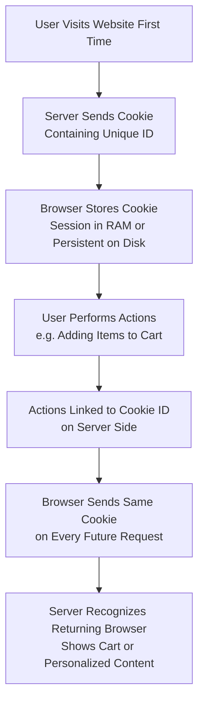

| Topic | Level | Reading Time | Prerequisites |
|---|---|---|---|
| Cookies: How Websites Remember You | Beginner | ~16 min | Basic understanding of HTTP and the client-server relationship |

> **الهدف من الـ Section ده:**  
> هتفهم إيه هو الـ Cookie فعليًا، وليه المواقع محتاجاه أصلًا عشان "تفتكرك"، هتشوف مثال عملي حقيقي (عربة تسوق Noon)، وهتتعرف على أنواع الكوكيز المختلفة وأعلام الأمان اللي بتحميها.

## Learning Objectives

By the end of this section, you will be able to:

- Define what a **Cookie** actually is at the data level, and explain what it can and cannot do.
- Explain why HTTP being a **stateless protocol** creates the need for cookies in the first place.
- Trace how a cookie lets a site like Noon remember your shopping cart across visits.
- Distinguish between **Session** and **Persistent** cookies, and between **First-Party** and **Third-Party** cookies.
- Explain the security purpose of the **Secure** and **HttpOnly** cookie flags.

## Table of Contents

- [What Exactly Is a Cookie](#what-exactly-is-a-cookie)
- [Session Cookies vs. Persistent Cookies](#session-cookies-vs-persistent-cookies)
- [Why Do We Even Need Cookies](#why-do-we-even-need-cookies)
- [Example: Noon Shopping Cart](#example-noon-shopping-cart)
- [Types of Cookies](#types-of-cookies)
  - [First-Party vs. Third-Party Cookies](#first-party-vs-third-party-cookies)
- [Security Flags: Secure and HttpOnly](#security-flags-secure-and-httponly)
- [Cookie Lifecycle Diagram](#cookie-lifecycle-diagram)
- [Career Connection](#career-connection)
- [Key Terms Glossary](#key-terms-glossary)
- [Summary](#summary)

## What Exactly Is a Cookie

**Cookie** هو قطعة صغيرة من بيانات نصية (**text data**) بيبعتها سيرفر الويب لمتصفحك، والمتصفح بعد كده بيخزّنها على جهازك.

> [!IMPORTANT]
> الكوكيز **مش برامج ومقدرش تنفذ كود (execute code)**، هي مقدرش تشغّل سكربتات، تثبّت malware، أو تعرض صور بنفسها. هي بس بتحتفظ بقطع صغيرة من المعلومات (زي user ID، session token، أو إعداد تفضيلي).

الكوكيز بتشتغل كمُعرِّف (**identifier**). هي بتخلي الموقع يتعرف على متصفحك/جهازك بالتحديد في الزيارات المستقبلية، حتى من غير ما تكون مسجّل دخول.

## Session Cookies vs. Persistent Cookies

فيه نوعين أساسيين حسب المدة اللي الكوكي بتفضل موجودة فيها:

| النوع | الوصف |
|---|---|
| **Session Cookies** | موجودة مؤقتًا بس في الذاكرة (**RAM**)، وبتتمسح بمجرد ما تقفل المتصفح |
| **Persistent Cookies** | متخزّنة على القرص الصلب بتاعك وبتفضل موجودة حتى بعد ما تقفل وتشغّل جهازك تاني، لحد ما تنتهي صلاحيتها أو تتمسح يدويًا |

> [!IMPORTANT]
> الكوكيز الـ **Persistent** هي اللي بتسمح بالتتبع طويل المدى (**long-term tracking**)، بتفتكر نشاطك على مدار أيام، أسابيع، أو شهور، وبتستخدم التاريخ ده عشان تعرض محتوى أو توصيات مخصصة.

## Why Do We Even Need Cookies

افتراضيًا، **HTTP هو بروتوكول عديم الحالة (stateless protocol)**، ده معناه إن كل طلب المتصفح بيبعته بيتعامل معاه كإنه جديد تمامًا. السيرفر مالوش ذاكرة مدمجة عن مين إنت أو إيه اللي عملته في طلب سابق.

من غير كوكيز، كل مرة تضغط على صفحة جديدة، السيرفر كان هيعاملك كزائر جديد تمامًا ومش معروف، عربة التسوق بتاعتك كانت هتبقى فاضية، هتحتاج تسجّل دخول تاني، والتفضيلات بتاعتك هتتنسى.

> [!TIP]
> الكوكيز بتحل المشكلة دي عن طريق إنها تدّي السيرفر طريقة إنه "يوسم" (**tag**) متصفحك بمُعرِّف، والمتصفح بعد كده بيبعت الكوكي دي تلقائيًا في كل طلب لاحق لنفس الموقع، وده إزاي السيرفر بيفتكرك عبر تحميلات صفحات متعددة.

## Example: Noon Shopping Cart

لما تضيف منتج لعربة التسوق بتاعتك على **Noon**، حتى وانت مش مسجّل دخول، الموقع بيقدر يفتكر إيه اللي في العربة بتاعتك. إليك إزاي ده بيشتغل:

1. أول ما تزور الموقع، السيرفر بيبعت لمتصفحك كوكي فيها **ID فريد**.
2. كل فعل بتعمله (زي إضافة منتجات للعربة) بيترتبط بالـ ID ده من ناحية السيرفر.
3. متصفحك تلقائيًا بيبعت نفس الكوكي دي في كل طلب لـ Noon.

ده السبب اللي لما تدوّر على منتج مرة واحدة، ترجع بعد كام يوم، أو حتى تعيد تشغيل جهازك، Noon لسه يقدر يتعرف على متصفحك من خلال الكوكي المخزّنة دي، ويوريك عربتك، أو يقترح منتجات مرتبطة ببحثك السابق.

> [!NOTE]
> من غير الكوكي، السيرفر مكانش هيقدر يربط "الشخص اللي ضاف المنتج X إمبارح" بالشخص اللي بيتصفح دلوقتي، فتكر إن HTTP في حد ذاته مالوش ذاكرة.

## Types of Cookies

### First-Party vs. Third-Party Cookies

فيه تصنيف تاني حسب "مين اللي حط الكوكي":

| النوع | الوصف |
|---|---|
| **First-Party Cookies** | متحطوطة من طرف الموقع اللي إنت بتزوره مباشرة (مثلًا، Noon بتحط كوكي لـ `noon.com`) |
| **Third-Party Cookies** | متحطوطة من طرف دومين مختلف عن اللي إنت بتزوره، غالبًا بتُستخدم من المعلنين عشان يتتبعوك عبر مواقع مختلفة (مثلًا، شبكة إعلانات مضمّنة في مواقع كتير، بتبني بروفايل لعادات تصفحك عبر كل المواقع دي) |

> [!TIP]
> Session مقابل Persistent، وFirst-Party مقابل Third-Party، دول تصنيفين مختلفين تمامًا للكوكيز: الأول بيوصف **المدة** اللي الكوكي بتفضل موجودة فيها، والتاني بيوصف **مين اللي حطها أصلًا**. كوكي واحدة ممكن تكون في نفس الوقت persistent وthird-party.

## Security Flags: Secure and HttpOnly

الكوكيز ممكن تتحدد عليها أعلام خاصة (**special flags**) عشان تحميها:

| العلم | الوصف |
|---|---|
| **Secure** | بتتبعت بس عبر اتصالات **HTTPS** |
| **HttpOnly** | مقدرش تتوصل من طرف **JavaScript**، وده بيساعد في الحماية ضد هجمات معينة (زي **cross-site scripting**) |

> [!IMPORTANT]
> علم **HttpOnly** بالتحديد مهم جدًا أمنيًا: لو كوكي فيها session token حساس اتحطلها العلم ده، حتى لو موقع اتخترق وحقن كود JavaScript ضار، الكود ده مقدرش يسرق الكوكي دي مباشرة، لأنها أصلًا مش متاحة للـ JavaScript خالص.

## Cookie Lifecycle Diagram

المخطط التالي بيوضح دورة حياة الكوكي، من إنشائها لحد ما بتتستخدم في زيارات مستقبلية:

## Career Connection

فهم الكوكيز له تطبيقات مباشرة في مسارات مهنية متعددة:

- في مجال **Web Application Security**، فهم أعلام **Secure** و **HttpOnly** أساسي لتقييم مدى حماية جلسات المستخدمين (**user sessions**) من هجمات زي سرقة الجلسة (**session hijacking**).
- في مجال **Privacy Engineering والامتثال (GRC)**، التمييز بين الكوكيز الـ first-party والـ third-party جزء أساسي من الامتثال لقوانين حماية البيانات (زي GDPR).
- في مجال **Pentesting**، فحص إعدادات الكوكيز (زي غياب علم HttpOnly) جزء شائع من تقييم أمان تطبيقات الويب.

## Key Terms Glossary

| Term | Definition |
|---|---|
| **Cookie** | قطعة بيانات نصية صغيرة يرسلها السيرفر للمتصفح ليتم تخزينها على جهاز المستخدم. |
| **Stateless Protocol** | بروتوكول لا يحتفظ بأي ذاكرة عن الطلبات السابقة، مثل HTTP بشكل افتراضي. |
| **Session Cookie** | كوكي مؤقتة موجودة فقط في الذاكرة، تُحذف عند إغلاق المتصفح. |
| **Persistent Cookie** | كوكي محفوظة على القرص الصلب، تبقى حتى بعد إعادة تشغيل الجهاز حتى انتهاء صلاحيتها. |
| **First-Party Cookie** | كوكي يضعها الموقع الذي تزوره مباشرة. |
| **Third-Party Cookie** | كوكي يضعها دومين مختلف عن الموقع الذي تزوره، غالبًا لأغراض التتبع الإعلاني. |
| **Secure Flag** | علم يضمن إرسال الكوكي فقط عبر اتصالات HTTPS. |
| **HttpOnly Flag** | علم يمنع الوصول إلى الكوكي من خلال JavaScript. |

## Summary

- **Cookie** هي قطعة بيانات نصية صغيرة، مش برنامج ومقدرش تنفذ كود، بتُستخدم كمُعرِّف عشان الموقع يتعرف على متصفحك في الزيارات المستقبلية.
- بما إن **HTTP بروتوكول عديم الحالة (stateless)**، الكوكيز هي الحل اللي بيسمح للسيرفر إنه "يفتكرك" عبر طلبات وصفحات متعددة.
- مثال Noon بيوضح إزاي كوكي واحدة بتربط أفعالك (زي إضافة منتج للعربة) عبر زيارات متعددة، حتى من غير تسجيل دخول.
- فيه تصنيفين مختلفين للكوكيز: **Session** مقابل **Persistent** (حسب المدة)، و **First-Party** مقابل **Third-Party** (حسب مين حطها).
- علما **Secure** و **HttpOnly** بيوفروا حماية أمنية إضافية، الأول بيقصر الإرسال على HTTPS، والتاني بيمنع الوصول من طرف JavaScript.

