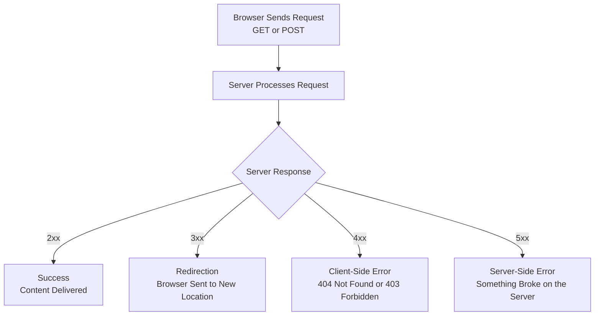

| Topic | Level | Reading Time | Prerequisites |
|---|---|---|---|
| HTTP: How Browsers Talk to Servers | Beginner | ~16 min | Basic understanding of how websites are built and hosted |

> **الهدف من الـ Section ده:**  
> هتفهم إزاي المتصفح والسيرفر بيتكلموا مع بعض عن طريق HTTP، هتتعرف على أشهر أنواع الطلبات (GET وPOST)، هتفهم كل فئات أكواد الحالة (status codes)، وهتشوف ليه الـ 403 error بالذات مهم جدًا لمحلل الأمان.

## Learning Objectives

By the end of this section, you will be able to:

- Explain the **client-server relationship** and why it's a strict one-directional flow.
- Distinguish between the **GET** and **POST** HTTP methods.
- Classify **HTTP status codes** into their four main categories: 200, 300, 400, and 500 series.
- Explain the difference between a **404** and a **403** error.
- Explain why a pattern of repeated 403 errors from the same source is a security red flag.
- Distinguish between **301** and **302** redirect codes.

## Table of Contents

- [How a Browser Talks to a Server](#how-a-browser-talks-to-a-server)
- [The One-Directional Flow](#the-one-directional-flow)
- [GET vs. POST](#get-vs-post)
- [Understanding HTTP Status Codes](#understanding-http-status-codes)
  - [200 Series: Success](#200-series-success)
  - [300 Series: Redirection](#300-series-redirection)
  - [400 Series: Client-Side Errors](#400-series-client-side-errors)
  - [500 Series: Server-Side Errors](#500-series-server-side-errors)
- [403 Errors and Security Monitoring](#403-errors-and-security-monitoring)
- [When a File Has Moved: Redirect Codes](#when-a-file-has-moved-redirect-codes)
- [Request-Response Flow Diagram](#request-response-flow-diagram)
- [Career Connection](#career-connection)
- [Key Terms Glossary](#key-terms-glossary)
- [Summary](#summary)

## How a Browser Talks to a Server

الاتصال بيحصل باستخدام **HTTP (HyperText Transfer Protocol)** أو نسخته الآمنة **HTTPS**. العلاقة دايمًا واحدة: **الـ client بيسأل، والـ server بيرد**.

## The One-Directional Flow

- الـ **Client** (متصفحك) بيبعت طلب (**request**)، مثلًا: `GET /homepage.html`.
- الـ **Server** بيعالج الطلب وبيرد برد (**response**)، بيتضمن كود حالة (**status code**) بالإضافة للمحتوى المطلوب (لو متاح).

> [!IMPORTANT]
> ده تدفق (**flow**) صارم في اتجاه واحد: السيرفر أبدًا مبيبعتش حاجة عشوائيًا للمتصفح من غير ما يتطلب منه الأول. كل قطعة محتوى إنت بتشوفها كانت مطلوبة (**requested**) من طرف متصفحك.

## GET vs. POST

فيه أنواع مختلفة من طلبات HTTP، لكن أشهرهم للتصفح العادي هما:

| النوع | الوصف |
|---|---|
| **GET** | طلب مورد (**resource**) معين، زي صفحة أو صورة |
| **POST** | إرسال بيانات للسيرفر، زي تقديم فورم تسجيل دخول |

> [!NOTE]
> فيه أنواع تانية زي `PUT` و`DELETE`، لكن `GET` و`POST` هما الأكتر استخدامًا في التصفح الأساسي.

## Understanding HTTP Status Codes

كل رد من السيرفر بيتضمن كود حالة (**status code**) مكوّن من 3 أرقام، بيقول للمتصفح إيه اللي حصل. الأكواد دي مقسّمة لفئات:

### 200 Series: Success

الطلب اشتغل. مثال: **200 OK** معناه إن الصفحة اتلاقت وتسلّمت بنجاح.

### 300 Series: Redirection

المورد المطلوب اتنقل لمكان تاني. المتصفح بيتقال له العنوان الجديد يروح يجيبه منه.

### 400 Series: Client-Side Errors

فيه حاجة غلط في الطلب نفسه:

- **404 Not Found**: الـ client طلب ملف مش موجود.
- **403 Forbidden**: الملف موجود، لكن الـ client مش مسموحله يوصله.

### 500 Series: Server-Side Errors

حاجة اتكسرت على السيرفر وهو بيحاول يعالج الطلب (مثلًا، bug في كود السيرفر، انهيار قاعدة بيانات، أو إعداد خاطئ **misconfiguration**).

## 403 Errors and Security Monitoring

**403 Forbidden** معناها: "أنا عارف إن ده موجود، لكن إنت مش مسموحلك تدخل." ده مختلف عن **404**، اللي فيها المورد مش موجود خالص.

ده مهم جدًا للمراقبة الأمنية (**security monitoring**): لو محلل أمان شاف عنوان IP واحد بيولّد أخطاء 403 كتيرة في وقت قصير، ده **علامة تحذير حمراء (red flag)**.

> [!WARNING]
> **ليه؟** لأنه عادةً معناه إن حد بيحاول عمدًا يوصل لملفات أو مجلدات مقيّدة مش المفروض يعرف عنها، وده علامة شائعة على استطلاع (**reconnaissance**) أو محاولة اختراق (زي حد بيحاول يتصفح `/admin`، `/config`، أو `/backup` بشكل متكرر).

> [!IMPORTANT]
> **403 واحد طبيعي تمامًا**. لكن **نمط من محاولات 403 متكررة من نفس المصدر** مشبوه، وغالبًا بيتم التحقيق فيه.

## When a File Has Moved: Redirect Codes

لو الملف المطلوب اتنقل، السيرفر مش بيفشل بس، هو ممكن يرد بكود إعادة توجيه (**redirect status code**) ويقول للمتصفح بالظبط فين يروح بدل كده، عن طريق **Location header**.

| الكود | الاسم | الوصف |
|---|---|---|
| **301** | **Moved Permanently** | المورد انتقل بشكل دائم لعنوان جديد. المتصفحات (ومحركات البحث) بتفتكر ده وتستخدم العنوان الجديد بشكل دائم |
| **302** | **Found (Temporary Redirect)** | المورد انتقل، لكن مؤقتًا بس. المتصفح المفروض يفضل يستخدم العنوان الأصلي للطلبات المستقبلية |

> [!TIP]
> بمجرد ما المتصفح يستقبل رد الـ redirect، هو تلقائيًا بيبعت طلب جديد للـ URL الجديد، من غير ما المستخدم يحتاج يعمل أي حاجة.

## Request-Response Flow Diagram

المخطط التالي بيوضح دورة الطلب والرد الأساسية، بالإضافة لمسار كل فئة من فئات الأكواد:

## Career Connection

فهم HTTP وأكواد الحالة له تطبيقات مباشرة في مسارات مهنية متعددة:

- في مجال **SOC**، مراقبة أنماط أخطاء 403 المتكررة من نفس المصدر جزء أساسي من اكتشاف محاولات الاستطلاع أو الاختراق.
- في مجال **Web Application Security**، فهم الفرق بين 404 و403 بيساعد في تشخيص هل هجوم معين نجح جزئيًا في اكتشاف بنية الموقع.
- في مجال **Pentesting**، أنماط الردود (زي 403 المتكرر) بتُستخدم لرسم خريطة (**mapping**) المسارات الموجودة والمقيّدة على الموقع.

## Key Terms Glossary

| Term | Definition |
|---|---|
| **HTTP (HyperText Transfer Protocol)** | بروتوكول الاتصال الأساسي بين المتصفح والسيرفر. |
| **Client-Server Relationship** | العلاقة حيث يرسل العميل الطلبات ويستجيب السيرفر لها فقط. |
| **GET** | طلب HTTP لجلب مورد معين. |
| **POST** | طلب HTTP لإرسال بيانات إلى السيرفر. |
| **Status Code** | رمز مكوّن من 3 أرقام يوضح نتيجة معالجة الطلب من طرف السيرفر. |
| **404 Not Found** | كود خطأ يشير إلى أن المورد المطلوب غير موجود. |
| **403 Forbidden** | كود خطأ يشير إلى أن المورد موجود لكن الوصول إليه غير مسموح. |
| **Redirect (301 / 302)** | كود يوجّه المتصفح تلقائيًا إلى عنوان جديد، إما بشكل دائم أو مؤقت. |
| **Reconnaissance** | مرحلة جمع المعلومات عن الهدف قبل تنفيذ الهجوم. |

## Summary

- الاتصال بين المتصفح والسيرفر بيحصل عن طريق **HTTP/HTTPS**، بعلاقة صارمة في اتجاه واحد: الـ client بيسأل، والـ server بيرد.
- أشهر أنواع الطلبات هما **GET** (طلب مورد) و **POST** (إرسال بيانات).
- أكواد الحالة مقسّمة لأربع فئات: **200** (نجاح)، **300** (إعادة توجيه)، **400** (خطأ من طرف الـ client)، و **500** (خطأ من طرف السيرفر).
- **404** معناها المورد مش موجود خالص، بينما **403** معناها المورد موجود لكن الوصول ليه ممنوع.
- نمط من أخطاء **403 متكررة** من نفس المصدر علامة تحذير أمنية، غالبًا بتدل على استطلاع أو محاولة اختراق.
- أكواد **301** و **302** بتوجّه المتصفح تلقائيًا لعنوان جديد، الأول دائم والتاني مؤقت.

