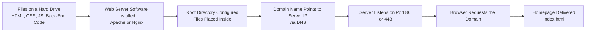

| Topic | Level | Reading Time | Prerequisites |
|---|---|---|---|
| How Websites Are Built and Hosted | Beginner | ~14 min | None |

> **الهدف من الـ Section ده:**  
> هتفهم إيه هو الموقع الإلكتروني فعليًا من جوه، الفرق بين الـ Front-End والـ Back-End، وإزاي بتتحول مجموعة ملفات على جهازك لموقع تقدر توصله من أي مكان في العالم عن طريق Domain وWeb Server.

## Learning Objectives

By the end of this section, you will be able to:

- Explain what a website actually is at the file level.
- Distinguish between **Back-End** and **Front-End** code and name common languages for each.
- Explain the role of the **Homepage**, **Domain Name**, **Web Server Software**, and **Root Directory** in making a website reachable.
- Explain how a web server listens for incoming connections using ports 80 and 443.
- Distinguish between **HTTP** and **HTTPS** in terms of encryption.

## Table of Contents

- [What a Website Actually Is](#what-a-website-actually-is)
- [Two Types of Code](#two-types-of-code)
- [Where the Files Actually Live](#where-the-files-actually-live)
- [Making Your Website Reachable](#making-your-website-reachable)
  - [The Homepage](#the-homepage)
  - [The Domain Name](#the-domain-name)
  - [Web Server Software](#web-server-software)
  - [The Root Directory](#the-root-directory)
- [How the Server Listens](#how-the-server-listens)
- [HTTP vs. HTTPS](#http-vs-https)
- [From Files to a Live Website Diagram](#from-files-to-a-live-website-diagram)
- [Career Connection](#career-connection)
- [Key Terms Glossary](#key-terms-glossary)
- [Summary](#summary)

## What a Website Actually Is

**Website** هو أساسًا مجموعة من الملفات: كود، صور، فيديوهات، خطوط (**fonts**)، وموارد تانية.

> [!NOTE]
> مفيش أي "سحر" في الموضوع، الموقع الإلكتروني هو بس ملفات، منظّمة في مجلدات، مستنية إنها تُطلب (**requested**) وتتسلّم (**delivered**).

## Two Types of Code

بناء موقع إلكتروني معناه كتابة نوعين من الكود:

### Back-End Code

الكود ده بيشتغل على السيرفر، وبيتعامل مع المنطق (**logic**)، قواعد البيانات، حسابات المستخدمين، معالجة الطلبات، إلخ.

من أمثلة لغات الـ back-end: **PHP**، **Python**، **Node.js**، **Java**.

### Front-End Code

ده اللي المتصفح بينزّله ويعرضه للمستخدم. بيتكون من:

- **HTML** (البنية).
- **CSS** (التنسيق والشكل).
- **JavaScript** (التفاعلية).

## Where the Files Actually Live

كل الملفات دي موجودة سوا على قرص صلب، سواء كان ده جهازك الشخصي، سيرفر شركة، أو مزوّد كلاود زي **AWS** أو **Google Cloud**.

> [!TIP]
> مفيش سحر: الموقع هو ملفات، منظّمة في مجلدات، مستنية إنها تتطلب وتتسلّم.

## Making Your Website Reachable

عشان موقعك يبقى متاح للعالم، محتاج أربع عناصر أساسية:

### The Homepage

كل موقع محتاج **homepage**، الملف الافتراضي اللي بيتحمّل لما حد يزور الموقع (عادةً بيتسمى `index.html`).

### The Domain Name

عشان الموقع يبقى قابل للوصول عبر الإنترنت، محتاج **domain name** (مثلًا `example.com`). الدومين هو بس اسم مفهوم للبشر (**human-friendly**) بيترجم لعنوان IP رقمي عن طريق **DNS**.

> [!TIP]
> لو درست موضوع DNS قبل كده، هتفتكر إن ده بالظبط نفس مفهوم "دليل التليفونات" اللي شرحناه هناك، الدومين هو الاسم، والـ IP هو الرقم الفعلي.

### Web Server Software

تقدر تحوّل أي كمبيوتر لسيرفر ويب عن طريق تثبيت **web server software**. **Apache** و **Nginx** هما الأشهر، وشغل السوفتوير ده إنه يستمع لاتصالات داخلة ويقدّم الملفات.

### The Root Directory

بتضبط **root directory** على السيرفر ده، ده المجلد اللي فيه ملفات موقعك (بدايةً من الـ homepage). لما حد يزور دومينك، السيرفر بيدوّر جوه المجلد ده عشان يلاقي إيه اللي يبعته.

## How the Server Listens

بمجرد ما السوفتوير يتثبت، هو بيفتح بورتات شبكة (**network ports**) معينة. البورت هو أساسًا "باب" مرقّم على السيرفر بيستمع عليه سوفتوير معين.

حركة مرور الويب عادةً بتستخدم بورت **80** أو **443**، بينما خدمات تانية بتستخدم بورتات مختلفة (زي 22 لـ SSH، 21 لـ FTP).

السيرفر باستمرار مستني طلبات داخلة موجّهة لدومينه. لما المتصفح يحاول يوصل لموقعك، هو بيبعت طلبه تحديدًا لبورت 80 أو 443 على عنوان IP بتاع السيرفر.

## HTTP vs. HTTPS

| البورت | البروتوكول | الوصف |
|---|---|---|
| **80** | **HTTP** | غير مشفّر (**unencrypted**) |
| **443** | **HTTPS** | مشفّر باستخدام **TLS** (**encrypted using TLS**) |

> [!IMPORTANT]
> الفرق بين الاتنين مش بس رقم بورت، هو فرق جوهري في الأمان. حركة مرور HTTP ممكن أي حد يعترضها ويقراها، بينما HTTPS بتحمي محتوى الاتصال عن طريق التشفير.

## From Files to a Live Website Diagram

المخطط التالي بيلخّص الرحلة الكاملة من مجرد ملفات على قرص صلب لحد ما تبقى موقع حي قابل للوصول:

## Career Connection

فهم إزاي المواقع بتُبنى وتُستضاف له تطبيقات مباشرة في مسارات مهنية متعددة:

- في مجال **SOC** و **Web Application Security**، فهم بنية الموقع (front-end/back-end، domain، root directory) أساسي لفهم أي هجوم مستهدف تطبيقات الويب.
- في مجال **Cloud Security**، معرفة إزاي السيرفرات بتُستضاف وتتصل بالإنترنت جزء أساسي من تأمين البنية التحتية السحابية.
- في مجال **Pentesting**، فهم مكان الـ root directory وإعدادات السيرفر بيساعد في تحديد نقاط الضعف المحتملة زي الوصول غير المصرح به للملفات.

## Key Terms Glossary

| Term | Definition |
|---|---|
| **Back-End Code** | الكود الذي يعمل على السيرفر ويتعامل مع المنطق، قواعد البيانات، والحسابات. |
| **Front-End Code** | الكود الذي يقوم المتصفح بتنزيله وعرضه للمستخدم (HTML، CSS، JavaScript). |
| **Homepage** | الملف الافتراضي الذي يتم تحميله عند زيارة الموقع. |
| **Domain Name** | اسم مفهوم للبشر يُترجم إلى عنوان IP عبر DNS. |
| **Web Server Software** | برنامج مثل Apache أو Nginx يستمع للاتصالات الداخلة ويقدّم ملفات الموقع. |
| **Root Directory** | المجلد على السيرفر الذي يحتوي على ملفات الموقع، بدءًا من الصفحة الرئيسية. |
| **Port** | باب مرقّم على السيرفر يستمع عليه برنامج معين لحركة مرور محددة. |
| **HTTP / HTTPS** | بروتوكولا نقل النص الفائق، غير المشفر والمشفر (عبر TLS) على التوالي. |

## Summary

- **Website** هو أساسًا مجموعة ملفات: كود، صور، فيديوهات، وخطوط، مخزّنة سوا على قرص صلب.
- بناء الموقع بيتطلب نوعين من الكود: **Back-End** (بيشتغل على السيرفر) و **Front-End** (بيتنزّل ويتعرض على المتصفح، مبني من HTML، CSS، وJavaScript).
- عشان الموقع يبقى قابل للوصول، محتاج **Homepage**، **Domain Name** (بيترجم لـ IP عن طريق DNS)، **Web Server Software** (زي Apache أو Nginx)، و **Root Directory** فيه الملفات.
- السيرفر بيستمع على بورتات محددة، غالبًا **80** لحركة مرور HTTP غير المشفرة، أو **443** لحركة مرور HTTPS المشفرة باستخدام TLS.
- الفرق بين HTTP وHTTPS جوهري من الناحية الأمنية: الأول غير مشفر وقابل للاعتراض، والتاني محمي بالتشفير.

