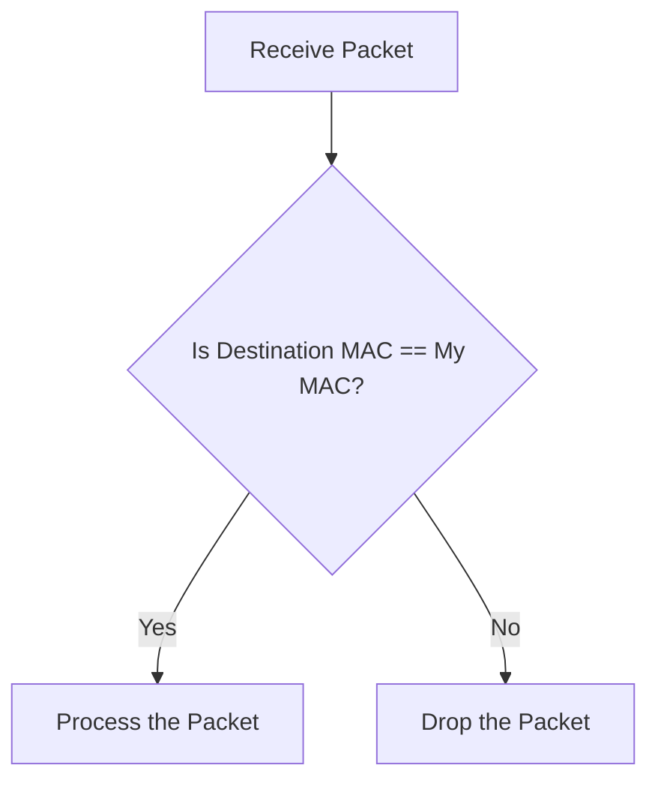
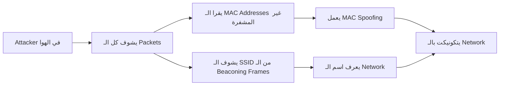
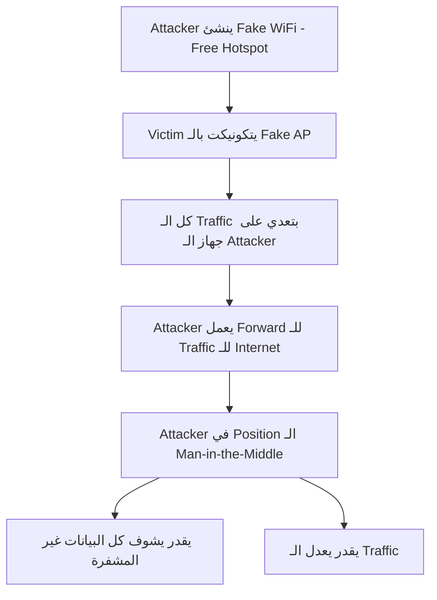
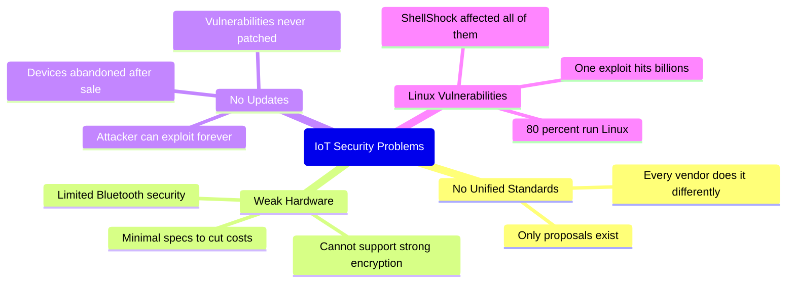

> **الهدف من الـ Section ده:**  
>هنتعرف على تحديات وتأمين كل من Wireless Networks و IoT Devices، واللي بيعتبروا من أكثر النقاط عرضة للهجمات في أي بيئة حديثة.

---

## Table of Contents

- [Wireless Security](#wireless-security)
  - [Wireless Attacks](#wireless-attacks)
  - [Rogue Access Points](#rogue-access-points)
- [IoT Security](#iot-security)
  - [IoT Devices and Their Security](#iot-devices-and-their-security)
- [Summary](#summary)

---

## Wireless Security

### Wireless Attacks

الـ Wireless Networks بطبيعتها أصعب في التأمين من الـ Wired Networks — لأن الـ Air مش ممكن تتحكم فيه.

#### معايير الـ WiFi

| الاسم القديم | الاسم الجديد |
|---|---|
| 802.11n | Wi-Fi 4 |
| 802.11ac | Wi-Fi 5 |
| 802.11ax | Wi-Fi 6 |

#### مشكلة التشفير في الـ Wireless

الـ WiFi بيستخدم Encryption عشان الـ Packets بتطير في الهوا وكلها ممكن يشوفها أي حد. المعايير الأمنية الموجودة:

| المعيار | الحالة | السبب |
|---|---|---|
| **WEP** | Deprecated / مكسور | الـ 40-bit Key قابل للتوقع بسبب ضعف الـ Randomness |
| **WPA** | Deprecated / مكسور | نفس مشكلة WEP بس بـ 128-bit (بياخد وقت أكثر بس نفس المشكلة) |
| **WPA2** | مقبول | تشفير أقوى، بيحتاج Processing أعلى |
| **WPA3** | الأفضل حالياً | الأحدث والأكثر أماناً |

> [!WARNING]
> للأسف لحد دلوقتي في بيوتنا كتير من الـ Routers بتيجي بـ WEP أو WPA ضعيف! السبب إن الـ Hardware الرخيص اللي بتبعته الـ ISPs مش بيقدر يتحمل تكلفة الـ Processing للـ WPA2/WPA3. وده خطر حقيقي.

#### المشاكل الأساسية في الـ Wireless

**1. الـ Management Frames مش ممكن تتشفر**

في الـ Wireless، في معلومات معينة لازم تبقى Unencrypted عشان الـ WiFi يشتغل — زي الـ Management Frames.

> [!IMPORTANT]
> الـ MAC Address مش ممكن يتشفر. لو اتشفر، الـ WiFi هيبطل يشتغل. كل Device بيحتاج يشوف الـ Destination MAC Address عشان يعرف هل الـ Packet ده ليه أم لا.

**2. الـ Broadcast Nature**

في الـ Wireless، **كل الأجهزة بتشوف كل الـ Packets**. كل Device بيعمل كده:

**3. الـ Beaconing Frames والـ SSID**

الـ Access Point بيبعت **Beaconing Frames** كل بضع ثواني. الـ Frame دي بتحتوي على الـ **SSID (Service Set Identifier)** — اسم الـ WiFi Network — وهي مش ممكن تتشفر لأنها بتُستخدم لتأسيس الاتصال.

> [!NOTE]
> زمان كان المستشار يقول "اعمل Hide للـ SSID عشان الـ Attackers ميشوفوكش." دلوقتي ده فكرة غلط. لأن لما حد بيحاول يكونيكت بالـ Network، الـ SSID بيتبعت في الـ Connection Process. يعني الـ Attacker بيستنى حد يتكونيكت وبيشوفه. إنت بس بتعمل الموضوع أصعب شوية على حسابك انت كمان — مش أصعب على الـ Attacker.

**4. الـ MAC Filtering**

ممكن تعمل Whitelist للـ MAC Addresses المسموح ليها تتكونيكت — بس:

> [!WARNING]
> الـ MAC Addresses مش متشفرة، يعني أي Attacker يقدر **يشوف** MAC Address مسموح ليه وبعدين **يـ Spoof** نفس الـ MAC عشان يدخل. الحل ده بيوفر حماية وهمية.

#### الـ Flow الكامل للـ Wireless Attack

---

### Rogue Access Points

**الـ Rogue Access Point** هو الـ Attacker نفسه بيعمل نفسه WiFi مجاني عشان يخلي الناس يتكونيكتوا بيه.

#### إزاي بيشتغل الـ Attack؟

> [!WARNING]
> أي WiFi "مجاني" في أماكن عامة ممكن يكون Rogue AP. دايماً تأكد من الـ Network اللي بتتكونيكت بيه قبل ما تدخل أي Data حساسة.

---

## IoT Security

### IoT Devices and Their Security

#### حجم المشكلة

- في أكتر من **75 Billion IoT Device** حول العالم
- أمثلة: Smart Speakers، Smart TVs، Garage Sensors، Security Cameras، وغيرهم

#### ليه الـ IoT Devices خطيرة؟

> [!IMPORTANT]
> في ثغرة اسمها **ShellShock** أثرت على الـ Bash Shell في الـ Linux. المشكلة إن **80% من الـ 75 Billion IoT Device بتشغل Linux** — يعني كلهم كانوا Vulnerable لهجوم واحد.

#### ليه الشركات مش بتصلح المشكلة؟

الأولوية عند الشركات هي **البيع بأعلى ربح** — مش الأمان. ومحدش بيجبرهم على معايير أمنية محددة. يعني:

- بيستخدموا أضعف Hardware بتكلفة أقل
- مش بيخططوا لأي Future Updates
- الـ Device لما بيتباع، الشركة خلصت مسؤوليتها

> [!TIP]
> كـ Defender، لازم تعامل أي IoT Device على الشبكة كـ **Untrusted Device**. ضيفها على Network منفصلة (IoT VLAN) وقيّد وصولها للـ Network الأساسية.

---

## Summary

**Wireless Security:**
- WEP وWPA Broken بسبب ضعف الـ Randomness — WPA2/WPA3 هو الصح
- الـ MAC Addresses والـ Management Frames مش ممكن يتشفروا — خطر أساسي
- الـ Rogue Access Point هو MITM Attack بسيط وفعال جداً

---

**IoT Security:**
- 75 Billion Device بدون معايير أمنية موحدة
- 80% بيشغلوا Linux — ثغرة واحدة زي ShellShock تأثر على الكل
- الشركات مش بتعمل Updates لأن مفيش قوانين تلزمهم

