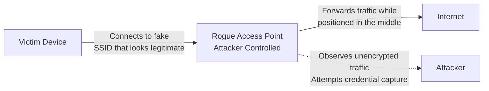
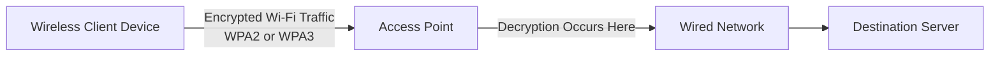

| Topic | Level | Reading Time | Prerequisites |
|---|---|---|---|
| Wireless Networks (Wi-Fi Security) | Beginner | ~18 min | Basic understanding of networking concepts and encryption fundamentals |

> **الهدف من الـ Section ده:**  
>  هتفهم إزاي الـ Wi-Fi بيشتغل، وليه لازم يتشفّر، والفرق بين معايير الأمان القديمة والحديثة، وإزاي المهاجمين بيستغلوا نقط ضعف زي الـ Rogue Access Points.

## Learning Objectives

By the end of this section, you will be able to:

- Explain how **Wi-Fi (802.11)** works and why wireless traffic requires encryption.
- Compare deprecated security standards like **WEP** with modern standards like **WPA2** and **WPA3**.
- Describe the role of **SSID broadcasting**, **beacon frames**, and **MAC filtering**, and evaluate why they are not real security controls.
- Identify how a **Rogue Access Point** attack works and how it enables a **Man-in-the-Middle (MITM)** attack.
- Recommend practical mitigations for both individual users and organizations.

## Table of Contents

- [Introduction to Wi-Fi and the 802.11 Standard](#1-introduction-to-wi-fi-and-the-80211-standard)
- [Why Wireless Traffic Needs Encryption](#2-why-wireless-traffic-needs-encryption)
- [Evolution of Wi-Fi Security Standards](#3-evolution-of-wi-fi-security-standards)
  - [WEP: A Broken Standard](#31-wep-a-broken-standard)
  - [WPA and the Move to WPA2/WPA3](#32-wpa-and-the-move-to-wpa2wpa3)
- [Management Frames and the Limits of Encryption](#4-management-frames-and-the-limits-of-encryption)
  - [The Role of Beacon Frames](#41-the-role-of-beacon-frames)
  - [What Remains Visible Even with Encryption](#42-what-remains-visible-even-with-encryption)
- [Common Wi-Fi Security Myths](#5-common-wi-fi-security-myths)
  - [Hiding the SSID](#51-hiding-the-ssid)
  - [MAC Filtering](#52-mac-filtering)
- [Rogue Access Points and Man-in-the-Middle Attacks](#6-rogue-access-points-and-man-in-the-middle-attacks)
- [Wireless Attack Flow Diagram](#7-wireless-attack-flow-diagram)
- [Mitigations and Best Practices](#8-mitigations-and-best-practices)
- [Career Connection](#9-career-connection)
- [Key Terms Glossary](#10-key-terms-glossary)
- [Summary](#11-summary)

## Introduction to Wi-Fi and the 802.11 Standard

**Wi-Fi** بيعتمد على مجموعة معايير الشبكات اللاسلكية المعروفة باسم **IEEE 802.11**. مع مرور الوقت، ظهر نظام تسمية أبسط عشان يسهّل على المستخدمين العاديين فهم الجيل اللي بيستخدموه، فبقينا نسمع مصطلحات زي:

| اسم تجاري | المعيار التقني |
|---|---|
| Wi-Fi 4 | 802.11n |
| Wi-Fi 5 | 802.11ac |
| Wi-Fi 6 | 802.11ax |

الفرق الجوهري بين الشبكات السلكية (wired) واللاسلكية (wireless) هو **وسط النقل (transmission medium)**. في الشبكات السلكية، البيانات بتتنقل جوه كابل، فمحتاج فعليًا توصيل فيزيائي عشان تقدر تعترض البيانات. أما في الـ Wi-Fi، البيانات بتتبعت عبر الهواء (radio waves)، وده معناه إن أي جهاز قريب وموجود في نطاق الإشارة يقدر "يسمع" أو يستقبل الإرسال اللاسلكي، حتى لو مش الهدف المقصود بيه.

> [!NOTE]
> الطبيعة "المفتوحة" لوسط النقل في الـ Wi-Fi هي السبب الجذري اللي بيخلي الأمان اللاسلكي موضوع حساس جدًا، لأن أي حد في النطاق يقدر نظريًا يستقبل الإشارة.

## Why Wireless Traffic Needs Encryption

بما إن حركة المرور اللاسلكية بتنتقل عبر **shared medium** (وسط مشترك يقدر أي حد قريب يوصله)، فالتشفير (**encryption**) بيبقى أمر أساسي مش اختياري. من غير تشفير، أي جهاز في نطاق الإشارة يقدر يلتقط البيانات المرسلة ويقرأها بسهولة.

الفكرة الأساسية إن التشفير هنا بيحل مشكلة **Confidentiality**: حتى لو حد قدر يستقبل الإشارة، البيانات نفسها هتكون غير مفهومة (unreadable) من غير المفتاح الصحيح.

## Evolution of Wi-Fi Security Standards

### WEP: A Broken Standard

**WEP (Wired Equivalent Privacy)** كان أول محاولة رسمية لتأمين شبكات الـ Wi-Fi، لكنه اتكشف إنه معيار **ضعيف ومكسور (broken)** من الناحية التصميمية.

المشكلة الأساسية في WEP كانت في استخدامه لخوارزمية **RC4** مع طريقة تعامل ضعيفة مع الـ **Initialization Vectors (IVs)**. الضعف ده سمح للمهاجمين بجمع كمية كافية من حركة المرور (traffic) واستخدامها لاستنتاج المفتاح (key) بشكل كامل.

> [!WARNING]
> خطأ شائع إن الناس يفتكروا إن زيادة حجم المفتاح (key size) بتحل مشكلة التشفير الضعيف. الحقيقة إن المشكلة في WEP كانت في **التصميم نفسه** (design) وطريقة توليد العشوائية (randomness)، مش في طول المفتاح بس. زيادة الطول من غير إصلاح المشكلة الجذرية مبتحلش حاجة.

### WPA and the Move to WPA2/WPA3

بعد اكتشاف عيوب WEP، ظهر **WPA (Wi-Fi Protected Access)** كحل مؤقت، لكنه هو كمان اعتُبر بمرور الوقت معيار غير كافٍ للأمان الحديث.

المعايير المستخدمة حاليًا والموصى بيها هي:

- **WPA2**: بيستخدم خوارزمية تشفير أقوى (AES) بدل RC4.
- **WPA3**: أحدث معيار، وبيوفر حماية إضافية ضد هجمات تخمين كلمة المرور (offline dictionary attacks) وتحسينات في عملية الـ handshake.

> [!IMPORTANT]
> الشبكات اللاسلكية الحديثة لازم تستخدم **WPA2** أو **WPA3** حصريًا، مع كلمات مرور قوية (**strong passwords**) وإعدادات آمنة (**secure configuration**). استخدام WEP أو WPA القديم بقى غير مقبول أمنيًا في أي بيئة إنتاجية.

## Management Frames and the Limits of Encryption

### The Role of Beacon Frames

جهاز الـ Wi-Fi بيستخدم **Destination MAC Address** الموجود في الـ frame عشان يقرر هل الـ frame ده موجّه له فعلًا ولازم يعالجه، ولا لأ.

لكن مش كل حاجة في شبكة الـ Wi-Fi ممكن تتشفر بالكامل. فيه نوع معين من الـ frames، خصوصًا **802.11 management و control frames**، لازم تفضل واضحة (غير مشفرة بالكامل) عشان الأجهزة تقدر تكتشف الشبكة، تنضم ليها، وتديرها بشكل صحيح.

مثال على كده هو **Beacon Frames**: دي frames بيبعتها الـ **Access Point (AP)** بشكل دوري ومتكرر، وعادةً بتحتوي على معلومات زي:

- الـ **SSID** (اسم الشبكة).
- الـ **capabilities** المدعومة من الشبكة (زي المعايير والسرعات المتاحة).

### What Remains Visible Even with Encryption

حتى لو الشبكة شغالة بتشفير قوي (زي WPA2/WPA3)، فيه معلومات معينة ممكن تفضل مرئية لأي حد بيراقب حركة المرور، من ضمنها:

- الـ **metadata** الخاصة بالاتصال.
- بعض الـ **unencrypted management information** زي محتوى الـ beacon frames.

المهم هنا إن البيانات الفعلية المحمية (**protected data**) بتفضل غير قابلة للقراءة، حتى لو المهاجم قادر يشوف إن فيه اتصال شغال، أو يعرف اسم الشبكة، أو معلومات إدارية تانية.

بمجرد ما حركة المرور المشفرة توصل للـ **Access Point**، بيتم فك تشفيرها (**decrypted**) في النقطة المناسبة، وبعدين بيتم توجيهها (**forwarded**) للشبكة السلكية حسب البنية الأمنية للشبكة.

> [!TIP]
> للتطبيقات الحساسة، الاعتماد على تشفير الـ Wi-Fi وحده مش كافي دايمًا. إضافة طبقة تشفير إضافية زي **HTTPS** أو **VPN** بتوفر حماية end-to-end فعلية بغض النظر عن أمان الشبكة اللاسلكية نفسها.

## Common Wi-Fi Security Myths

### Hiding the SSID

الـ **SSID** هو اسم الشبكة اللاسلكية، وبيتم الإعلان عنه عادةً عن طريق الـ **beacon frames** عشان الأجهزة تقدر تكتشف الشبكات المتاحة.

فيه اعتقاد شائع إن **إخفاء الـ SSID** (disabling SSID broadcasting) بيخلي الشبكة "غير مرئية" أو أكتر أمانًا. الحقيقة إن ده مش صحيح، لأن الشبكة لسه ممكن تتكتشف من خلال نشاط لاسلكي تاني.

كمان، لما جهاز عميل (client) يحاول يتصل بشبكة مخفية، الجهاز نفسه ممكن **يفضح اسم الشبكة** أثناء عملية الاتصال، وده بيدي فرصة لمهاجم بيراقب حركة المرور اللاسلكية إنه يكتشف الاسم بسهولة.

> [!WARNING]
> إخفاء الـ SSID بيوفر **قدر ضئيل جدًا من الأمان الحقيقي (security through obscurity)** ومينفعش يتعامل معاه كبديل للتشفير الفعلي القوي.

### MAC Filtering

**MAC Filtering** هو إعداد بيسمح للمسؤول (**administrator**) يحدد إن مين بالظبط، من خلال عناوين الـ MAC، مسموح له بالاتصال بالشبكة.

المشكلة إن عناوين الـ MAC مش وسيلة أمان موثوقة، لأن المهاجم يقدر يراقب حركة المرور، يلاحظ عنوان MAC مسموح بيه، وبعدين يعمل **spoofing** ليه (يتظاهر إنه نفس الجهاز صاحب العنوان ده).

> [!IMPORTANT]
> المصادقة القوية (**strong authentication**) والتشفير عن طريق **WPA2** و **WPA3** أهم بكتير من إخفاء الـ SSID أو الاعتماد على الـ MAC filtering كطبقة حماية أساسية.

## Rogue Access Points and Man-in-the-Middle Attacks

**Rogue Access Point** هي نقطة وصول لاسلكية غير مصرح بيها، بيقوم المهاجم بوضعها على الشبكة أو بإنشائها بهدف جذب الضحايا للاتصال بيها.

المهاجم ممكن ينشئ شبكة Wi-Fi وهمية باسم يبدو شرعيًا (زي اسم فندق، مطار، كافيه، أو حتى اسم شبكة الشركة نفسها) عشان يخدع المستخدمين.

لما الضحية يتصل بالـ Access Point الخاص بالمهاجم، المهاجم يقدر يضع جهازه بين الضحية والإنترنت، وده بيخلق حالة محتملة من الـ **Man-in-the-Middle (MITM)**.

في الوضع ده، المهاجم يقدر يراقب حركة المرور اللي مش محمية بتشفير إضافي، وممكن يحاول:

- التقاط بيانات الاعتماد (**capture credentials**).
- إعادة توجيه المستخدمين (**redirect users**) لصفحات وهمية.
- التلاعب بحركة المرور (**manipulate traffic**).

> [!NOTE]
> استخدام **HTTPS** القوي بيساعد في حماية بيانات التطبيقات حتى لو شبكة الـ Wi-Fi نفسها غير موثوقة، لأن التشفير هنا بيحصل على مستوى التطبيق مش على مستوى الشبكة اللاسلكية فقط.

## Wireless Attack Flow Diagram

المخطط التالي بيوضح إزاي هجوم الـ Rogue Access Point بيؤدي لحالة Man-in-the-Middle:

والمخطط التالي بيوضح مسار حركة المرور اللاسلكية العادية من الجهاز للـ Access Point وبعدين للشبكة السلكية، مع توضيح نقطة فك التشفير:

## Mitigations and Best Practices

الجدول التالي بيلخّص أهم الإجراءات الوقائية للمستخدمين والمؤسسات:

| الفئة | الإجراء الموصى به |
|---|---|
| المستخدم العادي | تجنّب الاتصال التلقائي بشبكات Wi-Fi غير معروفة |
| المستخدم العادي | التأكد من اسم الشبكة الصحيح وطريقة المصادقة قبل الاتصال |
| المستخدم العادي | الاعتماد على HTTPS وVPN كطبقة حماية إضافية |
| المؤسسات | استخدام WPA2/WPA3-Enterprise بدل الأوضاع الشخصية (Personal) |
| المؤسسات | تفعيل المصادقة القائمة على الشهادات (certificate-based authentication) |
| المؤسسات | تنفيذ مراقبة لاسلكية (wireless monitoring) لاكتشاف الـ Rogue APs |
| المؤسسات | تطبيق ضوابط الوصول للشبكة (Network Access Control - NAC) |

## Career Connection

فهم أمان الشبكات اللاسلكية له تطبيقات مباشرة في مسارات مهنية متعددة:

- في مجال **SOC (Security Operations Center)**، بيتم مراقبة تنبيهات اكتشاف الـ Rogue Access Points من أدوات الـ Wireless Intrusion Detection Systems (WIDS).
- في مجال **Pentesting**، اختبار أمان الشبكات اللاسلكية (Wireless Penetration Testing) بيشمل محاولة كسر WPA2/WPA3 واختبار مدى فعالية إعدادات الشبكة.
- في مجال **GRC (Governance, Risk, and Compliance)**، وجود سياسات واضحة لاستخدام الشبكات اللاسلكية جزء أساسي من متطلبات الامتثال في معايير أمنية متعددة.

## Key Terms Glossary

| Term | Definition |
|---|---|
| **802.11** | عائلة المعايير الخاصة بشبكات الاتصال اللاسلكي (Wi-Fi) الصادرة عن IEEE. |
| **WEP (Wired Equivalent Privacy)** | معيار أمان لاسلكي قديم ومكسور تصميميًا بسبب ضعف في خوارزمية RC4 وتوليد الـ IVs. |
| **WPA / WPA2 / WPA3** | أجيال متتالية من معايير أمان الـ Wi-Fi، بحيث WPA2 وWPA3 هما الموصى بهما حاليًا. |
| **SSID (Service Set Identifier)** | اسم الشبكة اللاسلكية المُعلن عادةً عبر beacon frames. |
| **Beacon Frame** | نوع من إطارات الإدارة (management frames) بيبعتها الـ Access Point بشكل دوري للإعلان عن الشبكة. |
| **MAC Filtering** | إعداد بيسمح بتحديد عناوين MAC المسموح لها بالاتصال بالشبكة، وغير موثوق كوسيلة أمان مستقلة. |
| **Rogue Access Point** | نقطة وصول لاسلكية غير مصرح بها، تُستخدم لجذب الضحايا وتنفيذ هجمات. |
| **Man-in-the-Middle (MITM)** | هجوم يقوم فيه المهاجم بوضع نفسه بين طرفي الاتصال لمراقبته أو التلاعب به. |

## Summary

- الـ **Wi-Fi** بيعتمد على معايير **802.11** وبيستخدم الهواء كوسط نقل مشترك، وده بيخلي التشفير أمر ضروري وليس اختياريًا.
- **WEP** معيار مكسور بسبب ضعف تصميمي في RC4 وطريقة توليد الـ IVs، ولا يمكن إصلاحه بمجرد زيادة طول المفتاح.
- المعايير الحديثة الموصى بيها هي **WPA2** و **WPA3** مع كلمات مرور قوية وإعدادات آمنة.
- بعض إطارات الإدارة، زي **Beacon Frames**، لازم تفضل غير مشفرة بالكامل عشان تسمح باكتشاف الشبكة وإدارتها، وده بيسمح بتسريب بعض الـ metadata حتى مع وجود تشفير قوي.
- **إخفاء الـ SSID** و **MAC Filtering** مش وسائل أمان حقيقية، ولازم دايمًا الاعتماد على تشفير قوي (WPA2/WPA3) كطبقة الحماية الأساسية.
- **Rogue Access Points** بتُستخدم لخداع الضحايا وتنفيذ هجمات **Man-in-the-Middle**، ومقاومتها بتحتاج توعية المستخدمين واستخدام HTTPS/VPN بالإضافة لضوابط مؤسسية زي WPA2/WPA3-Enterprise والمراقبة اللاسلكية.

